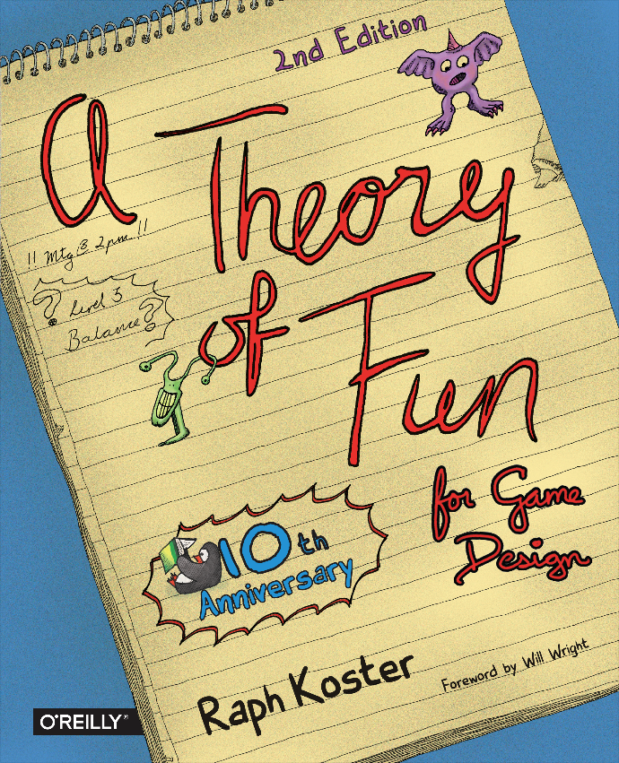

阅读地址：[GitBook](https://cool8jay.gitbook.io/Theory-of-Fun-for-Game-Design)

源文件地址：[GitHub](https://cool8jay.gitbook.io/theory-of-fun-for-game-design)

  

A theory of fun for game design · 2nd Edition · 10th Anniversary · Raph Koster · Foreword by Will Wright

游戏设计的趣味理论·第 2 版·10 周年纪念·拉菲·科斯特【著】·威尔·莱特【序】

