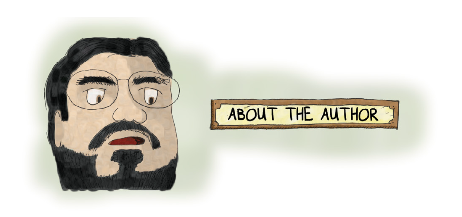

  

Raph Koster is a veteran game designer who has been professionally credited in almost every area of the game industry. He started out as a hobbyist, making games himself starting in his teens. Eventually he played a key role on [LegendMUD](https://www.legendmud.org/index.php/Welcome_to_Legend), an award-winning text-based virtual world. He’s been the lead designer or director of massive online titles such as [Ultima Online](https://en.wikipedia.org/wiki/Ultima_Online) and [Star Wars Galaxies](https://en.wikipedia.org/wiki/Star_Wars_Galaxies); a venture-backed entrepreneur heading his own studio, Metaplace; and he’s contributed design work, writing, art, soundtrack music, and programming to many more titles ranging from Facebook games to single-player games for handheld consoles.

拉斐·科斯特是一位资深的游戏设计师，他在游戏行业的几乎所有领域都有专业的贡献。他最初只是一个业余爱好者、从十几岁开始自己制作游戏。最终，他在[《传奇MUD》](https://www.legendmud.org/index.php/Welcome_to_Legend)这一屡获殊荣的基于文本的虚拟世界中扮演了重要角色。他曾是[《网络创世纪》](https://en.wikipedia.org/wiki/Ultima_Online)和[《星球大战星系》](https://en.wikipedia.org/wiki/Star_Wars_Galaxies)等大型在线游戏的首席设计师或总监。风险投资企业家，领导自己的工作室 Metaplace；他还为从 Facebook 游戏到掌上游戏机单人游戏等更多游戏提供设计、写作、美术、配乐和编程服务。

Koster is widely recognized as one of the world’s top thinkers about game design, and is an in-demand speaker at conferences all over the world. His book A Theory of Fun for Game Design is one of the undisputed classics in the games field, and his essays and other writings such as ["Declaring the Rights of Players"](https://www.raphkoster.com/games/essays/declaring-the-rights-of-players/) and ["The Laws of Online World Design"](https://www.raphkoster.com/games/laws-of-online-world-design/) are widely reprinted.

科斯特被公认为世界顶级游戏设计思想家之一，是世界各地会议的热门演讲人。他的《游戏设计趣味理论》一书是游戏领域无可争议的经典著作之一，他的论文和其他著作，如[《玩家权利宣言》](https://www.raphkoster.com/games/essays/declaring-the-rights-of-players/)和[《在线世界设计法则》](https://www.raphkoster.com/games/laws-of-online-world-design/)等，被广泛转载。

He was born in 1971, has lived in four countries and over a half-dozen different states, and is married with two kids. He holds a bachelor’s degree from Washington College in English/creative writing and in Spanish, and a Master of Fine Arts degree in creative writing from the University of Alabama. While in college, he also spent time studying most everything in the humanities, including music theory and composition and studio art. He is a past member of the famed Turkey City science fiction writing workshop. His music has been featured on television, and he has released one album, After the Flood.

他出生于 1971 年，曾在四个国家和超过六个州生活过，已婚并育有两个孩子。他拥有华盛顿学院英语/创意写作和西班牙语学士学位，以及阿拉巴马大学创意写作艺术硕士学位。在大学期间，他还学习了大部分人文学科，包括音乐理论、作曲和工作室艺术。他曾是著名的火鸡城科幻小说写作讲习班的成员。他的音乐曾在电视上播出，并发行过一张专辑《洪水过后》。

In 2012, he was named an Online Game Legend at the Game Developers Conference Online. This award recognizes the career and achievements of one particular creator who has made an indelible impact on the craft of online game development.

2012 年，他在“在线游戏开发者大会”上被评为“在线游戏传奇人物”。该奖项旨在表彰对网络游戏开发工艺产生不可磨灭影响的某位创作者的职业生涯和成就。

Visit his website at [http://www.raphkoster.com](http://www.raphkoster.com), or this book’s website at [http://www.theoryoffun.com](http://www.theoryoffun.com).

请访问他的网站 [http://www.raphkoster.com](http://www.raphkoster.com)，或本书的网站 [http://www.theoryoffun.com](http://www.theoryoffun.com)。