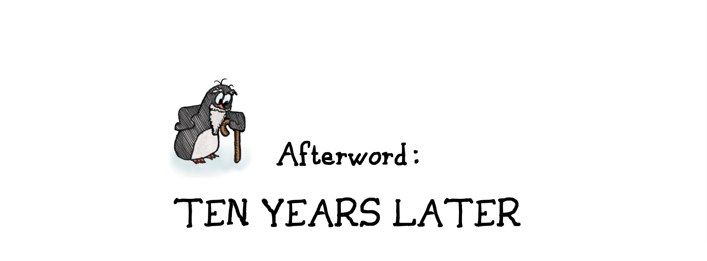

# Afterword: Ten Years Later 跋：十年后

It all began as a keynote address at the very first Austin Games Conference.

这一切都源于首届奥斯汀游戏大会的主题演讲。

The talk led to a book, essentially an adaptation of the slide deck from the presentation, with the speech itself greatly expanded and turned into a book-length essay. It took months to do the cartoons, on a tight deadline, which is why they were mostly fairly crude. I did them all with Rapidograph pens on Bristol paper, something that now seems rather quaint. The text itself spilled out quickly, mostly over a single long weekend.

这次演讲促成了一本书的诞生，这本书基本上是演讲稿幻灯片的改编版，演讲稿本身被大大扩充，变成了一本书篇幅的文章。由于时间紧迫，我花了几个月的时间才完成这些漫画，因此它们大多相当粗糙。我都是用 Rapidograph 钢笔在 Bristol 纸上绘制的，这在现在看来已经相当过时了。文字本身很快就完成了，大部分是在一个长周末完成的。

The idea that play is a primary form of learning was not new even then, of course. But at the time that the book was written, games were under regular and sustained attack. They had not yet been exhibited at the Smithsonian. Many game designers themselves believed that games could not be considered an art form. We had yet to see a court case upholding them as worthy of First Amendment protection. Game books were mostly how-to manuals for game developers, with some shining exceptions.

当然，“游戏是学习的主要形式”这一观点在当时并不新鲜。但在本书写成的时候，游戏还经常受到持续的攻击。游戏还没有在史密森尼博物馆展出过。许多游戏设计师自己也认为，游戏不能被视为一种艺术形式。我们还没有看到一个法院案例支持游戏值得受到第一修正案的保护。游戏书籍大多是游戏开发者的操作手册，但也有一些耀眼的例外。

The reception of the book is still difficult for me to believe. It has become standard reading at game design programs around the world. I feel incredibly lucky to have touched so many budding designers, and I sincerely hope I did not damage them for life. It may well be the single largest legacy I leave on this planet, outside of my children.

这本书的受欢迎程度至今仍让我难以相信。它已成为全世界游戏设计专业的标准读物。能感动这么多崭露头角的设计师，我感到无比幸运。我衷心希望我没有对他们造成终生的伤害。这本书很可能是我在这个星球上留下的最大遗产，除了我的孩子们之外。

Writing the book changed my own approaches to my work, and led me on an intellectual and creative journey that is still ongoing today. Ten years after the original talk, I attended the last Game Developers Conference ever held in Austin, and delivered a "ten years later" retrospective. Sometimes, there is closure.

写这本书改变了我自己对待工作的方式，并引领我踏上了一段至今仍在持续的知识和创意之旅。在最初那次演讲的十年后，我参加了在奥斯汀举行的最后一届游戏开发者大会，并发表了“十年之后”的回顾。有时候，故事会画上圆满的句点。

There's a science of happiness now (such a phrase!). Researchers tell us that happiness is driven by factors like gratitude, using one's strengths, a sense of social connection, striving for goals, and optimism. These sound a lot like what games do at their best, and that may be the most important closure of all.

现在有一门关于幸福的科学（真是个好词儿！）。研究人员告诉我们，幸福感是由感恩、发挥自身优势、社会联系感、为目标奋斗和乐观心态等因素驱动的。这些听起来非常像游戏在最佳状态下所做的事情，这可能是所有事情中最重要的圆满结局。

It may be that playing games my whole life is itself what led me to see them as systems and machinery, that they taught me to perceive everything that way. But after ten years, I look back on it all and I see games as not just a swirl of systems, but as a space between the dust from which we come and the dust we shall be, a space in which we can engage in that grand pursuit of happiness. Thank you for reading.

也许正是因为我一生都在玩游戏，才让我将游戏视为系统和机械，游戏让我学会了用这种方式看待一切。但十年之后，回首往事，我发现游戏不仅仅是系统的漩涡，更是我们源自尘埃，归于尘埃之间的那片天地，在这方寸之间，我们可以投身于追寻幸福的美妙事业。感谢你的阅读。