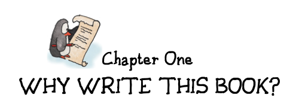

  

Our kids took to games at a very early age. Games were all around them, and I brought home a crazy amount of them because of my work. I suppose it's no surprise that children model their parents. But my wife and I are also voracious readers, and the kids were resistant to that. Their attraction to games was more instinctive. As babies, they found the game of hide-the-object to be endlessly fascinating, and even now that they are older it elicits an occasional giggle. As babies there was an intentness about their alien gaze, as they tried to figure out where the rubber duckie had gone, that showed that this game was, for them, in deadly earnest.

我们的孩子很小就喜欢上了游戏。他们身边到处都是游戏，由于工作关系，我带回家的游戏多得让人眼花缭乱。我想，孩子以父母为榜样并不奇怪。但我和妻子也是贪婪的读者，孩子们对此很抵触。他们对游戏的热爱更多是出于本能。在他们还是婴儿的时候，他们就发现捉迷藏的游戏充满了无穷的吸引力，即使现在他们长大了，这个游戏偶尔也会引起他们的咯咯笑声。当他们试图找出橡皮鸭子的去向时，他们那异样的目光中流露出一种专注，这表明这个游戏对他们来说是认真的。

Kids are playing everywhere, all the time, and often playing games that we do not quite understand. They play and learn at a ferocious rate. We see the statistics on how many words kids absorb in a day, how rapidly they develop motor control, and how many basic aspects of life they master—aspects that are frankly so subtle that we have even forgotten learning them—and we usually fail to appreciate what an amazing feat this is.

孩子们无处不在、无时无刻不在玩耍，而且经常玩一些我们不太理解的游戏。他们以惊人的速度玩耍和学习。我们看到的统计数字表明，孩子们一天能吸收多少单词，他们的运动控制能力发展得有多快，他们掌握了多少生活的基本方面——坦率地说，这些方面是如此微妙，以至于我们甚至忘记了自己是如何学会的——我们通常没有意识到这是多么了不起的壮举。

Consider how hard it is to learn a language, and yet children all over the world do it routinely. A first language. They are doing it without assigning cognates[^cognates] in their native tongue and without translating in their heads. Much attention has been paid to some very special deaf kids in Nicaragua[^deaf_kids_in_nicaragua], who have managed to invent a fully functional sign language in just a few generations. Many believe this shows language is built into the brain, and that there's something in our wiring that guides us inexorably towards language.

想想看，学习一门语言有多难，但全世界的孩子都能照常学习。第一语言。他们是在没有指定母语中的同义词[^cognates]，也没有在头脑中进行翻译的情况下完成学习的。尼加拉瓜一些非常特殊的聋哑儿童[^deaf_kids_in_nicaragua]备受关注，他们在短短几代人的时间里就发明了一种功能齐全的手语。许多人认为，这表明语言是内置于大脑中的，我们大脑的某些结构不可抗拒地引导我们走向语言。

[^cognates]: Words that derive from a common root and are similar in meaning, even though they are in a different language. Languages frequently borrow words from one another, and thus similar words in different languages can be found. Often the meaning, pronunciation, or spelling can diverge to the point of being unrecognizable. 源于共同词根、意义相似的词，尽管它们使用的是不同的语言。语言之间经常会相互借词，因此不同语言中也会出现类似的词。通常情况下，词义、发音或拼写会出现偏差，以至于无法辨认。

Language is not the only hardwired behavior. As children move up the developmental ladder, they take part in a variety of instinctual activities. Any parent who has suffered through the “terrible twos” can tell you that it's as if a switch went on in the child's brain, altering his or her behavior radically. (This phase lasts beyond just the age of two, by the way—just a friendly warning.)

语言并不是唯一一种先天固有的行为。随着孩子的成长，他们会参与各种本能活动。任何经历过“可怕的两岁”的家长都会告诉你，孩子的大脑就像被打开了开关，行为发生了翻天覆地的变化。(顺便说一句，这个阶段不会只持续到两岁——只是一个善意的提醒）。

Kids also move on from certain games as they age. It was particularly interesting to see my kids outgrow tic-tac-toe—a game I beat them at for years, until one day all the matches became draws.

随着年龄的增长，孩子们也会远离某些游戏。看到我的孩子们不再玩井字游戏是一件特别有趣的事情——我在这个游戏上赢了他们很多年，直到有一天所有的比赛都变成了平局。

That extended moment when tic-tac-toe ceased to interest them was a moment of great fascination to me. Why, I asked myself, did mastery and understanding come so suddenly? The kids weren't able to tell me that tic-tac-toe is a limited game with optimal strategy. They saw the pattern, but they did not understand it, as we think of things.

他们对井字游戏不再感兴趣的那一刻让我非常着迷。我问自己，为什么掌握和理解会来得如此突然？孩子们无法告诉我井字游戏是一种具有最佳策略的有限游戏。他们看到了规律，但并不像我们所想的那样理解它。

This isn't unfamiliar to most people. I do many things without fully understanding them, even things I feel I have mastered. I don't need a degree in automotive engineering to drive my car. I don't even need to understand torque, wheels and how the brakes work. I don't need to remember the ins and outs of the rules of grammar to speak grammatically in everyday conversation. I don't need to know whether tic-tac-toe is NP-hard or NP-complete* to know that it's a dumb game.

这对大多数人来说并不陌生。我做很多事情时都没有完全理解它们，即使是我觉得自己已经掌握的事情。我不需要汽车工程学位就能开我的车。我甚至不需要了解扭矩、车轮和刹车的工作原理。我不需要记住语法规则的来龙去脉，就能在日常对话中用语法说话。我不需要知道井字游戏是NP困难还是NP完全*，就知道这是一个愚蠢的游戏。

[^deaf_kids_in_nicaragua]: Many articles have been written on Nicaraguan Sign Language, also called NSL or ISN (after the initials of the phrase in Spanish). Deaf children in Nicaragua did not have access to each other, nor to training in sign language, until 1979, when schools for the deaf began to be opened. Over a few generations, the children developed a fully functional sign language that enabled them to communicate. This is believed to be the first time in history that scientists have been able to observe a language spontaneously created (as opposed to created intentionally, like Esperanto). A good overview of the story can be found at www.nytimes.com/library/magazine/home/19991024mag-sign-language.html. 关于尼加拉瓜手语（又称 NSL 或 ISN，取自西班牙语中该词组的首字母）的文章很多。尼加拉瓜的聋哑儿童没有机会相互交流，也没有机会接受手语培训，直到 1979 年才开始开设聋哑学校。经过几代人的努力，聋哑儿童发展出了一种功能齐全的手语，使他们能够进行交流。这被认为是历史上科学家第一次观察到一种自发创造的语言（而不是像世界语那样有意创造的语言）。有关该故事的精彩概述，请访问 www.nytimes.com/library/magazine/home/19991024mag-sign-language.html。

NP-hard and NP-complete: These are terms from complexity theory, the field of mathematics that studies how hard it is to solve a given problem (as opposed to whether it can be solved at all, which is called “computability theory”). Other types of complexity include P, NP, PSPACE-complete, and EXPTIME-complete. Many abstract board games are classifiable as terms of their mathematical complexity in this way; for example, checkers is EXPTIME- complete, and Othello is PSPACE-complete. Rendering games obsolete is a favorite pastime of mathematicians. They have proven that for optimal players, the first player to move will always win games such as Connect Four and Pentominoes.

Sisyphean task (6): Sisyphus was condemned to roll a heavy stone uphill in Tartarus, deep below Hades. Every time he got it to the top, it would roll back down again and he’d have to do it over. To be facetious, in modern video games, this is called “restoring a save.”