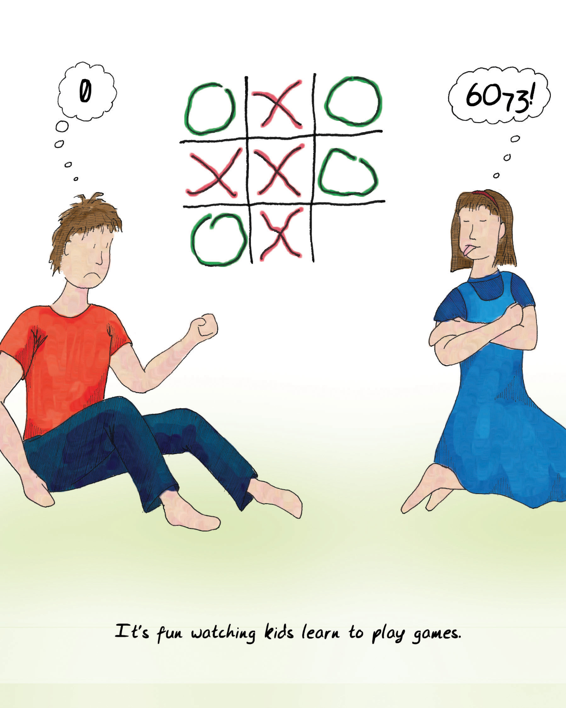
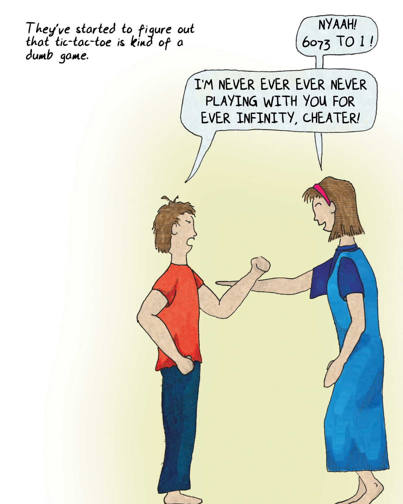

# Chapter 1 Why Write This Book? 第一章 为什么要写这本书？

  

Our kids took to games at a very early age. Games were all around them, and I brought home a crazy amount of them because of my work. I suppose it's no surprise that children model their parents. But my wife and I are also voracious readers, and the kids were resistant to that. Their attraction to games was more instinctive. As babies, they found the game of hide-the-object to be endlessly fascinating, and even now that they are older it elicits an occasional giggle. As babies there was an intentness about their alien gaze, as they tried to figure out where the rubber duckie had gone, that showed that this game was, for them, in deadly earnest.

我们的孩子很小就喜欢上了游戏。他们身边到处都是游戏，由于工作关系，我带回家的游戏多得让人眼花缭乱。我想，孩子以父母为榜样并不奇怪。但我和妻子也是贪婪的读者，孩子们对此很抵触。他们对游戏的热爱更多是出于本能。在他们还是婴儿的时候，他们就发现捉迷藏的游戏充满了无穷的吸引力，即使现在他们长大了，这个游戏偶尔也会引起他们的咯咯笑声。当他们试图找出橡皮鸭子的去向时，他们那异样的目光中流露出一种专注，这表明这个游戏对他们来说是认真的。

Kids are playing everywhere, all the time, and often playing games that we do not quite understand. They play and learn at a ferocious rate. We see the statistics on how many words kids absorb in a day, how rapidly they develop motor control, and how many basic aspects of life they master—aspects that are frankly so subtle that we have even forgotten learning them—and we usually fail to appreciate what an amazing feat this is.

孩子们无处不在、无时无刻不在玩耍，而且经常玩一些我们不太理解的游戏。他们以惊人的速度玩耍和学习。我们看到的统计数字表明，孩子们一天能吸收多少单词，他们的运动控制能力发展得有多快，他们掌握了多少生活的基本方面——坦率地说，这些方面是如此微小，以至于我们甚至忘记了自己是如何学会的——我们通常没有意识到这是多么惊人的壮举。

Consider how hard it is to learn a language, and yet children all over the world do it routinely. A first language. They are doing it without assigning [cognates](#user-content-fn-1)[^1] in their native tongue and without translating in their heads. Much attention has been paid to some very special [deaf kids in Nicaragua](#user-content-fn-2)[^2], who have managed to invent a fully functional sign language in just a few generations. Many believe this shows language is built into the brain, and that there's something in our wiring that guides us inexorably towards language.

想想看，学习一门语言有多难，但全世界的孩子都能照常学习。第一语言。他们是在没有指定母语中的[同源词](#user-content-fn-3)[^3]，也没有在头脑中进行翻译的情况下完成学习的。[尼加拉瓜一些非常特殊的聋哑儿童](#user-content-fn-4)[^4]备受关注，他们在短短几代人的时间里就发明了一种功能齐全的手语。许多人认为，这表明语言是内置于大脑中的，我们大脑的某些结构不可抗拒地引导我们走向语言。

  

> It's fun watching kids learn to play games.
> 
> 看着孩子们学习玩游戏很有趣。

Language is not the only hardwired behavior. As children move up the developmental ladder, they take part in a variety of instinctual activities. Any parent who has suffered through the “terrible twos” can tell you that it's as if a switch went on in the child's brain, altering his or her behavior radically. (This phase lasts beyond just the age of two, by the way—just a friendly warning.)

语言并不是唯一一种先天固有的行为。随着孩子的成长，他们会参与各种本能活动。任何经历过“可怕的两岁”的家长都会告诉你，孩子的大脑就像被打开了开关，行为发生了翻天覆地的变化。(顺便说一句，这个阶段不会只持续到两岁——只是一个善意的提醒）。

Kids also move on from certain games as they age. It was particularly interesting to see my kids outgrow tic-tac-toe—a game I beat them at for years, until one day all the matches became draws.

随着年龄的增长，孩子们也会远离某些游戏。看到我的孩子们不再玩井字游戏是一件特别有趣的事情——我在这个游戏上赢了他们很多年，直到有一天所有的比赛都变成了平局。

That extended moment when tic-tac-toe ceased to interest them was a moment of great fascination to me. Why, I asked myself, did mastery and understanding come so suddenly? The kids weren't able to tell me that tic-tac-toe is a limited game with optimal strategy. They saw the pattern, but they did not understand it, as we think of things.

他们对井字游戏不再感兴趣的那一刻让我非常着迷。我问自己，为什么掌握和理解会来得如此突然？孩子们无法告诉我井字游戏是一种具有最佳策略的有限游戏。他们看到了规律，但并不像我们所想的那样理解它。

This isn't unfamiliar to most people. I do many things without fully understanding them, even things I feel I have mastered. I don't need a degree in automotive engineering to drive my car. I don't even need to understand torque, wheels and how the brakes work. I don't need to remember the ins and outs of the rules of grammar to speak grammatically in everyday conversation. I don't need to know whether tic-tac-toe is [NP-hard or NP-complete](#user-content-fn-5)[^5] to know that it's a dumb game.

这对大多数人来说并不陌生。我做很多事情时都没有完全理解它们，即使是我觉得自己已经掌握的事情。我不需要汽车工程学位就能开我的车。我甚至不需要了解扭矩、车轮和刹车的工作原理。我不需要记住语法规则的来龙去脉，就能在日常对话中用语法说话。我不需要知道井字游戏是[NP 困难还是 NP 完全](#user-content-fn-6)[^6]，就知道这是一个愚蠢的游戏。

  

> They've started to figure out that tic-toc-toe is kind of a dumb game.
> 
> 他们已经开始意识到井字游戏是一种愚蠢的游戏。
> 
> NYAAH! 6073 to 1!
> 
> 哎呀！6073 比 1！
> 
> I'M NEVER EVER EVER NEVER PLAYING WITH YOU FOR EVER INFINITY, CHEATER!
> 
> 我永远永远永远永远都不会和你玩了，骗子！

I also have plenty of experiences where I stare at something and simply don't get it. I hate to admit it, but my typical reaction is to simply turn away. I feel this way often these days now that there's some (OK, a lot of) gray at my temples. I find myself unable to relate to some of the games that everyone tells me I should be playing. I just can't move the mouse quite as fast as I used to. I'd rather not play than feel that inept, even if the other players are friends of mine.

我也有很多这样的经历：我盯着某样东西看，但就是不明白。我不想承认这一点，但我的典型反应就是干脆转过身去。现在我的鬓角已经有一些（好吧，很多）白发了，我经常有这种感觉。我发现自己无法理解一些人人都说我应该玩的游戏。我无法像以前那样快速移动鼠标。我宁愿不玩，也不想觉得自己无能，即使其他玩家都是我的朋友。

That's not just me saying, “I can't cut it in Internet play! Damn 14-year-old kids.” My reaction isn't mere frustration; it's also got a tinge of boredom. I look at the problem and say, “Well, I could take on the [Sisyphean task](#user-content-fn-7)[^7] of trying to match these folks in every new game as it comes out, but frankly, repeated failure is a predictable cycle, and rather boring. I have better things to do with my time.”

这不仅仅是我在说“我在网络游戏中不行了！该死的 14 岁孩子”。我的反应不仅仅是沮丧，还有一丝厌烦。我看着这个问题说：“好吧，我可以承担[西西弗斯式的任务](#user-content-fn-8)[^8]，在每款新游戏问世时都努力与他们比赛，但坦率地说，反复失败是一个可预见的循环，而且相当无聊。我有更好的事情要做。”

From everything I hear, this feeling is likely to increase as I age. More and more novel experiences are going to come along, until sometime in 2038 when I'll need the assistance of my smart-ass grandkid to flibber-jibber the frammistan because I won't be able to cope with the newfangled contraptions. Is this inevitable?

据我所知，随着年龄的增长，这种感觉可能会越来越强烈。越来越多的新奇体验会接踵而至，直到 2038 年的某个时候，我需要我那自作聪明的孙子的帮助来摆弄那些我无法应对的新奇玩意儿。这是不可避免的吗？

  

> I know how they feel. I'm not a kid anymore, and some days, when I play a game on my computer, it seems like I'm fighting the tide. I quit because I feel inadequate.
> 
> 我知道他们的感受。我不再是个孩子了，有些时候，当我在电脑上玩游戏时，我似乎在与潮水对抗。我放弃了，因为我觉得力不从心。
> 
> first-person shooter
> 
> 第一人称射击游戏
> 
> water. honest.
> 
> 水。真的。

When I work on games that are more my speed, I can still crush them ([mu ha ha ha](#user-content-fn-9)[^9]). We read all the time about people who play Scrabble or other mentally challenging games delaying the onset of [Alzheimer's](#user-content-fn-10)[^10]. Surely keeping the mind active keeps it flexible and keeps you young?

当我玩那些更适合我的游戏时，我仍然可以碾压他们（[哞哈哈哈](#user-content-fn-11)[^11]）。我们经常读到关于玩拼字游戏或其他智力挑战游戏的人会延缓[老年痴呆症](#user-content-fn-12)[^12]发病的报道。当然，保持思维活跃可以保持头脑灵活，让你永葆青春？

Games don't last forever, though. There just comes a point where you say, "You know, I think I've seen most everything that this game has to offer." This happened to me most recently with a typing game I found on the Internet—it was a cute game where I played a diver and sharks were trying to eat me. Each shark had a word on its side, and as I typed the words in, the sharks went belly-up.

不过，游戏不会永远持续下去。总有一天你会说，“你知道吗，我想我已经玩遍了这个游戏的所有内容”。最近，我在互联网上发现了一款打字游戏，这是一款可爱的游戏，我扮演一名潜水员，鲨鱼试图吃掉我。每条鲨鱼的侧面都有一个单词，当我输入单词时，鲨鱼就会肚皮朝上。

Now, I am a terrible formal typist, but I can hunt-and-peck at almost 100 words a minute. This game was fun, but it was also a piece of cake. After level 12 or 14, the game just gave up. It conceded. It said to me, “You know, I've tried every trick I can think of, including words with random punctuation in the middle, words spelled backwards, and not showing you the words until the last minute. So to hell with it; from now on, I'll just keep throwing the same challenges at you. But really, you can quit now, because you've seen all I've got.”

现在，我是一个糟糕的正式打字员，但我能以每分钟大约可以猎食 100 个字。这个游戏很有趣，但也是小菜一碟。在第 12 或 14 级之后，游戏放弃了。它认输了。它对我说：“你知道，我能想到的招数我都试过了，包括中间随意加标点符号的单词、单词拼反了、不到最后一刻不给你看单词等。所以，见鬼去吧；从现在起，我将继续向你提出同样的挑战。不过说真的，你现在可以退出了，因为你已经看到了我的全部。”

I took its advice, and quit.

我接受了它的建议，退出了。

  

> Other times, if I play something I'm good at, I get really far and really well, then I get bored.
> 
> 其他时候，如果我玩自己擅长的东西，我就会玩得很好，玩得很远，然后我就会感到无聊。
> 
> Puzzle game
> 
> 益智游戏
 
Games that are too hard kind of bore me, and games that are too easy also kind of bore me. As I age, games move from one to the other, just as tic-tac-toe did for our children. Sometimes I play games with people who crush me and afterwards explain kindly, "Well, you see, this is a [game about vertices](#user-content-fn-13)[^13]." And I say, “Vertices? I'm putting down pieces on a board!” And they shrug, as if to say I'll never get it.

太难的游戏让我厌烦，太简单的游戏也让我厌烦。随着年龄的增长，游戏也从一个变成了另一个，就像我们的孩子玩井字游戏一样。有时候，我和一些人玩游戏，他们会把我压得喘不过气来，然后和蔼地解释说：“你看，这是一个[关于顶点的游戏](#user-content-fn-14)[^14]。”而我却说：“顶点？我在棋盘上下棋呢！”他们耸耸肩，好像在说我永远也不会明白。

That's why I decided to tackle the questions of what games are, and what fun is, and why games matter. I knew I'd be going over well-trod ground—a fair amount of psychological literature has been written on developmental behaviors in kids, for example. But the fact is that we don't tend to take games all that seriously.

这就是为什么我决定解决游戏是什么、乐趣是什么以及游戏为什么重要的问题。我知道我的研究会涉及一些老生常谈的问题——例如，关于儿童发育行为的心理学文献已经写了不少。但事实上，我们并没有那么认真地对待游戏。

As I write this a lot of people happen to be exploring these questions. Games, in their digital form, have become big business. We see ads for them on TV, we debate whether or not they [make more money than the movie industry](#user-content-fn-15)[^15], and we agonize over whether they cause violence in our children. Games are now a major cultural force. The time is ripe for us to dig deeper into the many questions that games raise.

在我写这本书的时候，很多人都在探讨这些问题。数字形式的游戏已经成为一门大生意。我们在电视上看到游戏广告，我们争论游戏是否[比电影业更赚钱](#user-content-fn-16)[^16]，我们焦虑游戏是否会给孩子们带来暴力。游戏现已成为一种重要的文化力量。我们深入探讨游戏引发的诸多问题的时机已经成熟。

I also find it curious that as parents, we'll insist that kids be given the time to play because it's important to childhood, but that work is deemed far more important later in life. I think work and play aren't all that different, to be honest. What follows explains how and why I came to that conclusion.

我还觉得奇怪的是，作为父母，我们坚持让孩子们有时间玩，因为这对童年很重要，但在以后的生活中，工作却被认为重要得多。老实说，我觉得工作和玩耍并没有什么不同。下文将解释我是如何以及为什么得出这个结论的。

  

> Why are some games fun and other games boring? Why do some games start getting boring after a while, and other games stay fun a long time?
> 
> 为什么有些游戏好玩，有些游戏却很无聊？为什么有的游戏玩久了就开始无聊，而有的游戏却能玩很长时间？
> 
> MISTER, WANNA PLAY WITH ME?
> 
> 先生，想和我一起玩吗？

[^1]: Cognates: Words that derive from a common root and are similar in meaning, even though they are in a different language. Languages frequently borrow words from one another, and thus similar words in different languages can be found. Often the meaning, pronunciation, or spelling can diverge to the point of being unrecognizable.

[^2]: Deaf children in Nicaragua: Many articles have been written on Nicaraguan Sign Language, also called NSL or ISN (after the initials of the phrase in Spanish). Deaf children in Nicaragua did not have access to each other, nor to training in sign language, until 1979, when schools for the deaf began to be opened. Over a few generations, the children developed a fully functional sign language that enabled them to communicate. This is believed to be the first time in history that scientists have been able to observe a language spontaneously created (as opposed to created intentionally, like Esperanto). A good overview of the story can be found at www.nytimes.com/library/magazine/home/19991024mag-sign-language.html.

[^3]: 源于共同词根、意义相似的词，尽管它们使用的是不同的语言。语言之间经常会相互借词，因此不同语言中也会出现类似的词。通常情况下，词义、发音或拼写会出现偏差，以至于无法辨认。

[^4]: 尼加拉瓜的聋哑儿童：关于尼加拉瓜手语（又称 NSL 或 ISN，取自西班牙语中该词组的首字母）的文章很多。尼加拉瓜的聋哑儿童没有机会相互交流，也没有机会接受手语培训，直到 1979 年才开始开设聋哑学校。经过几代人的努力，聋哑儿童发展出了一种功能齐全的手语，使他们能够进行交流。这被认为是历史上科学家第一次观察到一种自发创造的语言（而不是像世界语那样有意创造的语言）。有关该故事的精彩概述，请访问 www.nytimes.com/library/magazine/home/19991024mag-sign-language.html。

[^5]: NP-hard and NP-complete: These are terms from complexity theory, the field of mathematics that studies how hard it is to solve a given problem (as opposed to whether it can be solved at all, which is called “computability theory”). Other types of complexity include P, NP, PSPACE-complete, and EXPTIME-complete. Many abstract board games are classifiable as terms of their mathematical complexity in this way; for example, checkers is EXPTIME-complete, and Othello is PSPACE-complete. Rendering games obsolete is a favorite pastime of mathematicians. They have proven that for optimal players, the first player to move will always win games such as Connect Four and Pentominoes.

[^6]: NP 困难 和 NP 完全：这是复杂性理论中的术语，复杂性理论是研究解决一个给定问题有多难的数学领域（而不是研究这个问题是否能被解决，后者被称为“可计算性理论”）。其他复杂性类型包括 P、NP、PSPACE-complete 和 EXPTIME-complete。许多抽象棋类游戏都可以用这种方法按其数学复杂性进行分类；例如，跳棋是 EXPTIME-完备的，黑白棋是 PSPACE-完备的。让游戏过时是数学家们最喜欢的消遣。他们已经证明，对于最佳玩家来说，最先行动的玩家总是能赢得四子连环和五子棋等游戏。

[^7]: Sisyphean task: Sisyphus was condemned to roll a heavy stone uphill in Tartarus, deep below Hades. Every time he got it to the top, it would roll back down again and he'd have to do it over. To be facetious, in modern video games, this is called "restoring a save."

[^8]: 西西弗斯式的任务：西西弗斯被罚在冥界深处的“塔尔塔罗斯”滚着一块沉重的石头上山。每当他把石头滚到山顶时，石头又会滚下来，他不得不重新来过。说句玩笑话，在现代电子游戏中，这叫做“恢复保存”。

[^9]: Mu ha ha ha: A common gloat heard in Internet gaming.

[^10]: Mentally challenging games and Alzheimer's : A study in the New England Journal of Medicine in June 2003 indicated that mental challenges such as games retarded the development of Alzheimer's. Games weren't the only mental challenge studied; playing musical instruments, learning new languages, and dancing also had similar effects. Another study performed in 2013, called the Iowa Healthy and Active Minds Study, showed that certain videogames could have positive effects on overall cognitive function, while crossword puzzles did not (results were published in PLOS ONE, http://bit.y/plos-one-random).

[^11]: 哞哈哈哈：网络游戏中常见的得意洋洋的笑声。

[^12]: 智力挑战游戏与阿尔茨海默氏症：2003 年 6 月，《新英格兰医学杂志》上的一项研究表明，游戏等智力挑战可延缓阿尔茨海默氏症的发展。游戏并不是研究中唯一的智力挑战，演奏乐器、学习新语言和跳舞也有类似的效果。2013年进行的另一项名为“爱荷华州健康和活跃思维研究”的研究表明，某些电子游戏对整体认知功能有积极影响，而填字游戏则没有（研究结果发表在《PLOS ONE》上，http://bit.y/plos-one-random）。

[^13]: Games as vertices: Many games that require you to place one piece adjacent to another can be expressed as problems in graph theory, a field of mathematics that studies points and links between them. Each node is called a vertex, and each link is called an edge. Analyzing games in this highly abstract way can reveal many fundamental characteristics about how to play them well.

[^14]: 游戏即顶点：图论是研究点和点之间联系的数学领域。每个节点称为顶点，每个链接称为边。以这种高度抽象的方式分析游戏，可以揭示出如何玩好游戏的许多基本特征。

[^15]: Make more money than the movie industry: In 2011, the L.A. Times reported that global box-office receipts were $31.8 billion, and the research firm Gartner stated that the videogame industry (where the bulk of game revenues reside) reached $74 billion. However, box-office receipts are not the only income streams for movies: they have physical copies on disc, streaming, airplane showings, TV showings, and even videogame licensing fees in their downstream revenues. On the flip side, the games industry figures include the sales of hardware—and game consoles can be purchased for use as media devices. And so the debate continues.

[^16]: 赚的钱比电影业还多：2011 年，据《洛杉矶时报》报道，全球电影票房收入为 318 亿美元，研究公司 Gartner 称，电子游戏产业（游戏收入的大头）达到 740 亿美元。然而，票房收入并不是电影的唯一收入来源：电影的下游收入包括光盘实体拷贝、流媒体、飞机放映、电视放映，甚至还有电子游戏授权费。另一方面，游戏产业的数据包括硬件的销售额——游戏机也可以作为媒体设备购买使用。争论还在继续。