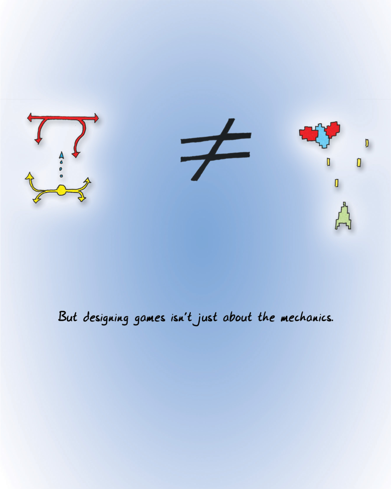

Nobody actually interacts with games on an abstract level exclusively. You don't play the abstract diagrams of games that I have drawn on the facing pages; you play the ones that have little spaceships and laser bolts and things that go BOOM! The core of gameplay may be about the emotion I am terming "fun," the emotion that is about learning puzzles and mastering responses to situations, but this doesn't mean that the other sorts of things we lump under fun do not contribute to the overall experience.

实际上，没有人只在抽象层面上与游戏互动。你不会去玩我在对面页面上画的抽象游戏图；你玩的是那些有小飞船、激光枪和会发出“轰！”声的东西的游戏。游戏玩法的核心可能与我所说的“开心”这种情感有关，这种情感是关于学习谜题和掌握应对各种情境的方法，但这并不意味着我们归类到乐趣下的其他各种事物对整体体验没有贡献。

People like playing go using well-burnished beads on a wooden board, and they like buying Lord of the Rings chess sets and glass Chinese checkers sets. The aesthetic experience of playing these games matters. When you pick up a well-carved wooden game piece, you respond to it in terms of aesthetic appreciation—one of the other forms of enjoyment. When you play table tennis against an opponent, you feel visceral sensations as you stretch your arm to the limit and smash the ball against the table surface. And when you slap the back of your teammate, congratulating him on his field goal, you're participating in the subtle social dance that marks the constant human exercise of social status.

人们喜欢在木板上用精心烧制的珠子下围棋，喜欢购买《指环王》主题的国际象棋和中国玻璃跳棋。玩这些游戏的审美体验非常重要。当你拿起一个雕刻精美的木制棋子时，你会从审美欣赏的角度对它做出反应——这也是其他形式的享受。当你与对手打乒乓球时，当你将手臂伸展到极限并将球砸向桌面时，你会感受到直观的感觉。而当你拍打队友的后背，祝贺他射门得分时，你正在参与微妙的社交舞蹈，这标志着人类不断的社交地位实践。

We know this from other media. It matters who sings a song because delivery is important. We treasure nice editions of books, rather than cheap ones, even though the semantic content is identical. Rock climbing a real rock face, versus a fake one attached to a wall, feels different.

我们从其他媒介中了解到这一点。演唱歌曲的人选很重要，因为演唱方式至关重要。我们珍爱书籍的精美版本，而不是廉价版本，即使两者的内容信息容完全相同。在真实的岩壁上攀岩，与在墙壁上的人造岩面攀岩，感觉是不同的。

> But designing games isn't just about the mechanics.
> 
> 但是，设计游戏并不仅仅是设计机制。

In many media, the presentation factors are outside the hands of the initial creator of the content. But in other media, the creator has a say. Often, we have a specific person whose role it is to create the overall experience, as opposed to the content itself. And rightfully, this person is given higher authority over the final output than the content creator alone. The director trumps the writer in a movie, and the conductor trumps the composer in a symphony.

在许多媒介中，内容呈现的因素并不在内容最初创作者的掌控之中。但在其他媒介中，创作者却有发言权。通常情况下，我们有一个特定的人，他的职责是创造整体体验，而不是内容本身。理所当然，这个人在最终产出上比内容创作者一个人拥有更高的权力。在电影中，导演高于编剧，在交响乐中，指挥高于作曲家。

There is a difference between designing the content and designing the end-user experience.

设计内容和设计最终用户体验是不同的。

Game design teams are set up this way, too. Too many other components have tremendous importance in our overall experience of games for their overall shape to rest in the hands of the designers of ludic artifacts alone.

游戏设计团队的组建也是如此。在我们对游戏的整体体验中，有太多其他的组成部分发挥着巨大作用，因此游戏的整体形态不能仅由负责设计游戏机制的设计师单独决定。

Players see through the fiction to the underlying mechanics, but that does not mean the fiction is unimportant. [Consider films](#user-content-fn-1)[^1], where the goal is typically for the many conventions, tricks, and mind-shapings that the camera performs to remain invisible and unperceived by the viewer. It's rare that a film tries to call attention to the gymnastics of the camera, and when it does, it will likely be to make some specific point. For example, cinematographers and directors frame conversations by placing the camera slightly over the shoulder of whoever is listening at the time. This creates psychological proximity. If done well, the audience never notices that the two sides of the conversation were filmed separately. This is part of the "vocabulary" of cinema.

玩家可以透过虚构看到潜在的机制，但这并不意味着虚构不重要。[就拿电影来说](#user-content-fn-2)[^2]，电影的目标通常是让摄影机所表现的许多传统手法、技巧和心智塑形不被观众察觉。很少有电影会试图唤起观众对摄影机技巧的关注，即使有，也很可能是为了表达某种特定的观点。例如，摄影师和导演会将镜头稍稍放在当时正在倾听的人的肩膀上，以此来定格对话。这样就会产生心理上的接近感。如果做得好，观众永远不会注意到对话的双方是分开拍摄的。这是电影“语汇”的一部分。

For better or worse, visual representation and metaphor are part of the vocabulary of games. When we describe a game, we almost never do so in terms of the formal abstract system alone; we describe it in terms of the overall experience.

无论好坏，视觉表现和隐喻都是游戏语汇的一部分。当我们描述一款游戏时，几乎从不只从形式上抽象系统来描述，而是从整体体验的角度来描述。

The dressing is tremendously important. It's very likely that chess would not have its long-term appeal if the pieces all represented different kinds of snot.

外观极其重要。试想，如果棋子代表的都是些微不足道的形象，恐怕国际象棋的吸引力就不会经久不衰。

> Even if players can see through fiction, the art of the game includes that fiction.
> 
> 即使玩家能看穿虚构，游戏的艺术也包括虚构。
> 
> YEAH, IT'S A GAME ABOUT PROJECTING FORCE, AIMING FOR A NASH EQUILIBRIUM.
> 
> 是的，这是一个关于投射力量的游戏，目标是纳什平衡。

When we compare games to other art forms that rely on multiple disciplines for effect, we find that there are a lot of similarities. Take dance, for example. The "content creator" in dance is called the choreographer (it used to be called the "dancing master," but modern dance disliked the old ballet terms and changed it). Choreography is a recognized discipline. For many centuries, it struggled, in fact, because there was no [notation system for dance](#user-content-fn-3)[^3]. That meant that much of the history of this art form is lost to us because there was simply no way to replicate a dance, save by passing it on from master to student.

当我们将游戏与其他依靠多种学科产生效果的艺术形式进行比较时，我们会发现两者有很多相似之处。以舞蹈为例。舞蹈中的“内容创作者”被称为编舞（过去被称为“舞蹈大师”，但现代舞不喜欢芭蕾舞的旧称，所以改了）。编舞是一门公认的学科。事实上，许多世纪以来，舞蹈编导一直在苦苦挣扎，因为[舞蹈没有记谱系统](#user-content-fn-4)[^4]。这意味着这种艺术形式的大部分历史已被我们遗忘，因为除了师徒相传之外，根本无法复制舞蹈。

And yet, the choreographer is not the ultimate arbiter in a dance. There are far too many other variables. There's a reason, for example, why the [prima ballerina](#user-content-fn-5)[^5] is such an important figure. The dancer makes the dance, just as the actor makes the lines. A poor delivery means that the experience is ruined—in fact, if the delivery is poor enough, the sense may be ruined, just as bad handwriting obscures the meaning of a word.

然而，舞蹈编导并不是舞蹈的最终仲裁者。还有太多其他变数。例如，[首席芭蕾舞演员](#user-content-fn-6)[^6]之所以如此重要是有原因的。舞者创造舞蹈，正如演员创造台词。糟糕的演绎意味着体验被破坏——事实上，如果演绎足够糟糕，意义也可能被破坏，就像糟糕的字迹会掩盖一个词的意义一样。

Swan Lake staged on the shore of a lake is a different experience from Swan Lake on a bare stage. There's a recognized profession there, too: the set designer. And there's the lighting, the casting, the costuming, the performance of the music… The choreographer may be the person who creates the dance, but in the end, there's probably a director who creates the dance.

在湖畔上演的《天鹅湖》与在光秃秃的舞台上上演的《天鹅湖》是两种不同的体验。这里还有一个公认的职业：布景师。还有灯光、选角、服装、音乐表演……编舞可能是创造舞蹈的人，但最终可能还是导演创造了舞蹈。

Games are the same way. We could probably use new terminology for games. Often in large projects, we make the distinction between game system designers, content designers, the lead designer or creative director (a problematic term because it means something else in different disciplines, such as in graphic design), writers, level designers, world builders, and who knows what else. If we consider games to be solely the design of the formal abstract systems, then only the system designer is properly a game designer. If we came up with a new term for the formal core of games, comparable to "choreography," then we'd give this person a title [derived from that term](#user-content-fn-7)[^7] instead.

游戏也是如此。我们或许可以为游戏使用新的术语。通常在大型项目中，我们会区分游戏系统设计师、内容设计师、首席设计师或创意总监（这是一个有问题的术语，因为它在不同的学科中另有含义，例如在平面设计中）、编剧、关卡设计师、世界构建者，以及其他谁知道是什么的人。如果我们认为游戏仅仅是形式抽象系统的设计，那么只有系统设计师才是真正的游戏设计师。如果我们为游戏的形式核心设计一个类似于“编舞”新术语，那么我们就可以给这个人一个由这个[术语衍生出来](#user-content-fn-8)[^8]的头衔。

> casting
> 
> 表演
> 
> lighting
> 
> 灯光
> 
> costuming
> 
> 服装
> 
> staging
> 
> 舞台
> 
> music
> 
> 音乐
> 
> choreography
> 
> 舞蹈编排
> 
> For example, we don't say tat dance is solely choreography, even though that is the formal core of it.
> 
> 例如，我们不会说舞蹈仅仅是编舞，尽管这是它的形式核心。

All of this implies that [a mismatch between the core of a game—the ludemes—and the dressing](#user-content-fn-9)[^9] can result in serious problems for the user experience. It also means that the right choice of dressing and fictional theme can strongly reinforce the overall experience and make the learning experience more direct for players.

所有这些都意味着，游戏的核心内容——[游戏元素——与外观之间的不匹配](#user-content-fn-10)[^10]会给用户体验带来严重问题。这也意味着，正确选择外观和虚构主题可以有力地强化整体体验，让玩家获得更直接的学习体验。

The bare mechanics of a game may indeed carry semantic freighting, but odds are that it will be fairly abstract. A game about aiming is a game about aiming, and there's no getting around that. It's hard to conceive of a game about aiming that isn't about shooting, but it has been done—there are several games where instead of shooting bullets with a gun, you are instead [shooting pictures with a camera](#user-content-fn-11)[^11].

游戏的基本机制可能确实带有语义，但很可能是相当抽象的。关于瞄准的游戏就是关于瞄准的游戏，这是无法回避的问题。你很难想象一款不以射击为主题的瞄准游戏，但这种游戏已经出现过——有几款游戏不是用枪射击子弹，而是[用照相机拍摄照片](#user-content-fn-12)[^12]。

For games to really develop as a medium, they need to further develop the ludemes, not just the dressing. By and large, however, the industry has spent its time improving the dressing. We have better and better graphics, better back stories, better plots, better sound effects, better music, more fidelity in the environments, more types of content, and more systems within each game. But the systems themselves tend to see fairly little innovation.

游戏要想真正发展成为一种媒介，就需要进一步开发“游戏元素”，而不仅仅是外观。然而，总的来说，游戏业已经把时间都花在了改进外观上。我们有了越来越好的画面、更好的背景故事、更好的情节、更好的音效、更好的音乐、更逼真的环境、更多类型的内容以及每个游戏中更多的系统。但系统本身的创新却很少。

It's not that progress along these other axes isn't merited—it's just easy relative to the true challenge, which is developing the formal structure of game systems themselves. Often these new developments improve the overall experience, but that's comparable to saying that the development of the 16-track recorder revolutionized songwriting. It didn't; it revolutionized arranging and production, but the demo versions of songs are still usually one person with a piano or a guitar.

这并不是说其他方面的进步没有价值——只是相对于真正的挑战而言，即开发游戏系统本身的形式结构而言，这些进步太容易了。通常情况下，这些新发展会改善整体体验，但这就好比说 16 轨录音机的发展彻底改变了歌曲创作。事实并非如此，它彻底改变了编曲和制作，但歌曲的试听版本通常仍是一个人与一架钢琴或一把吉他。

The best test of a game's fun in the strict sense is playing the game with no graphics, no music, no sound, no story, nothing. If that is fun, then everything else will serve to focus, refine, empower, and magnify. But all the dressing in the world can't change iceberg lettuce into roast turkey.

从严格意义上讲，检验一款游戏是否有趣的最佳方式是，在玩游戏时不要画面、不要音乐、不要声音、不要故事，什么都不要。如果这样也有趣，那么其他一切都将起到有助于集中、提炼、增强和放大。但世界上所有的调味品都无法把冰山生菜变成烤火鸡。

> ...oof...
> 
> ……呜……
> 
> ...aaaah...
> 
> ……啊……
> 
> ...you're next...
> 
> ……你是下一个……
> 
> ...please...
> 
> ……求求你……
> 
> ...this cannot stand...
> 
> ……这不能忍受……
> 
> ...unh...
> 
> ……不……
> 
> ...my wife...
> 
> ……我的妻子……
> 
> Consider a game of mass murder where you throw victims down a well and they stand on each other to try to climb out.
> 
> 考虑玩一个大屠杀的游戏，把受害者扔到井里，让他们站在对方身上试图爬出来。

This means the question of ethical responsibility rears its head. The ethical questions surrounding games as murder simulators, games as misogyny, games as undermining of traditional values, and so on are not aimed at games themselves. They are aimed at the dressing.

这意味着伦理责任问题再次出现。围绕游戏是谋杀模拟器、游戏是厌女症、游戏是对传统价值观的破坏等伦理问题，并非针对游戏本身。它们针对的是外观。

To the designer of formal abstract systems, these complaints are always going to seem misguided. A vector of force and a marker of territory have no cultural agenda. At the least, the complaints are misdirected—they ought to go to the equivalent of the director, the person who is making the call on the overall user experience.

对于形式抽象系统的设计者来说，这些抱怨似乎总是被误导的。力的矢量和领土的标记并没有文化议程。至少，这些抱怨的方向是错误的——它们应该去找相当于导演的人，也就是对整体用户体验做出决定的人。

Directing these complaints to the director is the standard. It's the standard to which we hold the writers of fiction, the makers of films, the directors of dances, and the painters of paintings. The cultural debate over the acceptable limits of content is a valid one. We all know that there is a difference in experience caused by presentation. If we consider the art of the dance to be the sum of choreography plus direction plus costuming and so on, then we must consider the art of the game to be the ludemes plus direction plus artwork and so on.

把这些投诉交给主管是标准。我们对小说作家、电影制作人、舞蹈导演和绘画画家的要求也是如此。关于内容的可接受限度的文化辩论是有道理的。我们都知道，表现形式不同，体验也就不同。如果我们认为舞蹈艺术是舞蹈编排加导演加服装等的总和，那么我们就必须认为游戏艺术是游戏元素加导演加美工等的总和。

The bare mechanics of the game do not determine its meaning. Let's try a thought experiment. Let's picture a mass murder game wherein there is a gas chamber shaped like a well. You the player are dropping innocent victims down into the gas chamber, and they come in all shapes and sizes. There are old ones and young ones, fat ones and tall ones. As they fall to the bottom, they grab onto each other and try to form human pyramids to get to the top of the well. Should they manage to get out, the game is over and you lose. But if you pack them in tightly enough, the ones on the bottom succumb to the gas and die.

纯粹的游戏机制并不能决定游戏的含义。让我们做一个思想实验。让我们想象一个大屠杀游戏，游戏中有一个形状像井的毒气室。玩家要把无辜的受害者扔进毒气室，他们形形色色。他们有老有少，有胖有高。当他们落到井底时，他们会互相抓住，试图组成人形金字塔，爬到井顶。如果他们设法逃了出来，游戏就结束了，你就输了。但是，如果你把他们紧密地装进去，井底的人就会被毒气毒死。

I do not want to play this game. Do you? [Yet it is Tetris](#user-content-fn-13)[^13]. You could have well-proven, stellar game design mechanics applied towards a quite repugnant premise. To those who say the art of the game is purely that of the mechanics, I say that film is not solely the art of cinematography or scriptwriting or directing or acting. Similarly, the art of the game is the whole.

我不想玩这个游戏。你想玩吗？然而，[这就是俄罗斯方块](#user-content-fn-14)[^14]。你可以把经过充分验证的优秀游戏设计机制应用到一个令人厌恶的前提中。对于那些认为游戏的艺术纯粹是游戏机制的人，我要说的是，电影的艺术不仅仅是摄影、编剧、导演或表演。同样，游戏艺术是一个整体。

This does not mean that the art of the cinematographer (or ludemographer) is less; in truth, the very fact that the art of the film fails if any of its constituent arts fail elevates each and every one to primacy.

这并不意味着电影摄影师（或游戏设计师）的艺术就不重要了；事实上，如果电影艺术的任何组成部分失效，那么电影艺术就会失效，这一事实恰恰将每一种艺术都提升到了至高无上的地位。

> The mechanics may be Tetris, but the experience is very different.
> 
> 其机制可能是俄罗斯方块，但体验却截然不同。

The danger is philistinism. If we continue to regard games as trivial entertainments, then we will regard games that transgress social norms as obscene. Our litmus test for obscenity centers on redeeming social value, after all. Game dressing might have it, or might not. But it is important to understand that the ludemes themselves have social value. By that standard, all good games should pass the litmus test regardless of their dressing.

危险在于庸俗主义。如果我们继续把游戏视为微不足道的娱乐，那么我们就会把违反社会规范的游戏视为淫秽。毕竟，我们判断内容是否淫秽的标准核心在于其是否有可救赎的社会价值。游戏外观可能有，也可能没有。但重要的是要明白，游戏机制本身具有社会价值。按照这个标准，所有优秀的游戏都应通过检验，无论它们的外观如何。

Creators in all media have a social obligation to be responsible with their creations. Consider the recent development of "[hate crime shooters](#user-content-fn-15)[^15]," where the enemies represent an ethnic or religious group that the creators dislike. The game mechanic is old and tired, and offers nothing new in this case. We can safely consider this game to be hate speech, as it was almost certainly intended.

所有媒介的创作者都有对其作品负责的社会义务。考虑到最近“[仇恨犯罪射击游戏](#user-content-fn-16)[^16]”的发展，在这些游戏中，敌人代表了创作者不喜欢的种族或宗教团体。在这种情况下，游戏机制已经老旧过时，没有任何新意。我们可以放心地将这款游戏视为仇恨言论，因为它几乎肯定是有意为之。

The problematic case is a game that contains both brilliant gameplay and offensive content. The commonest defense is to argue that games do not exert significant influence on their players. This is untrue. All media exert influence on their audiences. But it is almost always the core of the medium that exerts the most influence because the rest is, well, dressing.

有问题的情况是，一款游戏既有出色的游戏性，又有攻击性的内容。最常见的辩护理由是游戏不会对玩家产生重大影响。这是不正确的。所有媒介都会对受众产生影响。但影响最大的几乎总是媒介的核心部分，因为其他部分都是外观。

All artistic media have influence, and free will also has a say in what people say and do. Games right now seem to have a very narrow palette of expression. But let them grow. Society should not do something stupid like the [Comics Code](#user-content-fn-17)[^17], which stunted the development of the comics medium in the United States severely for decades. Not all artists and critics agree that art has a social responsibility. If there was such agreement, there wouldn't be the debates about the ethics of locking up [Ezra Pound](#user-content-fn-18)[^18], about the validity of propagandistic art, about whether one should respect artists who were scoundrels and scum in their private lives. It's not surprising that we wonder whether games or TV or movies have a social responsibility—once upon a time we asked the same thing about poetry. Nobody really ever agreed on an answer.

所有艺术媒介都有影响力，而人的自由意志也在决定人们言行的过程中发挥作用。现在的游戏似乎只有非常狭窄的表达空间。但还是让它们成长吧。社会不应该做[《漫画准则》](#user-content-fn-19)[^19]那样的蠢事，它严重阻碍了美国漫画媒介的发展，长达数十年之久。并非所有的艺术家和评论家都同意艺术具有社会责任。如果有这样的共识，就不会有关于关押[埃兹拉·庞德](#user-content-fn-20)[^20]的伦理辩论，不会有关于宣传艺术有效性的争论，关于是否应该尊重那些在私生活中是无赖和人渣的艺术家的争论。我们不禁要问，游戏、电视或电影是否负有社会责任——曾经我们也对诗歌提出过同样的问题。没有人真正就答案达成一致。

The constructive thing to do is to push the boundary gently so that it doesn't backfire. That's how we got Lolita, Catcher in the Rye, and Apocalypse Now. As a medium, games have to earn the right to be taken seriously.

有建设性的做法是温和地突破界限，以免适得其反。因此，我们才有了《洛丽塔》、《麦田守望者》和《现代启示录》。作为一种媒介，游戏必须赢得被认真对待的权利。

> The literal lesson being taught is still how to stack blocks, but the artistic statement is different.
> 
> 所教的字面意思仍然是如何堆砌积木，但艺术表现形式却不同。
> 
> MOM, CAN I GET THIS MASS MURDER GAME, HUH, HUH?
> 
> 妈妈，我能买这个大屠杀游戏吗？嗯？嗯？

[^1]: Consider films: Jon Boorstin's Making Movies Work (Silman-James Press, 1995) is an excellent primer on the basics of film as a medium.

[^2]: 考虑电影：乔恩·博尔斯汀的《让电影运作》（Silman-James 出版社，1995 年）是介绍电影作为一种媒介的基础知识的优秀入门读物。

[^3]: Notation system for dance: It wasn't until the 1500s that the first very primitive system of notating dance was developed, and it wasn't until 1926 that Laban developed a system that was really what we'd call complete.

[^4]: 舞蹈记谱系统：直到 1500 年代，才出现了第一套非常原始的舞蹈记谱系统，而直到 1926 年，拉班才开发出一套真正称得上完整的系统。

[^5]: Prima ballerina: This calls to mind, of course, the poem "Among School Children," written by William Butler Yeats in 1927: O body swayed to music, O brightening glance, How can we know the dancer from the dance?

[^6]: 首席芭蕾舞演员：这当然会让人想起威廉·巴特勒·叶芝 1927 年写的诗歌《在学童中》：啊，随着音乐摇摆的身体，啊，明亮的眼神，我们怎能从舞蹈中认识舞者？

[^7]: Term comparable to choreography: "Ludography" seems like a good choice, except that it is instead comparable to "bibliography" and means the games you have created. This hasn't stopped designer James Ernest from calling himself a ludographer. If anyone has any ideas better than the awful "gameplayographer," let me know! "Ludeme-ographer"? "Ludemographer"? Right now, the closest term is probably the role of "systems designer," but that all too often covers aspects well outside of ludic artifact specification.

[^8]: 可与舞蹈编排相媲美的术语：“Ludography”似乎是个不错的选择，但它与“bibliography”类似，指的是你创造的游戏。但这并不妨碍设计师詹姆斯·欧内斯特称自己为“ludographer”。如果谁有比糟糕的“gameplayographer”更好的主意，请告诉我！“Ludeme-ographer”？“Ludemographer”？现在，最接近的说法可能是“系统设计师”这个角色，但它往往涵盖的内容远远超出了游戏机制规范的范畴。

[^9]: A mismatch between the ludemes and the dressing: the theory term for this is "ludonarrative dissonance," coined by game designer Clint Hocking in 2007 in his blog post [here](http://clicknothing.typepad.com/click_nothing/2007/10/ludonarrative-d.html).

[^10]: 游戏与外观之间的不匹配：游戏设计师克林特·霍金于 2007 年在他的[博客文章](http://clicknothing.typepad.com/click_nothing/2007/10/ludonarrative-d.html)中提出了“游戏叙事失调”这一理论术语：。

[^11]: Games about shooting with a camera: Among them are Pokemon Snap for the Nintendo 64 and Beyond Good & Evil, available on various platforms.

[^12]: 关于用相机拍摄的游戏：其中包括任天堂 64 的《口袋妖怪随乐拍》和多平台的《超越善恶》。

[^13]: Yet it is Tetris: In the ten years since the first edition of this book was published, at least two examples surfaced of exactly this game, and at least one more was inspired by this chapter.

[^14]: 这就是俄罗斯方块：在本书第一版出版后的十年间，至少有两款游戏正是这样的（本质是俄罗斯方块），至少还有一款是受这一章的启发。

[^15]: Hate crime shooters: Several of these have been made, espousing various causes ranging from the agenda of the Ku Klux Klan to Palestinian nationhood.

[^16]: 仇恨犯罪射击游戏：有几个这样的作品，支持从三K党议程到巴勒斯坦建国等各种事业。

[^17]: The Comics Code: Established in the 1950s following an uproar over the impact that violent comics could have on children. The result was self-censorship imposed by the comics industry; for many years, no comics were published without the Comics Code seal of approval. The artistic gap between the EC Comics of the 50s and Art Spiegelman's Maus is not that huge—the time gap that resulted from the imposition of the Comics Code arguably set the medium back by 30 years. David Hajdu's The Ten-Cent Plague: The Great Comic-Book Scare and How it Changed America (Picador, 2009) is an excellent book covering the history of this moral panic.

[^18]: Ezra Pound: A brilliant modernist poet who was also a fascist and not a very nice human being.

[^19]: 《漫画准则》：20世纪50年代，由于对暴力漫画可能对儿童产生的影响的强烈抗议之后建立。结果是漫画行业实行自我审查；多年来，没有《漫画准则》印章的漫画一律不得出版。从 50 年代的 EC 漫画到阿特·斯皮格尔曼的《鼠族》，两者之间的艺术差距并不算大，但《漫画准则》的实施造成的时间差可以说让漫画媒介倒退了 30 年。大卫·哈伊杜的《十分钱瘟疫：伟大的漫画恐慌以及它如何改变了美国》（Picador，2009 年）是一本介绍这一道德恐慌历史的优秀著作。

[^20]: 埃兹拉·庞德：一位杰出的现代主义诗人，同时也是一位法西斯主义者，为人并不友善。