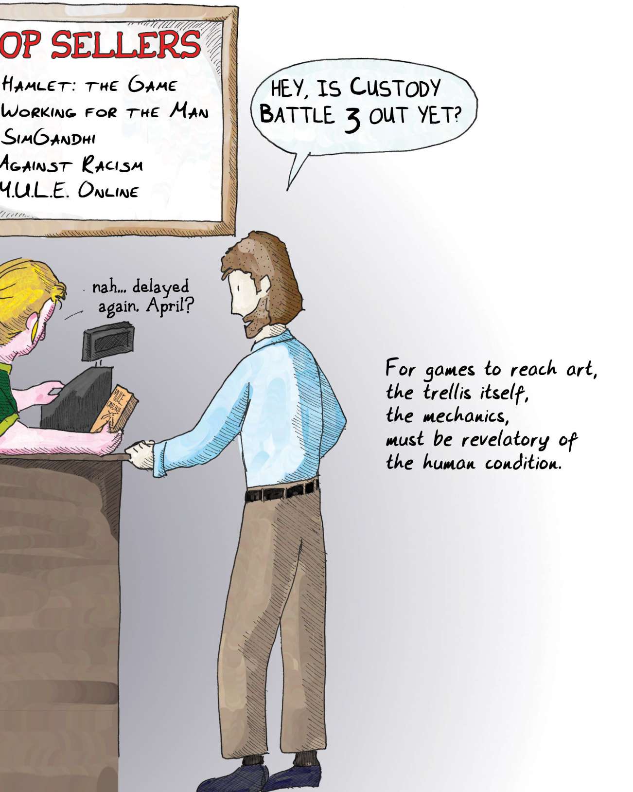

# Chapter 11 Where Games Should Go 第十一章 游戏的去向

I've spent a lot of time talking about how games intersect the human condition. I think there is an important distinction to be drawn, however. In other media, we frequently speak of how a given work is revelatory of the human condition. By this, we mean that the work is a good portrayal of the human condition—it is something that gives us insight into ourselves. As the Greeks put it, [Gnothi seauton](#user-content-fn-1)[^1]—know thyself. It's perhaps the greatest challenge we as humans face, and in many ways, it may be the greatest threat to our survival.

我已经花了很多时间来讨论游戏如何与人类的生存状态相互交织。然而，我认为有一个重要的区别需要明确。在其他媒介中，我们经常谈到某部作品如何揭示了人类的境况。我们这样说的意思是，该作品很好地描绘了人类的境况——它能让我们洞察自身。正如希腊人所说，[Gnothi seauton](#user-content-fn-2)[^2]——认识你自己。这也许是我们人类面临的最大挑战，并且在很多方面，它可能是对我们生存的最大威胁。

Many of the things that I have discussed in this book, such as theories of cognition, understanding of gender, learning styles, chaos theory, graph theory, and literary criticism, are fairly recent developments in human history. Humanity is engaged in a grand project of self-understanding, and most of the tools we have used in the past were imprecise at best. Over time we have developed better tools in the quest to understand ourselves better.

我在本书中讨论的许多问题，如认知理论、对性别的理解、学习风格、混沌理论、图论和文学批评等，都是人类历史上的最新发展。人类正在进行一项宏大的自我认识工程，而我们过去使用的大多数工具充其量都是不精确的。随着时间的推移，我们开发出了更好的工具，以求更好地了解我们自己。

It's an important endeavor because other humans have typically been our greatest predator. Today we have come to realize how interrelated we all are, even when the left continent doesn't know what the right continent is doing. We have come to realize that actions we undertake often have far-reaching consequences that we never anticipated. Some, such as [James Lovelock](#user-content-fn-3)[^3], have gone so far as to call us all one giant organism.

这是一项重要的工作，因为其他人类通常一直是我们最大的天敌。今天，我们逐渐认识到，即使左边的大陆不知道右边的大陆在做什么，所有人也是息息相关的。我们逐渐认识到，我们采取的行动往往会产生我们从未预料到的深远影响。有些人，比如[詹姆斯·洛夫洛克](#user-content-fn-4)[^4]，甚至称我们都是一个巨大的有机体。

> It is not the same thing for our games to portray the human condition and the human condition to exist within our games.
> 
> 我们的游戏描绘人类状况与人类状况存在于我们的游戏中并不是一回事。
> 
> \* All quotes from Sartre pondering online multiplayer roleplaying games.
> 
> \* 所有引用来自萨特对在线多人角色扮演游戏的思考。
> 
> Objects should not touch because they are not alive. You use them, put them back in place, you live among them. They are useful, nothing more.
> 
> 物体不应该接触，因为它们没有生命。你使用它们，将它们放回原位，你在它们当中生活。它们是有用的，仅此而已。
> 
> Hell is other people.
> 
> 他人即地狱。
> 
> Nothing seemed true, I felt surrounded by cardboard scenery, which could quickly be removed.
> 
> 一切似乎都不真实，我感到周围都是可以迅速拆除的纸板布景。
> 
> I was just thinking -- that here we sit, all of us, eating and drinking to precious existence and really there is nothing, nothing, absolutely no reason for existing.
> 
> 我刚才在想——我们大家坐在这里，为了珍贵的生命而吃喝，但实际上，没有任何理由，没有任何绝对存在的理由。
> 
> I am. I am. I exist therefore I am. I am because I think that I don't want to be, I think that I because ugh! I flee...
> 
> 我在。我在。我存在故我在。我因为思考自己不想在而在，我思考因为我……啊！我逃了……
> 
> People who live in society have learned to see themselves in mirrors as they appear to their friends.
> 
> 生活在社会中的人们已经学会了通过朋友的眼睛来了解自己，这就像在镜子中看自己一样。

I'm not being all that fanciful or idealistic in saying that we are in many ways trembling on the threshold of a far deeper understanding of ourselves than ever before, thanks to advances as diverse as medical imaging, [network theory](#user-content-fn-5)[^5], quantum physics, and even [marketing](#user-content-fn-6)[^6]. Much of our view of the world is shaped by our perceptions and the way we filter information as it reaches us. Clarifying our understanding of that filter is reshaping our relationship to the world.

我并不是在胡思乱想，也不是理想主义地认为，由于医学影像、[网络理论](#user-content-fn-7)[^7]、量子物理学甚至[市场营销](#user-content-fn-8)[^8]等领域的进步，我们在很多方面都站在了比以往任何时候都更深入了解自己的门槛上。我们对世界的看法在很大程度上是由我们的感知和我们过滤信息的方式形成的。厘清我们对这种过滤方式的理解，正在重塑我们与世界的关系。

In this light, it's interesting to see how many of the most famous quotes of Jean-Paul Sartre seem eerily applicable to our relationship to the virtual worlds created by games. Students of philosophy would tell you that he was simply recognizing the artificiality of every world we perceive, since they are all mental constructs in the end.

有鉴于此，让·保罗·萨特的许多名言似乎非常适用于我们与游戏所创造的虚拟世界之间的关系，这一点非常奇妙。哲学系的学生会告诉你，他只是认识到我们所感知的每一个世界都是人为的，因为它们归根结底都是精神建构的产物。

Games thus far have not really worked to extend our understanding of ourselves. Instead, games have primarily been an arena where human behavior—often in its crudest, most primitive form—is put on display.

迄今为止，游戏并没有真正致力于扩展我们对自身的理解。相反，游戏主要是一个展示人类行为的舞台，而人类行为往往是最粗糙、最原始的形式。

There is a crucial difference between games really illuminating and exploring the human condition, and seeing how the human condition manifests while we play games. The latter is interesting in an academic sense, but it is unsurprising. The human condition manifests anywhere and anytime we interact. We may come to a better understanding of ourselves by examining our relationship to games, as this book attempts to do, but for games to truly step up to the plate, they need to provide us with insights into ourselves.

游戏真正揭示和探索人类的状况，与我们在玩游戏时看到人类的状况是如何表现出来的，这两者之间有着至关重要的区别。后者在学术意义上是有趣的，但也不足为奇。人类状况在我们互动的任何地方和任何时候都会表现出来。通过研究我们与游戏的关系，我们可能会更好地了解自己，本书也试图这样做，但游戏要真正发挥其作用，它们需要为我们提供对自己深入的见解。

> A game is like a trellis.
> 
> 游戏就像花架。

Right now, most games are about violence. They are about power. They are about control. This is not a fatal flaw. Practically any form of entertainment is about sex and violence, if you want to look at basic building blocks. But these emotions are often contextualized into love, yearning, jealousy, pride, coming of age, patriotism, and other subtler concepts. If you took out all the sex and all the violence, you wouldn't have very many movies, books, or TV shows.

现在，大多数游戏都与暴力有关。它们是关于权力的。它们是关于控制的。这并不是致命的缺陷。如果你想了解基本的构成要素，几乎所有的娱乐形式都与性和暴力有关。但是，这些情感往往被赋予爱、渴望、嫉妒、自豪、成长、爱国主义以及其他更微妙的概念。如果剔除所有的性和暴力，就不会有太多的电影、书籍或电视节目。

But, while we're bemoaning the lack of maturity in the field, we need not to miss the forest for the trees. Too much sex and violence isn't the problem. The problem is shallow sex and violence. This is why we decry casual player killing in an online world, why we snicker at puerile chat sex logs, why we resent seeing bouncing boobies in the beach volleyball game, and why we are disturbed by the portrayals of ethnicities and women. And also why we get excited to hear of the possibility for meaningful conflict in games, or get defensive about the "reality" of online relationships.

但是，在我们抱怨这个领域不够成熟的同时，我们也不能只见树木不见森林。太多的性和暴力并不是问题所在。问题在于肤浅的性和暴力。正因如此，我们才会谴责网络世界中玩家的随意杀戮，我们才会对幼稚愚蠢的聊天性爱记录嗤之以鼻，我们才会对沙滩排球游戏中的弹跳乳房深恶痛绝，我们才会对游戏中的种族和女性形象感到不安。还有，为什么我们一听到游戏中可能出现有意义的冲突就兴奋不已，或者对网络关系的“现实性”进行维护。

We should fix the fact that the average cartoon does a better job at portraying the human condition than our games do.

我们应该正视一个事实，那就是普通动画片在描绘人类状况方面比我们的游戏做得更好。

> A trellis can shape how a plant grows.
> 
> 花架可以塑造植物的生长方式。

In conversation, I use the analogy of a trellis. People are the plants and the game is the trellis. The plants are shaped to some degree by the trellis. It also shouldn't surprise us that the plants grow to escape the trellis. Both of these are merely in the nature of the plant. It learns from its environment and its inborn nature both, and it works to escape those confines, to progress, to reproduce and be the tallest plant in the garden.

在谈话中，我使用了“花架”这个比喻。人是植物，游戏就是花架。植物在某种程度上是由花架塑造的。我们也不应该对植物的生长逃避花架感到惊讶。这两者都是植物的天性。它从环境和与生俱来的天性中学习，努力摆脱这些束缚，不断进步，繁衍后代，成为花园中最高的植物。

When we look at the great works of art, however, they are shaped in special ways. They are like trellises that form the plant in particular directions. They have intent behind them, and they have the purpose of achieving something in particular with the growth of that plant.

然而，当我们欣赏伟大的艺术作品时，它们是以特殊的方式塑造出来的。它们就像花架，让植物朝着特定的方向生长。它们背后有意图，它们的目的是让植物的生长达到某种特定的效果。

Not all fields have the knack for this. Storytelling mastered it long, long ago. Music discovered that something in the combination of certain frequencies of sound, certain rates of sound wave pulses, and certain combinations of timbres could be combined to achieve specific, targeted effects. Relatively recently, we have seen the field of architecture come to a realization that the shape of the space we walk in can be [formed with intent](#user-content-fn-9)[^9]—we can be made angry, inquisitive, friendly, or antisocial by means of how we divide spaces, how high we vault a ceiling, where we permit natural light, where people walk, and what colors we paint the walls.

并非所有领域都有这样的诀窍。讲故事在很久很久以前就掌握了这一诀窍。音乐发现，将特定频率的声音、特定速率的声波脉冲和特定音色组合在一起，可以达到特定的、有针对性的效果。最近，我们看到建筑领域开始意识到，我们所走过的空间的形状可以[通过意图来形成](#user-content-fn-10)[^10]——我们可以通过划分空间的方式、拱顶的高度、允许自然光照射的位置、人们行走的位置以及墙壁的颜色来使人愤怒、好奇、友好或孤僻。

> Often the plants escape the trellis, but that is not a credit to the trellis, it's a credit to the plants.
> 
> 植物常常能逃出花架，但这不是花架的功劳，而是植物的功劳。
> 
> I WAS PLAYING THIS PLATFORMER LAST NIGHT, AND I WAS STRUCK BY THE ESSENTIAL FUTILITY OF HISTORY, THE WAY IN WHICH PAST EVENTS RECUR...
> 
> 昨晚我在玩这款平台游戏时，我被历史的本质虚无性、过去事件重演的方式所震撼......
> 
> ...uh...I'm late for class...
> 
> ......呃......我上课要迟到了

The reason why games as a medium are not mature, despite their prehistoric origins, is not because we haven't reliably mastered creating fun, or that we do not have a vocabulary to define fun, or terminology to describe features or mechanics. It's not because we only know how to create power fantasies.

游戏作为一种媒介，尽管起源于史前时代，却并不成熟，其原因并不在于我们没有可靠地掌握创造乐趣的方法，也不在于我们没有定义乐趣的词汇，或描述特征或机制的术语。也不是因为我们只知道如何创造权力幻想。

It's because when you feed a plant through a musical trellis, the trellis-maker can shape the plant into many possible forms. When you feed a plant through a literary trellis, the writer can shape the plant into many possible forms.

而是因为当你通过音乐花架栽培一株植物时，花架制造者可以将植物塑造成多种可能的形态。当你通过文学花架栽培一株植物时，作家可以将植物塑造成多种可能的形态。

When you feed a player through a game trellis, right now, we tend to speak only of "fun" and "boring." Mastery of the medium of games will have to imply authorial intent. The formal systems must be capable of invoking desired learning patterns.

现在，当你通过游戏花架栽培玩家时，我们往往只会谈论“有趣”和“无聊”。对游戏媒介的掌握将意味着作者的意图。形式系统必须能够换取所需的学习模式。

If they can't, then games are a second-rate art form, and always will be. I am not going to pretend I know how to achieve this. But I see [glimmers of hope](#user-content-fn-11)[^11] in many games. I see the possibility of creating games where the rules are informed by our understanding of human beings themselves—counters that react according to the newly discovered rules of human minds.

如果做不到这一点，那么游戏就是一种二流的艺术形式，而且永远都是。我不会假装我知道如何做到这一点。但我在许多游戏中看到了[希望的微光](#user-content-fn-12)[^12]。我看到创造游戏的可能性，其中规则是由我们对人类自身的理解所指导——根据人类心智新发现的规则做出反应的计数器。

We know how to create games where the formal mechanics are about climbing a ladder of status. I don't know how to make a game that is about the loneliness of being at the top, but I think I can see how we might get there.

我们知道如何创造游戏，其中的形式机制是关于攀登地位的阶梯。我不知道该如何制作一款游戏，让玩家体会到站在顶峰的孤独感，但我想我知道我们可能如何到达那里。

> TOP SELLERS
> 
> 畅销榜
> 
> HAMLET: THE GAME
> 
> 哈姆雷特：游戏
> 
> WORKING FOR THE MAN
> 
> 为男人工作
> 
> SIMGANDHI
> 
> 模拟甘地
> 
> AGAINST RACISM
> 
> 反对种族主义
> 
> M.U.L.E. ONLINE
> 
> M.U.L.E. 在线
> 
> HEY, IS CUSTODY BATTLE 3 OUT YET?
> 
> 嘿，《监护权争夺战 3》出来了吗？
> 
> nah...delayed again. April?
> 
> 没……又推迟了。四月？
> 
> For games to reach art, the trellis itself, the mechanics, must be revelatory of the human condition.
> 
> 游戏要达到艺术的境界，花架本身，游戏机制，必须对人类状况有所启示。

Consider a game in which you gained power to act based on how many people you controlled, but you gained power to heal yourself from attacks based on how many friends you had. Then include a rule that friends tend to fall away as you gain power. This is expressible in mathematical terms. It fits within an abstract formal system. It is also an artistic statement, a choice made by the designer of the ludeme.

考虑这样一个游戏：在游戏中，你可以根据你控制的人数获得行动能力，但也可以根据你拥有的朋友人数获得治疗自己受到攻击的能力。然后加入一条规则：当你获得力量时，朋友往往会减少。这可以用数学术语来表达。它符合抽象的形式系统。这也是一种艺术表述，是游戏设计者的选择。

Now, the tough part—the game's victory condition must not be about being on top or being at the bottom. Instead, the goal must be something else, perhaps ensuring the overall survival of the tribe.

现在，困难的部分来了——游戏的胜利条件绝不能是在顶端或在底端。相反，目标必须是别的，也许是确保部落的整体生存。

Now, suddenly, we see that being at the top, and having no allies, is a choice. Being lower in the status hierarchy is also a choice, and it may be a more satisfying choice. The game is presenting a pattern and a lesson with a specific desired outcome. We need the right feedback in place as well, of course: we should reward all players for sacrificing themselves for the good of the tribe. Perhaps if they are captured in the course of the game, they may no longer act directly, but still score points based on the actions of the players they used to rule. This would represent their legacy—an important psychological driver that mere power fantasies tend not to tackle.

现在，我们突然发现，站在顶端，没有盟友，也是一种选择。地位较低也是一种选择，而且可能是一种更令人满意的选择。游戏呈现的是一种模式和一堂课，并有一个具体的预期结果。当然，我们还需要正确的反馈：我们应该奖励所有为部落利益牺牲自己的玩家。或许，如果他们在游戏过程中被俘，他们可以不再直接行动，但仍然可以根据他们曾经统治过的玩家的行动得分。这将代表他们的遗产——一种重要的心理驱动力，而单纯的权力幻想往往无法解决这个问题。

There are many possible lessons to be extracted from such a game, and there's no right answer to the question of choice of strategy. It is simply representing some aspects of the world as it is. It's crude, and not worked out in detail, but it is an example of a game that might actually teach something subtler than tactics in a simulated battle. We begin to create mechanics that simulate not the projection of power, but lofty concepts like duty, love, honor, and responsibility, and evolutionary ones like "I want my children to have a better life than mine."

从这样的游戏中可以汲取许多可能的经验教训，而且在选择策略的问题上也没有正确的答案。它只是表现了世界的某些方面。它很粗糙，也没有详细的设计，但它是一个游戏的例子，它实际上可能比模拟战斗中的战术更微妙。我们开始创造一些机制，模拟的不是权力的投射，而是责任、爱、荣誉和责任等崇高的概念，以及“我希望我的孩子过上比我更好的生活”等进化的概念。

The obstacles to making games—trellises—that shape players in ways we choose are not mechanical ones. The primary obstacle is a state of mind. It's an attitude. It's a worldview.

制作出能以我们选择的方式塑造玩家的花架——游戏，其障碍并不在于技术。最大的障碍，本质上是一种心态，一种态度，一种世界观。

Fundamentally, it is intent.

从根本上说，是一种意图。

> love
> 
> 爱
> 
> ethics
> 
> 道德
> 
> self-sacrifice
> 
> 自我牺牲
> 
> duty
> 
> 责任
> 
> And that means the puzzles should be a bit more interesting than animalistic concepts like "territory," "aiming," or "timing."
> 
> 这意味着谜题应该比“领土”、“瞄准”或“时机”等动物性概念更有趣一些。

[^1]: Gnothi seauton: This is the motto over the entrance to the temple of Apollo at Delphi.

[^2]: Gnothi seauton：这是德尔斐阿波罗神庙入口处的格言。

[^3]: James Lovelock: An environmentalist who proposed the Gaia hypothesis, which is the notion that our biosphere functions as a single complex organism.

[^4]: 詹姆斯·洛夫洛克：提出盖亚假说的环境学家，盖亚假说认为我们的生物圈是一个单一的复杂有机体。

[^5]: Network theory: A whole branch of science has sprung up around a subset of graph theory that studies networks. For further reading, I suggest [Small Worlds](https://www.amazon.com/dp/0691117047) by Duncan Watts (Princeton University Press, 1999) and [Linked](https://www.amazon.com/dp/0465085733) by Albert-László Barabási (Plume, 2003).

[^6]: Marketing: Yes, even marketing has given us insights into the way humanity works. In particular, marketing has taught us much about mob behavior, information propagation through groups, and the tactics of persuasion.

[^7]: 网络理论：围绕图论的一个子集，研究网络的整个科学分支已经兴起。如要深入了解，我推荐邓肯·沃茨的[《小世界》](https://www.amazon.com/dp/0691117047)（普林斯顿大学出版社，1999 年）和阿尔伯特·拉斯洛·巴拉巴西的[《链接》](https://www.amazon.com/dp/0465085733)（Plume，2003 年）。

[^8]: 市场营销：是的，即使是市场营销也能让我们洞察人类的运作方式。特别是，市场营销教会了我们很多关于群体行为、群体信息传播和说服策略的知识。

[^9]: Architecture affecting people: The classic book in the field is [A Pattern Language](https://www.amazon.com/dp/0195019199) by Christopher Alexander et al (Oxford University Press, 1977). Although architects have been building for emotional purposes since at least the 12th century and probably longer, this is still a brief time compared to how long we have used story and music.

[^10]: 建筑影响人类：该领域的经典著作是克里斯托弗·亚历山大等人撰写的[《模式语言》](https://www.amazon.com/dp/0195019199)（牛津大学出版社，1977 年）。尽管建筑师至少从 12 世纪起就开始为情感目的而建造建筑，甚至可能更早，但与我们使用故事和音乐的时间相比，这仍然是一个短暂的时间。

[^11]: Glimmers of hope: The classic example of a game that provides a subtle moral lesson is [M.U.L.E.](https://en.wikipedia.org/wiki/M.U.L.E.), designed by Dani Bunten Berry. In this game of colonization, players compete on a distant world to be the richest member of the colony via participation in multiple industries and selling goods to one another. However, the game also offers an additional victory condition. The overall success of the colony matters. You could win as an individual and still perish with the colony as a whole. The lesson is a remarkably subtle one on the ecologies of economic markets and the importance of both individuals and society.

[^12]: 希望的微光：由达妮·本腾·贝瑞设计的[《M.U.L.E.》](https://en.wikipedia.org/wiki/M.U.L.E.)是一款提供微妙道德教育的经典游戏。在这款殖民游戏中，玩家在一个遥远的世界上通过参与多种产业和相互出售商品，竞争成为殖民地最富有的成员。不过，游戏还提供了一个额外的胜利条件。殖民地的整体成功至关重要。你可能以个人身份获胜，但仍然随着整个殖民地一起灭亡。这个教训是关于经济市场生态和个人与社会重要性的一个非常微妙的启示。
