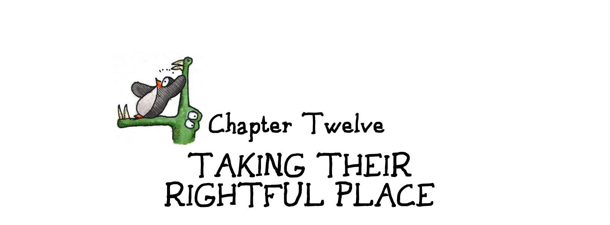

# Chapter 12 Taking Their Rightful Place 第十二章 回到应有的位置

There are games that succeed at portraying concepts like social good or honor through mechanics—the work of [Dani Bunten Berry](#user-content-fn-1)[^1] comes to mind. But far too many games do not do so with conscious intent. Games have the capability to sit on the shelf next to all other communications media. They are capable of art. They are capable of portraying the human condition. They are teaching tools. They carry socially redeeming content. They elicit emotion.

有些游戏通过机制成功地描绘了社会公益或荣誉等概念——我想到了[达妮·本腾·贝瑞](#user-content-fn-2)[^2]的作品。但有太多的游戏并非有意为之。游戏有能力与所有其他传播媒介并驾齐驱。它们可以成为艺术。它们能够描绘人类的境况。它们是教学工具。它们承载着社会救赎的内容。它们能激发情感。

But we have to believe that they do, in order for them to reach their potential. We have to go into the systems design process, the ludeme-building process, aware that games have this potential and this capability. We have to consider ourselves as artists, as teachers, as people with a powerful tool that can be taken up.

但是，我们必须相信游戏具有这样的潜力，才能让它们发挥出所有的潜力。我们必须在系统设计过程中，在构建游戏元素的过程中，意识到游戏具有这种潜力和能力。我们必须将自己视为艺术家、教师、拥有强大工具的人。

It's time for games to move on from only teaching patterns about territory, aiming, timing, and the rest. These subjects aren't the preeminent challenges of our day.

现在是时候让游戏不再仅仅教授关于领土、瞄准、时机和其他方面的模式了。这些话题并不是我们这个时代最重要的挑战。

> Games deserve to sit on the shelf right next to all other communications media, once the medium is mature.
> 
> 一旦游戏作为一种媒介发展成熟，它理应与所有其他传播媒介平起平坐。

Games do not need to be able to evoke an unexpected tear, like the Pietà.

游戏不需要像《圣母怜子》那样能够唤起我们意外的泪水。

Games do not need to be able to rouse us to anger against injustice, like Uncle Tom's Cabin.

游戏不需要像《汤姆叔叔的小屋》那样能激起我们对不公正的愤怒。

Games do not need to be able to send us spiraling into awe, like Mozart's Requiem.

游戏不需要像莫扎特的《安魂曲》那样，能让我们肃然起敬。

Games do not need to leave us hovering at the boundary of understanding, like Duchamp's [Nude Descending a Staircase](#user-content-fn-3)[^3].

游戏不需要像杜尚的[《下楼梯的裸体》](#user-content-fn-4)[^4]那样，让我们徘徊在理解的边界。

Games do not need to record the history of our souls, like Beowulf.

游戏不需要像《贝奥武夫》那样记录我们灵魂的历史。

They may not be able to, in fact. We would not necessarily ask architecture or dance to accomplish all of those things, either.

事实上，游戏可能无法做到这些。我们也不一定会要求建筑或舞蹈做到所有这些事情。

But games do need to illuminate aspects of ourselves that we do not understand fully.

但游戏确实需要启发我们自己尚未完全理解的方面。

> The point at which our game puzzles approach the complexity of the puzzles in other art forms in the point at which the game art form becomes mature.
> 
> 当我们的游戏谜题接近其他艺术形式谜题的复杂程度时，也就是游戏艺术形式成熟的时候。

Games do need to present us with problems and patterns that do not have one solution, because those are the problems that deepen our understanding of ourselves.

游戏确实需要向我们展示没有解决方案的问题和模式，因为这些问题能够加深我们对自身的了解。

Games do need to be created with formal systems that have authorial intent.

游戏确实需要用具有作者意图的形式系统来创造。

Games do need to acknowledge their influence over our patterns of thought.

游戏确实需要承认它们对我们思维模式的影响。

Games do need to wrestle with issues of social responsibility.

游戏确实需要与社会责任问题作斗争。

Games do need to attempt to apply our understanding of human nature to the formal aspects of game design.

游戏确实需要尝试将我们对人性的理解应用于游戏设计的形式方面。

Games do need to develop a critical vocabulary so that understanding of our field can be shared.

游戏确实需要发展一种批判性的词汇，以便分享对我们领域的理解。

Games do need to push at the boundaries.

游戏确实需要突破界限。

> The gap between those who want games to entertain and those who want games to be art does not exist.
> 
> 希望游戏娱乐化的人与希望游戏艺术化的人之间并不存在鸿沟。
> 
> 2B || !(2B)
> 
> To be or not to be. 
> 
> 生存还是毁灭。 


译者注：图中背景中的代码，有很多是出自莎士比亚《哈姆雷特》的[台词](https://en.wikipedia.org/wiki/To_be,_or_not_to_be)。


Most importantly, games and their designers need to acknowledge that there is no distinction between art and entertainment. Viewed in context with human endeavor and what we know of how our inner core actually works, games are not to be denigrated. They are not trivial, childish things.

最重要的是，游戏及其设计者需要承认，艺术与娱乐之间并无区别。从人类的努力和我们所了解的我们的内在核心是如何实际运作的角度来看，游戏是不应该被诋毁的。它们不是微不足道的幼稚事物。

In no other medium do the practitioners assume that just because they're paying their dues, they cannot create something capable of changing the world. Nor should game designers.

在其他任何媒介中，从业者都不会仅仅因为他们付出了努力，就认为他们无法创造出能够改变世界的东西。游戏设计师也同样不应该这样想。

All art and all entertainment are posing problems, questions, and challenges to the audience. All art and all entertainment are prodding us towards greater understanding of the chaotic patterns we see swirling around us. Art and entertainment are not terms of type—they are terms of intensity.

所有的艺术和娱乐都在向观众提出问题、疑问和挑战。所有的艺术和所有的娱乐都在促使我们更好地理解我们周围的混乱模式。艺术和娱乐不是类型的术语，而是强度的术语。

> because all art entails posing questions and puzzles -- tough ones, ethical ones even. And games will never be mature as long as designers create them with complete answers to their own puzzles in mind.
> 
> 因为所有的艺术都需要提出问题和谜题——棘手的问题，甚至是道德问题。只要设计者在设计游戏时，心中只有自己的谜题的完整答案，那么游戏就永远不会成熟。

Why? Because people are lazy, yet people also want a better life for themselves and for future generations. That is the blind urge that drives all humanity, all life. A legacy is what motivates the selfish genes embedded in the warp and weft of our bodies.

为什么呢？因为人们天生懒惰，但同时又渴望为自己和后代创造更美好的生活。这种盲目的驱动力推动着全人类乃至所有生命的前行。留下遗产（延续后代）正是激励着我们身体里每一个自私基因的动力，这些基因构成了我们存在的经纬。

Let's be frank with ourselves. We all know that most people, most of the audience out there, is complacent. They are more than up for another evening in the reclining chair in front of a sitcom that teaches the same lessons that the one on last week did. They are very willing to settle for easy entertainment.

让我们坦然面对自己。我们都知道，大多数人、大多数观众都在喜欢安于现状。他们更愿意再坐在躺椅上看一个晚上的情景喜剧，而这部情景喜剧所讲的课程与上周播出的情景喜剧如出一辙。他们非常愿意满足于轻松的娱乐。

We call this "pop music." We call it "mass market." And games are indeed reaching this mass market, and I suppose that to a degree I am fighting the tide in arguing that that is not the ultimate destiny for games any more than it is for any other art form. The art we remember is material that opened up new vistas; whether or not it was popular at the time is largely an accident of history. [Shakespeare](#user-content-fn-5)[^5] was a popular playwright and then was neglected for a couple hundred years. Popularity is not a measure of long-term evolutionary success.

我们称之为“流行音乐”。我们称之为“大众市场”。而游戏确实正在进入这个大众市场，我猜想在一定程度上，我在主张这并不是游戏的终极命运，就像任何其他艺术形式一样。我们所记住的艺术是开辟了新视野的材料；它在当时是否受欢迎在很大程度上是历史的偶然。[莎士比亚](#user-content-fn-6)[^6]曾是一位受欢迎的剧作家，然后被忽视了几百年。受欢迎程度不是长期进化成功的一种衡量标准。

> Of course, we all know that most people are too comfortable to want to be challenged in that way.
> 
> 当然，我们都知道，大多数人都太安逸了，不愿意接受这样的挑战。
> 
> another gratuitous penguin
> 
> 又一只无谓的企鹅

A tremendous amount of the content pumped through media today has as its goal mere comforting, confirming, and cocooning. We gravitate towards the music we already like, the morals we already know, and the characters who behave predictably.

如今，通过媒介传播的大量内容，其目的仅仅是安慰、确认和安慰。我们倾向于我们已经喜欢的音乐、我们已经知道的道德观以及行为可以预见的人物。

Seen in the most pessimistic light, this is irresponsible. When the world shifts around people whose entertainment diet is unchallenging, they will lack the tools to adapt. The calling of the creator is to provide those people with the tools to adapt, so that when the world changes and is swept along the currents of cultural change, those folks in the reclining chairs are swept along with them and the march of human advancement continues.

从最悲观的角度来看，这是不负责任的。当世界发生变化，而那些只接受不具挑战性娱乐内容的人将缺乏适应变化的工具。创造者的使命是为这些人提供适应变化的工具，这样一来，当世界变化并随文化变迁的潮流前进时，那些安坐于躺椅上的人也能随之同行，人类进步的步伐得以延续。

> There will always be a class of player who prefers the comfort of tackling only puzzles they know how to solve.
> 
> 总有那么一类玩家，只喜欢舒适地应对他们知道如何解决的谜题。
> 
> TRUN. DOWN. THAT. DAMN. MUSIC!
> 
> 关。掉。那。该死。音乐！

Play teaches us survival. For many cultural reasons, we have allowed it to take a place in human culture where it is often denigrated, minimized, and assumed to be worthless, set in contrast against concepts such as "work" or "practice" or "seriousness." And yet there's a cultural undercurrent that operates at the instinctive level, an undercurrent that mourns the ways in which play is removed from our lives.

游戏教会我们生存。由于许多文化原因，我们让游戏在人类文化中占据了一席之地，它常常被诋毁、贬低，被认为毫无价值，与“工作”、“常规”或“严肃”等概念形成鲜明对比。然而，在文化的潜流中，有一种本能层面的暗流在涌动，它为我们生活中缺失游戏的方式感到哀伤。

Games mattered to us in prehistoric days. It may be that we've outgrown the simplistic lessons they were able to teach and that, when we reach adulthood, we do in fact put aside childish ways.

在史前时代，游戏对我们很重要。也许我们已经不满足于游戏所能教给我们的那些简单的道理，也许当我们长大成人后，我们确实会把幼稚的方式抛诸脑后。

But my kids are showing me that childhood is also a state of mind. It is an ongoing quest for learning.

但我的孩子们告诉我，童年也是一种精神状态。它是一种不断学习的追求。

I, for one, don't want to put that aside, and I don't think anyone else should either.

就我个人而言，我不想放下童年，我认为其他人也不应该放下童年。

> In the caveman days, the wolves and tigers got'em.
> 
> 在山顶洞人时代，狼和老虎捕食他们。

In the end, if I can say with a straight face after a day's work making games that one person out there learned to be a better leader, a better parent, a better co-worker, learned a new skill that kept her job, a new skill that helped her advance the state of the art in his chosen field, a new skill that made her grow a little...

最终，如果在一天的游戏制作工作之后，我能认真地说，有人学会了成为更好的领导、父母、同事，学会了一项能保住工作、提升业务领域技术水平、让自己有所成长的新技能……

Then I will know that my work was valuable. It was worthwhile. It was a contribution to society.

那么，我就知道我的工作是有价值的，是值得的，是对社会的有贡献的。

I'll be able to whisper to myself, "I do connect people."

我就能轻声对自己说：“我把人们联系到了一起。”

"I do teach."

“我在教书育人。”

Hear that, grandpa?

听到了吗？爷爷。

> I MAKE GAMES, AND I'M PROUD OF IT.
> 
> 我做游戏，我很自豪。

> These days, we're a bit more tolerant -- the job market gets them instead.
> 
> 现在，我们宽容多了——换成了就业市场来“捕食”他们。

[^1]: Dani Bunten Berry: Designer of such classic video games as [M.U.L.E.](https://en.wikipedia.org/wiki/M.U.L.E.) and [Seven Cities of Gold](https://en.wikipedia.org/wiki/The_Seven_Cities_of_Gold_(video_game)).

[^2]: 达妮·本腾·贝瑞：[《M.U.L.E.》](https://en.wikipedia.org/wiki/M.U.L.E.)和[《七座金城》](https://en.wikipedia.org/wiki/The_Seven_Cities_of_Gold_(video_game))等经典电子游戏的设计师。

[^3]: Duchamp's Nude Descending a Staircase: Considered one of the first paintings to attempt to show motion abstractly, this painting is an early example of Futurism.

[^4]: 杜尚的《下楼梯的裸体》：这幅画被认为是最早尝试抽象表现运动的画作之一，是未来主义的早期代表作。

[^5]: Shakespeare neglected: Interest in the works of Shakespeare has fluctuated over the centuries. Although he was regarded as a solid entertainer in the seventeenth century, and his works were collected in the eighteenth, it is not until the nineteenth century that we see him enthroned as the greatest writer who ever lived.

[^6]: 被忽视的莎士比亚：几个世纪以来，人们对莎士比亚作品的兴趣起伏不定。虽然他在十七世纪被视为一位出色的艺人，其作品在十八世纪被收集起来，但直到十九世纪，我们才看到他被尊为有史以来最伟大的作家。