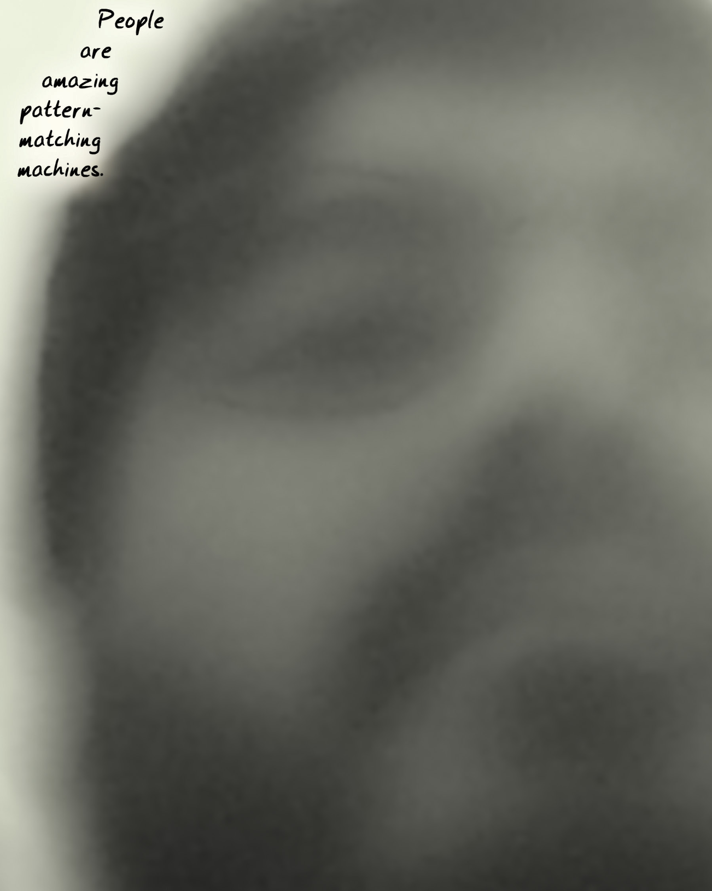
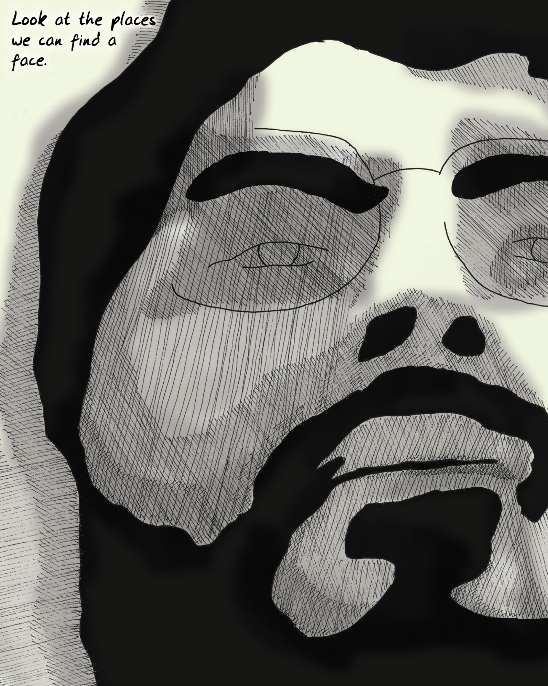

  

There are a lot of definitions of "game" out there.

关于“游戏”，有很多定义。

There's a field called "game theory[^game_theory]," which has something to do with games, a lot to do with psychology, even more to do with math, and not a lot to do with game design. Game theory is about how competitors make optimal choices, and it's mostly used in politics and economics, where it is frequently proven wrong.

有一个领域叫“博弈论[^game_theory]”，它与游戏有关，与心理学有很大关系，与数学关系更大，与游戏设计关系不大。博弈论是关于竞争者如何做出最优选择的，它主要用于政治和经济领域，但经常被证明是错误的。

[^game_theory]: Game theory: A field of mathematics that studies decision making in formal models. Most games can be interpreted as formal models, but game theory (like economics) tends to run afoul of real-world data when the mathematical hypotheses are tested, largely because game theory is based on optimal strategies. Most people aren't optimal all the time. Game theory doesn't always help you design a better game, but it can help explain why people make certain choices in a game. 博弈论：研究形式模型中决策制定的数学领域。大多数博弈都可以被解释为形式模型，但博弈论（和经济学一样）在检验数学假设时往往会与现实世界的数据相冲突，这主要是因为博弈论是建立在最优策略的基础上的。大多数人并不是一直都是最优的。博弈论并不总能帮你设计出更好的游戏，但它可以帮助解释为什么人们会在游戏中做出某些选择。

Looking up "game" in the dictionary isn't that helpful. Once you leave out the definitions referring to hunting, they wander all over the place. Pastimes or amusements are lumped in with contests. Interestingly, none of the definitions tend to assume that fun is a requirement: amusement or entertainment at best is required.

在字典里查找“游戏”一词并没有什么帮助。一旦撇开有关狩猎的定义，它们就会到处乱窜。消遣或娱乐与竞赛混为一谈。有趣的是，没有一个定义倾向于认为乐趣是必要条件：娱乐或消遣充其量只是必要条件。

Those few academics who have tried to define "game" have offered up everything from Roger Caillois[^roger_caillois]' "activity which is…voluntary…uncertain, unproductive, governed by rules, make-believe" to Johan Huizinga[^johan_huizinga]'s "free activity…outside 'ordinary' life…" to Jesper Juul[^jesper_juul]'s more contemporary and precise take: "A game is a rule-based formal system with a variable and quantifiable outcome, where different outcomes are assigned different values, the player exerts effort in order to influence the outcome, the player feels attached to the outcome, and the consequences of the activity are optional and negotiable."

那些尝试定义“游戏”的少数学者们提出了各种定义，从罗杰·卡尤瓦[^roger_caillois]的“自愿的……不确定的，无产出的，受规则制约的，虚构的活动”到约翰·赫伊津哈[^johan_huizinga]的“自由活动……在‘普通’生活之外……”到杰斯珀·尤尔[^jesper_juul]的更现代和精确的看法：“游戏是一个基于规则的形式系统，具有可变和可量化的结果，在其中不同的结果被赋予不同的价值，玩家付出努力以影响结果，玩家对结果有归属感，并且该活动的后果是可选择和可协商的。”

[^roger_caillois]: Roger Caillois: An anthropologist who wrote a book called Man, Play and Games in 1958. In it, he also categorized games into four types, based on chance, competition, make-believe or pretense, and vertigo. He saw games primarily as tools of acculturation. 罗杰·卡尤瓦：人类学家，1958 年著有《人、玩和游戏》一书。在这本书中，他还将游戏分为四种类型，分别基于机会、竞争、虚构或伪装以及眩晕。他认为游戏主要是文化适应的工具。

[^johan_huizinga]: Johan Huizinga: Author of Homo Ludens (1938), a book primarily focusing on the importance of play in human culture. Huizinga defines the concept of the “magic circle” within which play takes place as a protected and even sacred space that must not be violated. 约翰·赫伊津哈：《游戏的人》（1938 年）的作者，该书主要关注玩乐在人类文化中的重要性。赫伊津哈提出了“魔法圈”的概念，认为游戏是一个受保护的、甚至是神圣的、不可侵犯的空间。

[^jesper_juul]: Jesper Juul: An academic who is a leader of the relatively recent "ludology" movement. His website is [https://www.jesperjuul.net](https://www.jesperjuul.net). I recommend his book Half-Real (MIT Press, 2011) for an introduction to ludology. 杰斯珀·尤尔：最近兴起的 “游戏学”（ludology）运动的领军学者。他的网站是 [https://www.jesperjuul.net](https://www.jesperjuul.net)。我推荐他的《半真实》（麻省理工学院出版社，2011 年）一书，以介绍游戏学。

None of these help designers find "fun," though.

但这些都无助于设计者找到“乐趣”。

  

> People are amazing pattern matching machines.
> 
> 人是神奇的模式匹配机器。

Game designers themselves offer a bewildering and often contradictory set of definitions:

游戏设计师们自己给出了一系列令人困惑、往往自相矛盾的定义：

* To Chris Crawford[^chris_crawford], outspoken designer and theorist, games are a subset of entertainment limited to conflicts in which players work to foil each other's goals, just one of many leaves off a tree that includes playthings, toys, challenges, stories, competitions, and a lot more.\

    对克里斯·克劳福德[^chris_crawford]这位直言不讳的设计师和理论家来说，游戏是娱乐的一个子集，仅限于玩家之间相互妨碍对方目标达成的冲突中，这只是包括玩物，玩具、挑战、故事、比赛等众多事物的大树上的一片叶子。

* Sid Meier[^sid_meier], designer of the classic Civilization computer games, gave a famous definition of "a series of meaningful choices."\

    经典电脑游戏《文明》的设计师席德·梅尔[^sid_meier]给出了一个著名的定义：“一系列有意义的选择。”

* Ernest Adams and Andrew Rollings, authors of Andrew Rollings and Ernest Adams on Game Design[^andrew_rollings_and_ernest_adams_on_game_design], narrow this further to "one or more causally linked series of challenges in a simulated environment."\

    《Andrew Rollings and Ernest Adams on Game Design》一书的作者欧内斯特·亚当斯和安德鲁·罗林斯[^andrew_rollings_and_ernest_adams_on_game_design]将这一定义进一步缩小为“模拟环境中一个或多个因果联系的系列挑战。”

* Katie Salen and Eric Zimmerman say in their book Rules of Play[^katie_salen_and_eric_zimmerman_and_rules_of_play] that a game is "a system in which players engage in an artificial conflict, defined by rules, that results in a quantifiable outcome."\

    凯蒂·萨伦和埃里克·齐默尔曼在《游戏规则》[^katie_salen_and_eric_zimmerman_and_rules_of_play]一书中称，游戏是“一个系统，在这个系统中，玩家参与由规则定义的人为冲突，并产生可量化的结果。”

[^chris_crawford]: Chris Crawford: One of the grand old men of computer game design, his seminal works include [Eastern Front 1941](https://en.wikipedia.org/wiki/Eastern_Front_(1941)) and [Balance of Power](https://en.wikipedia.org/wiki/Balance_of_Power_(video_game)). Crawford has long advocated games as art, and has also been a major proponent of interactive storytelling. His book, The Art of Computer Game Design, is considered a classic. 克里斯·克劳福德：克劳福德是电脑游戏设计界的老前辈之一，他的开创性作品包括[《1941 年东部前线》](https://en.wikipedia.org/wiki/Eastern_Front_(1941))和[《权力平衡》](https://en.wikipedia.org/wiki/Balance_of_Power_(video_game))。长期以来，克劳福德一直主张将游戏作为艺术，也是互动故事的主要倡导者。他的著作《电脑游戏设计艺术》被奉为经典。

[^sid_meier]: Sid Meier: One of the most highly regarded computer game designers working today, Meier has been responsible for [Civilization](https://en.wikipedia.org/wiki/Civilization_(series)) (the computer version, not the board game version, although there is now a board game version of the computer game), [Pirates!](https://en.wikipedia.org/wiki/Sid_Meier%27s_Pirates!), and [Gettysburg](https://en.wikipedia.org/wiki/Sid_Meier%27s_Gettysburg!). 席德·梅尔：当今最受推崇的电脑游戏设计师之一，他的作品包括[《文明》](https://en.wikipedia.org/wiki/Civilization_(series))（电脑版，而非棋盘游戏版，尽管现在电脑游戏也有棋盘游戏版）、[《海盗！》](https://en.wikipedia.org/wiki/Sid_Meier%27s_Pirates!)和[《盖茨堡战役》](https://en.wikipedia.org/wiki/Sid_Meier%27s_Gettysburg!)。

[^andrew_rollings_and_ernest_adams_on_game_design]: Andrew Rollings and Ernest Adams on Game Design: This book was published by New Riders in 2003. It is a solid “how-to” book covering a variety of game genres as well as general game design principles. Disclaimer: I helped write the chapter on online games, so I am biased. 《安德鲁·罗林斯和欧内斯特·亚当斯论游戏设计》：这本书由 New Riders 于 2003 年出版。这是一本扎实的“如何做”的书，涵盖了各种游戏类型以及一般的游戏设计原则。免责声明：我参与撰写了关于网络游戏的章节，因此有失偏颇。

[^katie_salen_and_eric_zimmerman_and_rules_of_play]: Katie Salen and Eric Zimmerman and Rules of Play: Rules of Play is one of the most important books on what games are and how they work. It was published by the MIT Press in 2003. The authors are academics and also game designers in their own right. 凯蒂·萨伦和埃里克·齐默尔曼和《游戏规则》：《游戏规则》是关于游戏是什么以及游戏如何运作的最重要的书籍之一。该书于 2003 年由麻省理工学院出版社出版。作者是学者，同时也是游戏设计师。

This feels like a quick way to get sucked into quibbling over the classification of individual games. Many simple things can be made complex when you dig into them, but having fun is something so fundamental that surely we can find a more basic concept?

这种说法让人很快陷入对单个游戏分类的争论。许多简单的事情只要深入研究就会变得复杂，但“乐趣”是如此基本的东西，我们肯定能找到一个更基本的概念？

I found my answer in reading about how the brain works. Based on my reading, the human brain is mostly a voracious consumer of patterns, a soft pudgy gray [Pac-Man](https://en.wikipedia.org/wiki/Pac-Man) of concepts. Games are just exceptionally tasty patterns to eat up.

我在阅读大脑工作原理时找到了答案。根据我的阅读，人类大脑主要是一个贪婪的模式消费者，一个柔软而丰满的灰色概念[吃豆人](https://en.wikipedia.org/wiki/Pac-Man)。游戏只是特别美味的模式供其吞噬。

When you watch kids learn, you see there's a recognizable pattern to what they do. They give it a try once—it seems that kids can't learn just by being taught. They have to make mistakes themselves. They push at boundaries to test them and see how far they will bend. They watch the same video over and over and over and over and over and over…

当你观察孩子们学习时，你会发现他们的行为有一个可识别的模式。他们尝试一次——看起来孩子们不能仅仅通过被教导来学习。他们必须自己犯错误。他们挑战极限，测试极限，看看极限能弯曲到什么程度。他们一遍又一遍又一遍又一遍又一遍地观看同一个视频……

  

> Look at the places we can find a face.
>
> 看看我们能在哪些地方找到一张脸。

Seeing patterns in how kids learn is evidence of how pattern-driven our brains are. We pattern-seek the process of pattern-seeking! Faces may be the best example. How many times have you seen faces in wood grain, in the patterns in plaster walls, or in the smudges on the sidewalk? A surprisingly large part of the human brain is devoted to seeing faces—when we look at a person's face, a huge amount of brainpower is expended in interpreting it. When we're not looking at someone face-to-face, we often misinterpret what he or she means because we lack all the information.

从孩子们的学习方式中发现模式，证明了我们的大脑是如何受模式驱动的。我们在寻找模式的过程中寻找模式！面孔可能就是最好的例子。你曾多少次在木纹、灰泥墙上的图案或人行道上的污迹中看到过人的面孔？人类大脑的很大一部分竟然是用来看脸的——当我们看一个人的脸时，会花费大量的脑力来解读它。当我们不是面对面地看着一个人时，我们常常会因为缺乏所有的信息而误解他或她的意思。

The brain is hardwired for facial recognition, just as it is hardwired for language, because faces are incredibly important to how human society works. The capability to see a face in a collection of cartoony lines, and interpret remarkably subtle emotions from it, is indicative of what the brain does best.

大脑天生就具备面部识别的能力，正如它天生就具备语言能力一样，因为面部对于人类社会的运作极其重要。在一系列卡通线条中认出一张人脸，并从中解读出极其微妙的情感，这正体现了大脑最擅长的能力。

Simply put, the brain is made to fill in blanks. We do this so much we don't even realize we're doing it.

简单来说，大脑天生就是用来填补空白的。我们这样做得如此频繁，以至于我们甚至没有意识到自己在这么做。

Experts have been telling us for a while now that we're not really "conscious" in the way that we think we are; we do most things on autopilot. But autopilot only works when we have a reasonably accurate picture of the world around us. Our noses really ought to be blocking a lot of our view, but when we cross our eyes, our brains magically make our nose invisible. What the heck has the brain managed to put in its place? The answer, oddly, is an *assumption*—a reasonable construct based on the input from both eyes and what we have seen before.

专家们已经告诉我们一段时间，我们的“意识”并不像我们认为的那样，我们做的大多数事情都是在自动驾驶状态下完成的。但是，只有当我们对周围的世界有一个相当准确的认识时，自动驾驶才会起作用。我们的鼻子本应挡住我们的大部分视线，但当我们睁开眼睛时，大脑却神奇地让我们的鼻子看不见了。大脑到底在它的位置上放了什么？奇怪的是，答案是一种*假设*——一种基于双眼输入和我们之前所见的合理构造。

Assumptions are what the brain is best at. Some days, I suspect that makes us despair.

大脑最擅长的就是假设。有些时候，我怀疑这让我们感到绝望。

  

> In fact, we tend to see patterns where there aren't any.
> 
> 事实上，我们往往会在没有模式的地方看到模式。
> 
> Blah, blah, blah...
> 
> 吧啦，吧啦，吧啦……
> 
> Raph's just being pedantic again...
> 
> 拉斐又开始掉书袋了……

There's a whole branch of science dedicated to figuring out how the brain knows what it does. It's already led to a wonderful set of discoveries.

有一门科学专门研究大脑如何知道自己在做什么。这已经带来了一系列奇妙的发现。

We've learned that if you show someone a movie with a lot of basketball players in it and tell them in advance to count the basketballs, they will probably miss the large gorilla in the background, even though it's a somewhat noticeable object. *The brain is good at cutting out the irrelevant*.

我们已经知道，如果你给别人看一部有很多篮球运动员的电影，并事先告诉他们数篮球，他们很可能会错过背景中的大猩猩，尽管它是一个有点引人注目的物体。*大脑善于剔除无关紧要的东西*。

We've also found that if you get someone into a hypnotic trance and ask her to describe something, she will often describe much more than if she were asked on the street. <!--The brain notices a lot more than we think it does-->.

我们还发现，如果你让一个人进入催眠恍惚状态，让她描述某件事情，她描述的内容往往会比在大街上问她要多得多。*大脑注意到的东西比我们想象的要多得多*。

We now know that when you ask someone to draw something, he is far more likely to draw the generalized iconic version of the object that he keeps in his head than he is to draw the actual object in front of him. In fact, seeing what is actually there with our conscious mind is really hard to do, and most people never learn how to do it! *The brain is actively hiding the real world from us*.

我们现在知道，当你让一个人画某样东西时，他画出自己脑中保存的该物体的概括性图标版本的可能性要远远大于画出眼前的实际物体。事实上，用我们有意识的思维去看实际存在的东西真的很难做到，而且大多数人永远也学不会！*大脑在积极地向我们隐藏真实的世界*。

These things fall under the rubric of "cognitive theory," a fancy way of saying "how we think we know what we think we know." Most of them are examples of a concept called "chunking."

这些都属于“认知理论”范畴，是“我们如何认为我们知道我们认为我们知道的东西”的一种花哨说法。其中大部分都是“分块”概念的例子。

Chunking is something we do all the time.

分块是我们经常做的事情。

  

> When we grasp a pattern, we usually get bored with it and iconify it.
> 
> 当我们掌握了一种模式后，通常会对其感到厌倦，并将其图标化。

If I asked you to describe how you got to work in the morning in some detail, you'd list off getting up, stumbling to the bathroom, taking a shower, getting dressed, eating breakfast, leaving the house, and driving to your place of employment. That seems like a good list, until I ask you to walk through exactly how you perform just one of those steps. Consider the step of getting dressed. You'd probably have trouble remembering all the stages. Which do you grab first, tops or bottoms? Do you keep your socks in the top or second drawer? Which leg do you put in your pants first? Which hand touches the button on your shirt first?

如果我让你详细描述一下你早上是如何上班的，你会列出起床、跌跌撞撞地去浴室、洗澡、穿衣、吃早餐、出门、开车去工作地点等步骤。这似乎是一个很好的清单，直到我请你具体回顾一下你是如何完成其中一个步骤的。考虑一下穿衣服这个步骤。你可能很难记住所有的步骤。你先拿上衣还是下衣？你把袜子放在最上面还是第二个抽屉？你先把哪条腿放进裤子里？哪只手先触摸衬衫上的纽扣？

Odds are good that you could come to an answer if you thought about it. This is called a morning routine because it *is* routine. You rely on doing these things on autopilot. This whole routine has been "chunked" in your brain, which is why you have to work to recall the individual steps. It’s basically a recipe that is burned into your neurons, and you don’t "think" about it anymore.

如果你仔细想想，很有可能得出答案。这就是所谓的晨间常规，因为它*就是*常规。你依靠自动驾驶来做这些事情。整个常规已经在你的大脑中“分块”，这就是为什么你必须努力回想各个步骤。这基本上就是一个烙印在你神经元里的食谱，你不再“思考”它。

Whatever “thinking” means.

不管“思考”是什么意思。

  

> Humans are really good at doing this -- we can drive barely seeing the road.
> 
> 人类很擅长这样做——我们开车时几乎看不到路。
 
We're usually running on these automatic chunked patterns. Thinking is, in fact, mostly memory, pattern-matching against past experiences.

我们通常是按照这些自动分块模式运行的。事实上，思考主要是记忆，是根据过去的经验进行模式匹配。

In fact, most of what we see is also a chunked pattern. We rarely look at the real world; we instead recognize something we have chunked and leave it at that. The world could easily be composed of cardboard stand-ins for real objects as far as our brains are concerned. One might argue that the essence of much of art is forcing us to see things as they are rather than as we assume them to be. Poems about trees force us to look at the majesty of bark and the subtlety of leaf, the strength of trunk and the amazing abstractness of the negative space between boughs; they are getting us to ignore the image in our head of "wood, big greenish, whatever" that we take for granted.

事实上，我们所看到的大部分事物也是分块模式。我们很少去看真实的世界，而是去识别一些我们已经分块的东西，然后就不管它了。就我们的大脑而言，这个世界很容易由纸板组成的真实物体的替身。有人可能会说，许多艺术的本质就是迫使我们看到事物的本来面目，而不是我们假定的样子。关于树的诗歌迫使我们观察树皮的壮观和树叶的细腻、树干的力量和枝桠间负空间的惊人抽象性；它们让我们忽略我们头脑中理所当然的“木头、大块的绿色什么的”形象。

When something in a chunk does not behave as we expect it to, we have problems. It can even get us killed. If cars careen sideways on the road instead of moving forward as we expect them to, we no longer have a rapid response routine unless we have trained a "chunk" for it. And sadly, conscious thought is really inefficient. If you have to think about what you're doing, you're more liable to screw up. Your reaction times are orders of magnitude slower, and odds are good you'll get in a wreck.

当成块的某些东西的行为与我们的预期不符时，我们就会遇到问题。它甚至会让我们丧命。如果汽车在道路上发生侧滑，而不是按照我们的预期向前行驶，我们就不再有快速反应的常规，除非我们为此训练了一个“大块”。可悲的是，有意识的思考实在是效率低下。如果你必须思考你在做什么，你就更容易搞砸。你的反应时间会慢上几个数量级，很有可能就会出车祸。

That we live in a world of chunking is fascinating. Maybe you're reading this and feeling uncomfortable about whether you're really reading this. But what I really want to talk about is how chunks and routines are built in the first place.

我们生活在一个分块的世界里，这一点令人着迷。也许你在读这篇文章时，会对自己是否真的在读这篇文章感到不安。但我真正想说的是，分块和常规是如何建立起来的。

  

> This can mess us up when something changes and isn't in the icon.
> 
> 当某些事物发生变化且不在图标中时，这可能会让我们手忙脚乱。

People dislike chaos. We like order—not regimented order, but order with a bit of *texture* or variation to it. For example, there's a long tradition in art history of observing that many paintings use a system of order called the golden section, which is basically just a way of dividing up the space on the painting into boxes of different proportions. It turns out that doing so makes the painting appear "prettier" to us.

人们不喜欢混乱。我们喜欢秩序——不是严格死板的秩序，而是有点*质感*或变化的秩序。例如，艺术史上有一个悠久的传统，许多画作都使用了一种名为*黄金分割*的秩序系统，这种系统基本上就是将画作上的空间分割成不同比例的方块。事实证明，这样做会让我们觉得画作更“漂亮”。

This isn't exactly a revelation to anyone in the arts. Excess chaos just doesn't have pop appeal. We call it "noise," "ugly," or "formless." My music teacher in college said, "Music is ordered sound and silence." "Ordered" is a pretty important word in that sentence.

这对艺术界的人来说并不是什么启示。过度的混乱并没有大众吸引力。我们称之为“噪音”、“丑陋”或 “杂乱”。我大学时的音乐老师说过：“音乐是有序的声音和寂静。”在这句话中，“有序”是一个相当重要的词。

There's some highly ordered music that doesn't appeal to most of us, though. A lot of folks say that the strain of jazz known as bebop is just noise. But I'm going to offer up an alternate definition of noise: *Noise is any pattern we don't understand*.

不过，有些高度有序的音乐的受众却很小。很多人说，被称为比波普的爵士乐分支只是噪音。但我要给噪音下一个另类的定义：*噪音是我们不理解的任何模式*。

Even static has patterns to it. If the little black and white dots are the output of random numbers, they have the pattern of the output of random number generators—a complex pattern, but a pattern nonetheless. If you happen to know the algorithm used to generate the number, and the seed from which the algorithm started, you could exactly replicate that static. There's really next to nothing in the visible universe that is patternless. If we perceive something as noise, it's most likely a failure in ourselves, not a failure in the universe.

即使是雪花屏也有模式。如果小黑点和小白点是随机数的输出，那么它们就具有随机数发生器输出的模式——虽然模式复杂，但仍然是一种模式。如果你碰巧知道生成数字的算法，以及算法的起始种子，你就可以精确地复现那个雪花点画面。在可见的宇宙中，几乎没有什么是没有模式的。如果我们把某些东西视为噪音，那很可能是我们自己的失败，而不是宇宙的失败。

  

> When we meet noise, and fail to see a pattern in it, we get frustrated, and give up.
> 
> 当我们遇到噪音，却无法从中发现模式时，我们就会感到沮丧并放弃。
 
The first time you hear bebop jazz it may sound weird to you, especially if you've been reared on good old-fashioned "three chords and the truth"* rock 'n' roll. It'll be "devil music," to borrow a term from countless exasperated parents who railed against their kids' choice of music.

第一次听到贝波普爵士乐时，你可能会觉得怪怪的，尤其是如果你是在老式的“三个和弦和真理”摇滚乐中长大的话。借用无数气急败坏的父母对孩子音乐选择的抨击，这将是“魔鬼音乐”。

If you get past your initial distaste (which may last only a fraction of a second), you may come to see the patterns inherent in it. For example, you'll spot the flattened fifth* that is so important to a jazzy sound. You'll start drumming your fingers to the expected 4/4 beat, and find to your dismay that it's actually 7/8 or some other meter. You'll be at sea for a bit, but you may experience a little thrill of delight once you get it, and experience a moment of discovery, of joy.

如果你摆脱了最初的厌恶（可能只持续几分之一秒），你可能会发现其中蕴含的模式。例如，你会发现对爵士乐来说非常重要的平五度。你开始用手指敲打预期的 4/4 拍子，却沮丧地发现实际上是 7/8 拍或其他拍子。你会茫然一会儿，但一旦你明白了，你可能会体验到一丝喜悦，体验到发现、喜悦的时刻。

If jazz happens to interest you, you'll sink into these patterns and come to expect them. If you get really into it, you may come to feel that a musical style such as alternating-bass* folk music is hopelessly "square."

如果你对爵士乐感兴趣，你就会沉浸在这些模式中，并开始期待它们。如果你真的喜欢上了爵士乐，你可能会觉得像交替低音*民乐这样的音乐风格是无可救药的“呆板”。

Congratulations, you just chunked up jazz. (Hmm, I hope that doesn’t sound too disgusting!)

恭喜你，你刚刚学会了爵士乐。(嗯，我希望这听起来不会太恶心！）。