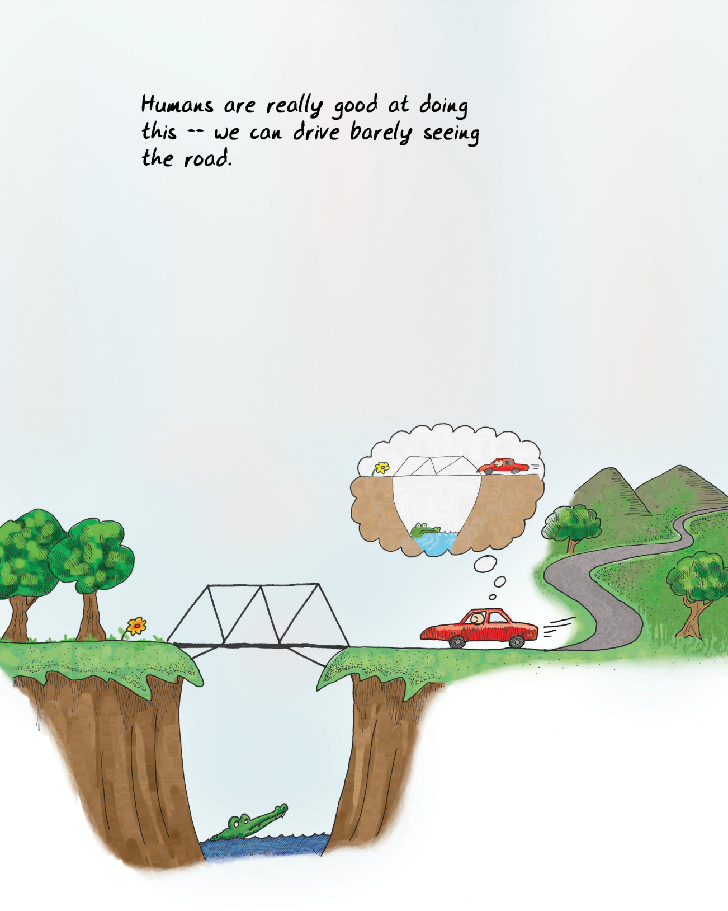
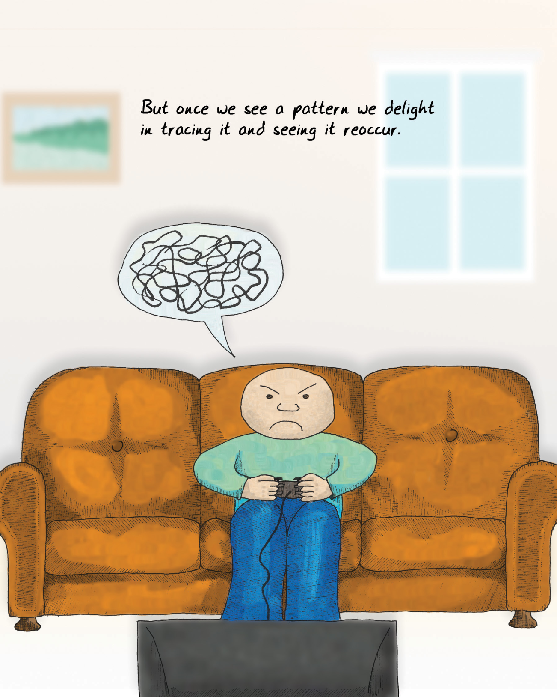
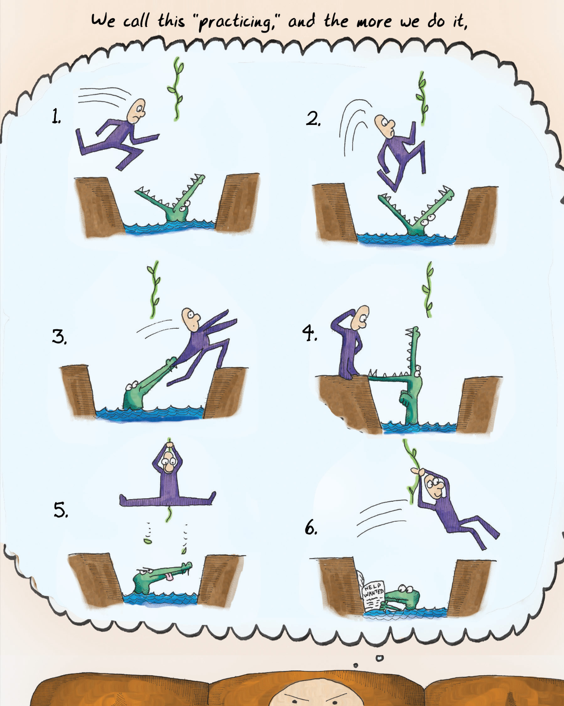
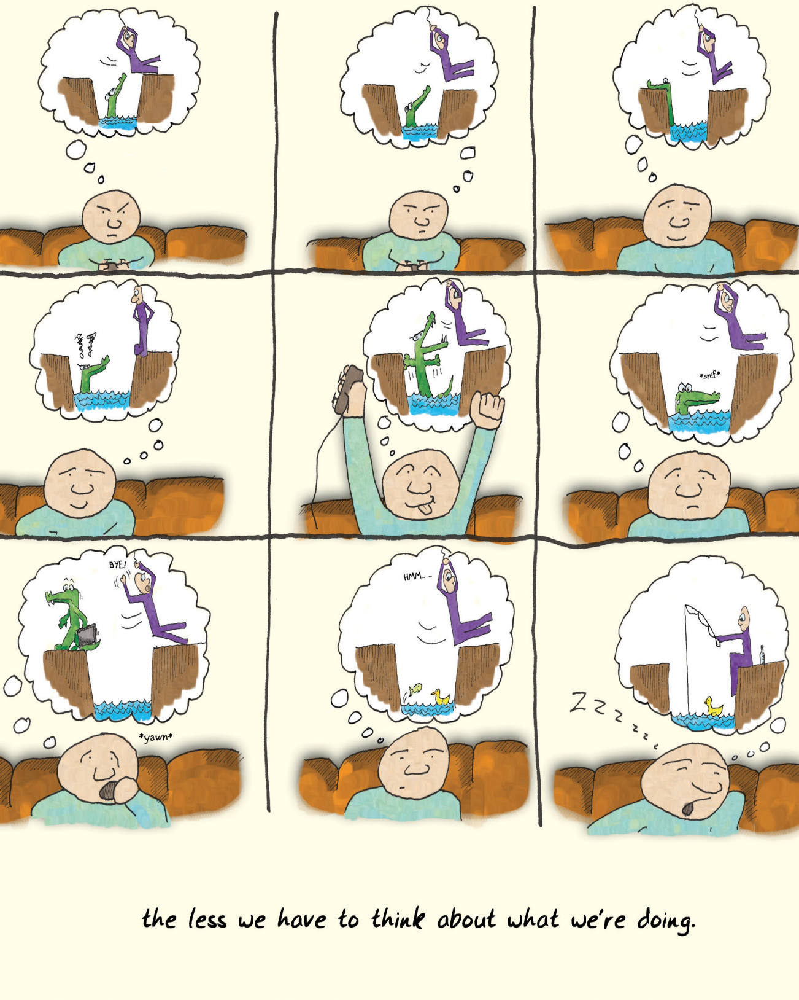
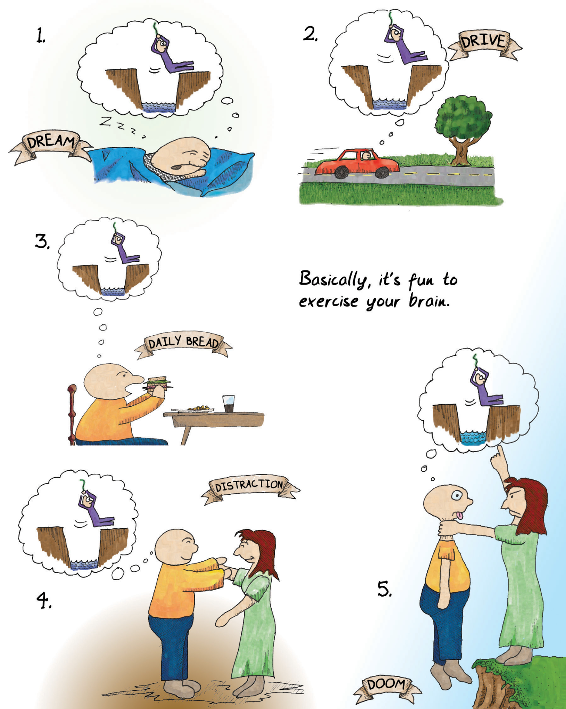

# Chapter 2 How the brain works? 第二章 大脑如何工作？

There are a lot of definitions of "game" out there.

关于“游戏”，有很多定义。

There's a field called "[game theory](#user-content-fn-1)[^1]," which has something to do with games, a lot to do with psychology, even more to do with math, and not a lot to do with game design. Game theory is about how competitors make optimal choices, and it's mostly used in politics and economics, where it is frequently proven wrong.

有一个领域叫“[博弈论](#user-content-fn-2)[^2]”，它与游戏有关，与心理学有很大关系，与数学关系更大，与游戏设计关系不大。博弈论是关于竞争者如何做出最优选择的，它主要用于政治和经济领域，但经常被证明是错误的。

Looking up "game" in the dictionary isn't that helpful. Once you leave out the definitions referring to hunting, they wander all over the place. Pastimes or amusements are lumped in with contests. Interestingly, none of the definitions tend to assume that fun is a requirement: amusement or entertainment at best is required.

在字典里查找“游戏”一词并没有什么帮助。一旦撇开有关狩猎的定义，它们就会到处乱窜。消遣或娱乐与竞赛混为一谈。有趣的是，没有一个定义倾向于认为乐趣是必要条件：娱乐或消遣充其量只是必要条件。

Those few academics who have tried to define "game" have offered up everything from [Roger Caillois](#user-content-fn-3)[^3]' "activity which is…voluntary…uncertain, unproductive, governed by rules, make-believe" to [Johan Huizinga](#user-content-fn-5)[^5]'s "free activity…outside 'ordinary' life…" to [Jesper Juul](#user-content-fn-7)[^7]'s more contemporary and precise take: "A game is a rule-based formal system with a variable and quantifiable outcome, where different outcomes are assigned different values, the player exerts effort in order to influence the outcome, the player feels attached to the outcome, and the consequences of the activity are optional and negotiable."

那些尝试定义“游戏”的少数学者们提出了各种定义，从[罗杰·卡尤瓦](#user-content-fn-4)[^4]的“自愿的……不确定的，无产出的，受规则制约的，虚构的活动”到[约翰·赫伊津哈](#user-content-fn-6)[^6]的“自由活动……在‘普通’生活之外……”到[杰斯珀·尤尔](#user-content-fn-8)[^8]的更现代和精确的看法：“游戏是一个基于规则的形式系统，具有可变和可量化的结果，在其中不同的结果被赋予不同的价值，玩家付出努力以影响结果，玩家对结果有归属感，并且该活动的后果是可选择和可协商的。”

None of these help designers find "fun," though.

但这些都无助于设计者找到“乐趣”。

> People are amazing pattern matching machines.
>
> 人是神奇的模式匹配机器。

Game designers themselves offer a bewildering and often contradictory set of definitions:

游戏设计师们自己给出了一系列令人困惑、往往自相矛盾的定义：

*   To [Chris Crawford](#user-content-fn-9)[^9], outspoken designer and theorist, games are a subset of entertainment limited to conflicts in which players work to foil each other's goals, just one of many leaves off a tree that includes playthings, toys, challenges, stories, competitions, and a lot more.\
    对[克里斯·克劳福德](#user-content-fn-10)[^10]这位直言不讳的设计师和理论家来说，游戏是娱乐的一个子集，仅限于玩家之间相互妨碍对方目标达成的冲突中，这只是包括玩物，玩具、挑战、故事、比赛等众多事物的大树上的一片叶子。
    
*   [Sid Meier](#user-content-fn-11)[^11], designer of the classic Civilization computer games, gave a famous definition of "a series of meaningful choices."\
    经典电脑游戏《文明》的设计师[席德·梅尔](#user-content-fn-12)[^12]给出了一个著名的定义：“一系列有意义的选择。”
    
*   Ernest Adams and Andrew Rollings, authors of [Andrew Rollings and Ernest Adams on Game Design](#user-content-fn-13)[^13], narrow this further to "one or more causally linked series of challenges in a simulated environment."\
    [《安德鲁·罗林斯和欧内斯特·亚当斯论游戏设计》](#user-content-fn-14)[^14]一书的作者欧内斯特·亚当斯和安德鲁·罗林斯将这一定义进一步缩小为“模拟环境中一个或多个因果联系的系列挑战。”
    
*   [Katie Salen and Eric Zimmerman say in their book Rules of Play](#user-content-fn-15)[^15] that a game is "a system in which players engage in an artificial conflict, defined by rules, that results in a quantifiable outcome."\
    [凯蒂·萨伦和埃里克·齐默尔曼在《游戏规则》](#user-content-fn-16)[^16]一书中称，游戏是“一个系统，在这个系统中，玩家参与由规则定义的人为冲突，并产生可量化的结果。”

This feels like a quick way to get sucked into quibbling over the classification of individual games. Many simple things can be made complex when you dig into them, but having fun is something so fundamental that surely we can find a more basic concept?

这种说法让人很快陷入对单个游戏分类的争论。许多简单的事情只要深入研究就会变得复杂，但“乐趣”是如此基本的东西，我们肯定能找到一个更基本的概念？

I found my answer in reading about how the brain works. Based on my reading, the human brain is mostly a voracious consumer of patterns, a soft pudgy gray [Pac-Man](https://en.wikipedia.org/wiki/Pac-Man) of concepts. Games are just exceptionally tasty patterns to eat up.

我在阅读大脑工作原理时找到了答案。根据我的阅读，人类大脑主要是一个贪婪的模式消费者，一个柔软而丰满的灰色概念[吃豆人](https://en.wikipedia.org/wiki/Pac-Man)。游戏只是特别美味的模式供其吞噬。

When you watch kids learn, you see there's a recognizable pattern to what they do. They give it a try once—it seems that kids can't learn just by being taught. They have to make mistakes themselves. They push at boundaries to test them and see how far they will bend. They watch the same video over and over and over and over and over and over…

当你观察孩子们学习时，你会发现他们的行为有一个可识别的模式。他们尝试一次——看起来孩子们不能仅仅通过被教导来学习。他们必须自己犯错误。他们挑战极限，测试极限，看看极限能弯曲到什么程度。他们一遍又一遍又一遍又一遍又一遍地观看同一个视频……

> Look at the places we can find a face.
>
> 看看我们能在哪些地方找到一张脸。

Seeing patterns in how kids learn is evidence of how pattern-driven our brains are. We pattern-seek the process of pattern-seeking! Faces may be the best example. How many times have you seen faces in wood grain, in the patterns in plaster walls, or in the smudges on the sidewalk? A surprisingly large part of the human brain is devoted to seeing faces—when we look at a person's face, a huge amount of brainpower is expended in interpreting it. When we're not looking at someone face-to-face, we often misinterpret what he or she means because we lack all the information.

从孩子们的学习方式中发现模式，证明了我们的大脑是如何受模式驱动的。我们在寻找模式的过程中寻找模式！面孔可能就是最好的例子。你曾多少次在木纹、灰泥墙上的图案或人行道上的污迹中看到过人的面孔？人类大脑的很大一部分竟然是用来看脸的——当我们看一个人的脸时，会花费大量的脑力来解读它。当我们不是面对面地看着一个人时，我们常常会因为缺乏所有的信息而误解他或她的意思。

The brain is hardwired for [facial recognition](#user-content-fn-17)[^17], just as it is hardwired for language, because faces are incredibly important to how human society works. The capability to see a face in a collection of cartoony lines, and interpret remarkably subtle emotions from it, is indicative of what the brain does best.

大脑天生就具备[面部识别](#user-content-fn-18)[^18]的能力，正如它天生就具备语言能力一样，因为面部对于人类社会的运作极其重要。在一系列卡通线条中认出一张人脸，并从中解读出极其微妙的情感，这正体现了大脑最擅长的能力。

Simply put, the brain is made to fill in blanks. We do this so much we don't even realize we're doing it.

简单来说，大脑天生就是用来填补空白的。我们这样做得如此频繁，以至于我们甚至没有意识到自己在这么做。

Experts have been telling us for a while now that we're not really "conscious" in the way that we think we are; we do most things on autopilot. But autopilot only works when we have a reasonably accurate picture of the world around us. Our noses really ought to be blocking a lot of our view, but when we cross our eyes, our brains magically make our [nose invisible](#user-content-fn-19)[^19]. What the heck has the brain managed to put in its place? The answer, oddly, is an _assumption_—a reasonable construct based on the input from both eyes and what we have seen before.

专家们已经告诉我们一段时间，我们的“意识”并不像我们认为的那样，我们做的大多数事情都是在自动驾驶状态下完成的。但是，只有当我们对周围的世界有一个相当准确的认识时，自动驾驶才会起作用。我们的鼻子本应挡住我们的大部分视线，但当我们双眼交叉时，大脑却神奇地让我们的[鼻子隐形](#user-content-fn-20)[^20]了。大脑究竟用什么取代了鼻子的位置呢？奇怪的是，答案是一种 _假设_——一种基于双眼睛的输入和我们以往所见而形成的合理构想。

Assumptions are what the brain is best at. Some days, I suspect that makes us despair.

大脑最擅长的就是假设。有些时候，我怀疑这让我们感到绝望。

> In fact, we tend to see patterns where there aren't any.
>
> 事实上，我们往往会在没有模式的地方看到模式。
>
> Blah, blah, blah...
>
> 吧啦，吧啦，吧啦……
>
> Raph's just being pedantic again...
>
> 拉斐又开始掉书袋了……

There's a whole branch of science dedicated to figuring out [how the brain knows what it does](#user-content-fn-21)[^21]. It's already led to a wonderful set of discoveries.

有一门科学专门研究[大脑如何知道自己在做什么](#user-content-fn-22)[^22]。这已经带来了一系列奇妙的发现。

We've learned that if you show someone a movie with a lot of basketball players in it and tell them in advance to count the basketballs, they will probably miss [the large gorilla](#user-content-fn-23)[^23] in the background, even though it's a somewhat noticeable object. _The brain is good at cutting out the irrelevant_.

我们已经知道，如果你给别人看一部有很多篮球运动员的电影，并事先告诉他们数篮球，他们很可能会错过背景中的[大猩猩](#user-content-fn-24)[^24]，尽管它是一个有点引人注目的物体。_大脑善于剔除无关紧要的东西_。

We've also found that if you get someone into a hypnotic trance and ask her to describe something, she will often describe much more than if she were asked on the street. .

我们还发现，如果你让一个人进入催眠恍惚状态，让她描述某件事情，她描述的内容往往会比在大街上问她要多得多。_大脑注意到的东西比我们想象的要多得多_。

We now know that when you ask someone to draw something, he is far more likely to draw the generalized iconic version of the object that he keeps in his head than he is to draw the actual object in front of him. In fact, seeing what is actually there with our conscious mind is really hard to do, and most people never learn how to do it! _The brain is actively hiding the real world from us_.

我们现在知道，当你让一个人画某样东西时，他画出自己脑中保存的该物体的概括性图标版本的可能性要远远大于画出眼前的实际物体。事实上，用我们有意识的思维去看实际存在的东西真的很难做到，而且大多数人永远也学不会！_大脑在积极地向我们隐藏真实的世界_。

These things fall under the rubric of "[cognitive theory](#user-content-fn-25)[^25]," a fancy way of saying "how we think we know what we think we know." Most of them are examples of a concept called "[chunking](#user-content-fn-27)[^27]."

这些都属于“[认知理论](#user-content-fn-26)[^26]”范畴，是“我们如何认为我们知道我们认为我们知道的东西”的一种花哨说法。其中大部分都是“[分块](#user-content-fn-28)[^28]”概念的例子。

Chunking is something we do all the time.

分块是我们经常做的事情。

> When we grasp a pattern, we usually get bored with it and iconify it.
>
> 当我们掌握了一种模式后，通常会对其感到厌倦，并将其图标化。

If I asked you to describe how you got to work in the morning in some detail, you'd list off getting up, stumbling to the bathroom, taking a shower, getting dressed, eating breakfast, leaving the house, and driving to your place of employment. That seems like a good list, until I ask you to walk through exactly how you perform just one of those steps. Consider the step of getting dressed. You'd probably have trouble remembering all the stages. Which do you grab first, tops or bottoms? Do you keep your socks in the top or second drawer? Which leg do you put in your pants first? Which hand touches the button on your shirt first?

如果我让你详细描述一下你早上是如何上班的，你会列出起床、跌跌撞撞地去浴室、洗澡、穿衣、吃早餐、出门、开车去工作地点等步骤。这似乎是一个很好的清单，直到我请你具体回顾一下你是如何完成其中一个步骤的。考虑一下穿衣服这个步骤。你可能很难记住所有的步骤。你先拿上衣还是下衣？你把袜子放在最上面还是第二个抽屉？你先把哪条腿放进裤子里？哪只手先触摸衬衫上的纽扣？

Odds are good that you could come to an answer if you thought about it. This is called a morning routine because it _is_ routine. You rely on doing these things on autopilot. This whole routine has been "chunked" in your brain, which is why you have to work to recall the individual steps. It's basically a recipe that is burned into your neurons, and you don't "think" about it anymore.

如果你仔细想想，很有可能得出答案。这就是所谓的晨间常规，因为它 _就是_ 常规。你依靠自动驾驶来做这些事情。整个常规已经在你的大脑中“分块”，这就是为什么你必须努力回想各个步骤。这基本上就是一个烙印在你神经元里的食谱，你不再“思考”它。

Whatever "thinking" means.

不管“思考”是什么意思。

> Humans are really good at doing this -- we can drive barely seeing the road.
>
> 人类很擅长这样做——我们开车时几乎看不到路。

We're usually running on these [automatic chunked patterns](#user-content-fn-29)[^29]. Thinking is, in fact, mostly memory, pattern-matching against past experiences.

我们通常是按照这些[自动分块模式](#user-content-fn-30)[^30]运行的。事实上，思考主要是记忆，是根据过去的经验进行模式匹配。

In fact, most of what we see is also a chunked pattern. We rarely look at the real world; we instead recognize something we have chunked and leave it at that. The world could easily be composed of cardboard stand-ins for real objects as far as our brains are concerned. One might argue that the essence of much of art is forcing us to see things as they are rather than as we assume them to be. Poems about trees force us to look at the majesty of bark and the subtlety of leaf, the strength of trunk and the amazing abstractness of the negative space between boughs; they are getting us to ignore the image in our head of "wood, big greenish, whatever" that we take for granted.

事实上，我们所看到的大部分事物也是分块模式。我们很少去看真实的世界，而是去识别一些我们已经分块的东西，然后就不管它了。就我们的大脑而言，这个世界很容易由纸板组成的真实物体的替身。有人可能会说，许多艺术的本质就是迫使我们看到事物的本来面目，而不是我们假定的样子。关于树的诗歌迫使我们观察树皮的壮观和树叶的细腻、树干的力量和枝桠间负空间的惊人抽象性；它们让我们忽略我们头脑中理所当然的“木头、大块的绿色什么的”形象。

When something in a chunk does not behave as we expect it to, we have [problems](#user-content-fn-31)[^31]. It can even get us killed. If cars careen sideways on the road instead of moving forward as we expect them to, we no longer have a rapid response routine unless we have trained a "chunk" for it. And sadly, conscious thought is really inefficient. If you have to think about what you're doing, you're more liable to screw up. Your reaction times are orders of magnitude slower, and odds are good you'll get in a wreck.

当成块的某些东西的行为与我们的预期不符时，我们就会遇到[问题](#user-content-fn-32)[^32]。它甚至会让我们丧命。如果汽车在道路上发生侧滑，而不是按照我们的预期向前行驶，我们就不再有快速反应的常规，除非我们为此训练了一个“块”。可悲的是，有意识的思考实在是效率低下。如果你必须思考你在做什么，你就更容易搞砸。你的反应时间会慢上几个数量级，很有可能就会出车祸。

That we live in a world of chunking is fascinating. Maybe you're reading this and feeling uncomfortable about whether you're really reading this. But what I really want to talk about is how chunks and routines are built in the first place.

我们生活在一个分块的世界里，这一点令人着迷。也许你在读这篇文章时，会对自己是否真的在读这篇文章感到不安。但我真正想说的是，分块和常规是如何建立起来的。

> This can mess us up when something changes and isn't in the icon.
>
> 当某些事物发生变化且不在图标中时，这可能会让我们手忙脚乱。

People dislike chaos. We like order—not regimented order, but order with a bit of _texture_ or variation to it. For example, there's a long tradition in art history of observing that many paintings use a system of order called _[the golden section](#user-content-fn-33)[^33]_, which is basically just a way of dividing up the space on the painting into boxes of different proportions. It turns out that doing so makes the painting appear "prettier" to us.

人们不喜欢混乱。我们喜欢秩序——不是严格死板的秩序，而是有点 _质感_ 或变化的秩序。例如，艺术史上有一个悠久的传统，许多画作都使用了一种名为 _[黄金分割](#user-content-fn-34)[^34]_ 的秩序系统，这种系统基本上就是将画作上的空间分割成不同比例的方块。事实证明，这样做会让我们觉得画作更“漂亮”。

This isn't exactly a revelation to anyone in the arts. Excess chaos just doesn't have pop appeal. We call it "noise," "ugly," or "formless." My music teacher in college said, "Music is ordered sound and silence." "Ordered" is a pretty important word in that sentence.

这对艺术界的人来说并不是什么启示。过度的混乱并没有大众吸引力。我们称之为“噪音”、“丑陋”或者“杂乱”。我大学时的音乐老师说过：“音乐是有序的声音和寂静。”在这句话中，“有序”是一个相当重要的词。

There's some highly ordered music that doesn't appeal to most of us, though. A lot of folks say that the strain of jazz known as bebop is just noise. But I'm going to offer up an alternate definition of noise: _Noise is any pattern we don't understand_.

不过，有些高度有序的音乐的受众却很小。很多人说，被称为比波普的爵士乐分支只是噪音。但我要给噪音下一个另类的定义：_噪音是我们不理解的任何模式_。

[Even static has patterns to it](#user-content-fn-35)[^35]. If the little black and white dots are the output of random numbers, they have the pattern of the output of random number generators—a complex pattern, but a pattern nonetheless. If you happen to know the algorithm used to generate the number, and the seed from which the algorithm started, you could exactly replicate that static. There's really next to nothing in the visible universe that is patternless. If we perceive something as noise, it's most likely a failure in ourselves, not a failure in the universe.

[即使是雪花屏也有模式](#user-content-fn-36)[^36]。如果小黑点和小白点是随机数的输出，那么它们就具有随机数发生器输出的模式——虽然模式复杂，但仍然是一种模式。如果你碰巧知道生成数字的算法，以及算法的起始种子，你就可以精确地复现那个雪花点画面。在可见的宇宙中，几乎没有什么是没有模式的。如果我们把某些东西视为噪音，那很可能是我们自己的失败，而不是宇宙的失败。

> When we meet noise, and fail to see a pattern in it, we get frustrated, and give up.
>
> 当我们遇到噪音，却无法从中发现模式时，我们就会感到沮丧并放弃。

The first time you hear bebop jazz it may sound weird to you, especially if you've been reared on good old-fashioned "[three chords and the truth](#user-content-fn-37)[^37]" rock 'n' roll. It'll be "devil music," to borrow a term from countless exasperated parents who railed against their kids' choice of music.

第一次听到贝波普爵士乐时，你可能会觉得怪怪的，尤其是如果你是在老式的“[三个和弦和真理](#user-content-fn-38)[^38]”摇滚乐中长大的话。借用无数气急败坏的父母对孩子音乐选择的抨击，这将是“魔鬼音乐”。

If you get past your initial distaste (which may last only a fraction of a second), you may come to see the patterns inherent in it. For example, you'll spot the [flattened fifth](#user-content-fn-39)[^39] that is so important to a jazzy sound. You'll start drumming your fingers to the expected 4/4 beat, and find to your dismay that it's actually 7/8 or some other meter. You'll be at sea for a bit, but you may experience a little thrill of delight once you get it, and experience a moment of discovery, of joy.

如果你摆脱了最初的厌恶（可能只持续几分之一秒），你可能会发现其中蕴含的模式。例如，你会发现对爵士乐来说非常重要的[降五度](#user-content-fn-40)[^40]。你开始用手指敲打预期的 4/4 拍子，却沮丧地发现实际上是 7/8 拍或其他拍子。你会茫然一会儿，但一旦你明白了，你可能会体验到一丝喜悦，体验到发现、喜悦的时刻。

If jazz happens to interest you, you'll sink into these patterns and come to expect them. If you get really into it, you may come to feel that a musical style such as [alternating-bass](#user-content-fn-41)[^41] folk music is hopelessly "square."

如果你对爵士乐感兴趣，你就会沉浸在这些模式中，并开始期待它们。如果你真的喜欢上了爵士乐，你可能会觉得像[交替低音](#user-content-fn-42)[^42]民谣这样的音乐风格是无可救药的“呆板”。

Congratulations, you just chunked up jazz. (Hmm, I hope that doesn't sound too disgusting!)

恭喜你，你刚刚“分块”了爵士乐。(嗯，我希望这听起来不会太恶心！）。


译者注：chunk up，还有呕吐的意思。


> But once we see a pattern we delight in tracing it and seeing it reoccur.
>
> 但是，一旦我们发现了一种模式，我们就会乐此不疲地追踪它，并看到它再次出现。

That doesn't mean you are done with jazz, though. There's a long way to go between intellectual understanding, intuitive understanding, and grokking something.

但这并不意味着你对爵士乐的了解已经结束。在智力理解、直觉理解和 "摸索 "之间，还有很长的路要走。

"Grok" is a really useful word. Robert Heinlein coined it in his novel [Stranger in a Strange Land](#user-content-fn-43)[^43]. It means that you understand something so thoroughly that you have become one with it and even love it. It's a profound understanding beyond intuition or empathy (though those are required steps on the way).

“神入”是一个非常有用的词。罗伯特·海因莱因在他的小说[《异乡异客》](#user-content-fn-44)[^44]中创造了这个词。它的意思是，你对某事物的理解如此透彻，以至于与它融为一体，甚至爱上了它。这是一种超越直觉或共鸣的深刻理解（虽然这些都是理解过程中的必要步骤）。

"Grokking" has a lot in common with what we call "muscle memory." Some writers on cognition describe the brain as functioning on [three levels](#user-content-fn-45)[^45]. The first level is what we call conscious thought. It's logical and works on a basically mathematical level, assigning values and making lists. It's kind of slow, even in those genius-IQ types. This is the sort of mind we measure when we take IQ tests.

“神入”与我们所说的“肌肉记忆”有很多共同之处。一些研究认知的作家将大脑的功能描述为[三个层次](#user-content-fn-46)[^46]。第一个层次是我们所说的有意识思维。它的逻辑性很强，基本上是在数学层面上工作，分配数值并列出清单。它有点慢，即使是那些天才智商型的人也是如此。我们在智商测试中测量的就是这种思维。

The second level of the brain is really slow. It's integrative, associative, and intuitive. It links things that don't make much sense. This is the part of the brain that packages things up and chunks them. This part of how we think isn't something we can access directly—it doesn't use words. It's also frequently wrong. It's the source of "common sense," which is often self-contradictory ("look before you leap, but he who hesitates is lost"). It's the thing that builds [approximations of reality](#user-content-fn-47)[^47].

大脑的第二个层次非常缓慢。它具有整合性、联想性和直觉性。它能将没有多大意义的事物联系起来。这部分大脑会将事物打包并分块。这部分思考方式我们无法直接获取——它不使用语言。它也经常出错。它是“常识”的来源，而“常识”往往是自相矛盾的（“三思而后行，但是，当断不断，反受其乱"）。它是构建[现实的近似](#user-content-fn-48)[^48]的那部分功能。

> We call this "practicing," and the more we do it,
>
> 我们称之为 "练习"，而且越练越多，
>
> HELP WANTED
>
> 需要帮助

The last kind of thinking is not thinking. When you stick your finger in fire, you snatch it back before your brain has time to think about it (seriously, it's been [measured](#user-content-fn-49)[^49]).

最后一种思考不是思考。当你把手指伸进火里时，你会在大脑来不及思考之前就把它收回来（说真的，有人[测过](#user-content-fn-50)[^50]）。

Calling this “muscle memory” is a lie. Muscles don't really have memory. They're just big ol' springs that coil and uncoil when you run electrical current through them. It's really all about nerves. There's a very large part of your body that works based on the _autonomic nervous system_, which is a fancy way of saying that it makes its own decisions. Some of it is stuff you can learn to bring under more conscious control, like your heart rate. Some of it is reflexes, like snatching your fingers out of the fire. And some of it is stuff you train your body to do.

说这是“肌肉记忆”是骗人的。肌肉并没有真正的记忆。它们只是一个大弹簧，当电流通过它们时，它们就会卷起或松开。真正有记忆的是神经。你的身体有很大一部分是基于 _自主神经系统_ 工作的，这是一种花哨的说法，意味着它自己做出决定。其中有些是你可以学会有意识控制，比如你的心率。有些是条件反射，比如把手指从火中拽出来。还有一些是你训练身体去做的事情。

There's an old joke about a crowd gathered at the bottom of a burning building. Up at the top countless people jump from windows to be caught by the firemen. There's one mother who is unwilling to toss her baby to the waiting rescuers. Finally, one guy at the bottom says, "I can catch the kid, ma'am, I'm a famous football player." So the mother tosses the baby to the football player.

有一个老笑话说，一群人聚集在一栋着火的大楼底部。在楼顶，无数人从窗户跳下，被消防员接住。有一位母亲不愿意把自己的孩子扔给救援人员。最后，底下的一个人说：“我能接住孩子，女士，我是个著名的足球运动员。”于是母亲把孩子扔给了那个足球运动员。

It's a bad toss, so he has to run a little ways. He dives to catch the little tyke, and rolls on the ground in a perfect tumble, and finally stands, holding the baby up to a cheering crowd. Everyone is amazed.

扔得不好，所以他不得不跑一段路。他俯身接住小家伙，在地上翻滚了一个完美的跟头，最后站了起来，把孩子举到欢呼的人群中。所有人都惊呆了。

Then he drop-kicks the baby.

然后，他一脚踢飞了婴儿。

OK, sick joke aside, it illustrates that we're not just talking about muscle memory, but about whole sets of decisions we make [instinctively](#user-content-fn-51)[^51].

好了，撇开这个恶心的笑话不谈，这说明我们谈论的不仅仅是肌肉记忆，而是我们[本能地](#user-content-fn-52)[^52]做出的一整套决定。

> the less we have to think about what we're doing.
>
> 我们就越不用思考我们在做什么。

Take the example of playing a musical instrument. I play the guitar—mostly acoustic guitar. I've also dabbled in piano and keyboards, and I've had enough musical training that I can fake it with a banjo or mountain dulcimer.

以演奏乐器为例。我弹吉他，主要是木吉他。我还涉猎过钢琴和键盘乐器，受过足够的音乐训练，可以用班卓琴或山地扬琴假弹。

My wife gave me a mandolin for my birthday one year. Mandolins have a different scale than a guitar—they're tuned like a violin. The frets are closer together. The chords are all different. There are a handful of techniques that just aren't used on the guitar. The notes sustain less. The musical vocabulary is different. And yet, it wasn't that hard to get basic competence.

有一年我过生日，妻子送了我一把曼陀林。曼陀林的音阶与吉他不同，它的调音方式像小提琴。品之间的距离更近。和弦也不一样。有一些技巧在吉他上是用不到的。音符的延音较少。音乐词汇也不同。然而，要获得基本能力并不难。

The reason isn't just muscle memory; that just accounts for some of my ability to move my fingers quickly along the fingerboard, but not all. For example, the distances I move my fingers are very different and the places I move them to are different, too. What is really going on is that because I have been playing guitar for over two decades, I have grokked enough about stringed instruments to create a library of chunked knowledge to apply. When I was playing the guitar all those years, I was also working on more obscure stuff, [deepening my knowledge](#user-content-fn-53)[^53] of the intervals between notes, mastering rhythm, and understanding harmonic progression.

原因不仅仅是肌肉记忆；肌肉记忆只是我手指在指板上快速移动的部分能力，但不是全部。例如，我移动手指的距离很不一样，移动的位置也不一样。实际上，因为我弹吉他已经有二十多年了，我对弦乐器已经有了足够的了解，建立了一个可以应用的成块知识库。在弹吉他的这些年里，我也在研究更多晦涩难懂的东西，加深对音符之间的音程、节奏的掌握以及和声进程的[理解](#user-content-fn-54)[^54]。

Building up this library is what we call "[practice](#user-content-fn-55)[^55]." Studies have shown that you don't even have to do it physically. You can just think about doing it and it'll get you much of the way there. This is strong evidence that [the brain is doing the work, not the muscles](#user-content-fn-57)[^57].

建立这个库就是我们所说的“[练习](#user-content-fn-56)[^56]”。研究表明，你甚至不必身体力行。你只需想着去做，就能在很大程度上达到目的。这有力地证明了[大脑在做功，而不是肌肉](#user-content-fn-58)[^58]。

When our brain is really into practicing something, we'll dream about it. This is the intuitive part of the brain burning neural pathways into our brain, working on turning newly grasped patterns into something that fits within the context of everything else we know. The ultimate goal is to turn it into a routine. Frankly, my impression is that the brain doesn't particularly want to have to deal with it again.

当我们的大脑真正投入到练习某件事时，我们会梦见它。这是大脑的直觉部分在我们的大脑中燃烧神经通路，努力将新掌握的模式转变为能融入我们已知的一切知识体系的东西。最终目标是将它变成一种常规。坦白说，我的感觉是，大脑并不特别想再次处理这个事。

> Dream
> 
> 做梦
> 
> Drive
> 
> 开车
> 
> Daily Bread
> 
> 吃饭
> 
> Distraction
> 
> 消遣
> 
> Doom
> 
> 毁灭

[^1]: Game theory: A field of mathematics that studies decision making in formal models. Most games can be interpreted as formal models, but game theory (like economics) tends to run afoul of real-world data when the mathematical hypotheses are tested, largely because game theory is based on optimal strategies. Most people aren't optimal all the time. Game theory doesn't always help you design a better game, but it can help explain why people make certain choices in a game.

[^2]: 博弈论：研究形式模型中决策制定的数学领域。大多数博弈都可以被解释为形式模型，但博弈论（和经济学一样）在检验数学假设时往往会与现实世界的数据相冲突，这主要是因为博弈论是建立在最优策略的基础上的。大多数人并不是一直都是最优的。博弈论并不总能帮你设计出更好的游戏，但它可以帮助解释为什么人们会在游戏中做出某些选择。

[^3]: Roger Caillois: An anthropologist who wrote a book called Man, Play and Games in 1958. In it, he also categorized games into four types, based on chance, competition, make-believe or pretense, and vertigo. He saw games primarily as tools of acculturation.

[^4]: 罗杰·卡尤瓦：人类学家，1958 年著有《人、玩和游戏》一书。在这本书中，他还将游戏分为四种类型，分别基于机会、竞争、虚构或伪装以及眩晕。他认为游戏主要是文化适应的工具。

[^5]: Johan Huizinga: Author of Homo Ludens (1938), a book primarily focusing on the importance of play in human culture. Huizinga defines the concept of the "magic circle" within which play takes place as a protected and even sacred space that must not be violated.

[^6]: 约翰·赫伊津哈：《游戏的人》（1938 年）的作者，该书主要关注玩乐在人类文化中的重要性。赫伊津哈提出了“魔法圈”的概念，认为游戏是一个受保护的、甚至是神圣的、不可侵犯的空间。

[^7]: Jesper Juul: An academic who is a leader of the relatively recent "ludology" movement. His website is [https://www.jesperjuul.net](https://www.jesperjuul.net). I recommend his book Half-Real (MIT Press, 2011) for an introduction to ludology.

[^8]: 杰斯珀·尤尔：最近兴起的 “游戏学”（ludology）运动的领军学者。他的网站是 [https://www.jesperjuul.net](https://www.jesperjuul.net)。我推荐他的《半真实》（麻省理工学院出版社，2011 年）一书，以介绍游戏学。

[^9]: Chris Crawford: One of the grand old men of computer game design, his seminal works include [Eastern Front 1941](https://en.wikipedia.org/wiki/Eastern_Front_(1941)) and [Balance of Power](https://en.wikipedia.org/wiki/Balance_of_Power_(video_game)). Crawford has long advocated games as art, and has also been a major proponent of interactive storytelling. His book, The Art of Computer Game Design, is considered a classic.

[^10]: 克里斯·克劳福德：克劳福德是电脑游戏设计界的老前辈之一，他的开创性作品包括[《1941 年东部前线》](https://en.wikipedia.org/wiki/Eastern_Front_(1941))和[《权力平衡》](https://en.wikipedia.org/wiki/Balance_of_Power_(video_game))。长期以来，克劳福德一直主张将游戏作为艺术，也是互动故事的主要倡导者。他的著作《电脑游戏设计艺术》被奉为经典。

[^11]: Sid Meier: One of the most highly regarded computer game designers working today, Meier has been responsible for [Civilization](https://en.wikipedia.org/wiki/Civilization_(series)) (the computer version, not the board game version, although there is now a board game version of the computer game), [Pirates!](https://en.wikipedia.org/wiki/Sid_Meier's_Pirates!), and [Gettysburg](https://en.wikipedia.org/wiki/Sid_Meier's_Gettysburg!).

[^12]: 席德·梅尔：当今最受推崇的电脑游戏设计师之一，他的作品包括[《文明》](https://en.wikipedia.org/wiki/Civilization_(series))（电脑版，而非棋盘游戏版，尽管现在电脑游戏也有棋盘游戏版）、[《海盗！》](https://en.wikipedia.org/wiki/Sid_Meier's_Pirates!)和[《盖茨堡战役》](https://en.wikipedia.org/wiki/Sid_Meier's_Gettysburg!)。

[^13]: Andrew Rollings and Ernest Adams on Game Design: This book was published by New Riders in 2003. It is a solid "how-to" book covering a variety of game genres as well as general game design principles. Disclaimer: I helped write the chapter on online games, so I am biased.

[^14]: 《安德鲁·罗林斯和欧内斯特·亚当斯论游戏设计》：这本书由 New Riders 于 2003 年出版。这是一本扎实的“如何做”的书，涵盖了各种游戏类型以及一般的游戏设计原则。免责声明：我参与撰写了关于网络游戏的章节，因此有失偏颇。

[^15]: Katie Salen and Eric Zimmerman and Rules of Play: Rules of Play is one of the most important books on what games are and how they work. It was published by the MIT Press in 2003. The authors are academics and also game designers in their own right.

[^16]: 凯蒂·萨伦和埃里克·齐默尔曼和《游戏规则》：《游戏规则》是关于游戏是什么以及游戏如何运作的最重要的书籍之一。该书于 2003 年由麻省理工学院出版社出版。作者是学者，同时也是游戏设计师。

[^17]: Recognizing faces: The part of the brain that recognizes faces is called the fusiform face area, and it's actually used for recognizing individuals of a given class (as opposed to the parts of the brain that recognize classes of things). When people get brain damage in this part of the brain, they become unable to recognize the photographs of famous people, even though they can still classify them as women, men, blondes, brunettes, young, or old. The fusiform face area has to be trained; most people are experts in other people, so they recognize individuals and read their emotions easily. Autistics show reduced functioning of the fusiform face area when examined via MRI. Birdwatchers and car experts show activation of the fusiform face area when they are identifying particular birds or cars.

[^18]: 识别面孔：大脑中识别面孔的部分叫做“梭状回（fusiform）面孔（face）区（area）”，它实际上是用来识别特定类别中的个体的（与大脑中识别事物类别的部分不同）。当人的这部分大脑受到损伤时，他们就无法识别名人的照片，尽管他们仍然可以把名人分为女性、男性、金发、黑发、年轻或年老。梭状回面孔区必须经过训练；大多数人是识人专家，因此他们很容易识别出个人并读懂他们的情绪。通过核磁共振成像检查，自闭症患者的梭状回面孔区功能减弱。观鸟者和汽车专家在识别特定的鸟类或汽车时，梭状回面孔区会被激活。

[^19]: Filling in blanks and not seeing your nose: Some fun experiments to demonstrate blind spots and the brain filling in known data can be found at [http://faculty.washington.edu/chudler/chvision.html](http://faculty.washington.edu/chudler/chvision.html). Many popular optical illusions are based on the fact that the brain makes assumptions about what we are seeing.

[^20]: 填空和看不到鼻子：一些展示盲点和大脑填补已知数据的有趣实验可在 [http://faculty.washington.edu/chudler/chvision.html](http://faculty.washington.edu/chudler/chvision.html) 上找到。许多流行的视错觉都是基于大脑对我们所看到的事物做出假设这一事实。

[^21]: The brain…: Steven Johnson's book Mind Wide Open (Scribner, 2004) is a wonderful excursion into the mysteries of the human mind.

[^22]: 大脑……： 史蒂文·约翰逊的《大开眼界》（斯克里布纳出版社，2004 年）一书是探索人类思维奥秘的绝佳读物。

[^23]: The large gorilla: The original Harvard study on this is whimsically titled "Gorillas in our midst: sustained inattentional blindness,” and was done by Simons and Chabris. It was published in Perception in 1999.

[^24]: 大猩猩：哈佛大学对此的最初研究被奇怪地命名为《我们身边的大猩猩：对动态事件的持续无意识失明》，由西蒙斯和查布里斯完成。该研究发表在 1999 年的《感知》杂志上。

[^25]: Cognitive theory: The field of cognition breaks down into several different areas. Cognitive psychology, the mainstream tradition of the field, is mostly abstract, and doesn't reference biology very much, whereas the relatively new field of cognitive neuroscience attempts to relate information flow to how the brain works. This latter field is relatively new, and it is what most of the commentary in this book references.

[^26]: 认知理论：认知领域细分为几个不同的区域。认知心理学是这一领域的主流传统，主要是抽象的，并不太涉及到生物学，而相对较新的认知神经科学领域则试图将信息流与大脑如何工作联系起来。后一领域相对较新，本书的大部分评论都参考了这一领域。

[^27]: Chunking: According to G. A. Miller's influential 1958 paper "The Magical Number Seven, Plus or Minus Two," our short-term memory (which you can think of as our "scratch pad" for doing mental work) can only handle around seven units of information. If you overload your short-term memory, you'll forget some of the items. Each unit of information can be fairly complex, as long as we are capable of reducing it down to a "chunk," or a collected unit of information with a single easy-to-remember label. This has important implications for a number of fields, including linguistics, interface design, and of course, games—it helps explain why adding more numbers to keep track of in a game will very quickly make the game too hard. Only short-term memory has this limitation; the brain itself is capable of far more. The classic example is to ask you to memorize a sequence of seemingly jumbled numbers and letters. When these turn out to have associations to previously mastered patterns, it becomes far easier. Try it yourself at http://www.youramazingbrain.org.uk/yourmemory/chunk01.htm.

[^28]: 分块记忆：根据 G. A. 米勒在 1958 年发表的极具影响力的论文《神奇的数字七，正负二》，我们的短期记忆（你可以把它想象成我们进行脑力劳动的“便签本”）只能处理大约七个信息单元。如果你的短期记忆超过上限，你就会忘记其中的一些项目。每个信息单元可以相当复杂，只要我们能够将其简化为一个“块”，或一个带有单一易记标签的信息集合单元。这对语言学、界面设计和游戏等多个领域都有重要影响，当然还有游戏——这有助于解释为什么在游戏中添加更多需要记录的数字很快就会让游戏变得太难。只有短期记忆才有这种局限性，而大脑本身的能力要大得多。最典型的例子就是要求你记住一串看似杂乱无章的数字和字母。当发现这些数字和字母与之前掌握的模式有关联时，记忆就会变得容易得多。请在 [http://www.youramazingbrain.org.uk/yourmemory/chunk01.htm](http://www.youramazingbrain.org.uk/yourmemory/chunk01.htm) 上亲自尝试一下。

[^29]: Automatic chunked patterns: Cognitive science uses numerous terms for many of these related concepts, including chunks, routines, categories, and mental models. In this book I used "chunk" because it's already used in different ways by different disciplines, plus it makes sense on a layman's level. Technically, most of the big "chunked patterns" to which I refer are called schemata.

[^30]: 自动分块模式：认知科学为许多相关概念使用了大量术语，包括块、常规/例程、类别和心智模型。在本书中，我之所以使用“块”，是因为不同学科已经以不同的方式使用了“块”这个词，而且这个词也很通俗易懂。从技术上讲，我提到的大多数大型“分块模式”都被称为图式。

[^31]: Chunks not behaving as we expect them to: When people learn information, the brain always tags it as "correct" and rarely considers the source's credibility. It takes conscious work to determine otherwise. People also tend to automatically group similar things together in the absence of complete data—thus, a person who didn't know much about either might consider a pumpkin and a basketball to be the same type of object. This can lead to unpleasant surprises when you try to make a pie. There is a field called "source monitoring" within the study of memory that works on examining these issues.

[^32]: 大块的行为与我们的预期不符：当人们学习信息时，大脑总是将其标记为“正确”，而很少考虑信息来源的可信度。要确定并非如此需要有意识的努力。在缺乏完整数据的情况下，人们也倾向于自动将相似的事物归为一类——因此，一个对两者都不太了解的人可能会认为南瓜和篮球是同一种物体。这可能会在你尝试制作馅饼时带来令人不快的意外。记忆研究中有一个名为“来源监控”的领域，致力于研究这些问题。

[^33]: The golden section: Also called the golden mean, golden ratio, and divine proportion. This is too large a topic to discuss in an endnote; whole books have been written about it (such as Mario Livio's The Golden Ratio: The Story of Phi, the World's Most Astonishing Number). The golden ratio is the irrational number, approximately 1.618, called phi or ϕ. Ever since the ancient Greeks, art composed using this ratio in the composition has been deemed more beautiful. Some degree of this perception seems to be hardwired into our brain, perhaps because the ratio manifests in a wide range of natural phenomena, including the spiral pattern of seeds and petals around a flower stem, the shape of curling sea-shells, and certain proportions of the human body.

[^34]: 黄金分割：又称黄金平均数、黄金比例和神圣比例。这个话题太大，不可能在尾注中讨论；关于它已经写了很多书（如马里奥·利维奥的《黄金比例：世界上最惊人的数字——ϕ的故事》）。黄金比例是一个无理数，约为 1.618，称为 phi 或 ϕ。自古希腊以来，运用这一比例进行创作的艺术作品就被认为更加美观。某种程度上，这种感知似乎植根于我们的大脑中，可能是因为这一比例广泛体现在众多自然现象中，包括花茎周围种子和花瓣的螺旋排列、海螺的卷曲形状，以及人体的某些比例。

[^35]: Even static has patterns: A concept from algorithmic information theory. An algorithm is an elegant way to describe complex information. The fraction "22 divided by 7" is a lot shorter than writing out 3.1428571. When we look at 3.1428571, it looks like chaos (it might look like π, but it's only an approximation). And yet the 22/7 expresses this very big, dense piece of information in a concise manner when we use the algorithm of long division on it. What looks like highly disordered information may actually be highly ordered information—we just might not know what the algorithm to describe it is. Three people described algorithmic information theory nearly simultaneously: Andrei Kolmogorov, Raymond Solomonoff, and Gregory Chaitin, all of whom arrived at it independently.

[^36]: 即使是雪花屏也有模式：算法信息论的一个概念。算法是描述复杂信息的一种优雅方式。分数 “22 除以 7 ”要比写出 3.1428571 短得多。当我们看 3.1428571 时，它看起来像一团乱麻（它可能看起来像 π，但这只是一个近似值）。然而，当我们用长除法的算法来计算时，22/7 却能简明扼要地表达出这一大段密集的信息。看似高度无序的信息实际上可能是高度有序的信息，只是我们可能不知道描述它的算法是什么。有三个人几乎同时描述了算法信息论：安德烈·科尔莫戈罗夫、雷蒙德·所罗门诺夫和格雷戈里·柴廷，他们都是独立提出这一理论的。

[^37]: Three chords and the truth: One of the most basic chord progressions in all of music is the progression from tonic to subdominant to dominant and back again, often written as I-IV-V. In most folk music, blues, and classic rock, this pattern repeats over and over again, albeit in different keys. Music theory states that certain chords lead naturally into others because of leading tones within the chord—the V chord "wants to" go to the I chord because the V chord includes a note that is one half-step below the tonic note. Stopping on the V makes the music sound unresolved. This is also an expression of information theory, in that skilled musicians can intuitively guess what sorts of harmonic structures will follow on a given chord based on their experience.

[^38]: 三和弦与真理：所有音乐中最基本的和弦进行之一，就是从主和弦到下属和弦再到属和弦，通常写成 I-IV-V。在大多数民间音乐、蓝调和经典摇滚中，尽管是在不同的调性上，这个模式会反复出现。音乐理论认为，由于和弦内部的导音，某些和弦自然会引导到其他和弦——V和弦“想要”进入I和弦，这是因为 V 和弦中的一个音比主音低半音。在 V 音上停顿会使音乐听起来不完整。这也是信息论的一种表现形式，因为熟练的音乐家可以根据自己的经验，凭直觉猜测特定和弦后出现什么样的和声结构。

[^39]: Flat fifth: A major or minor chord will make use of a perfect fifth, which is two notes that are exactly seven half-steps apart on the scale (seven black or white keys on the piano). The flat fifth, or tritone, is six half-steps and is extremely dissonant, unlike the perfect fifth and perfect fourth. In much classical music, the tritone is not permitted and is called “the devil's interval.” It is, however, extremely common in jazz.

[^40]: 降五度：大调或小调和弦都会使用完全五度，即在音阶上相隔七个半音（钢琴上的七个黑键或白键）的两个音符。与完全五度和完全四度不同，降五度，或称三全音，是六个半音，极不和谐。在许多古典音乐中，三全音是不允许出现的，被称为“魔鬼音程”。但在爵士乐中却极为常见。

[^41]: Alternating bass: A rhythm whereby the bass alternates steadily between the tonic note of a chord and the perfect fifth above it.

[^42]: 交替低音：低音在和弦的调性音与其上方的完全五度音之间稳定交替的一种节奏。

[^43]: Grok and Robert Heinlein: The definition offered in the book is "Grok means to understand so thoroughly that the observer becomes a part of the observed—to merge, blend, intermarry, lose identity in group experience. It means almost everything that we mean by religion, philosophy, and science— and it means as little to us (because we are from Earth) as color means to a blind man." In Martian, however, the word means "to drink."

[^44]: 神入和罗伯特·海因莱因：书中给出的定义是：“神入意味着理解得如此透彻，以至于观察者成为被观察者的一部分——在群体经验中融合、交融、通婚、失去个体特性。它几乎意味着我们所说的宗教、哲学和科学的一切——它对我们（因为我们来自地球）的意义就像颜色对盲人的意义一样微不足道”。然而，在火星语中，这个词的意思是“喝”。

[^45]: Brain functioning on three levels: A good book describing this theory is Hare Brain, Tortoise Mind by cognitive scientist Guy Claxton, published by Ecco in 2000. He describes how many problems are best solved by the unconscious mind rather than the conscious, or "D-mode," brain.

[^46]: 大脑功能分三个层次：认知科学家盖伊·克莱克斯顿于 2000 年由 Ecco 出版社出版的《兔头龟脑》就是一本描述这一理论的好书。他描述了许多问题的最佳解决方式是通过无意识思维而非有意识，或者“深思（Deliberation）模式”大脑。

[^47]: Approximations of reality: We deal with approximations all the time, and perhaps they are our only reality. Is color a hue, or electromagnetic radiation? The best example of this that I can come up with is "weight." Physics tells us that mass is the correct concept. But in everyday life weight is "good enough." Another example: hot water is composed of highly excited molecules. But even hot water has molecules that are barely moving (and are therefore "cold"). When we speak of the temperature of water, we don't consider the trillions of water molecules with varying levels of excitation—we instead consider the average of all of them and call it "temperature," a convenience that makes sense for us because we're so big and molecules are so small. Ludwig Boltzmann explained the difference between "temperature" and "individual molecule excitation" as the difference between a macrostate and a microstate. The schemata the brain works with are macrostates—they are algorithmic representations of reality. All of these are models for a reality where temperature and excited molecules are both "real," but some levels of abstraction are a lot easier to cope with than others.

[^48]: 现实的近似：我们无时无刻不在与近似值打交道，也许它们就是我们唯一的现实。颜色是一种色调，还是电磁辐射？我能想到的最好的例子就是“重量”。物理学告诉我们，质量才是正确的概念。但在日常生活中，重量已经 “足够好”。另一个例子：热水是由高度激发的分子组成的。但即使是热水，里面也有一些分子是几乎不动（因此是“冷”的）。当我们谈论水的温度时，我们不考虑数以万亿计的具有不同激发水平的水分子，而是考虑所有水分子的平均值，并称之为“温度”，这对我们来说很方便，因为我们是如此之大，而分子是如此之小。路德维希·玻尔兹曼将"温度”和“单个分子激发”之间的区别解释为宏观状态和微观状态之间的区别。大脑使用的图式是宏观状态——它们是现实的算法表征。所有这些都是现实的模型，其中温度和激发分子都是“真实的”，但某些抽象层次比其他层次更容易处理。

[^49]: Sticking your finger in fire: The typical elapsed time for a reflex reaction such as this is around 250 milliseconds. Doing it consciously requires around 500 milliseconds.

[^50]: 把手指伸进火里：像这样的反射反应一般需要 250 毫秒左右。而有意识地去做则需要大约 500 毫秒。

[^51]: The football player and instinctive reactions: In the book Sources of Power: How People Make Decisions, Gary Klein describes how most complex decisions are made based on the first impulse that came to mind and not conscious thought. Eerily, the first impulse is usually right. When it is wrong, however, it can be disastrous. The joke about the football player is funny because it rings true—we recognize something about how the brain works in it.

[^52]: 足球运动员和本能反应：加里·克莱因在《力量之源：人们如何做决定》一书中描述了大多数复杂的决定是如何根据脑海中的第一冲动而不是有意识的思考做出的。令人震惊的是，第一反应通常是正确的。然而，当它是错误的时候，就会带来灾难性的后果。关于足球运动员的笑话很有趣，因为它是真实的——我们从中认识到了大脑是如何工作的。

[^53]: Deepening my knowledge: This is also an expression of information theory. In 1948, Claude Shannon developed the basics of information theory, proposing the notion that you could regard an information stream as a chain of probability events. Assume a limited set of symbols (like, say, the alphabet). When you get one given symbol in a sequence (like, say, the letter Q), you can reduce the possible symbols that might come next (like, say, to just the letter U) because you know enough about the symbolic system within which Q and U exist. You're not likely to pick K, but you might think of E for Q.E.D. or A for Qatar. Music happens to be a highly ordered and fairly limited formal system, and so as you develop a "musical vocabulary," you are also developing a sense of the shape of the entire problem domain, even though a few new letters in the alphabet (such as tremolo on the mandolin) might be new to you.

[^54]: 深化我的知识：这也是信息论的一种表现形式。1948 年，克劳德·香农建立了信息论的基本原理，提出了可以将信息流视为一连串概率事件的概念。假设有一组有限的符号（比如字母表）。当你在一个序列中得到一个给定的符号（比如说字母 Q）时，你可以减少接下来可能出现的符号（比如说只剩下字母 U），因为你对 Q 和 U 所在的符号系统有足够的了解。你不可能选择 K，但你可能会想到证毕（Q.E.D. 是拉丁语 Quod Erat Demonstrandum 的缩写，意为“这就证明了”，数学家经常把它放在证明的结尾，表示证明完毕/证毕/证讫）中的 E 或 卡塔尔（Qatar） 中的 A。音乐恰好是一个高度有序且相当有限的形式系统，因此，在你建立“音乐词汇”的同时，你也在建立对整个问题领域结构的感知，尽管这个字母表中的几个新字母（如曼陀林的颤音）对你来说可能是新的。

[^55]: Practice: Alan Turing, better known as the father of modern computing, is also the creator of something called "Turing's Halting Problem." We know that you can get a computer to tackle incredibly difficult problems. However, we do not know how long it will take for the answers to be returned; no predictive method works. This is because of the Church-Turing thesis, which simply states that you can compute anything that has already been computed, but problems we haven't computed yet are unknown territory. Only experience tells us the scope of a problem. In short, we only really learn things by experiencing them.

[^56]: 实践：现代计算机之父艾伦·图灵也是“图灵停机问题”的创造者。我们知道，你可以让计算机解决令人难以置信的难题。但是，我们不知道需要多长时间才能得到答案；没有一种预测方法是有效的。这是因为丘奇·图灵理论，它简单地指出你可以计算任何已经计算过的问题，但我们尚未计算过的问题是未知领域。只有经验才能告诉我们问题的范围。简而言之，只有亲身经历，我们才能真正学到东西。

[^57]: Mental practice: This is called "mental imagery," and it is widely used in sports training. One study by Anne Isaac in 1992 showed that mental imagery helps an athlete improve in a skill. Other studies have found that autonomic nervous system responses are triggered by detailed mental imagery. It's important to note that actual practice is still better than just imagining yourself doing something—the mental images have to be highly detailed and specific to provide a benefit. One of the most famous examples of mental imagery in the last 100 years is shown in the film The Pianist, where Wladyslaw Szpilman, played by Adrien Brody, “plays” piano while hovering his fingers above the keys, so as to avoid detection by the Nazis.

[^58]: 心理练习：这被称为“心理想象”，在体育训练中被广泛使用。安妮·艾萨克在 1992 年进行的一项研究表明，心理想象有助于运动员提高技能。其他研究发现，详细的心理想象会引发自主神经系统的反应。值得注意的是，实际练习仍比想象自己在做某事要好——心理想象必须非常详细和具体，才能带来益处。在电影《钢琴师》中，阿德里安·布罗迪扮演的弗拉迪斯拉夫·席皮尔曼一边“弹钢琴”，一边将手指悬停在琴键上方，以避免被纳粹发现。