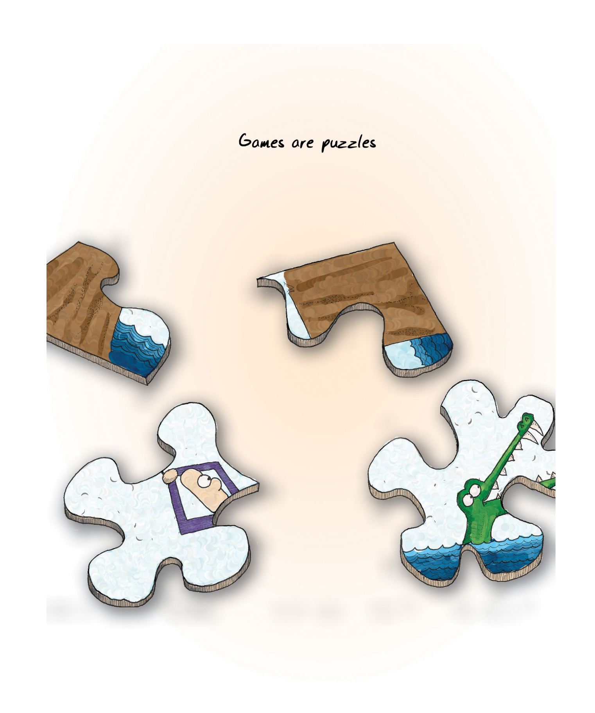
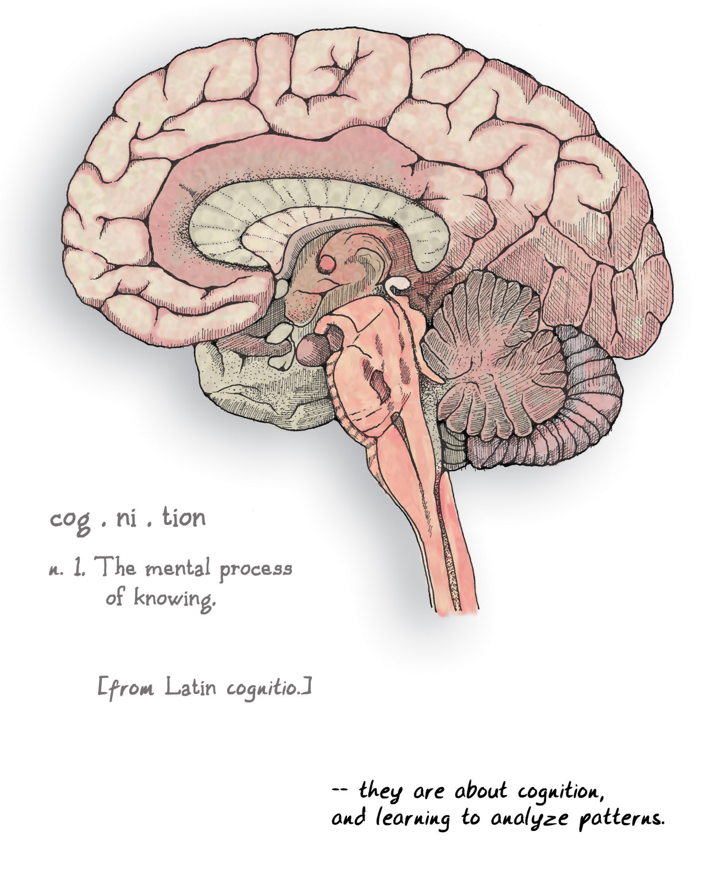
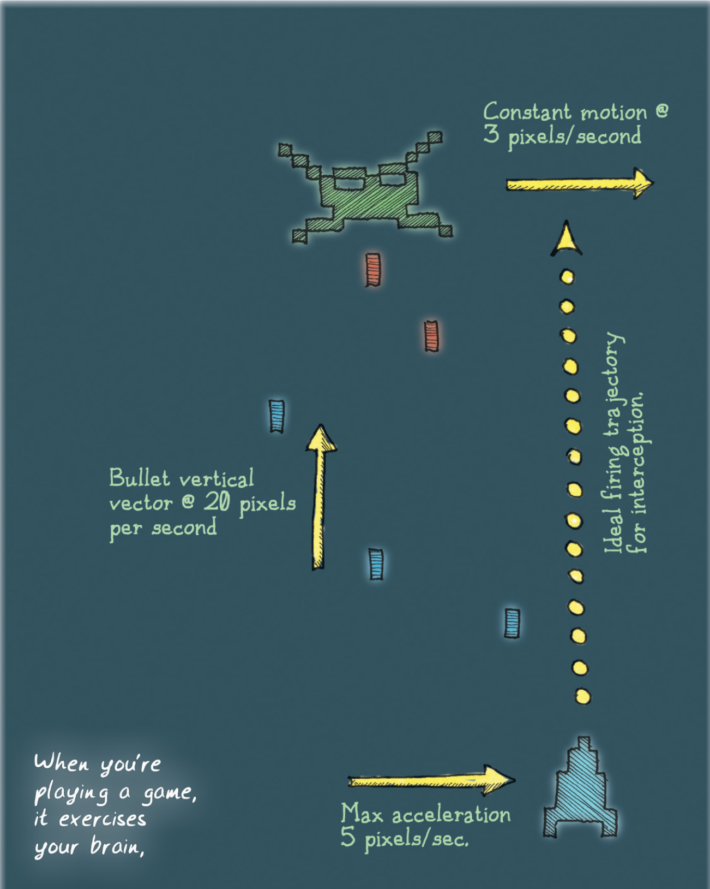
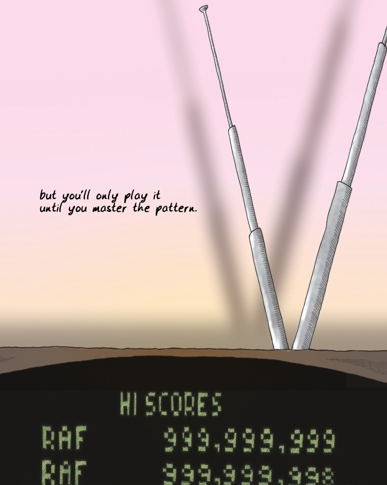
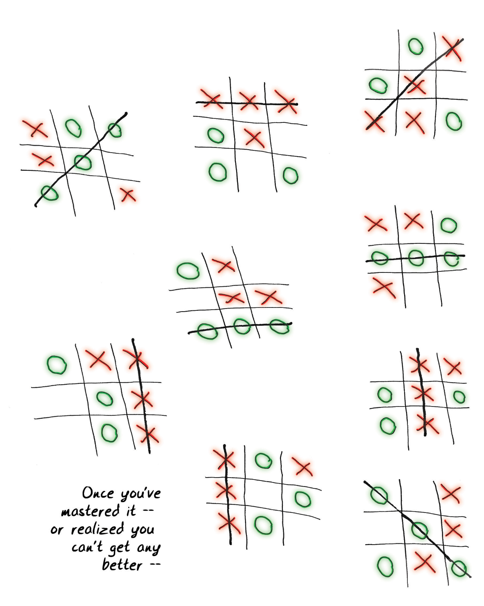
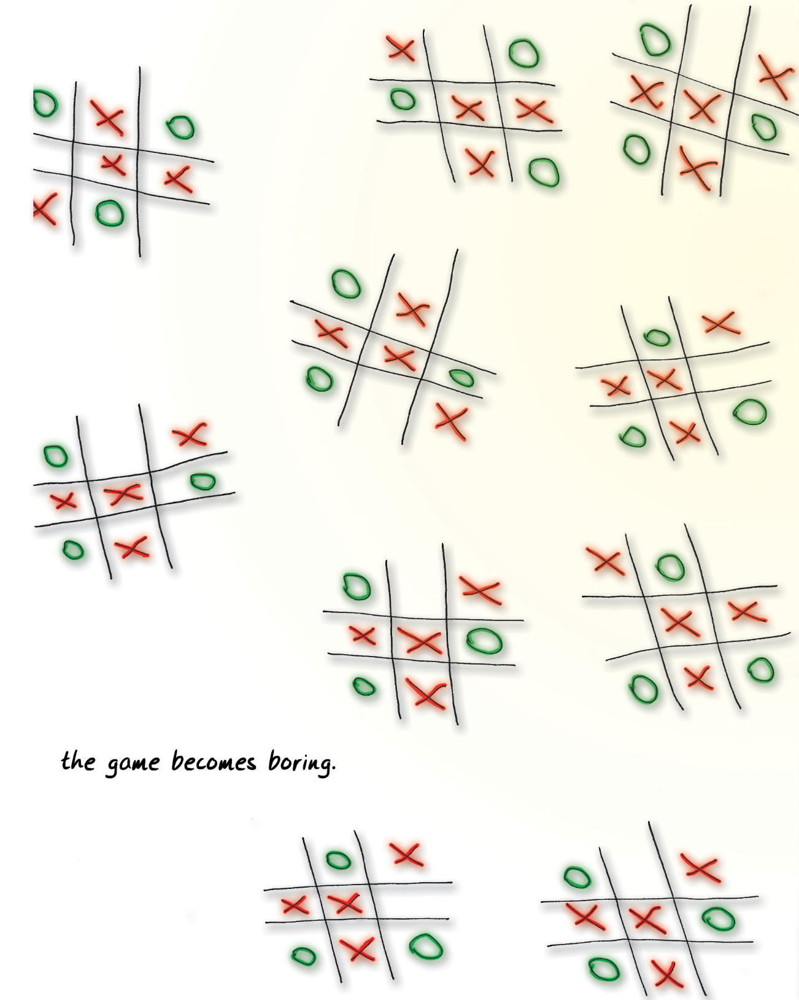
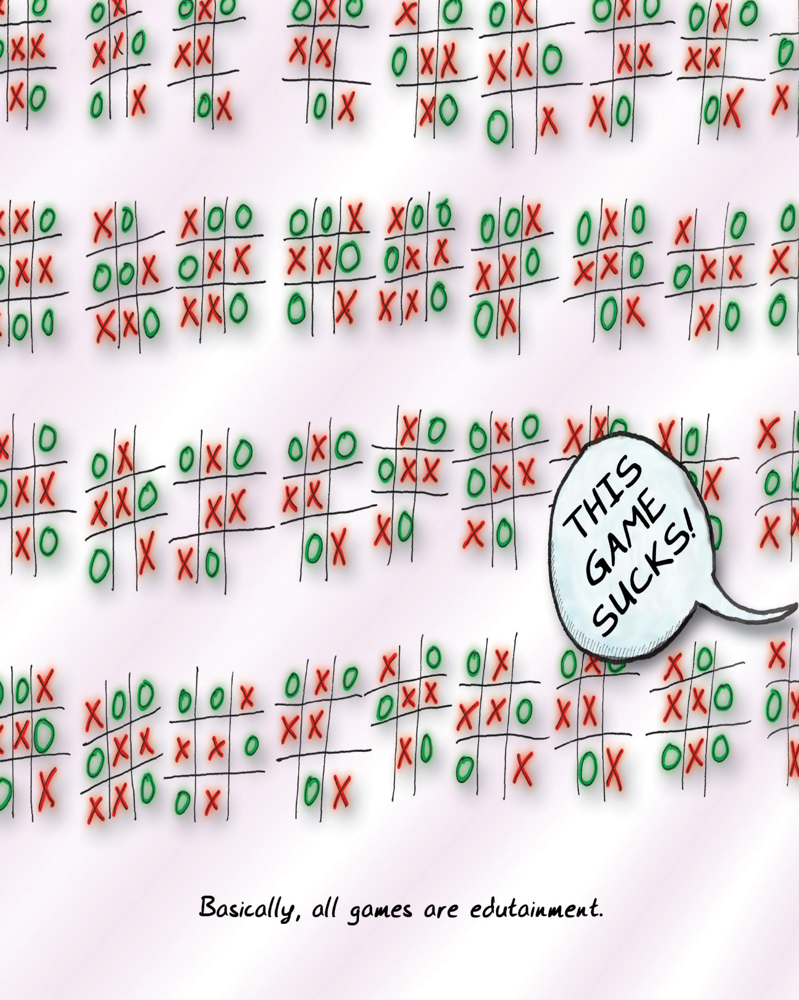

Which brings us, finally, to games.

这最终把我们引向游戏。

If you review those definitions of "game" I presented earlier, you'll see that they have some elements in common. They all present games as if they exist within a world of their own. They describe games as a simulation, a formal system, or as Huizinga put it, a "magic circle" that is disconnected from reality. They all talk about how choices or rules are important, as well as conflict. Finally, a lot of
them define games as objects that aren't real, things for pretending with.

如果你回顾一下我前面介绍的那些关于“游戏”的定义，就会发现它们有一些共同之处。它们都把游戏说成是存在于自己的世界中。它们都把游戏描述为一种模拟、一种形式系统，或者如赫伊津哈所说，是一个与现实脱节的 “魔法圈”。他们都谈到了选择或规则以及冲突的重要性。最后，他们中的很多人都把游戏定义为不真实的物体，是用来假装的东西。

But games are very real to me. Games might seem abstracted from reality because they are iconic depictions of patterns in the world. They have more in common with how our brain visualizes things than they do with how reality is actually formed. Since [our perception of reality is basically abstraction](#user-content-fn-1)[^1] anyway, I call it a wash.

但对我来说，游戏是非常真实的。游戏看似从现实中抽象出来，因为它们是对世界模式的标志性描述。它们与我们大脑将事物视觉化的方式有更多共通之处，而不是与现实的实际形成方式有更多共通之处。既然[我们对现实的感知基本上都是抽象的](#user-content-fn-2)[^2]，我称之为洗脑。

The pattern depicted may or may not exist in reality. Nobody is claiming that tic-tac-toe is a decent mimicry of warfare, for example. But the rules we perceive—what I'll call the pattern—get processed exactly the same way we process very real things like "fire burns" and "how cars move forward."

所描述的模式在现实中可能存在，也可能不存在。例如，没有人说井字游戏是对战争的完美模仿。但我们感知到的规则——我称之为模式——的处理方式与我们处理“火会燃烧”和“汽车如何前进”等真实事物的方式完全相同。

The world is full of systems that we can choose to approach as games, and by approaching them that way, we make them into games. Games are puzzles to solve, just like everything else we encounter in life. They are on the same order as learning to drive a car, play the mandolin, or multiply seven times seven. We learn the underlying patterns, grok them fully, and file them away so that they can be rerun as needed. The only real difference between games and reality is that the stakes are lower with games.

这个世界充满了各种系统，我们可以选择把它们当作游戏来处理，通过这样的处理方式，我们把它们变成了游戏。游戏是待解决的谜题，就像我们在生活中遇到的其他事情一样。它们与学习驾驶汽车、弹曼陀林或计算 7 乘以 7 的顺序相同。我们学习其基本模式，完全领悟它们，并将它们归档，以便在需要时重新运行。游戏与现实的唯一真正区别在于，游戏的风险较低。

> Games are puzzles
> 
> 游戏是谜题

Games are something special and unique. They are concentrated chunks ready for our brains to chew on. Since they are abstracted and iconic, they are readily absorbed. Since they are formal systems, they exclude distracting extra details. Usually, our brains have to do hard work to turn messy reality into something as clear as a game is.

游戏是一种特殊而独特的东西。它们是可供我们大脑咀嚼的浓缩块。由于它们是抽象的、标志性的，因此很容易被吸收。由于它们是形式系统，因此舍弃了分散注意力的额外细节。通常情况下，我们的大脑需要做艰苦的工作，才能把杂乱无章的现实变成像游戏一样清晰的东西。

In other words, games serve as very fundamental and powerful learning tools. It's one thing to read in a book that "[the map is not the territory](#user-content-fn-3)[^3]" and another to have your armies rolled over by your opponent in a game. When the latter happens because your map didn't adequately reflect what was going on, you're gonna get the point even if the actual armies aren't marching into your suburban home.

换句话说，游戏是非常基本和强大的学习工具。在书中读到“[地图不是领土](#user-content-fn-4)[^4]”是一回事，而在游戏中你的军队被对手辗过又是另一回事。当后者发生时，是因为你的地图没有充分反映当时的情况，即使真正的军队没有开进你郊区的家，你也会明白这一点。

The distinctions between toys and games, or between play and sport, start to seem a bit picky and irrelevant when you look at them in this light. There's been a lot of hay made over how play is non-goal-oriented and games tend to have goals; over how toys are aimed at pointless play rather than being games; about how make-believe is a form of play and not a game.

从这个角度看，玩具与游戏之间，或玩耍与体育之间的区别开始显得有些吹毛求疵和无关紧要。人们对此有很多争论，比如玩耍是非目标导向的，而游戏往往有明确的目标；玩具旨在促进无目的的玩耍，而非成为游戏的一部分；假装是一种玩耍形式，而非游戏。

A game designer might find those distinctions useful because they provide helpful guideposts. But all these things are the same at their most fundamental level. Perhaps this is the reason why language hasn't done a very good job of making distinctions between "play," "game," and "sport." Playing a goal-oriented game involves simply recognizing a particular sort of pattern; playing make-believe is recognizing another one. Both deservedly belong in the same category of "iconified representations of human experience that we can practice with and learn patterns from."

游戏设计师可能会觉得这些区别很有用，因为它们提供了有益的指导。但所有这些东西在最根本的层面上都是一样的。也许这就是为什么语言没有很好地区分“玩耍”、“游戏”和“运动”的原因。玩一种以目标为导向的游戏，只涉及识别一种特定的模式；而玩“假装”游戏则是识别另一种模式。两者当之无愧地属于同一类“人类经验的图标化表征，我们可以从中练习和学习模式”。

Consider the key difference between something like a book and different kinds of games. A book can do the logical conscious part of the brain pretty well. And really good readers have an ability to slurp that info directly into the subconscious, intuitive mind. But what a book will never be able to do is accelerate the grokking process to the degree that games do, because you cannot practice a pattern and [run permutations on it with a book](#user-content-fn-5)[^5], and have the book respond with feedback.

考虑一下像书这样的东西与不同种类的游戏之间的主要区别。一本书可以很好地完成大脑的逻辑意识部分。而真正优秀的读者有能力将这些信息直接吸收到潜意识、直觉思维中。但书永远无法做到的是，像游戏那样加速理解过程，因为你无法[用一本书来实践某种模式和运行模式的各种变化组合](#user-content-fn-6)[^6]，然后让书做出反馈。

> cog.ni.tion
> 
> n. 1. The mental process of knowing.
> 
> 名词 1. 认识的心理过程。
> 
> [from Latin cognitio]
> 
> [源于拉丁语 cognitio，意思是认识，了解]
> 
> -- they are about cognition, and learning to analyze patterns.
> 
> -- 它们是关于认知和学习分析模式的。

Linguists have noticed that language obeys fairly strict mathematical rules. For example, humans cannot understand a sentence that is too [deeply nested](#user-content-fn-7)[^7]. "The house the cheese the rat the cat the dog chased caught ate lay in was built by Jack" is a bad sentence because it violates this rule. The clauses are too deeply nested. We can puzzle it out with our slow logical conscious brain, but we work against our own natures when we do so.

语言学家注意到，语言遵守相当严格的数学规则。例如，人类无法理解[嵌套太深](#user-content-fn-8)[^8]的句子。“放有被老鼠吃掉、老鼠又被猫抓、猫又被狗追的奶酪的房子是杰克造的。”就是一个糟糕的句子，因为它违反了这一规则。分句嵌套太深。我们可以用逻辑思维迟钝的大脑来解题，但这样做违背了我们的本性。

Games run into similar limitations. The biggest of these lies in games' very nature as exercises for our brains. Games that fail to exercise the brain become boring. This is why tic-tac-toe ends up falling down—it's exercise, but so limited we don't need to spend much time on it. As we learn more patterns, more novelty is needed to make a game attractive. Practicing can keep a game fresh for a while, but in many cases we'll say, "Eh, I get it, I don't need to practice this task," and we'll move on.

游戏也有类似的局限性。其中最大的限制在于游戏作为大脑运动的本质。无法锻炼大脑的游戏会变得枯燥乏味。这就是为什么井字游戏最终会失败的原因——它是一种锻炼，但却非常有限，我们不需要花太多时间在上面。当我们学会更多的游戏模式时，就需要更多的新颖性来吸引我们。练习可以让游戏保持一段时间的新鲜感，但在很多情况下，我们会说：“诶，我懂了，我不需要练习这个任务了”，然后我们就会继续前进。

Almost all intentionally designed games fall prey to this. They are limited formal systems. If you keep playing them, you'll eventually grok wide swaths of their possibility space. In that sense, games are disposable, and boredom is inevitable.

几乎所有有意设计的游戏都会犯这个错误。它们是有限的正式系统。如果你一直玩下去，你最终会摸索出它们的大片可能性空间。从这个意义上说，游戏是一次性的，无聊是不可避免的。

Fun comes from ["richly interpretable" situations](#user-content-fn-9)[^9]. Games that rigidly define rules and situations are more susceptible to mathematical analysis, which is a limitation in itself. We don't think that we can drive just because we know the rules of the road and the controls of a car, but extremely formal games (such as most board games) have fairly few variables, and so you can often extrapolate out everything about how the game will go from the known rule set. This is an important insight for game designers: _[the more rigidly constructed your game is, the more limited it will be.](#user-content-fn-10)[^10]_  To make games more long-lasting, they need to integrate either math problems we don't know the solutions to, or more variables (and less predictable ones) such as human psychology, physics, and so on. These are elements that arise from outside the game's rules and from outside the "magic circle."

乐趣来自于[“丰富的可解释性”](#user-content-fn-11)[^11]。严格定义规则和情境的游戏更容易受到数学分析的影响，这本身就是一种限制。我们不会因为知道了道路规则和汽车的控制方法就认为自己会开车，但极其正式的游戏（如大多数棋盘游戏）变量相当少，因此你往往可以从已知的规则中推断出游戏的一切走向。这对游戏设计者来说是一个重要的启示：_[你的游戏构造得越死板，它的局限性就越大。](#user-content-fn-12)[^12]_ 要想让游戏更持久，就需要融入我们不知道解法的数学问题，或者更多的变量（而且是不那么容易预测的变量），比如人类心理学、物理学等等。这些元素来自游戏规则之外，也来自“魔法阵”之外。

(If it's any consolation to games, that's where game theory tends to fall down too—psych tends not to be that amenable to math.)

(如果说这对游戏有什么安慰的话，那就是博弈论往往也会失败的地方——心理学往往不那么适合数学）。

> Constant motion @ 3 pixels/second
> 
> 匀速运动 @ 3 像素/秒
> 
> Bullet vertical vector @ 20 pixels per second
> 
> 子弹垂直矢量 @ 20 像素/秒
> 
> Ideal firing trajectory for interception.
> 
> 理想的拦截射击弹道。
> 
> Max acceleration 5 pixels/sec.
> 
> 最大加速度为 5 像素/秒。
> 
> When you're play a game, it exercises your brain.
> 
> 当你玩游戏时，它能锻炼你的大脑。

This finally brings us to the title of the book and the fundamental question: What is fun?

这最终引出了本书的标题和根本问题：什么是乐趣？

If you dig into the origins of the word, you’ll find that it comes either from "fonne," which is "fool" in Middle English, or from "fonn," which means "pleasure" in Gaelic. Either way, fun is defined as "a source of enjoyment." This can happen via physical stimuli, aesthetic appreciation, or direct chemical manipulation.

如果你仔细研究这个词的起源，就会发现它要么来自“fonne”，在中古英语中是“傻瓜”的意思，要么来自“fonn”，在盖尔语中是“快乐”的意思。无论哪种说法，“乐趣”都被定义为“享受的源泉”。这可以通过物理刺激、审美鉴赏或直接化学操纵来实现。

Fun is all about our brains feeling good—the release of [endorphins](#user-content-fn-13)[^13] into our system. There are a variety of complex cocktails of chemicals that result in different sensations. Science has shown that the pleasurable chills that we get down the spine after exceptionally powerful music or a really great book are caused by the same sorts of chemicals we get when we have cocaine, an orgasm, or chocolate. Basically, our brains are on drugs pretty much all the time.

乐趣就是让我们的大脑感觉良好——[内啡肽](#user-content-fn-14)[^14]释放到我们的身体中。各种复杂的化学物质混合在一起，会产生不同的感觉。科学表明，我们在听了特别震撼的音乐或读了一本非常棒的书之后，脊背会感到阵阵凉意，这与我们吸食可卡因、达到性高潮或吃巧克力时产生的化学物质是一样的。基本上，我们的大脑无时无刻不在吸毒。

One of the releases of chemicals triggering good feelings is at that moment of triumph when we learn something or master a task. This almost always causes us to [break out into a smile](#user-content-fn-15)[^15]. After all, it is important to the survival of the species that we learn—therefore our bodies reward us for it with moments of pleasure. There are many ways we find fun in games, and I will talk about the
others. But learning is the one I believe to be the most important.

当我们学到某样东西或掌握了某项任务时，释放出的化学物质会引发美好的感觉。这几乎总是会让我们[绽放笑容](#user-content-fn-16)[^16]。毕竟，学习对人类的生存非常重要，因此我们的身体会用快乐的时刻来奖励我们。我们在游戏中找到乐趣的方式有很多，下面我将谈谈其他方式。但我认为学习是最重要的。

Fun from games arises out of mastery. It arises out of comprehension. It is the act of solving puzzles that makes games fun.

游戏的乐趣源于掌握。它源于理解。正是解谜行为让游戏充满乐趣。

In other words, with games, [learning is the drug](#user-content-fn-17)[^17].

换句话说，在游戏中，[学习就是毒品](#user-content-fn-18)[^18]。

> but you'll only play it until you master the pattern.
>
> 但你只能玩到掌握模式为止。

Boredom is the opposite of learning. When a game stops teaching us, we feel bored. Boredom is the brain casting about for new information. It is the feeling you get when there are no new visible patterns to absorb. When a book is dull and fails to lead you on to the next chapter, it is failing to exhibit a captivating pattern. When you feel a piece of music is repetitive or derivative, it grows boring because it presents no cognitive challenge. And of course, it could arise when a pattern is present but "going over our heads."

无聊是学习的反面。当一个游戏不再教我们任何东西时，我们会感到无聊。无聊是大脑在寻找新信息。当没有新的可见模式可供吸收时，你就会有这种感觉。当一本书枯燥乏味，无法引导你进入下一章时，它就没有展现出吸引人的模式。当你觉得一首音乐是重复或模仿时，它就会变得乏味，因为它没有给你带来认知上的挑战。当然，当一种模式存在但“超出我们的理解范围”时，也可能产生这种感觉。

We shouldn't underestimate the brain's desire to learn. If you put a person in a sensory deprivation chamber, he or she will get very unhappy very quickly. The brain craves stimuli. At all times, the brain is casting about trying to learn something, trying to integrate information into its worldview. It is insatiable in that way.

我们不应该低估大脑的学习欲望。如果你把一个人放在感官剥夺室里，他或她很快就会变得非常不开心。大脑渴望刺激。无论何时，大脑都在努力学习，试图将信息融入它的世界观。在这方面，它是贪得无厌的。

This doesn't mean it necessarily craves new experiences—mostly, it just craves new data. New data is all it needs to flesh out a pattern. A new experience might force a whole new system on the brain, and often the brain doesn't like that. It's disruptive. The brain doesn't like to do more work than it has to. That's why it chunks in the first place. That's why we have the term "[sensory overload](#user-content-fn-19)[^19]," as an opposite to "sensory deprivation."

这并不意味着它一定渴望新体验——主要是渴望新数据。它需要新数据来充实模式。新的体验可能会给大脑带来全新的系统，而大脑往往不喜欢这样。这具有破坏性。大脑不喜欢做比它必须做的更多的工作。这就是为什么它首先要分块。这就是为什么我们有“[感官超载](#user-content-fn-20)[^20]”这个词，作为“感官剥夺”的反义词。

Games grow boring when they fail to unfold new niceties in the puzzles they present. But they have to navigate between the [Scylla and Charybdis](#user-content-fn-21)[^21] of deprivation and overload, of excessive order and excessive chaos, of silence and noise.

当游戏无法在谜题中展现新的乐趣时，游戏就会变得枯燥乏味。但游戏必须在剥夺和超载、过度秩序和过度混乱、寂静和嘈杂的[斯库拉和卡律布狄斯](#user-content-fn-22)[^22]之间游刃有余。

This means that it's easy for the player to get bored before the end of the game. After all, people are really good at pattern-matching and dismissing noise and silence that doesn't fit the pattern they have in mind.

这意味着玩家很容易在游戏结束前感到厌倦。毕竟，人们非常善于进行模式匹配，并消除不符合他们心目中模式的噪音和沉默。

> Once you've mastered it -- or realized you can't get any better --
> 
> 一旦你掌握了它——或者意识到你已经不能再好了——

Here are some ways in which boredom might strike, killing the pleasurable learning experience that games are supposed to provide:

以下是一些让人感到无聊的方式，它们会扼杀游戏本应带来的愉悦的学习体验：

* The player might grok how the game works from just the first five minutes, and then the game will be dismissed as trivial, just as an adult dismisses tic-tac-toe. This doesn't mean the player actually solved the game; she may have just arrived at a good-enough strategy or heuristic that lets her get by. "Too easy," might be the remark the player makes.\
    玩家可能在游戏开始的五分钟内就明白了游戏的玩法，然后就会把游戏当成小事一桩，就像成年人不屑于玩井字游戏一样。这并不意味着玩家真的解决了这个游戏；她可能只是找到了一个足够好的策略或启发式方法，让她能够过关。玩家可能会说：“太简单了。”

* The player might grok that there's a ton of depth to the possible permutations in a game, but conclude that these permutations are below their level of interest—sort of like saying, "Yeah, there's a ton of depth in baseball, but memorizing the [RBI stats](#user-content-fn-23)[^23] for the past 20 years is not all that useful to me."\
    玩家可能会认为游戏中可能出现的排列组合有很大的深度，但得出的结论是这些排列组合低于他们的兴趣水平——有点像在说：“是的，棒球有很大的深度，但记住过去 20 年的 [RBI 统计](#user-content-fn-24)[^24]对我来说并没有什么用。”

* The player might fail to see any patterns whatsoever, and nothing is more boring than noise. "This is too hard."\
    玩家可能看不到任何模式，而没有什么比噪音更无聊了。“这太难了。”

* The game might unveil new variations in the pattern too slowly, in which case the game may be dismissed as trivial too early, even though it does have depth. "The difficulty ramps too slowly."\
    游戏揭示模式新变化的速度可能太慢，在这种情况下，尽管游戏确实有深度，但玩家可能会过早地将其视为微不足道。“难度提升太慢。”

* The game might also unveil the variations too quickly, which then leads to players losing control of the pattern and giving up because it looks like noise again. "This got too hard too fast," they'll say.\
    游戏也可能过快地揭示出图案的变化，从而导致玩家失去对模式的控制并放弃游戏，因为它看起来又像是噪音。他们会说“这太难了，太快了。”
    
* The player might master everything in the pattern. He has exhausted the fun, consumed it all. "I beat it."\
    玩家可能掌握了模式中的所有内容。他已经耗尽了乐趣，享受完了所有。“我征服了它。”

> the game becomes boring.
> 
> 游戏就会变得无聊乏味。

Any of these will result in the player stating that she is bored. In reality, some of these are boredom+frustration, and some are boredom+triumph, and so on. If your goal is to keep things fun (read as "keep the player learning"), boredom is always the signal to let you know you have failed.

任何一种情况都会让玩家表示自己很无聊。实际上，有些是无聊+挫败，有些是无聊+胜利，等等。如果你的目标是保持游戏的趣味性（可以理解为“让玩家不断学习”），那么“无聊”永远是让你知道自己失败了的信号。

The definition of a good game is therefore "one that teaches everything it has to offer before the player stops playing."

因此，好游戏的定义就是“能在玩家停止游戏之前教会他所有东西的游戏。”

That's what games are, in the end. Teachers. [Fun is just another word for learning](#user-content-fn-25)[^25]. Games teach you how aspects of reality work, how to understand yourself, how to understand the actions of others, and how to imagine.

这就是游戏的本质。老师。[乐趣只是学习的另一种说法](#user-content-fn-26)[^26]。游戏教会你现实的方方面面如何运作，如何理解自己，如何理解他人的行为，以及如何想象。

One wonders, then, why learning is so damn boring to so many people. It's almost certainly because the method of transmission is wrong. We praise good teachers by saying that they "make learning fun." Games are very good teachers...of something. The question is, what do they teach?

那么，我们不禁要问，为什么对这么多人来说，学习是如此该死的无聊呢？这几乎可以肯定是因为传授的方法不对。我们称赞好老师，说他们"让学习变得有趣"。游戏是很好的老师……在某些方面。问题是，游戏能教什么？

Either way, I have an answer for my late grandfather, and it looks like what I do fits right alongside the upstanding professions of my various aunts and uncles. Fireman, carpenter, and…teacher.

无论如何，我已经为我已故的祖父找到了答案，而且看起来我所从事的工作与我的叔叔阿姨们的正直职业是相吻合的。消防员，木匠，还有……老师。

> THIS GAME SUCKS!
> 
> 这游戏烂透了！
> 
> Basically, all games are edutainment.
> 
> 基本上，所有游戏都是寓教于乐的。

[^1]: Our perception of reality is basically abstraction: An important paper called "What the Frog's Eye Tells the Frog's Brain," by Lettvin, Maturana, McCulloch, and Pitts, described the fact that what the brain "sees" as output from the eyes is not even vaguely close to the literal visual image. A significant amount of processing turns the literal input of light and shadow into something that the brain copes with. In a very real sense, we do not see the world—we see what our brain tells us we see. Solipsism is five blocks down and to the left.

[^2]: 我们对现实的感知基本上是抽象的：莱特文、马图拉纳、麦克库洛赫和皮茨的一篇重要论文《青蛙的眼睛告诉青蛙的大脑什么》描述了这样一个事实：大脑从眼睛中“看到”的输出与字面上的视觉图像相差甚远。大量的处理过程将光影的直接输入转化为大脑可以应对的东西。从真正意义上说，我们看到的不是世界，而是大脑告诉我们看到了什么。唯我论就在左下方五个街区的地方。

[^3]:The map is not the territory: This is a condensation of a statement by the father of general semantics, Alfred Korzybski: "A map is not the territory it represents, but if correct, it has a similar structure to the territory, which accounts for its usefulness."

[^4]:地图不是领土：这句话浓缩了一般语义学之父阿尔弗雷德·柯兹布斯基的一句话：“地图不是它所代表的领土，但如果正确的话，它具有与领土相似的结构，这就是它有用的原因。”

[^5]: Run permutations on a book: This statement is a bit too forceful. There exist works of literature that are intended in this manner. Examples include the entire genre of hypertext fiction (Victory Garden by Stuart Moulthrop is a good starting point). There are also books such as Julio Cortázar's Rayuela (translated as Hopscotch) that are intended to be read in multiple different orders. And of course, the genre of games known as "interactive fiction," or text adventures, can be seen as a computer-assisted form of this type of book.

[^6]: 用一本书进行排列组合：这种说法有点过于武断。有一些文学作品就是以这种方式创作的。例如整个超文本小说流派（斯图而特·莫而特洛普的《胜利花园》就是一个很好的起点）。还有像胡里奥·科塔萨尔的《Rayuela》（译为《跳房子》）这样可以按照多种不同顺序阅读的书籍。当然，被称为“互动小说”或文字冒险的游戏类型也可以被视为这类书籍的计算机辅助形式。

[^7]: Deeply nested clauses: This is typically seen as an expression of G. A. Miller’s number cited in the endnote on "chunking" in Chapter Two: 7±2. In assessing a deeply nested sentence, it’s important to realize that each word is itself already being "chunked" from a collection of letters. The example sentence comes from Jane Robinson’s 1974 paper ["Performance Grammars"](http://www.sri.com/sites/default/files/uploads/publications/pdf/1384.pdf).

[^8]: 深嵌套从句：这通常被视为第二章“分块”尾注中引用的乔治·阿米蒂奇·米勒的数字：7±2。在评估一个深嵌套句子时，重要的是要意识到每个单词本身已经是从字母集合中“分块”出来的。例句来自简·罗宾逊 1974 年的论文[《表现语法》](http://www.sri.com/sites/default/files/uploads/publications/pdf/1384.pdf)。

[^9]: Richly interpretable situations: This is not only my interpretation of the sorts of game patterns that humans find compelling, but also the phrase used by Biederman & Vessel in their research on endorphins and pleasurable feedback from the brain. For a discussion of the applicability of this to games, see Craig Perko’s blog at [http://blog.ihobo.com/2012/05/implicit-game-aesthetics-4-cooks-chemistry.html](http://blog.ihobo.com/2012/05/implicit-game-aesthetics-4-cooks-chemistry.html).

[^10]: The limitations of rules: This is a game-specific way of explaining Gödel’s Theorem. Kurt Gödel, in his 1931 paper "On Formally Undecidable Propositions in Principia Mathematica and Related Systems," proved that there are always propositions that lie outside the boundaries of a given formal system. No formal system can describe itself fully. The "magic circle" is basically an attempt to protect the integrity of a model, in the same way that Hilbert’s view of mathematics attempted to fully define a system. The truly long-lived rigidly defined games have tended to be those presenting truly difficult mathematical problems to their players – games that fall into the NP-hard complexity category. For more on this, I refer you to my conference presentation "Games Are Math," given at GDCO in 2009: [http://www.raphkoster.com/2009/09/22/gdca-games-are-math-slides-posted/](http://www.raphkoster.com/2009/09/22/gdca-games-are-math-slides-posted/).

[^11]: 丰富的可解释情境：这不仅是我对人类认为引人入胜的游戏模式的理解，也是比德曼和韦塞尔在研究大脑内啡肽和愉悦反馈时使用的短语。关于这句话在游戏中的适用性，请参阅克雷格·佩尔科的博客：[http://blog.ihobo.com/2012/05/implicit-game-aesthetics-4-cooks-chemistry.html](http://blog.ihobo.com/2012/05/implicit-game-aesthetics-4-cooks-chemistry.html)。

[^12]: 规则的局限性：这是解释哥德尔定理的一种特定游戏方式。库尔特·哥德尔在 1931 年发表的论文《论数学原理及相关体系中形式上不可判定的命题》中证明，总有一些命题处于特定形式系统的边界之外。任何形式系统都无法完全描述自身。“魔法阵”基本上是试图保护模型的完整性，就像希尔伯特的数学观试图完全定义一个系统一样。真正长寿的严格定义的游戏往往是那些给玩家带来真正困难的数学问题的游戏——属于 NP 困难 复杂性类别的游戏。关于这方面的更多信息，请参阅我在 2009 年 GDCO 大会上的演讲《游戏即数学》：[http://www.raphkoster.com/2009/09/22/gdca-games-are-math-slides-posted/](http://www.raphkoster.com/2009/09/22/gdca-games-are-math-slides-posted/)。

[^13]: Endorphins: "Endorphin" is abbreviated from "endogenous morphine." I'm not kidding when I say we're on drugs when we're having fun! Endorphins are an opiate. The "chill down the spine" effect is often explained as the release of endorphins into the spinal fluid. Pleasure is not the only thing that gives us this effect, of course—adrenaline rushes caused by fear provide a similar sensation.

[^14]: 内啡肽：“内啡肽”是“内源性吗啡”的缩写。当我说我们在玩乐时会嗑药时，我不是在开玩笑！内啡肽是一种鸦片制剂。“脊柱发凉”的效果通常被解释为内啡肽释放到脊髓液中。当然，给我们带来这种效果的不仅仅是快乐，恐惧导致的肾上腺素激增也会带来类似的感觉。

[^15]: Break out in a smile: There's good evidence that the smile can cause us to be happy and not just the other way around. For more reading on emotions, I recommend the work of Paul Ekman.

[^16]: 绽放笑容：有充分证据表明，微笑能让我们快乐，而不仅仅是相反。关于情绪的更多阅读，我推荐保罗·艾克曼的著作。

[^17]: Learning is the drug: "Fun is the emotional response to learning." - Chris Crawford, March 2004. Also, Biederman and Vessel's research shows that curiosity itself is inherently pleasurable.

[^18]: 学习是毒品：“快乐是学习的情绪反应。” - 克里斯·克劳福德，2004 年 3 月。此外，比德曼和维塞尔的研究表明，好奇心本身就是一种快乐。

[^19]: Sensory overload: The input capacity of the conscious mind is only around 16 bits a second. Sensory overload can be thought of as the difference between the amount of information and the amount of meaning. You can have a large stack of information—such as a book typed by monkeys—that is very low in meaning. When the amount of information is too high and we fail to extract meaning from it, we say we're in overload.

[^20]: 感官超载：意识的输入能力每秒只有 16 比特左右。感官超载可以理解为信息量和意义量之间的差异。你可以有一大堆信息，比如一本由猴子打出来的书，但其意义却很低。当信息量过大，我们无法从中提取意义时，我们就会说自己超载了。

[^21]: Scylla and Charybdis: In Greek myth, these two monsters sat on opposite sides of a narrow strait. Sailors wishing to pass inevitably ran too close to one or the other.

[^22]: 斯库拉和卡律布狄斯：在希腊神话中，这两只怪兽分居狭窄海峡的两岸。想要通过的水手不可避免地会过于靠近其中之一。

[^23]: RBI: "Runs batted in" in baseball. This statistic is tracked per player and is incremented by one each time a run is scored as a result of the player's turn at bat, no matter who actually scores the run, provided it wasn’t the result of an opponent error or the cause of a forced double play.

[^24]: RBI：棒球中的“打数”。这项统计是按球员追踪的，每当该球员轮到击球而得分时，无论实际得分的是谁，只要不是对手失误或被迫双杀的结果，都会增加 1 分。

[^25]: Fun is another word for learning: The theoretician of play Brian Sutton-Smith called this just one of the "rhetorics of play." He identified several more in his book The Ambiguity of Play, including using games of chance to determine your fate, or using games to determine the fate of nations. I tend to regard almost all of the rhetorics he identifies as differing sources of learning and practice, and the balance (such as the two I just mentioned) as more like alternative uses of games. More recently, designer Craig Perko has written a series of articles identifying what he calls "aesthetics of play," once again identifying learning and mastery as just two possible things to value within a game structure. “Play” can be taken in a Derridean sense to mean "movement" or "freedom," as several games academics have pointed out (Salen, Zimmerman, and Bogost). In my definition of fun, the sort of learning we are doing is essentially mapping the space of that movement.

[^26]: 乐趣是学习的另一个词：游戏理论家布赖恩·萨顿·史密斯称这只是“游戏修辞”之一。他在《游戏的歧义》一书中还指出了其他几种游戏修辞，包括用机会游戏来决定你的命运，或用游戏来决定国家的命运。我倾向于把他指出的几乎所有修辞方法都看作是学习和实践的不同来源，而其余的（比如我刚才提到的两种）更像是游戏的其他用途。最近，设计师克雷格·佩尔科撰写了一系列文章，指出了他所谓的"游戏美学"，并再次指出学习和掌握只是游戏结构中两种可能的价值。正如几位游戏学者（萨伦，齐默尔曼和博格斯特）所指出的，“游戏”在德里达意义上可以理解为“运动”或“自由”。在我对“乐趣”的定义中，我们正在进行的学习本质上就是在映射这种运动的空间。