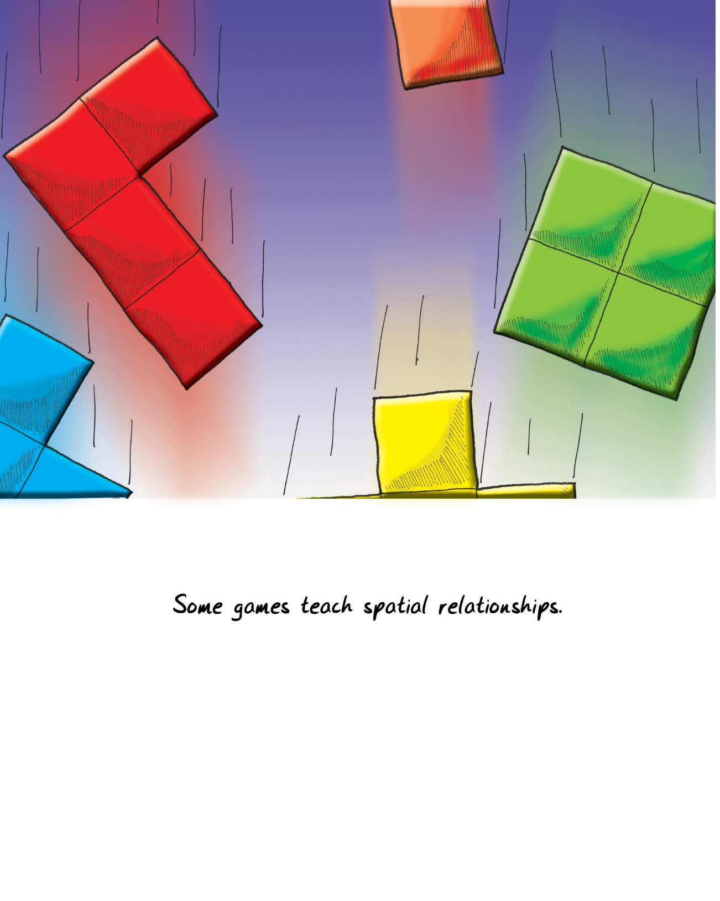
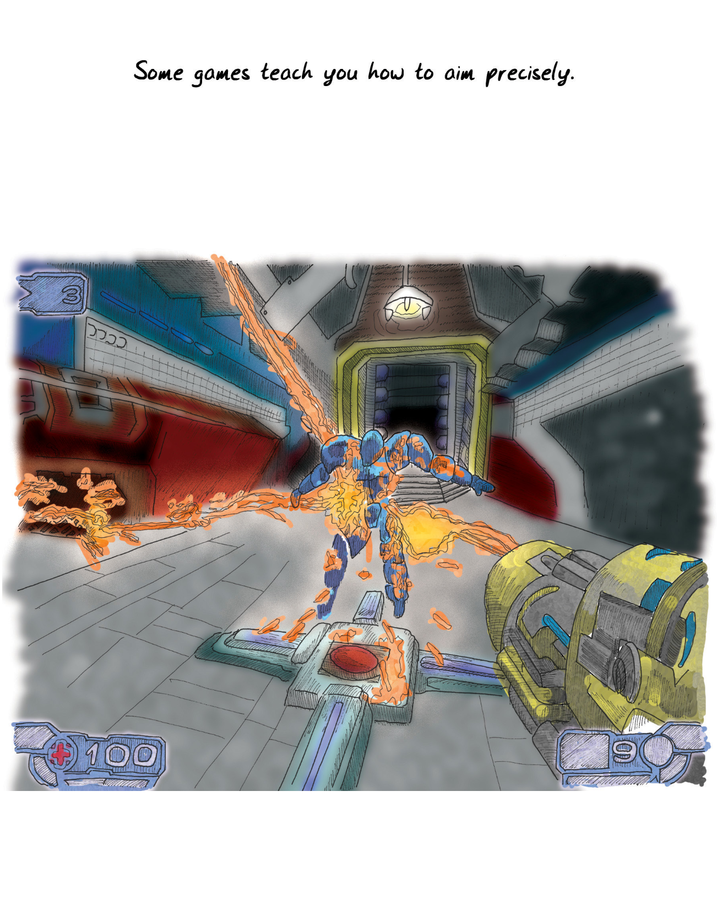
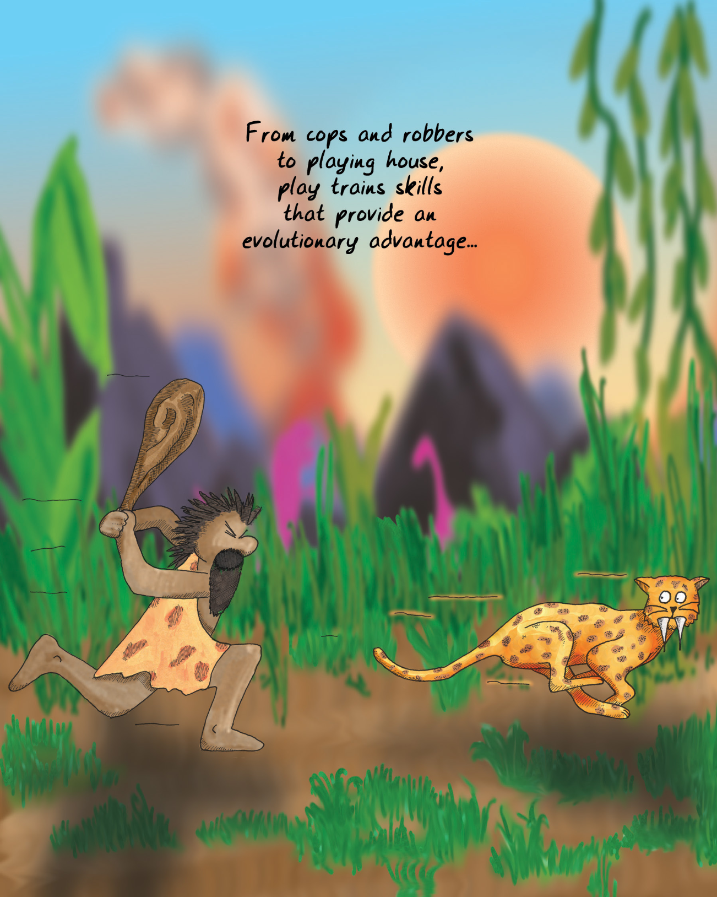
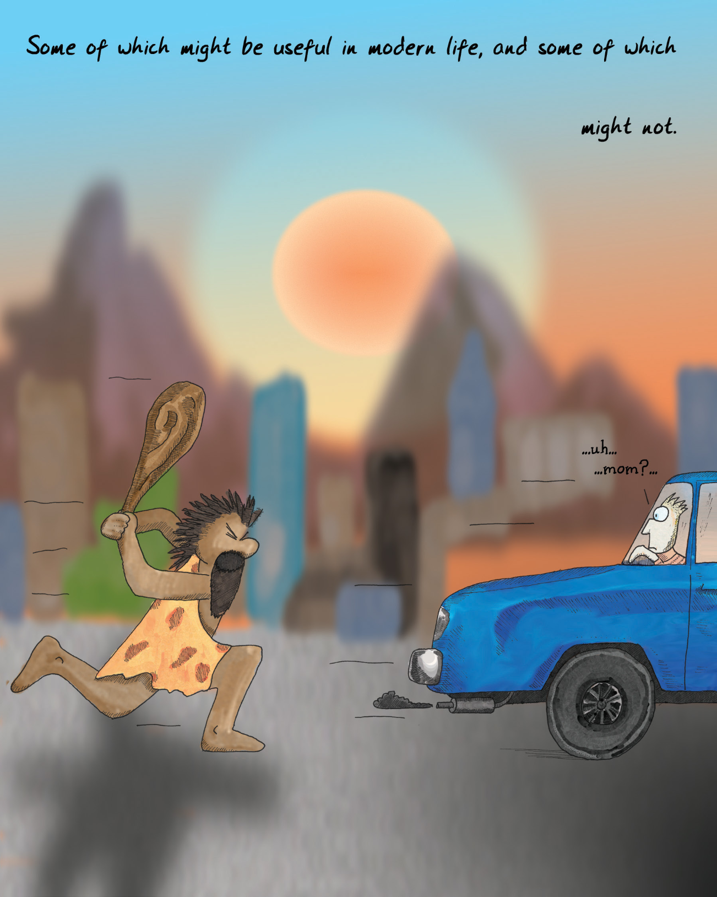
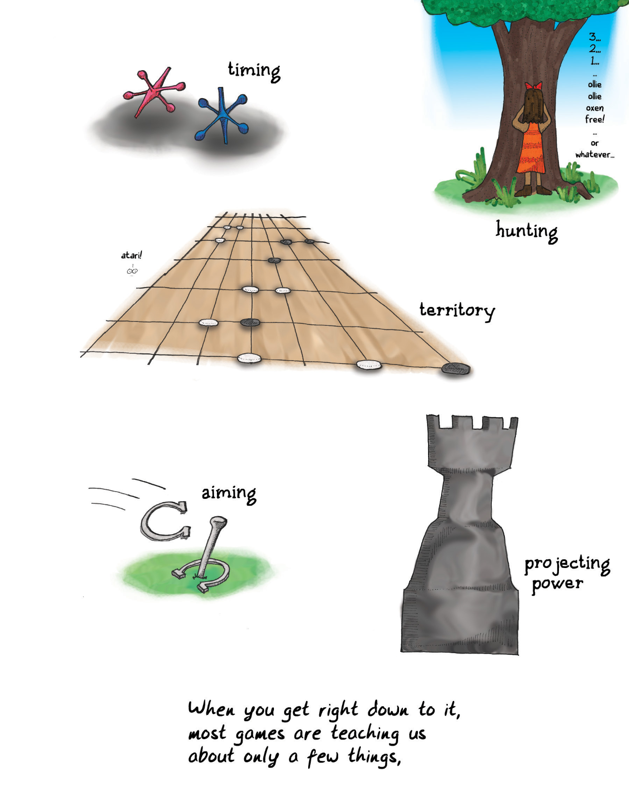
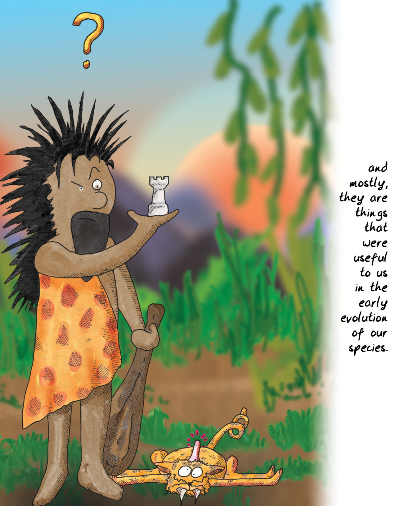
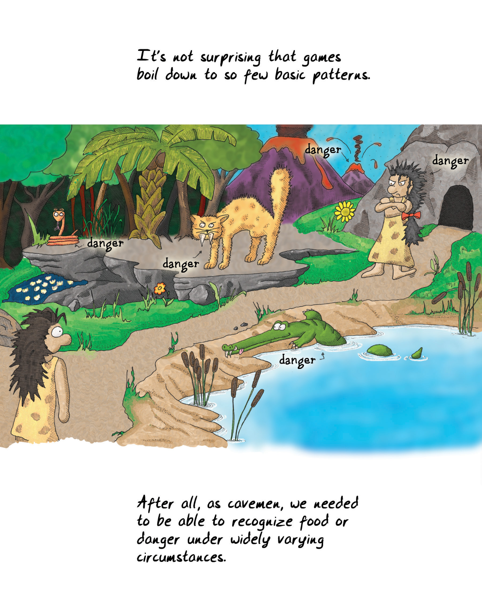
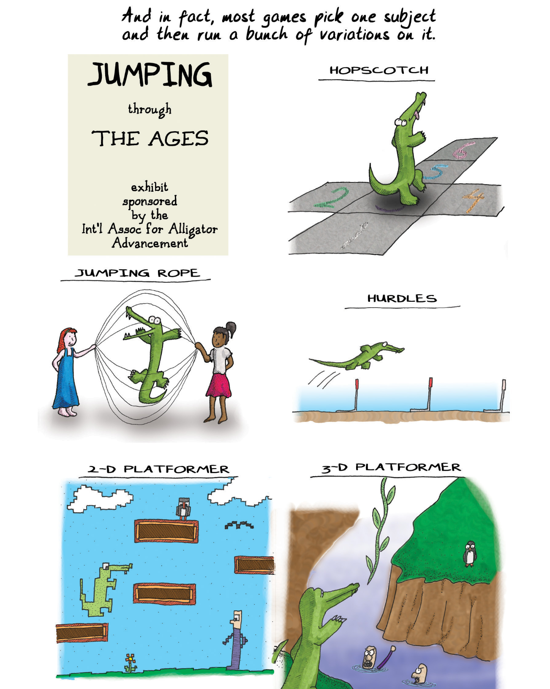
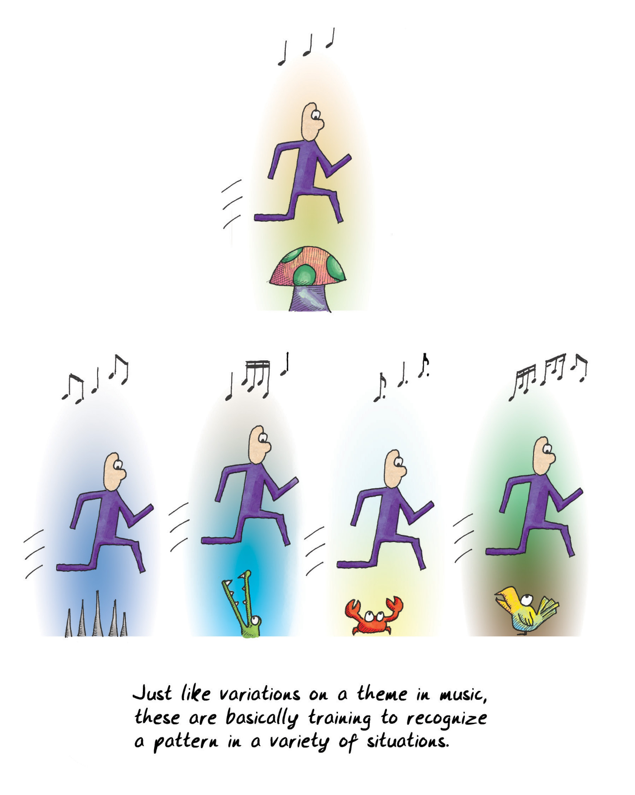
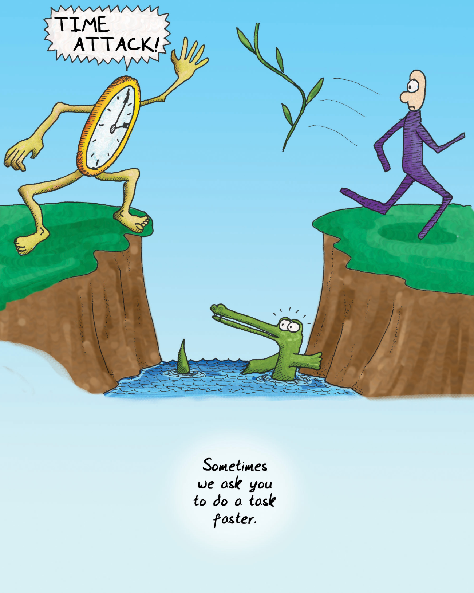

Formal training isn't really required to become a game designer. Most of the game designers working professionally today are self-taught. That is changing rapidly as [university programs for game designers](#user-content-fn-1)[^1] crop up all around the country and the world.

要成为一名游戏设计师，其实并不需要正规的培训。如今，大多数专业从事游戏设计工作的设计师都是自学成才的。这种情况正在迅速改变，因为全国乃至全世界的[游戏设计师大学课程](#user-content-fn-2)[^2]层出不穷。

I went to school to be a writer, mostly. I believe really passionately in the importance of writing and the incredible power of fiction. We learn through stories; we become who we are through stories.

我上学主要是为了成为一名作家。我坚信写作的重要性和小说不可思议的力量。我们通过故事学习；我们通过故事成为我们自己。

My thinking about what fun is led me to similar conclusions about games. I can't deny, however, that stories and games teach really different things, in very different ways. Game systems (as opposed to the visuals and presentation of a given game) don't usually have a moral. They don't usually have a theme in the sense that a novel has a theme.

我对乐趣的思考让我对游戏也得出了类似的结论。然而，我不能否认，故事和游戏以截然不同的方式传授着真正不同的东西。游戏系统（相对于特定游戏的视觉效果和表现形式）通常没有寓意。它们通常不像小说那样有主题。

The population that uses games as learning tools the most effectively is the young. Certainly folks in every generation keep playing games into old age ([pinochle](#user-content-fn-3)[^3], anyone?), but as we get older we view those people more as the exception, though this is changing as digital gaming continues to rise in popularity. Games are viewed as frivolity. In the Bible in [1 Corinthians](#user-content-fn-4)[^4], we are told, "When I was a child, I spoke like a child, I thought like a child, I reasoned like a child; when I became a man, I gave up childish ways." But children speak honestly—sometimes too much so. Their reasoning is far from impaired—it is simply inexperienced. We often assume that games are childish ways, but is that really so?

将游戏作为学习工具最有效的人群是年轻人。当然，每一代人都会一直玩游戏到老年（[皮纳克尔](#user-content-fn-5)[^5]，有人玩吗？），但随着年龄的增长，我们更多地将这些人视为例外，尽管随着数字游戏的不断普及，这种情况正在发生变化。游戏被视为无聊。《圣经》[哥林多前书](#user-content-fn-6)[^6]告诉我们：“我作孩子的时候，说话像孩子，思想像孩子，推理像孩子；及至我作了成人，就弃绝了孩子的事。”但孩子们说话坦诚——有时过于坦诚。他们的推理能力远远没有受损，只是缺乏经验而已。我们常常认为游戏是幼稚的方式，但事实真的如此吗？

> This shouldn't surprise us -- after all, the young of all species play.
> 
> 我们不应该对此感到惊讶——毕竟，所有物种的年轻人都在玩耍。

We don't actually put away the notion of "having fun," as far as I can tell. We migrate it into other contexts. Many claim that work is fun, for example (me included). Just getting together with friends can be enough to give us the little burst of endorphins we crave.

据我所知，我们实际上并没有抛弃“玩得开心”的概念。我们将其迁移到其他语境中。例如，许多人声称工作是一种乐趣（包括我在内）。与朋友相聚就足以让我们获得渴望的内啡肽。

We also don't put aside the notion of constructing abstract models of reality in order to practice with them. We practice our speeches in front of mirrors, run fire drills, go through training programs, and role-play in therapy sessions. There are games all around us. We just don't call them that.

我们也不会抛开构建抽象的现实模型的概念，以便用它们进行练习。我们对着镜子练习演讲，进行消防演习，参加培训项目，在治疗过程中进行角色扮演。游戏就在我们身边。只是我们不这样称呼它们。

As we age, we think that things are more serious and that we must leave frivolous things behind. Is that a value judgment on games or is it a value judgment on the content of a given game? Do we avoid the notion of fun because we view the content of the fire drill as being of greater import?

随着年龄的增长，我们认为事情变得更加严肃，必须抛开无聊的事情。这是对游戏的价值判断，还是对特定游戏内容的价值判断？我们是否因为认为消防演习的内容更重要而回避了趣味的念头？

Most importantly, would fire drills be more effective if they were fun activities? There is a design practice called "gamification" which attempts to use the trappings of games (reward structures, points, etc.) to make people engage more with product offerings. Does it miss the point of games? It is often layered on top of systems that lack the rich interpretability of a good game. A reward structure alone does not a [game make](#user-content-fn-7)[^7].

最重要的是，如果消防演习是有趣的活动，它们会更有效吗？有一种设计实践被称为“游戏化”，它试图利用游戏的外在特征（奖励结构、积分等）让人们更多地参与到产品中来。这种做法是否忽略了游戏的本质？游戏化经常被添加到那些缺乏优质游戏丰富解读性的系统上。单凭奖励结构并不能[构成游戏](#user-content-fn-8)[^8]。

> With age, some games turn serious.
> 
> 随着年龄的增长，有些游戏会变得严肃起来。

If games are essentially models of reality, then the things that games teach us must reflect on reality.

如果游戏本质上是现实的模型，那么游戏教给我们的东西就必须反映现实。

My first thought was that games are models of hypothetical realities, since they often bear no resemblance to any reality I know.

我首先想到的是，游戏是假设现实的模型，因为它们往往与我所知道的任何现实都毫无相似之处。

As I looked deeper, though, I found that even whacked-out abstract games do reflect underlying reality. The guys who told me these games were all about vertices were correct. Since formal rule sets are basically mathematical constructs, they always end up reflecting forms of mathematical truth, at the very least. (Formal rule sets are the basis for most games, but not all—there are classes of [games with informal rule sets](#user-content-fn-9)[^9], but you can bet that little kids will cry "no fair" when someone violates an unstated assumption in their tea party.)

但随着我的深入研究，我发现即使是古怪抽象的游戏也确实反映了潜在的现实。那些告诉我这些游戏都是关于顶点的人是对的。由于形式规则集基本上是数学构造，因此它们最终总会反映出数学真理的形式，至少是这样。(正式规则集是大多数游戏的基础，但并不是所有游戏的基础——有一些[游戏的规则集是非正式的](#user-content-fn-10)[^10]，但你可以放心，当有人在他们的茶话会上违反了一个未说明的假设时，小孩子们一定会大叫“不公平”。）

Sadly, reflecting mathematical structures is also the only thing many games do. The real-life challenges that games prepare us for are almost exclusively ones based on the calculation of odds. They teach us how to predict events. A huge number of games simulate forms of combat. Even games ostensibly about building are usually framed competitively.

可悲的是，反映数学结构也是许多游戏唯一能做的事情。游戏让我们为现实生活中的挑战做好准备，而这些挑战几乎都是基于几率计算的。它们教我们如何预测事件。大量游戏模拟了各种形式的战斗。即使是表面上是关于建设的游戏，通常也是以竞争为框架的。

Given that we're basically [hierarchical and strongly tribal primates](#user-content-fn-11)[^11],  it's not surprising that so many of the basic lessons taught by our early childhood play are about power and status. Think about how important these lessons still are within society, regardless of your particular culture. Games almost always teach us tools for being the top monkey or tribe of monkeys.

鉴于我们基本上是[等级森严且热衷抱团的灵长类动物](#user-content-fn-12)[^12]，很多我们儿时游戏中学到的基本课程都与权力和地位有关也就不足为奇。想想看，无论你的文化背景如何，这些课程在社会中都至关重要。游戏几乎总是教我们如何成为最顶尖的猴子或猴群。

> ...uh...
> 
> ……嗯……
> 
> gratuitous penguin
> 
> 无谓的企鹅
> 
> ...oh well...
> 
> ……好吧……
> 
> The very phrase "it's just a game" implies that playing a game is a form of PRACTICE for a real-life challenge.
> 
> “这只是个游戏”这句话本身就意味着，玩游戏是对现实挑战的一种练习。

Games also teach us how to [examine the environment, or space, around us](#user-content-fn-13)[^13]. From games where we fit together odd shapes to games where we learn to see the invisible lines of power projection across a grid, much effort is spent in teaching us about territory. That is what tic-tac-toe is essentially all about.

游戏还教会我们如何[审视周围的环境或空间](#user-content-fn-14)[^14]。从拼凑奇形怪状的游戏，到让我们学会看清权力投射的无形线条的游戏，都在教我们认识领地方面花费了大量精力。这也是井字游戏的本质所在。

Spatial relationships are, of course, critically important to us. Some animals might be able to navigate the world using the Earth's magnetic field, but not us. Instead, we use maps and we use them to map all sorts of things, not just space. Learning to interpret symbols on a map, assess distance, assess risk, and remember caches must have been a critically important survival skill when we were nomadic tribesmen. Most games incorporate some element of spatial reasoning. The space may be a [Cartesian coordinate space](#user-content-fn-15)[^15], like what we see on a soccer field, or it may be a [directed graph](#user-content-fn-16)[^16] like we see in "racetrack" board games. Mathematicians might even point out that something like [a tennis court could be both](#user-content-fn-17)[^17] at the same time. Classifying, collating, and exercising power over the contents of a space is one of the fundamental lessons of all kinds of gameplay.

当然，空间关系对我们来说至关重要。有些动物也许可以利用地球磁场来导航，但我们不行。相反，我们使用地图，而且我们用地图来描绘各种事物，而不仅仅是空间。当我们还是游牧部落的人时，学会解释地图上的符号、评估距离、评估风险和记住藏匿地点一定是一项极其重要的生存技能。大多数游戏都包含一些空间推理元素。空间可能是[笛卡尔坐标空间](#user-content-fn-18)[^18]，就像我们在足球场上看到的那样；也可能是[有向图](#user-content-fn-19)[^19]，就像我们在“赛道”棋类游戏中看到的那样。数学家甚至会指出，像网球场这样的东西可以同时是这[两种空间](#user-content-fn-20)[^20]。对空间内容进行分类、整理和行使权力，是各种游戏的基本课程之一。

Examining space also fits into our nature as toolmakers. We learn how things [fit together](#user-content-fn-21)[^21]. We often abstract this a lot—we play games where things fit together not only physically, but [conceptually](#user-content-fn-22)[^22] as well. We map things like temperature. We map social relationships (as graphs of edges and vertices, in fact). We map things over time. By playing [games of classification and taxonomy](#user-content-fn-23)[^23], we extend mental maps of relationships between objects. With these maps, we can extrapolate behaviors of these objects.

研究空间也符合我们作为工具制造者的天性。我们学习如何将[事物组合](#user-content-fn-24)[^24]在一起。我们经常把这一点抽象化——在我们玩的游戏中，事物不仅是物理上的组合，也是[概念上的组合](#user-content-fn-25)[^25]。我们将温度等事物绘制成图。我们绘制社会关系图（实际上是边和顶点的图）。我们绘制事物的时间图。通过[玩分类游戏](#user-content-fn-26)[^26]，我们扩展了物体间关系的心理地图。有了这些地图，我们就能推断出这些物体的行为。

> Some games teach spatial relationships.
> 
> 有些游戏教你空间关系。

Exploring conceptual spaces is critical to our success in life. Merely understanding a space and how the rules make it work isn't enough, though. We also need to understand how it will react to change to exercise power over it. This is why games progress over time. There are almost no games that take just [one turn](#user-content-fn-27)[^27].

探索概念空间是我们人生成功的关键。不过，仅仅了解一个空间以及它的运行规则还不够。我们还需要了解它对变化的反应，才能对它行使权力。这就是为什么游戏会随着时间的推移而进步。几乎没有游戏是只进行[一轮](#user-content-fn-28)[^28]的。

Let's consider "games of chance" that use a six-sided die. Here we have a possibility space—values labeled 1 through 6. If you roll dice against someone, the game you are playing might seem to end very quickly. You also might feel you don't have much control over the outcome. You might think an activity like this shouldn't be called a game. It certainly seems like a game you can play in one turn.

让我们考虑一下使用六面骰子的“机会游戏”。这里我们有一个可能性空间——标有 1 到 6 的数值。如果你和别人掷骰子，你所玩的游戏似乎很快就会结束。你也可能会觉得自己无法控制结果。你可能会认为这样的活动不应该叫做游戏。当然，这似乎是一个你可以一局玩完的游戏。

But I suggest gambling games like this are actually designed to teach us about odds. You usually don't just play for one turn, and with each turn you try to learn more about how odds work. (Unfortunately, you often prove you didn't learn the lesson—especially if you are [gambling for money](#user-content-fn-29)[^29].) We know from experiments that probability is something our brains have serious trouble grasping.

但我认为，这样的赌博游戏实际上是为了让我们了解赔率而设计的。你通常不会只玩一局，每一局你都会试图了解更多关于赔率如何运作的知识。(不幸的是，你往往会证明自己并没有学到这门课——尤其是如果你是[为了钱而赌博](#user-content-fn-30)[^30]的话。) 我们从实验中得知，概率是我们大脑很难掌握的东西。

Exploring a possibility space is the only way to learn about it. Most games repeatedly throw evolving spaces at you so that you can explore the recurrence of symbols within them. A modern video game will give you tools to navigate a complicated space, and when you finish, the game will give you another space, and another, and another.

探索可能性空间是了解它的唯一途径。大多数游戏都会反复向你抛出不断演变的空间，让你探索其中符号的反复出现。现代电子游戏会给你一些工具来浏览一个复杂的空间，当你完成后，游戏会给你另一个空间，再一个，再一个。

Some of the really important parts of exploration involve memory. A huge number of games involve recalling and managing very long and complex chains of information. (Think about counting cards in [blackjack](#user-content-fn-31)[^31] or playing competitive [dominoes](#user-content-fn-32)[^32].) Many games involve thoroughly exploring the possibility space as part of their victory condition.

一些真正重要的探索部分涉及记忆。大量的游戏都需要回忆和管理很长很复杂的信息链。(想想[二十一点](#user-content-fn-33)[^33]中的算牌或玩竞技性[多米诺骨牌](#user-content-fn-34)[^34]）许多游戏的胜利条件之一就是彻底探索可能性空间。

> Some games teach you to explore.
> 
> WELCOME TO WARP ZONE!
> 
> 有些游戏教你探索。
> 
> 欢迎来到传送区！

In the end, most games have something to do with power. Even the innocuous games of childhood tend to have violence lurking in their heart of hearts. Playing "house" is about jockeying for social status. It is richly multileveled, as kids position themselves in authority (or not) over other kids. They play-act at using the authority that their parents exercise over them. (There's this idealized picture of [young girls](#user-content-fn-35)[^35] as being all sweetness and light, but there are few more viciously status-driven groups on earth.)

归根结底，大多数游戏都与权力有关。即使是童年时无害的游戏，在它的核心深处也往往潜藏着暴力。玩“过家家”游戏是为了争夺社会地位。它具有丰富的多层次性，因为孩子们把自己放在其他孩子的权威之上（或者之下）。他们扮演模仿使用父母对他们行使的权威。(有一种理想化的印象，认为[年轻女孩](#user-content-fn-36)[^36]都是甜美可人的，但世界上很少有比它更激烈地追求地位的群体。）

Consider the games that get all the attention lately: [shooters](#user-content-fn-37)[^37], [fighting games](#user-content-fn-38)[^38], and war games. They are not subtle about their love of power. The gap between these games and cops and robbers is small as far as the players are concerned. They are all about reaction times, tactical awareness, assessing the weaknesses of an opponent, and judging when to strike. Just as my playing guitar was in fact preparing me for playing mandolin by teaching me skills beyond basic guitar fretting, these games teach many skills that are relevant in a corporate setting. It is easy to pay attention to the obvious nature of a particular game and miss the subtler point; be it cops and robbers or [CounterStrike](#user-content-fn-39)[^39], the real lessons are about teamwork and not about aiming. In fact, the [training provided by shooting a virtual gun](#user-content-fn-40)[^40] is worse than useless in teaching you how to shoot a real one.

看看最近备受关注的游戏：[射击游戏](#user-content-fn-41)[^41]、[格斗游戏](#user-content-fn-42)[^42]、战争游戏。它们对权力的热爱毫不掩饰。就玩家而言，这些游戏与警察抓小偷之间的差距很小。他们玩的都是反应速度、战术意识、评估对手的弱点以及判断何时出手。就像我弹吉他实际上是在为弹曼陀林做准备，因为我学到了吉他基本指法以外的技能，这些游戏也教给我许多与公司环境相关的技能。人们很容易只注意到某款游戏的明显性质，而忽略了更微妙的一点；无论是《警察抓强盗》还是[《反恐精英》](#user-content-fn-43)[^43]，真正的课程都是关于团队合作，而不是瞄准。事实上，[通过射击虚拟枪支所提供的训练](#user-content-fn-44)[^44]，在教你如何射击真枪方面毫无用处。

Think about it: teamwork is a far deadlier tool than sharpshooting.

想想看：团队合作是比神枪手更致命的工具。

> Some games teach you how to aim precisely.
> 
> 有些游戏会教你如何精确瞄准。

Many games, particularly those that have evolved into the classic Olympian sports, can be directly traced back to the needs of primitive humans to survive under very difficult conditions. Many things we have fun doing are in fact training us to be better cavemen. We learn skills that are antiquated. Most folks never need to shoot something with an arrow to eat, and nowadays we run marathons or other long races mostly to raise funds for charities.

许多游戏，特别是那些演变成经典奥林匹克运动的游戏，可以直接追溯到原始人类在非常困难的条件下生存的需要。我们所做的许多有趣的事情实际上是在训练我们成为更好的穴居人。我们学习的是过时的技能。大多数人从来不需要箭射抓东西吃，如今，我们参加马拉松或其他长跑比赛，主要是为了给慈善机构筹款。

Many games have become obsolete and are no longer played. During World War II, there were [games about rationing supplies](#user-content-fn-45)[^45].

许多游戏已经过时，不再玩了。在第二次世界大战期间，有一些[关于物资配给的游戏](#user-content-fn-46)[^46]。

Nonetheless, we have fun mostly to improve our life skills. And while there may be something deep in our reptile brains that wants us to continue practicing aiming or sentry-posting, we do in fact evolve games that are more suited to our modern lives.

尽管如此，我们享受乐趣主要是为了提升我们的生存技能。而且，尽管我们大脑深处可能有一种原始的本能，驱使我们不断练习瞄准或站岗，但我们确实发展出了更适合现代生活的游戏。

> From cops and robbers to playing house, play trains skills that provide an evolutionary advantage...
> 
> 从“警察抓小偷“到”过家家“，游戏训练的技能为进化提供了优势……

For example, there are many games in my collection that relate to large-scale network building. Building railway lines or aqueducts wasn't exactly a caveman activity. As humans have evolved, we've changed around our games. In early versions of chess, [queens](#user-content-fn-47)[^47] weren't nearly as powerful a piece as they are today.

例如，我收藏的许多游戏都与大型网络建设有关。建造铁路或沟渠并不是穴居人的活动。随着人类的进化，我们的游戏也发生了变化。在早期的国际象棋中，[皇后](#user-content-fn-48)[^48]并不像今天这样强大。

Farming used to be a much bigger part of the typical person's life than it is in industrialized societies. In the ancient [mancala](#user-content-fn-49)[^49] family of games, players "sow seeds," and rotate them through "houses." In some variants, you are not supposed to leave your opponent without any seeds.

与工业化社会相比，农耕曾经是普通人生活中更重要的一部分。在古老的[《曼卡拉》](#user-content-fn-50)[^50]游戏家族中，玩家“播种种子”，并在“房子”之间轮流播种。在某些变体中，你不应该让对手没有任何种子。

For a long time, we had few new games about farming, perhaps because there was no need to model an activity that one participated in every day. When they did return in force in the form of casual online games, they were really games about running a business, not about crop rotation and cooperation. Today's [farming games](#user-content-fn-51)[^51] won't actually help you feed yourself from crops.

长期以来，我们很少有关于农耕的新游戏，也许是因为没有必要模拟一项人们每天都要参与的活动。当它们以休闲在线游戏的形式重新强势回归时，它们实际上是关于经营的游戏，而不是关于作物轮作和合作的游戏。如今的[农耕游戏](#user-content-fn-52)[^52]实际上不会帮助你用农作物养活自己。

In general, the level of mathematical sophistication required by games has risen dramatically over the course of human history, as common people learned how to do sums. Word games were once restricted to the elite, but today they are enjoyed by the masses.

一般来说，随着普通人学会算术，游戏所要求的数学复杂程度在人类历史进程中大幅提高。文字游戏曾经仅限于精英阶层，但如今大众都喜欢玩。

Games do adapt, but perhaps not as fast as we might wish, since almost all of these games are still, at their core, about the same activities even though they may involve different skill sets: resource allocation, force projection, territory control, and so on.

游戏确实在适应环境，但也许并没有我们希望的那么快，因为几乎所有这些游戏的核心仍然是相同的活动，尽管它们可能涉及不同的技能组合：资源分配、武力投射、领土控制等等。

> Some of which might be useful in modern life, and some of which might not.
> 
> 其中有些在现代生活中可能有用，有些可能没用。
> 
> ...uh...mom?...
> 
> ……呃……妈？……

In some ways games can be compared to music (which is even more mathematically driven). Music excels at conveying a few things—emotion being paramount among them—but as a medium, is not very good at conveying things outside of its "sweet spot." Games also seem to have a sweet spot. They do very well at active verbs: controlling, projecting, surrounding, matching, remembering, counting, and so on. Games are also very good at quantification.

在某些方面，游戏可以与音乐相提并论（音乐的数学驱动力更强）。音乐擅长传达一些东西——情感是其中最重要的，但作为一种媒介，它并不擅长传达其“甜蜜点”之外的东西。游戏似乎也有一个“甜蜜点”。它们在主动动词方面表现出色：控制、投射、环绕、匹配、记忆、计数等等。游戏还非常擅长量化。

By contrast, literature can tackle all of the above and more. Over time, language-based media have tackled increasingly broader subjects. Are game systems simply more limited than literature, like music is?

相比之下，文学作品可以解决上述所有问题，甚至更多。随着时间的推移，以语言为基础的媒体所涉及的主题越来越广泛。难道游戏系统就像音乐一样，比文学作品更有局限性吗？

Pure systems probably cannot convey the same breadth of content that literature can. That said, games are capable of modeling situations of greater richness and complexity than many assume. Games like [Diplomacy](#user-content-fn-53)[^53] are evidence that remarkably subtle interactions can be modeled within the confines of a rule set, and traditional [role-playing](#user-content-fn-54)[^54]  can reach the same heights as literature in the right hands. But it is an uphill battle for the medium nonetheless, simply because games, at their core, are about teaching us survival skills. As we all know, when you're worried about subsistence and survival, more refined things tend to fall by the wayside.

纯粹的系统可能无法像文学作品那样传达广泛的内容。尽管如此，游戏还是能够模拟比许多人想象的更加丰富和复杂的情况。像[《外交》](#user-content-fn-55)[^55]这样的游戏就证明，在规则设定的范围内，可以模拟出非常微妙的互动，而传统的[角色扮演](#user-content-fn-56)[^56]游戏在合适的人手中也可以达到与文学作品同样的高度。但是，对于游戏媒介来说，这是一场艰苦的战斗，因为游戏的核心是教会我们生存技能。众所周知，当你为温饱和生存发愁时，更高雅的东西往往会被抛到一边。

Of course, games are a "compound" medium, and can have stories, artwork, and music all working alongside the game system. And at that point, games can have an incredible expressive breadth, with potential that has not yet been fulfilled.

当然，游戏是一种“复合”媒体，可以有故事、艺术作品和音乐与游戏系统并行不悖。在这一点上，游戏的表现力可以达到令人难以置信的广度，其潜力尚未得到发挥。 

> timing
> 
> 时机
> 
> hunting
> 
> 狩猎
> 
> 3...
> 2...
> 1...
> ollie
> ollie
> oxen
> free!
> ...
> or
> whatever...
> 
> 3……
> 2……
> 1……
> ……
> 都出来吧
> …… 
> 随便吧……
> 
> ollie ollie oxen free是捉迷藏的用语，大意是：躲藏的玩家可以出来露面而不会被抓住。
> 
> atari!
> 
> 叫吃！（围棋用语）
> 
> territory
> 
> 领地
> 
> aiming
> 
> 瞄准
> 
> projecting power
> 
> 投射权力
> 
> When you get right down to it, most games are teaching us about only a few things,
> 
> 说到底，大多数游戏只教我们几件事，

It's worth asking ourselves what skills are more commonly needed today. Games should be evolving towards teaching us those skills.

我们应该扪心自问，当今社会更需要哪些技能。游戏应该朝着教会我们这些技能的方向发展。

The entire spread of games for children is fairly limited, and hasn't changed much over time. The basic skills needed by children are the same. Perhaps we need a few more games about using touchscreens, but that's about it. Adults, on the other hand, could use new games that teach more relevant skills. Most of us no longer hunt our own food, and we no longer live in danger every moment of our lives. It's still valuable to train ourselves in some of the caveman traits, but we need to adapt.

儿童游戏的整个传播范围相当有限，而且随着时间的推移变化不大。儿童需要的基本技能是一样的。也许我们需要更多关于使用触摸屏的游戏，但也仅此而已。另一方面，成年人则需要新游戏来传授更多相关技能。我们中的大多数人不再自己捕猎食物，也不再每时每刻都生活在危险之中。训练自己的一些穴居人特征仍然很有价值，但我们需要适应。

Some traits are relevant but need to change because conditions have changed. Interesting research has been done into what people find disgusting, for example. [Disgust](#user-content-fn-57)[^57] is a survival trait that points us away from grayish-green, mucousy, slimy things.It does so because that was the most likely vector for illness.

有些特质是有意义的，但需要改变，因为条件已经改变。例如，人们对什么感到恶心进行了有趣的研究。[恶心](#user-content-fn-58)[^58]是一种生存特征，它让我们远离灰绿色、粘液状、黏糊糊的东西。之所以如此，是因为那是最有可能致病的媒介。

Today it might be the electric blue fluid that is the real risk—don't drink any drain cleaner—and we have no inborn revulsion towards it. In fact, it's made electric blue to make it seem aseptic and clean. That's a case where we should supplement our instincts with training, since I doubt there's anything I can drink under my kitchen sink.

如今，真正危险的可能是电光蓝的液体——不要喝任何下水道清洁剂——但我们对它并没有天生的反感。事实上，为了让它看起来无菌、干净，我们把它做成了电光蓝色。在这种情况下，我们应该通过培训来补充我们的直觉，因为我怀疑厨房水槽下方的东西没有一样是可以喝的。

> and mostly, they are things that were useful to us in the early evolution of our species.
> 
> 它们大多是在人类早期进化过程中对我们有用的东西。

Some of the new patterns we need to learn in our brave new world run contrary to our instinctive behaviors. For example, humans are tribal creatures. We not only fall readily into [groups run by outsize personalities](#user-content-fn-59)[^59],but we'll often subsume our better judgment in doing so. We also seem to have an [inbred dislike of groups not our own](#user-content-fn-60)[^60]. It is very easy to get humans to regard a different tribe as less than human, particularly if they look or act differently in some way.

在我们这个勇敢的新世界中，我们需要学习的一些新模式与我们的本能行为背道而驰。例如，人类是部落性生物。我们不仅容易加入由[强势人物领导的群体](#user-content-fn-61)[^61]，而且在这样做时往往会削弱自己的判断力。我们还似乎[天生厌恶不属于我们自己的群体](#user-content-fn-62)[^62]。人类很容易把不同的部族视为低人一等，尤其是当他们的外表或行为在某些方面与我们不同的时候。

Maybe this was a survival trait at one time, but it's not now. Our world grows ever more interdependent; if a currency collapse occurs on the other side of the world, the price of milk at our local grocery could be affected. A lack of empathy and understanding of different tribes and xenophobic hatred can really work against us.

也许这曾经是一种生存特征，但现在不是了。我们的世界越来越相互依存；如果世界另一端发生货币崩溃，我们当地杂货店的牛奶价格就会受到影响。对不同部落缺乏同情和理解以及仇外心理真的会对我们不利。

Most games encourage "othering" the opponent, treating him as "not like us," teaching a sort of ruthlessness that is a proven survival trait. But historically, we're not likely to need or want the scorched-earth victory, despite legends of ["sowing salt"](#user-content-fn-63)[^63] over conquered cities. Can we create games that instead offer us greater insight into how the modern world works?

大多数游戏都鼓励将对手“另类化”，将其视为“异己”，教导一种被证明是生存特征的冷酷无情。但从历史上看，尽管有在被征服的城市[“撒盐”](#user-content-fn-64)[^64]的传说，我们可能并不需要或想要焦土胜利。我们能否创造一些游戏，让我们更深入地了解现代世界是如何运作的？

If I were to identify other basic human traits that game designs currently tend to reinforce, and that may be obsolete legacies of our heritage, I might call out traits like:

如果让我找出游戏设计目前倾向于强化的其他人类基本特征，而这些特征可能是我们传统中过时的遗产，我可能会指出以下特征：

* **[Blind obedience](#user-content-fn-65)[^65] to leaders and cultism:** We're willing to do things in games simply because "those are the rules."\
**[盲目服从](#user-content-fn-66)[^66]领导和偶像：** 我们愿意在游戏中做事，只是因为“这是规则”。

* **Rigid hierarchies or binary thinking:** Games, because they are simplified, quantized models, usually reinforce notions about class, jobs, identity, and other fluid concepts.\
**僵化的等级制度或二元思维：** 游戏是一种简化、量化的模型，通常会强化阶级、工作、身份和其他流动概念的观念。

* **The use of force to resolve problems:** We don't tend to see a way to form a treaty with our opponent in chess.\
**使用武力解决问题：** 在国际象棋中，我们往往看不到与对手缔结条约的方法。

* **Like seeking like, and its converse, xenophobia:** Seen in countless role-playing games where we slaughter endless orcs.\
**物以类聚，人以群分：** 在无数的角色扮演游戏中，我们屠杀着无穷无尽的兽人。

> It's not surprising that games boil down to so few basic patterns.
> 
> 游戏归结为几种基本模式并不奇怪。
> 
> danger, danger, danger, danger, danger
> 
> 危险，危险，危险，危险，危险
> 
> After all, as cavemen, we needed to be able to recognize food or danger under widely varying circumstances.
> 
> 毕竟，作为穴居人，我们需要能够在千差万别的环境中识别食物或危险。

For better or worse, games have been ringing changes on the same few subjects. There's probably something deep in the reptile brain that is deeply satisfied by [jumping puzzles](#user-content-fn-67)[^67], but you'd think that by now we would have jumped over everything in every possible way.

不管是好是坏，游戏一直在同样的几个主题上不断变化。在爬行动物的大脑深处，[跳跃谜题](#user-content-fn-68)[^68]可能会让它们深感满足，但你可能会认为，现在我们已经用各种可能的方式跳过了一切。

When I first started playing games, everything was [tile-based](#user-content-fn-69)[^69], meaning that you moved in discrete squares, as if you were popping from tile to tile on a tiled floor. Nowadays you move in a much freer way, but what has changed is the fidelity of the simulation, not what we're simulating. The skills required are perhaps closer to being what they are in reality, and yet an improvement in the simulation of crossing a pond full of alligators is not necessarily a real improvement in what the game teaches us.

我刚开始玩游戏的时候，一切都[以瓷砖为基础](#user-content-fn-70)[^70]，也就是说，你在离散的方格中移动，就像在瓷砖地板上从一块瓷砖跳到另一块瓷砖一样。如今，你的移动方式要自由得多，但改变的是模拟的逼真度，而不是我们在模拟什么。所需的技能也许更接近于现实中的技能，然而在模拟穿越满是鳄鱼的池塘方面的改进并不一定是游戏教给我们的东西的真正改进。

The mathematical field of studying shape, and the way in which apparent shapes can change but remain fundamentally the same, is called [topology](#user-content-fn-71)[^71]. It can be helpful to think of games in terms of their topology.

研究形状的数学领域，以及研究表面形状变化但本质上保持不变的方式，被称为[拓扑学](#user-content-fn-72)[^72]。从拓扑学的角度来思考游戏可能会有所帮助。

Early [platform videogames](#user-content-fn-73)[^73] followed a few basic gameplay paradigms:

早期的[平台电子游戏](#user-content-fn-74)[^74]遵循一些基本的游戏模式：

* "Get to the other side" games: [Frogger](#user-content-fn-75)[^75], [Donkey Kong](#user-content-fn-76)[^76], [Kangaroo](#user-content-fn-77)[^77]. These are not really very dissimilar. Some of these featured a time limit, some didn't.\
“到达另一边”的游戏：[《青蛙过河》](#user-content-fn-78)[^78]、[《大金刚》](#user-content-fn-79)[^79]、[《袋鼠》](#user-content-fn-80)[^80]。这些游戏本质上并没有太大的区别，其中有些有时间限制，有些则没有。

* "Visit every location" games: Probably the best-known early platformer like this was [Miner 2049er](#user-content-fn-81)[^81]. Pac-Man and [Q*Bert](#user-content-fn-82)[^82] also made use of this mechanic. The most cerebral of these were probably [Lode Runner and Apple Panic](#user-content-fn-83)[^83], where the map traversal could get very complex, given the fact that you could modify the map to a degree.\
“访问每个地点”的游戏：最著名的早期平台游戏可能是[《矿工 2049》](#user-content-fn-84)[^84]。《吃豆人》和[《Q*伯特》](#user-content-fn-85)[^85] 也使用了这种机制。其中最有创意的可能是[《淘金者》和《Apple Panic》](#user-content-fn-86)[^86]，由于可以在一定程度上修改地图，因此地图的穿越可以变得非常复杂。

Games started to meld these two styles, then they added scrolling environments. Eventually designers added playing in [3-D on rails](#user-content-fn-87)[^87], and finally made the leap to [true 3-D](#user-content-fn-88)[^88] with Mario 64.

游戏开始融合这两种风格，然后又加入了滚动环境。最后，设计师们又加入了[轨道三维](#user-content-fn-89)[^89]游戏，最终在《马里奥 64》中实现向[真正的三维](#user-content-fn-90)[^90]游戏的飞跃。

> And in fact, most games pick on subject and then run a bunch of variations on it.
> 
> 事实上，大多数游戏都是选取一个主题，然后进行一系列变化。
> 
> JUMPING through THE AGES exhibit sponsored by the Int'l Assoc for Alligator Advancement
> 
> 由国际鳄鱼发展协会赞助的“穿越时空”展览
> 
> HOPSCOTCH
> 
> 跳房子
> 
> JUMPING ROPE
> 
> 跳绳
> 
> HURDLES
> 
> 跨栏
> 
> 2-D PLATFORMER
> 
> 二维平台游戏
> 
> 3-D PLATFORMER
> 
> 三维平台游戏

A modern platformer makes use of all of these dimensions:

现代平台游戏会利用所有这些维度：

• "Get to the other side" is still the basic paradigm.\
“到达另一边”仍然是基本范式。

• "Visit all the map" is handled by a "[secrets](#user-content-fn-91)[^91]" system.\
“访问所有地图”由“[秘密](#user-content-fn-92)[^92]”系统处理。

• Time limits add another dimension of challenge.\
时间限制增加了挑战的另一个维度。

Since the original Donkey Kong, players have been able to [pick up](#user-content-fn-93)[^93] a hammer to use as a weapon. One of the most common signs of incremental innovation in game design is designers simply adding more of a given element, rather than adding a new element. Hence, today we have a bewildering array of weapons.

从最初的《大金刚》开始，玩家就可以[拾取](#user-content-fn-94)[^94]锤子作为武器。在游戏设计中，渐进式创新最常见的表现之一就是设计者只是简单地增加某种元素的数量，而不是增加一种新元素。因此，今天我们有了一系列令人眼花缭乱的武器。

Platformers have now covered all the dimensions. They have started pulling in elements of racing and flying games as well as fighters and shooters. They have built in secret discovery, time limits, and power-ups. Recent games have included more robust stories, and even elements from role-playing games. Are there more dimensions on which to expand?

现在，平台游戏已经涵盖了所有层面。它们开始引入赛车和飞行游戏以及战斗机和射击游戏的元素。它们还加入了秘密探索、时间限制和强化道具等元素。最近的游戏还加入了更丰富的故事，甚至还有角色扮演游戏的元素。还有更多的维度可以拓展吗？

Going from [Pong](https://en.wikipedia.org/wiki/Pong) to a modern tennis game is not so large a leap. How odd that we've ended up in the recursive pattern of making games that model other games—it suggests that there's something that the real-life sport of tennis can teach that doesn't require running around on a court in a white outfit. Nonetheless, rather than teaching the skill of hurling rocks and judging trajectories, it would be nice if more games instead taught things like [whether or not the price of oil is going to rise](#user-content-fn-95)[^95] in response to signing or not signing a global warming treaty.

从[《乓》](https://en.wikipedia.org/wiki/Pong)到现代网球游戏并不是一个很大的飞跃。奇怪的是，我们最终陷入了制作模拟其他游戏的游戏的递归模式——这说明现实生活中的网球运动可以教给人们一些东西，而这些东西并不需要穿着一身白衣在球场上奔跑。尽管如此，与其教授投掷石块和判断弹道的技巧，不如让更多的游戏教授[油价是否会因签署或不签署全球变暖条约而上涨](#user-content-fn-96)[^96]等问题。

This may sound bleak, but in fact, it's not. The skills needed around a meeting room table and the skills needed at the tribal council are not so different, after all. There are whole genres of games that are about husbandry, resource management, logistics, and negotiation. If anything, the question to ask might be why the most popular games are the ones that teach obsolete skills, while the more sophisticated ones that teach subtler skills tend to reach smaller markets.

这听起来似乎很凄凉，但事实上并非如此。毕竟，在会议室的会议桌上所需的技能和在部落会议上所需的技能并无太大区别。有很多类型的游戏都是关于勤俭节约、资源管理、后勤和谈判的。如果说有什么问题的话，那就是为什么最受欢迎的游戏都是那些教授过时技能的游戏，而那些教授更微妙技能的更复杂的游戏往往市场较小。

> Just like variations on a theme in music, these are basically training to recognize a pattern in a variety of situations.
> 
> 就像音乐中的主题变奏曲一样，这些基本上是在各种情况下识别模式的训练。

A lot of it can probably be traced to visceral appeal. Remember, we live most of our lives in the unconscious. Action games let us stay there, whereas games that demand careful consideration of logistics might require logical, conscious thought. So we play variations on old, often irrelevant challenges because, frankly, it's easier.

其中很大一部分原因可能是内驱力。请记住，我们生活的大部分时间都是在无意识中度过的。动作游戏让我们停留在无意识状态，而那些需要仔细考虑后勤问题的游戏可能需要逻辑、有意识的思考。因此，我们玩的都是老游戏的变种，通常都是无关紧要的挑战，因为老实说，这更容易。

很多（游戏的吸引力）可能可以追溯到内在的吸引力。记住，我们大部分的生活是在无意识中度过的。动作游戏让我们可以保持在这种状态，而那些要求仔细考虑后勤的游戏可能需要逻辑性的、有意识的思考。所以我们玩那些古老、通常不相关的挑战的变体，因为，坦率地说，这样更容易。

We've evolved exquisite sensitivity to visceral challenges. A survey of games featuring jumping found that the games with the "best controls" all shared an important characteristic: when you hit the jump button, the character on screen spent almost exactly the same amount of [time](#user-content-fn-97)[^97] in the air. Games with "bad controls" violated this unspoken assumption. I'm pretty sure that if we went looking, we'd find that good jumping games have been unscientifically adhering to this unspoken rule for a couple of decades, without ever noticing its existence. That's hardly the only case of our adjusting our work to better target the unconscious mind. A very common feature of action games, for example, is to push you through a task faster and faster. This is purely intended to address the visceral reaction and the autonomic nervous system. When you learn any physical skill, you are told to do it slowly at first, and slowly increase the speed as you master the task. The reason is that developing speed without precision is not all that useful. Going slowly lets you practice the precision first, make it unconscious, and then work on the speed.

我们已经进化出了对内在挑战的极度敏感。一项针对以跳跃为特色的游戏的调查发现，“最佳操控”的游戏都有一个共同的重要特征：当你按下跳跃键时，屏幕上的角色在空中停留的[时间](#user-content-fn-98)[^98]几乎完全相同。而“糟糕操控”的游戏则违反了这心再不宣的假设。我相当确信，如果我们去寻找，就会发现几十年来，优秀的跳跃游戏一直在不科学地遵守这一潜规则，却从未注意到它的存在。这并不是我们调整作品来更好地针对无意识思维的唯一案例。例如，动作游戏的一个非常普遍的特点就是让你越来越快地完成任务。这纯粹是为了应对内在反应和自主神经系统。当你学习任何体能技能时，都会被告知一开始要慢慢来，当你掌握了任务之后再慢慢提高速度。这是因为，只练速度而不练精度是没有用的。慢慢来可以让你先练习精确度，使其成为无意识，然后再提高速度。

You don't tend to see "[time attack](#user-content-fn-99)[^99]" modes in strategy games for this same reason. The tasks in the strategic games are not about automatic responses, and therefore the training to execute at reflex levels of speed would be misguided. (If anything, a good strategy game will teach you not to get too familiar with the situation and will keep you on your toes.)

出于同样的原因，在策略游戏中往往看不到“[时间挑战](#user-content-fn-100)[^100]”模式。战略游戏中的任务并不是无意识反应，因此训练以条件反射的速度执行任务是错误的。(如果有的话，好的策略游戏会教你不要对环境习以为常，并让你时刻保持警惕）。

This whole approach is intended for learning by rote. When I was a kid, I had a game for the [Atari 2600](#user-content-fn-101)[^101] console called [Laser Blast](#user-content-fn-102)[^102]. I got to the point where I could get a million points at the maximum difficulty setting without ever dying. With my eyes closed. This is the same sort of training that we put our militaries through—the training of rote and reflex. It's not a very adaptable mode of training, but it is desirable in many cases.

整个方法都是为了死记硬背。我小时候玩过一款[雅达利 2600](#user-content-fn-103)[^103]游戏机上的游戏，名叫[《激光爆炸》](#user-content-fn-104)[^104]。我玩到最高难度设置时，能得到一百万分而不死。而且是闭着眼睛。这与我们对军队进行的训练如出一辙——死记硬背和条件反射的训练。这不是一种适应性很强的训练模式，但在很多情况下是可取的。

> TIME ATTACK!
> 
> 时间挑战！
> 
> Sometimes we ask you to do a task faster.
> 
> 有时，我们会要求你加快完成任务的速度。

[^1]: University programs for game designers: To investigate this more, I urge you to look at the website for the International Game Developers Association and its academic outreach [page](www.igda.org/academia/).

[^2]: 针对游戏设计师的大学课程：要进一步了解这方面的情况，我建议你访问国际游戏开发者协会的网站及其学术推广[页面](www.igda.org/academia/)。

[^3]: Pinochle: A game of cards. You play with a slightly different deck than the standard 52-card deck used for poker or bridge. Points are scored based on the number of particular combinations of cards (called "melds") that you hold in your hand, which is similar to poker, but you also bid for "trumps" (naming a suit higher ranking than all other suits), similar to bridge.

[^4]: 1 Corinthians: The citation is 1 Corinthians 13:11. The following is from the King James version of the Bible:
`When I was a child, I spake as a child, I understood as a child, I thought as a child: but when I became a man, I put away childish things.
For now we see through a glass, darkly; but then face to face: now I know in part; but then shall I know even as also I am known.
And now abideth faith, hope, charity, these three; but the greatest of these is charity.`

[^5]: 皮纳克尔：一种纸牌游戏。与扑克或桥牌所用的标准 52 张牌略有不同。得分是根据你手中的牌的特定组合（称为“拼牌”）的数量来计算的，这与扑克牌类似，但你也要为“王牌”出价（命名一种比其他花色等级都高的花色），这与桥牌类似。

[^6]: 哥林多前书：引用的是《哥林多前书》13:11。以下内容出自《圣经》詹姆士王版本：
`我作孩子的时候，说话像孩子，心思像孩子，意念像小孩子。既成了人，就把孩子的事丢弃了。
我们如今仿佛对着镜子观看，模糊不清；到那时就要面对面了。我如今所知道的有限，到那时就全知道，如同主知道我一样。
如今常存的有信，有望，有爱；这三样，其中最大的是爱。`

[^7]: Gamification: Two solid critiques of this practice can be found in Margaret Robertson's blog post on ["pointsification"](http://bit.ly/cant-play-wont-play) and Ian Bogost's critique ["Gamification is Bullshit,](https://www.theatlantic.com/technology/archive/2011/08/gamification-is-bullshit/243338/) published in The Atlantic.

[^8]: 游戏化：玛格丽特·罗伯逊的博客文章[《点数化 》](http://bit.ly/cant-play-wont-play)和伊恩·博格斯特在《大西洋月刊》发表的批评文章[《游戏化是胡扯》](http://bit.ly/gamification-bogost-atlantic)，是对这种做法的两个有力批判。

[^9]: Games with informal rule sets: Many theorists have established a spectrum from "game" to "play." Bruno Bettelheim, the child psychologist, defined forms of play as make-believe (solo or cooperative), joint storytelling, community building, and play with toys. He saw games as team-based, or individual competitions against other people or against self-imposed marker thresholds. Of course, joint storytelling or social tie-building proceed by concrete if unspoken rules. I'd argue that what we tend to think of as "play" or "informal" games may have more rules than the classic definition of game.

[^10]: 具有非正式规则集的游戏：许多理论家建立了一个从“游戏”到“玩耍”的谱系。儿童心理学家布鲁诺·贝特尔海姆把游戏的形式定义为虚构（独自或合作）、共同讲故事、社区建设和玩玩具。他认为游戏是以团队为基础的，或者是个人与他人的竞争，或者是与自我设定的标记阈值的竞争。当然，共同讲故事或建立社会纽带的游戏是根据具体的规则进行的。我认为，我们通常认为的“游戏”或“非正式”游戏可能比游戏的经典定义有更多的规则。

[^11]: Hierarchical and strongly tribal primates: For marvelous insight into the tribal and animalistic nature of human societies, I highly recommend the work of Jared Diamond, particularly The Third Chimpanzee (Harper, 2006) and Guns, Germs, and Steel (W.W. Norton and Company, 1999).

[^12]: 等级森严且热衷抱团的灵长类动物：我强烈推荐贾雷德·戴蒙德的作品，尤其是《第三只黑猩猩》（哈珀出版社，2006 年）和《枪炮、病菌和钢铁》（W.W. Norton and Company, 1999 年），其中对人类社会的部落和兽性有深刻的见解。

[^13]: Examining the space around us: A lot of games can be treated as problems in graph theory—and this is where those guys saying that the game was all vertices were right. These were people who had essentially "leveled up" in how they viewed space; they were practiced enough in territory problems that they were able to abstract any given territory game into a graph and discern patterns that I, stuck in my perception of it, was unable to see.

[^14]: 审视我们周围的空间：很多游戏都可以被视为图论中的问题——这也是那些说游戏都是顶点的人说对了的地方。这些人在看待空间方面基本上已经“升级”了；他们在领地问题上已经练得足够好，能够将任何给定的领地游戏抽象成图形，并找出我无法看到的模式，而我却还停留在对它的认知上。

[^15]: Cartesian coordinate space: This is the classic method, developed by René Descartes, of locating a point in 2-D space on a grid defined by two orthogonal axes. It serves as the basis of much of algebra (as well as most of computer graphics). This tends to be our default assumption for how space is "shaped," but within graph theory many other types of spaces are possible.

[^16]: Directed graph: A directed graph is one where you have points or nodes connected by lines (vertices and edges, in mathematics lingo) but the lines have direction. Think of the classic children's board game Chutes and Ladders; the chutes and ladders on the board are directed links between points on the board. You can only move one way on a chute. It is a game that does not use Cartesian space; the shortest distances between points have nothing to do with the physical distances on the board, but rather with the number of moves it takes to get to a given spot. All of the "track" games such as Monopoly are in effect directed graphs.

[^17]: A tennis court could be both: Tennis has two separate spaces divided by a net, and can therefore be looked at either way. Were we to graph it using nodes, we might say that there are four nodes: two halves of the court, and the out of bounds area at each extreme. The game is about getting the ball from your node to the out of bounds area on the opposite side. But of course, it is also a game played in a traditional coordinate space. Player position within a node is actually where most of the strategy lies.

[^18]: 笛卡尔坐标空间：这是由勒内·笛卡尔提出的经典方法，即在两个正交轴所定义的网格上确定二维空间中某一点的位置。它是大部分代数（以及大部分计算机制图）的基础。这往往是我们对空间如何“成形”的默认假设，但在图论中，还有许多其他类型的空间是可能的。

[^19]: 有向图：有向图是指点或节点由线（数学术语为顶点和边）连接，但线是有方向的。想想经典的儿童棋盘游戏“滑梯和梯子”：棋盘上的滑梯和梯子是棋盘上各点之间的有向连接。在滑梯上只能单向移动。这是一个不使用笛卡尔空间的游戏；点与点之间的最短距离与棋盘上的物理距离无关，而是与到达指定地点所需的移动次数有关。所有的“轨道”游戏，如大富翁，实际上都是有向图。

[^20]: 网球场可以两者兼而有之：网球场有两个独立的空间，由球网分割开来，因此可以从任意一个方面来看。如果用节点来表示，我们可以说有四个节点：两个半场和两端的出界区。比赛就是要把球从你的节点打到对面的出界区。当然，这也是一场在传统坐标空间中进行的比赛。球员在节点内的位置实际上是大部分策略的所在。

[^21]: Games where things fit together physically: My favorites include Tetris, [Blokus](https://en.wikipedia.org/wiki/Blokus), and [Rumis](https://en.wikipedia.org/wiki/Rumis).

[^22]: Games where things fit together conceptually: Poker is probably the most obvious example, but many card games work this way, as do many tile-laying games such as [Carcassonne](https://en.wikipedia.org/wiki/Carcassonne_(board_game)).

[^23]: Games of classification or taxonomy: Card games such as [Uno](https://en.wikipedia.org/wiki/Uno_(card_game)) and [Go Fish!](https://en.wikipedia.org/wiki/Go_Fish), and even memory games, rely on classifying things into sets.

[^24]: 在物理意义上进行组合的游戏：我最喜欢的游戏包括俄罗斯方块、[Blokus](https://en.wikipedia.org/wiki/Blokus) 和 [Rumis](https://en.wikipedia.org/wiki/Rumis)。

[^25]: 在概念上进行组合的游戏：扑克可能是最明显的例子，但许多纸牌游戏都是如此，许多铺瓷砖游戏（如[卡卡颂](https://en.wikipedia.org/wiki/Carcassonne_(board_game))）也是如此。

[^26]: 分类游戏：[Uno](https://en.wikipedia.org/wiki/Uno_(card_game)) 和 [Go Fish!](https://en.wikipedia.org/wiki/Go_Fish) 等纸牌游戏，甚至是记忆游戏，都依赖于将事物分类成套。

[^27]: Games that take one turn: We might think of ro-sham-bo when used as a decision-making tool (“Let's do rock-paper-scissors to see who pays the bill.”), or the mathematical game of [Nomic](http://en.wikipedia.org/wiki/Nomic), or the parodic “non-game” of [Mornington Crescent](https://en.wikipedia.org/wiki/Mornington_Crescent_(game)) from the UK.

[^28]: 一局定胜负的游戏：我们可能会想到用剪刀石头布作为决策工具（“我们来玩剪刀石头布，看谁买单”），或者数学游戏 [Nomic](http://en.wikipedia.org/wiki/Nomic)，或者英国的讽刺性“非游戏” [Mornington Crescent](https://en.wikipedia.org/wiki/Mornington_Crescent_(game))。

[^29]: You didn't learn the lesson (games of chance): Some wags have called gambling "a tax on the math-impaired." Probability is one of those areas where the human mind just seems to have trouble. The classic example is the repeated coin toss—there are only two possibilities, heads or tails. If you throw a coin and it lands on heads seven times in a row, what are the odds that it will land on tails next? The answer is still 50 percent because of how the question is phrased. If you ask, "What are the odds that eight consecutive throws will land on heads?" the answer is very different (1 in 28). Playing on this weakness has been a classic tool of marketers and con men. Unfortunately, this inherent inability to properly assess probability leads our brain to treat it as a "richly interpretable" situation, resulting in positive feedback for gambling even though the house always wins in the long run.

[^30]: 你没有学到课程（机会游戏）：有些人把赌博称为“对数学障碍者的征税”。概率是人类思维似乎有问题的领域之一。最典型的例子就是反复抛掷硬币——只有两种可能，正面或反面。如果你扔硬币，连续七次都是正面，那么下一次是反面的概率是多少？答案仍然是 50%，因为问题的措辞是这样的。如果你问：“连续八次掷出正面的概率是多少？”答案就大不相同了（1/28）。利用这一弱点一直是营销人员和骗子的经典手段。不幸的是，这种天生无法正确评估概率的情况导致我们的大脑将其视为一种“可解释性很强”的情况，从而为赌博带来正反馈，尽管从长远来看，庄家总是赢家。

[^31]: Blackjack card counting: Card counting is based on rough statistical analysis to determine what the odds are of receiving a card of the right value next. This is possible because the game is played with a finite deck of known configuration. A detailed explanation of card counting methods can be found at [here](http://en.wikipedia.org/wiki/Card_counting).

[^32]: Dominoes: Because a line of dominoes can only fork when a "double" is played (a domino with the same value on both squares), you can count how many times a given value has been played, and how many are likely to be in players' hands, in order to determine whether it will be possible to play a given number in the future. Assuming the other players are playing optimally to remove the highest-value dominoes from their hand, you can determine which particular dominoes they are likely to have in their hands based on what play choices they make.

[^33]: 二十一点算牌：算牌是基于粗略的统计分析来确定接下来得到一张合适数值的牌的几率。之所以能做到这一点，是因为游戏使用的是有限且已知配置的牌组。有关算牌方法的详细解释，请访问[这里](http://en.wikipedia.org/wiki/Card_counting)。

[^34]: 多米诺骨牌：因为一排多米诺骨牌只有在打出“双牌”（两个方格上的点数相同）时才能分叉，所以你可以计算给定点数的骨牌被打出的次数，以及玩家手中可能有的骨牌数量，从而确定未来是否有可能打出给定数字的骨牌。假设其他玩家的最佳策略是从手中打出点数最高的多米诺骨牌，你可以根据他们的出牌选择来判定他们手中可能会有哪些特定的多米诺骨牌。

[^35]: Young girls as status driven: An excellent glimpse into this world can be found in Queen Bees and Wannabes: Helping Your Daughter Survive Cliques, Gossip, Boyfriends, and Other Realities of Adolescence by Rosalind Wiseman.

[^36]: 受地位驱使的年轻女孩：罗莎琳德·怀斯曼所著的《蜂后与崇拜者：帮助你的女儿度过拉帮结派、流言蜚语、男朋友和青春期的其他现实问题》一书中对这一世界进行了精彩的描述。

[^37]: Shooters: A class of video games where you fire projectiles at targets in order to score points. Usually divided into first-person shooters and 2-D shooters.

[^38]: Fighting games: A specific genre of video game wherein players take control of a martial artist. Typically, these games involve pressing particular button combinations in order to execute a particular kick or blow, or to dodge or deflect attacks. These games usually mimic one-on-one battles.

[^39]: CounterStrike: A team-based first-person shooter where players play one of two teams: terrorists or counterinsurgents. Each team has a slightly different goal, and the game is fought within a time limit. A very high degree of team coordination is required in order to be successful. CounterStrike was the most popular online action game in the world for many years.

[^40]: Training provided by shooting a virtual gun: In professions where training is a matter of life and death, training is designed to match the real circumstances as closely as possible. A mouse or a tap on a screen does not convey the realities of recoil, mass, size, or how humans react to being hit in various locations. The same is true for operating vehicles, such as tanks or airliners. Interfaces matter tremendously.

[^41]: 射击游戏：向目标发射弹丸以获取分数的一类电子游戏。通常分为第一人称射击游戏和 2-D 射击游戏。

[^42]: 格斗游戏：一种特殊类型的视频游戏，玩家在游戏中控制一名武术家。通常，这些游戏涉及按特定的组合键来执行特定的踢或击，或躲避或抵挡攻击。这些游戏通常模仿一对一的战斗。

[^43]: 反恐精英：这是一款以团队为基础的第一人称射击游戏，玩家可从两支队伍中选择一支：恐怖分子或反叛乱分子。每支队伍的目标略有不同，游戏有时间限制。要想取得成功，需要高度的团队协作。多年来，《反恐精英》一直是世界上最受欢迎的在线动作游戏。

[^44]: 通过虚拟枪支射击进行训练：在训练关系到生死存亡的职业中，训练的设计要尽可能与真实情况相吻合。鼠标或在屏幕上点击并不能传达后坐力、质量、大小或人类在不同位置被击中时的反应等真实情况。操作坦克或客机等交通工具也是如此。界面非常重要。

[^45]: Games about rationing: The specific game was called simply Ration Board Game and was made by the Jay-line Mfg. Co. Inc., in 1943. The wonderful BoardGameGeek website has an [entry](http://boardgamegeek.com/boardgame/27313/ration-board) on it:.

[^46]: 关于配给的游戏：具体的游戏名为《配给委员会》，由 Jay-line 制造公司于 1943 年制作。精彩的 BoardGameGeek 网站上有一个关于它的[条目](http://boardgamegeek.com/boardgame/27313/ration-board)。

[^47]: Chess and queens: Chess most likely originated in India 1400 years ago. The most mobile piece is the queen, which is allowed to move any distance it likes across the board, be it horizontally, diagonally, or vertically. This mobility only arrived in the game in the fifteenth century, and some argue that it arose as a result of the increasing presence of queens as heads of state in European politics.

[^48]: 国际象棋和皇后：国际象棋很可能起源于 1400 年前的印度。皇后是移动性最强的棋子，它可以在棋盘上任意移动，无论是横向、斜向还是纵向。这种移动性直到 15 世纪才出现在国际象棋中，有人认为它的出现是由于皇后作为国家元首在欧洲政治中的作用越来越大。

[^49]: Mancala: This family of games goes under many names including mancala, oware, wari, and many more. They all involve moving seeds or pebbles through wells on a board. The variant where you are not supposed to leave the opponent with no seeds is called oware, and is widely played in Africa. The name literally means "he/she marries."

[^50]: 《曼卡拉》：这个游戏家族有很多名字，包括曼卡拉、奥瓦、瓦里等等。它们都是在棋盘上的凹槽中移动种子或鹅卵石。不能让对手没有种子的变体叫做播棋，在非洲广为流传。这个名字的字面意思是 "他/她结婚"。

[^51]: Modern games about farming: There are a number of these, including Euro games like [Agricola](https://en.wikipedia.org/wiki/Agricola_(board_game)), social games like [Farmville](https://en.wikipedia.org/wiki/FarmVille), and card games like [Bohnanza](https://en.wikipedia.org/wiki/Bohnanza). However, none of them encode the same set of social practices as mancala does.

[^52]: 现代农耕游戏：这类游戏有很多，包括欧洲游戏（如[《农家乐》](https://en.wikipedia.org/wiki/Agricola_(board_game))）、社交游戏（如[《农场小镇》](https://en.wikipedia.org/wiki/FarmVille)）和纸牌游戏（如[《种豆》](https://en.wikipedia.org/wiki/Bohnanza)）。不过，这些游戏都没有像《曼卡拉》那样包含了相同的社会实践。

[^53]: [Diplomacy](https://en.wikipedia.org/wiki/Diplomacy_(game)): A classic board game of interpersonal strategy, Diplomacy requires that players make deals with one another and then proceed to double-cross each other, all in the context of a board representing a map of the world.

[^54]: Role-playing: Generally speaking, role-playing games are ones where the player takes on an alternate identity. Traditional pen-and-paper role-playing is like a special form of collaborative acting, but the computerized versions tend to put a much heavier emphasis on increasing the statistical definition of your character. A game with role-playing elements is typically one where the character you play can become more powerful over time.

[^55]: [《外交》](https://en.wikipedia.org/wiki/Diplomacy_(game))：是一款经典的人际策略棋盘游戏，要求玩家在一个代表世界地图的棋盘上相互交易，然后再相互出卖。

[^56]: 角色扮演：一般来说，角色扮演游戏是指玩家扮演另一个身份的游戏。传统的纸笔角色扮演游戏就像是一种特殊形式的合作表演，但电脑版的角色扮演游戏往往更强调增加角色的统计定义。具有角色扮演元素的游戏通常会让玩家扮演的角色随着时间的推移变得更加强大。

[^57]: Disgust: A quick online quiz where you can test your own disgust levels with various substances is available at [here](www.bbc.co.uk/science/humanbody/mind/surveys/disgust/). This quiz is part of a study developed by Dr. Val Curtis of the London School of Hygiene and Tropical Medicine.

[^58]: 恶心：你可以在[网站](www.bbc.co.uk/science/humanbody/mind/surveys/disgust/)上进行快速在线测验，测试自己对各种物质的厌恶程度。该测验是伦敦卫生与热带医学学院瓦尔·柯蒂斯博士所做研究的一部分。

[^59]: Groups run by outsize personalities: For more on the many vulnerabilities of the human mind to persuasion, I recommend the wonderful book Influence: The Psychology of Persuasion by Robert Cialdini.

[^60]: Inbred dislike of groups not our own: There are many studies in the history of sociology and psychology that demonstrate this, but perhaps the most chilling is the Stanford Prison Experiment.

[^61]: 强势人物领导的群体：如果想了解更多关于人的心理在说服方面的弱点，我推荐罗伯特·西亚迪尼所著的《影响力》一书。

[^62]: 天生厌恶不属于我们自己的群体：社会学和心理学史上有许多研究证明了这一点，但最令人不寒而栗的可能是斯坦福监狱实验。

[^63]: "Sowing salt": There isn't any historical evidence that this ever happened at Carthage. While it probably did happen in a ritual manner among the Hittites and Assyrians, historically populations were much less mobile than today, and ruining cropland would be a foolhardy move. Shifting alliances meant that today's enemy would be tomorrow's ally.

[^64]: “撒盐”：没有任何历史证据表明迦太基发生过这种情况。虽然在赫梯人和亚述人中可能以仪式的方式发生过，但历史上人口的流动性远不如今天，毁坏耕地是一种愚蠢的举动。联盟的变化意味着今天的敌人会成为明天的盟友。

[^65]: Blind obedience: This tension in games is at the center of the powerful series of games entitled "The Mechanic is the Message," by Brenda Romero. In particular, the board game [Train](http://romero.com/analog/) is about the complicity of players in performing terrible deeds (or finding ways to subvert the system).

[^66]: 盲目服从：游戏中的这种紧张关系正是布伦达·罗梅罗所著的《机械即信息》系列游戏的核心。尤其是棋盘游戏[《火车》](http://romero.com/analog/)，它讲述的是玩家在实施可怕行为（或找到颠覆系统的方法）时的同谋关系。

[^67]: Jumping puzzles: A challenge often found in games, jumping puzzles are sequences of jumps that must be performed with precise timing. They are often denigrated as a designer's failure of imagination.

[^68]: 跳跃谜题：游戏中常见的一种挑战，跳跃谜题是需要在精确时机执行的一系列跳跃动作。它们经常被批评为设计师想象力的失败。

[^69]: Tile-based: A term for computer graphics that are based on drawing discrete squares, or tiles, each with an image on them. Generally, nothing in the game can straddle the boundary between two tiles.

[^70]: 基于瓷砖的图形：这是一个计算机图形学术语，指基于绘制离散方格或瓷砖的图形，每个方格或瓷砖上都有一个图像。通常，游戏中的任何物体都不能跨越两个瓷砖之间的边界。

[^71]: Topology: More specifically, the branch of geometry that is interested in the properties of shapes that do not change when you "squish" a shape. In theory, if you had a cube that you could squish all you wanted, you could shape it into a sphere. However, to change it into a donut, you have to punch a hole in it. The donut, however, can easily become a teapot; the hole becomes the handle. This is called a "continuous deformation," and we term shapes that can be squished into one another "homeomorphic." Quite often, we find that different game designs are more or less homeomorphic, too: the variances between them have more in common with the difference between a cube and a sphere than they do between a cube and a donut.

[^72]: 拓扑学：更具体地说，是几何学的一个分支，研究的是“挤压”形状时不会改变的形状属性。从理论上讲，如果你有一个立方体，你可以随心所欲地挤压它，你可以把它捏成一个球体。但是，要把它变成一个甜甜圈，就必须在上面打一个洞。然而，甜甜圈可以很容易地变成茶壶；孔变成了把手。这就是所谓的 "连续变形"，我们把可以相互挤压的形状称为“同胚”"。很多时候，我们会发现不同的游戏设计也或多或少具有同胚性：它们之间的差异更像是立方体和球体之间的差异，而不是立方体和甜甜圈之间的差异。

[^73]: Platform games: Any of a broad class of games where you attempt to traverse a landscape collecting objects or touching every space on the map. Platform games originally featured platforms as their setting, hence the name.

[^74]: 平台游戏：平台游戏是一类游戏，游戏中玩家试图穿越一个场景，收集物品或触及地图上的每一个空间。平台游戏最初以平台为背景，因此得名。

[^75]: [Frogger](https://en.wikipedia.org/wiki/Frogger): A simple space traversal game where you play as a frog attempting to reach one of five safe spaces on the other side of a busy road and a river. Both the road and the river present the same obstacle, but clever artwork makes them look like different play experiences.

[^76]: [Donkey Kong](https://en.wikipedia.org/wiki/Donkey_Kong): One of the earliest arcade platformers, this game required you to play as Mario, a plumber who wanted to rescue his girlfriend, who was abducted by a giant ape. You had to walk up slanted platforms and jump over rolling barrels in order to reach the top.

[^77]: [Kangaroo](https://en.wikipedia.org/wiki/Kangaroo_(video_game)): Another early arcade platformer. In this game, you played as a kangaroo mother trying to rescue her baby joey. Monkeys threw apples at you from the side of the screen as you tried to reach the top.

[^78]: [《青蛙过河》](https://en.wikipedia.org/wiki/Frogger)：这是一款简单的空间穿越游戏，玩家扮演一只青蛙，试图到达繁忙道路和河流另一侧的五个安全空间之一。道路和河流都有相同的障碍，但巧妙的美术设计让它们看起来像是不同的游戏体验。

[^79]: [《大金刚》](https://en.wikipedia.org/wiki/Donkey_Kong)：作为最早的街机平台游戏之一，这款游戏要求玩家扮演水管工马里奥，去营救被巨猿绑架的女友。你必须走上倾斜的平台，跳过滚动的木桶，才能到达顶端。

[^80]: [《袋鼠》](https://en.wikipedia.org/wiki/Kangaroo_(video_game))：另一款早期的街机平台游戏。在这款游戏中，你扮演一位袋鼠妈妈，试图救出她的小宝宝。当你试图到达顶端时，猴子会从屏幕一侧向你扔苹果。

[^81]: [Miner 2049er](https://en.wikipedia.org/wiki/Miner_2049er): An early platformer available on 8-bit computer systems, this game was actually very similar topologically to Pac-Man. You played as a miner who had to touch every spot on the map—as you walked over girders, they changed color to indicate that you had been there.

[^82]: [Q*Bert](https://en.wikipedia.org/wiki/Q*bert): Another map traversal game, this game took place on a triangular grid of diamonds rather than in a traditional Cartesian space. It also featured a few spots where there were elements of a directed graph—you could jump onto a little disk that floated beside the map and be taken to the top of the triangle. Once again, the objective was to visit every node on the graph without colliding with an enemy.

[^83]: [Lode Runner](https://en.wikipedia.org/wiki/Lode_Runner) and [Apple Panic](https://en.wikipedia.org/wiki/Apple_Panic): Complex platformers for 8-bit computers where you were asked to collect all of a number of objects on the screen while not being caught by the enemies. Unlike other platformers, however, these let you actually change the map by dropping a substance that temporarily removed a segment of the floor. Enemies could fall in the floor and be trapped—if the floor was restored before they escaped, they would be removed from play. Often, objects you needed to retrieve would be hidden under deep floors that required you to tunnel down using this ability, thus risking death. The best levels were highly difficult puzzles.

[^84]: [《矿工 2049》](https://en.wikipedia.org/wiki/Miner_2049er)：这是一款早期的平台游戏，可用于 8 位电脑系统，从拓扑结构上看，这款游戏与《吃豆人》非常相似。你扮演一名矿工，必须触碰到地图上的每一个点，当你走过大梁时，大梁就会变色，表示你曾经到过那里。

[^85]: [《Q*伯特》](https://en.wikipedia.org/wiki/Q*bert)：这是另一款地图穿越游戏，游戏地点是由菱形组成的三角形网格，而不是传统的笛卡尔空间。游戏中还有一些有向图元素——你可以跳到漂浮在地图旁边的一个小圆盘上，然后被带到三角形的顶端。同样，游戏的目标是在不与敌人发生碰撞的情况下访问图上的每个节点。

[^86]: [《淘金者》](https://en.wikipedia.org/wiki/Lode_Runner)和 [《苹果恐慌》](https://en.wikipedia.org/wiki/Apple_Panic)：8 位电脑上的复杂平台游戏，要求玩家收集屏幕上的所有物体，同时不被敌人抓住。但与其他平台游戏不同的是，这两款游戏可以通过投掷物质暂时移除一段地板来改变地图。敌人可能会掉进地板并被困住——如果在他们逃脱之前地板被恢复，他们就会被移出游戏。通常情况下，你需要取回的物品会藏在很深的地板下，这就要求你使用这种能力向下挖隧道，从而冒着死亡的危险。最好的关卡都是高难度的谜题。

[^87]: 3-D on rails: A term used to refer to games that have a 3-D representation but do not permit you to move freely through the environment.

[^88]: True 3-D: A term used to refer to games that use both 3-D rendering and a 3-D space in which the player can move.

[^89]: 轨道三维：指的是有 3-D 呈现但不允许在环境中自由移动的游戏。

[^90]: 真正的三维：指同时使用 3-D 渲染和玩家可以移动的 3-D 空间的游戏。

[^91]: Secrets: A term for hidden objects scattered throughout a level of a game. Many games offer up the collection of secrets as an additional axis for success in order to reward thorough exploration.

[^92]: 秘密：指散落在游戏关卡中的隐藏物品。许多游戏都将收集秘密作为衡量成功的额外维度，以奖励玩家的深入探索。

[^93]: Pick-up: A generic term for a game object that grants new abilities to the player when collected. The classic early examples include the large dots in Pac-Man that make the player capable of eating ghosts and the hammer in Donkey Kong, which allows the player to destroy barrels.

[^94]: 拾取：游戏物品的总称，玩家收集后可获得新的能力。早期的经典例子包括《吃豆人》中能让玩家吃鬼的大圆点，以及《大金刚》中能让玩家摧毁木桶的锤子。

[^95]: Whether or not the price of oil is going to rise: This game does exist in various forms, most famously as [World Without Oil](http://worldwithoutoil.org/), a serious game that invites players to collaboratively describe a global oil crisis.

[^96]: 油价是否会上涨：这种游戏确实以各种形式存在，其中最著名的是[《没有石油的世界》](http://worldwithoutoil.org/)，这是一款严肃游戏，邀请玩家共同描述全球石油危机。

[^97]: Jumping times: An article by Ben Cousins in Develop Magazine (August 2002) examined this. The author found that hit games with well-received gameplay had level lengths clustering around 1 minute and 10 seconds, characters that jump with an elapsed time in the air clustering around 0.7 seconds, and the elapsed time to perform three combat moves in succession clustered around 2 seconds. He suggests that these should be considered constants for good gameplay.

[^98]: 跳跃时间：本·卡辛斯在《开发》杂志（2002 年 8 月）上发表的一篇文章对此进行了研究。作者发现，游戏性广受好评的热门游戏的关卡长度集中在 1 分 10 秒左右，角色在空中跳跃的时间集中在 0.7 秒左右，连续完成三个战斗动作的时间集中在 2 秒左右。他建议，这些应被视为良好游戏性的常量。

[^99]: Time attack: A common tactic in many games, particularly platform games, is to ask you to do the same tasks you have done before but within tighter and tighter time limits.

[^100]: 时间挑战：许多游戏（尤其是平台游戏）中的一个常见策略就是要求玩家在越来越短的时间内完成之前做过的相同任务。

[^101]: Atari 2600: The first blockbuster success in the console industry, the Atari 2600's heyday was in the late 70s and early 80s.

[^102]: Laser Blast: Designed by David Crane, this simple shooter from Activision features a flying saucer with a gun that can shoot at any one of five downward angles. On the terrain below are three tanks per screen. Shots are almost instantaneous, so this is a game of lining up the correct angle and firing before the tanks do.

[^103]: 雅达利 2600：雅达利 2600 是游戏机行业中第一款大获成功的游戏机，其全盛时期是上世纪 70 年代末和 80 年代初。

[^104]: [激光爆炸](https://en.wikipedia.org/wiki/Laser_Blast)：由大卫·克雷恩设计，动视公司推出的简单射击游戏。游戏中有一个配备枪械的飞碟，可以向五个向下的不同角度射击。在下面的地形上，每屏有三辆坦克。射击几乎是瞬间完成的，所以这是一个在坦克开火前对准正确角度并射击的游戏。