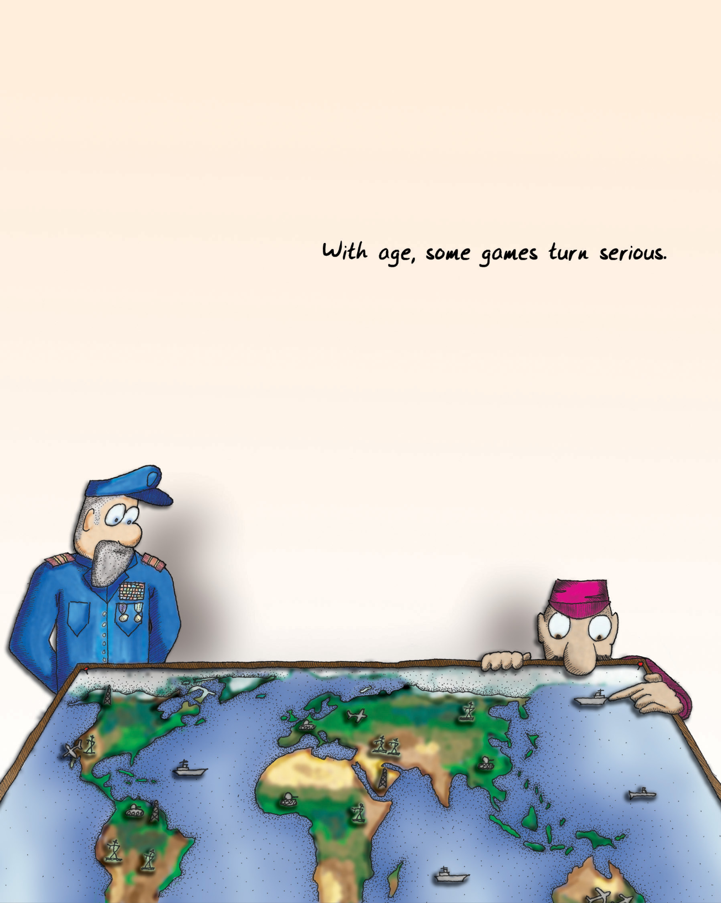

Formal training isn't really required to become a game designer. Most of the game designers working professionally today are self-taught. That is changing rapidly as [university programs for game designers](#user-content-fn-1)[^1] crop up all around the country and the world.

要成为一名游戏设计师，其实并不需要正规的培训。如今，大多数专业从事游戏设计工作的设计师都是自学成才的。这种情况正在迅速改变，因为全国乃至全世界的[游戏设计师大学课程](#user-content-fn-2)[^2]层出不穷。

I went to school to be a writer, mostly. I believe really passionately in the importance of writing and the incredible power of fiction. We learn through stories; we become who we are through stories.

我上学主要是为了成为一名作家。我坚信写作的重要性和小说不可思议的力量。我们通过故事学习；我们通过故事成为我们自己。

My thinking about what fun is led me to similar conclusions about games. I can't deny, however, that stories and games teach really different things, in very different ways. Game systems (as opposed to the visuals and presentation of a given game) don't usually have a moral. They don't usually have a theme in the sense that a novel has a theme.

我对乐趣的思考让我对游戏也得出了类似的结论。然而，我不能否认，故事和游戏以截然不同的方式传授着真正不同的东西。游戏系统（相对于特定游戏的视觉效果和表现形式）通常没有寓意。它们通常不像小说那样有主题。

The population that uses games as learning tools the most effectively is the young. Certainly folks in every generation keep playing games into old age ([pinochle](#user-content-fn-3)[^3], anyone?), but as we get older we view those people more as the exception, though this is changing as digital gaming continues to rise in popularity. Games are viewed as frivolity. In the Bible in [1 Corinthians](#user-content-fn-4)[^4], we are told, "When I was a child, I spoke like a child, I thought like a child, I reasoned like a child; when I became a man, I gave up childish ways." But children speak honestly—sometimes too much so. Their reasoning is far from impaired—it is simply inexperienced. We often assume that games are childish ways, but is that really so?

将游戏作为学习工具最有效的人群是年轻人。当然，每一代人都会一直玩游戏到老年（[皮纳克尔](#user-content-fn-5)[^5]，有人玩吗？），但随着年龄的增长，我们更多地将这些人视为例外，尽管随着数字游戏的不断普及，这种情况正在发生变化。游戏被视为无聊。《圣经》[哥林多前书](#user-content-fn-6)[^6]告诉我们：“我作孩子的时候，说话像孩子，思想像孩子，推理像孩子；及至我作了成人，就弃绝了孩子的事。”但孩子们说话坦诚——有时过于坦诚。他们的推理能力远远没有受损，只是缺乏经验而已。我们常常认为游戏是幼稚的方式，但事实真的如此吗？

> This shouldn't surprise us -- after all, the young of all species play.
> 
> 我们不应该对此感到惊讶——毕竟，所有物种的年轻人都在玩耍。

We don't actually put away the notion of "having fun," as far as I can tell. We migrate it into other contexts. Many claim that work is fun, for example (me included). Just getting together with friends can be enough to give us the little burst of endorphins we crave.

据我所知，我们实际上并没有抛弃“玩得开心”的概念。我们将其迁移到其他语境中。例如，许多人声称工作是一种乐趣（包括我在内）。与朋友相聚就足以让我们获得渴望的内啡肽。

We also don't put aside the notion of constructing abstract models of reality in order to practice with them. We practice our speeches in front of mirrors, run fire drills, go through training programs, and role-play in therapy sessions. There are games all around us. We just don't call them that.

我们也不会抛开构建抽象的现实模型的概念，以便用它们进行练习。我们对着镜子练习演讲，进行消防演习，参加培训项目，在治疗过程中进行角色扮演。游戏就在我们身边。只是我们不这样称呼它们。

As we age, we think that things are more serious and that we must leave frivolous things behind. Is that a value judgment on games or is it a value judgment on the content of a given game? Do we avoid the notion of fun because we view the content of the fire drill as being of greater import?

随着年龄的增长，我们认为事情变得更加严肃，必须抛开无聊的事情。这是对游戏的价值判断，还是对特定游戏内容的价值判断？我们是否因为认为消防演习的内容更重要而回避了趣味的念头？

Most importantly, would fire drills be more effective if they were fun activities? There is a design practice called "gamification" which attempts to use the trappings of games (reward structures, points, etc.) to make people engage more with product offerings. Does it miss the point of games? It is often layered on top of systems that lack the rich interpretability of a good game. A reward structure alone does not a [game make](#user-content-fn-7)[^7].

最重要的是，如果消防演习是有趣的活动，它们会更有效吗？有一种设计实践被称为“游戏化”，它试图利用游戏的外在特征（奖励结构、积分等）让人们更多地参与到产品中来。这种做法是否忽略了游戏的本质？游戏化经常被添加到那些缺乏优质游戏丰富解读性的系统上。单凭奖励结构并不能[构成游戏](#user-content-fn-8)[^8]。

> With age, some games turn serious.
> 
> 随着年龄的增长，有些游戏会变得严肃起来。

If games are essentially models of reality, then the things that games teach us must reflect on reality.

如果游戏本质上是现实的模型，那么游戏教给我们的东西就必须反映现实。

My first thought was that games are models of hypothetical realities, since they often bear no resemblance to any reality I know.

我首先想到的是，游戏是假设现实的模型，因为它们往往与我所知道的任何现实都毫无相似之处。

As I looked deeper, though, I found that even whacked-out abstract games do reflect underlying reality. The guys who told me these games were all about vertices were correct. Since formal rule sets are basically mathematical constructs, they always end up reflecting forms of mathematical truth, at the very least. (Formal rule sets are the basis for most games, but not all—there are classes of [games with informal rule sets](#user-content-fn-9)[^9], but you can bet that little kids will cry "no fair" when someone violates an unstated assumption in their tea party.)

但随着我的深入研究，我发现即使是古怪抽象的游戏也确实反映了潜在的现实。那些告诉我这些游戏都是关于顶点的人是对的。由于形式规则集基本上是数学构造，因此它们最终总会反映出数学真理的形式，至少是这样。(正式规则集是大多数游戏的基础，但并不是所有游戏的基础——有一些[游戏的规则集是非正式的](#user-content-fn-10)[^10]，但你可以放心，当有人在他们的茶话会上违反了一个未说明的假设时，小孩子们一定会大叫“不公平”。）

Sadly, reflecting mathematical structures is also the only thing many games do. The real-life challenges that games prepare us for are almost exclusively ones based on the calculation of odds. They teach us how to predict events. A huge number of games simulate forms of combat. Even games ostensibly about building are usually framed competitively.

可悲的是，反映数学结构也是许多游戏唯一能做的事情。游戏让我们为现实生活中的挑战做好准备，而这些挑战几乎都是基于几率计算的。它们教我们如何预测事件。大量游戏模拟了各种形式的战斗。即使是表面上是关于建设的游戏，通常也是以竞争为框架的。

Given that we're basically [hierarchical and strongly tribal primates](#user-content-fn-11)[^11],  it's not surprising that so many of the basic lessons taught by our early childhood play are about power and status. Think about how important these lessons still are within society, regardless of your particular culture. Games almost always teach us tools for being the top monkey or tribe of monkeys.

鉴于我们基本上是[等级森严且热衷抱团的灵长类动物](#user-content-fn-12)[^12]，很多我们儿时游戏中学到的基本课程都与权力和地位有关也就不足为奇。想想看，无论你的文化背景如何，这些道理在社会中都至关重要。游戏几乎总是教我们如何成为最顶尖的猴子或猴群。

> ...uh...
> 
> ……嗯……
> 
> gratuitous penguin
> 
> 无谓的企鹅
> 
> ...oh well...
> 
> ……好吧……
> 
> The very phrase "it's just a game" implies that playing a game is a form of PRACTICE for a real-life challenge.
> 
> “这只是个游戏”这句话本身就意味着，玩游戏是对现实挑战的一种练习。

[^1]: University programs for game designers: To investigate this more, I urge you to look at the website for the International Game Developers Association and its academic outreach page: [www.igda.org/academia/](www.igda.org/academia/).

[^2]: 针对游戏设计师的大学课程：要进一步了解这方面的情况，我建议你访问国际游戏开发者协会的网站及其学术推广页面：[www.igda.org/academia/](www.igda.org/academia/)。

[^3]: Pinochle: A game of cards. You play with a slightly different deck than the standard 52-card deck used for poker or bridge. Points are scored based on the number of particular combinations of cards (called "melds") that you hold in your hand, which is similar to poker, but you also bid for "trumps" (naming a suit higher ranking than all other suits), similar to bridge.

[^4]: 1 Corinthians: The citation is 1 Corinthians 13:11. The following is from the King James version of the Bible:
`When I was a child, I spake as a child, I understood as a child, I thought as a child: but when I became a man, I put away childish things.
For now we see through a glass, darkly; but then face to face: now I know in part; but then shall I know even as also I am known.
And now abideth faith, hope, charity, these three; but the greatest of these is charity.`

[^5]: 皮纳克尔：一种纸牌游戏。与扑克或桥牌所用的标准 52 张牌略有不同。得分是根据你手中的牌的特定组合（称为“拼牌”）的数量来计算的，这与扑克牌类似，但你也要为“王牌”出价（命名一种比其他花色等级都高的花色），这与桥牌类似。

[^6]: 哥林多前书：引用的是《哥林多前书》13:11。以下内容出自《圣经》詹姆士王版本：
`我作孩子的时候，说话像孩子，心思像孩子，意念像小孩子。既成了人，就把孩子的事丢弃了。
我们如今仿佛对着镜子观看，模糊不清；到那时就要面对面了。我如今所知道的有限，到那时就全知道，如同主知道我一样。
如今常存的有信，有望，有爱；这三样，其中最大的是爱。`

[^7]: Gamification: Two solid critiques of this practice can be found in Margaret Robertson’s blog post on ["pointsification"](http://bit.ly/cant-play-wont-play) and Ian Bogost’s critique ["Gamification is Bullshit,](http://bit.ly/gamification-bogost-atlantic) published in The Atlantic.

[^8]: 游戏化： 玛格丽特·罗伯逊的博客文章[《点数化 》](http://bit.ly/cant-play-wont-play)和伊恩·博格斯特在《大西洋月刊》发表的批评文章[《游戏化是胡扯》](http://bit.ly/gamification-bogost-atlantic)，是对这种做法的两个有力批判。

[^9]: Games with informal rule sets: Many theorists have established a spectrum from "game" to "play." Bruno Bettelheim, the child psychologist, defined forms of play as make-believe (solo or cooperative), joint storytelling, community building, and play with toys. He saw games as team-based, or individual competitions against other people or against self-imposed marker thresholds. Of course, joint storytelling or social tie-building proceed by concrete if unspoken rules. I'd argue that what we tend to think of as "play" or "informal" games may have more rules than the classic definition of game.

[^10]: 具有非正式规则集的游戏：许多理论家建立了一个从“游戏”到“玩耍”的谱系。儿童心理学家布鲁诺·贝特尔海姆把游戏的形式定义为虚构（独自或合作）、共同讲故事、社区建设和玩玩具。他认为游戏是以团队为基础的，或者是个人与他人的竞争，或者是与自我设定的标记阈值的竞争。当然，共同讲故事或建立社会纽带的游戏是根据具体的规则进行的。我认为，我们通常认为的“游戏”或“非正式”游戏可能比游戏的经典定义有更多的规则。

[^11]: Hierarchical and strongly tribal primates: For marvelous insight into the tribal and animalistic nature of human societies, I highly recommend the work of Jared Diamond, particularly The Third Chimpanzee (Harper, 2006) and Guns, Germs, and Steel (W.W. Norton and Company, 1999).

[^12]: 等级森严、部落性极强的灵长类动物：我强烈推荐贾雷德·戴蒙德的作品，尤其是《第三只黑猩猩》（哈珀出版社，2006 年）和《枪炮、病菌和钢铁》（W.W. Norton and Company, 1999 年），其中对人类社会的部落和兽性有深刻的见解。