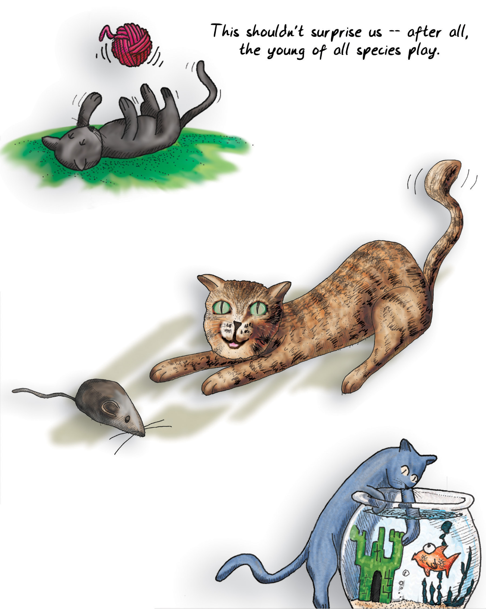

Formal training isn't really required to become a game designer. Most of the game designers working professionally today are self-taught. That is changing rapidly as [university programs for game designers](#user-content-fn-1)[^1] crop up all around the country and the world.

要成为一名游戏设计师，其实并不需要正规的培训。如今，大多数专业从事游戏设计工作的设计师都是自学成才的。这种情况正在迅速改变，因为全国乃至全世界的[游戏设计师大学课程](#user-content-fn-2)[^2]层出不穷。

I went to school to be a writer, mostly. I believe really passionately in the importance of writing and the incredible power of fiction. We learn through stories; we become who we are through stories.

我上学主要是为了成为一名作家。我坚信写作的重要性和小说不可思议的力量。我们通过故事学习；我们通过故事成为我们自己。

My thinking about what fun is led me to similar conclusions about games. I can't deny, however, that stories and games teach really different things, in very different ways. Game systems (as opposed to the visuals and presentation of a given game) don't usually have a moral. They don't usually have a theme in the sense that a novel has a theme.

我对乐趣的思考让我对游戏也得出了类似的结论。然而，我不能否认，故事和游戏以截然不同的方式传授着真正不同的东西。游戏系统（相对于特定游戏的视觉效果和表现形式）通常没有寓意。它们通常不像小说那样有主题。

The population that uses games as learning tools the most effectively is the young. Certainly folks in every generation keep playing games into old age ([pinochle](#user-content-fn-3)[^3], anyone?), but as we get older we view those people more as the exception, though this is changing as digital gaming continues to rise in popularity. Games are viewed as frivolity. In the Bible in [1 Corinthians](#user-content-fn-4)[^4], we are told, "When I was a child, I spoke like a child, I thought like a child, I reasoned like a child; when I became a man, I gave up childish ways." But children speak honestly—sometimes too much so. Their reasoning is far from impaired—it is simply inexperienced. We often assume that games are childish ways, but is that really so?

将游戏作为学习工具最有效的人群是年轻人。当然，每一代人都会一直玩游戏到老年（[皮纳克尔](#user-content-fn-5)[^5]，有人玩吗？），但随着年龄的增长，我们更多地将这些人视为例外，尽管随着数字游戏的不断普及，这种情况正在发生变化。游戏被视为无聊。《圣经》[哥林多前书](#user-content-fn-6)[^6]告诉我们：“我作孩子的时候，说话像孩子，思想像孩子，推理像孩子；及至我作了成人，就弃绝了孩子的事。”但孩子们说话坦诚——有时过于坦诚。他们的推理能力远远没有受损，只是缺乏经验而已。我们常常认为游戏是幼稚的方式，但事实真的如此吗？

> This shouldn't surprise us -- after all, the young of all species play.
> 
> 我们不应该对此感到惊讶——毕竟，所有物种的年轻人都在玩耍。

[^1]: University programs for game designers: To investigate this more, I urge you to look at the website for the International Game Developers Association and its academic outreach page: [www.igda.org/academia/](www.igda.org/academia/).

[^2]: 针对游戏设计师的大学课程：要进一步了解这方面的情况，我建议你访问国际游戏开发者协会的网站及其学术推广页面：[www.igda.org/academia/](www.igda.org/academia/)。

[^3]: Pinochle: A game of cards. You play with a slightly different deck than the standard 52-card deck used for poker or bridge. Points are scored based on the number of particular combinations of cards (called “melds”) that you hold in your hand, which is similar to poker, but you also bid for “trumps” (naming a suit higher ranking than all other suits), similar to bridge.

[^4]: 1 Corinthians: The citation is 1 Corinthians 13:11. The following is from the King James version of the Bible:
`When I was a child, I spake as a child, I understood as a child, I thought as a child: but when I became a man, I put away childish things.
For now we see through a glass, darkly; but then face to face: now I know in part; but then shall I know even as also I am known.
And now abideth faith, hope, charity, these three; but the greatest of these is charity.`

[^5]: 皮纳克尔：一种纸牌游戏。与扑克或桥牌所用的标准 52 张牌略有不同。得分是根据你手中的牌的特定组合（称为“拼牌”）的数量来计算的，这与扑克牌类似，但你也要为“王牌”出价（命名一种比其他花色等级都高的花色），这与桥牌类似。

[^6]: 哥林多前书：引用的是《哥林多前书》13:11。以下内容出自《圣经》詹姆士王版本：`我作孩子的时候，说话像孩子，心思像孩子，意念像小孩子。既成了人，就把孩子的事丢弃了。
我们如今仿佛对着镜子观看，模糊不清；到那时就要面对面了。我如今所知道的有限，到那时就全知道，如同主知道我一样。
如今常存的有信，有望，有爱；这三样，其中最大的是爱。`