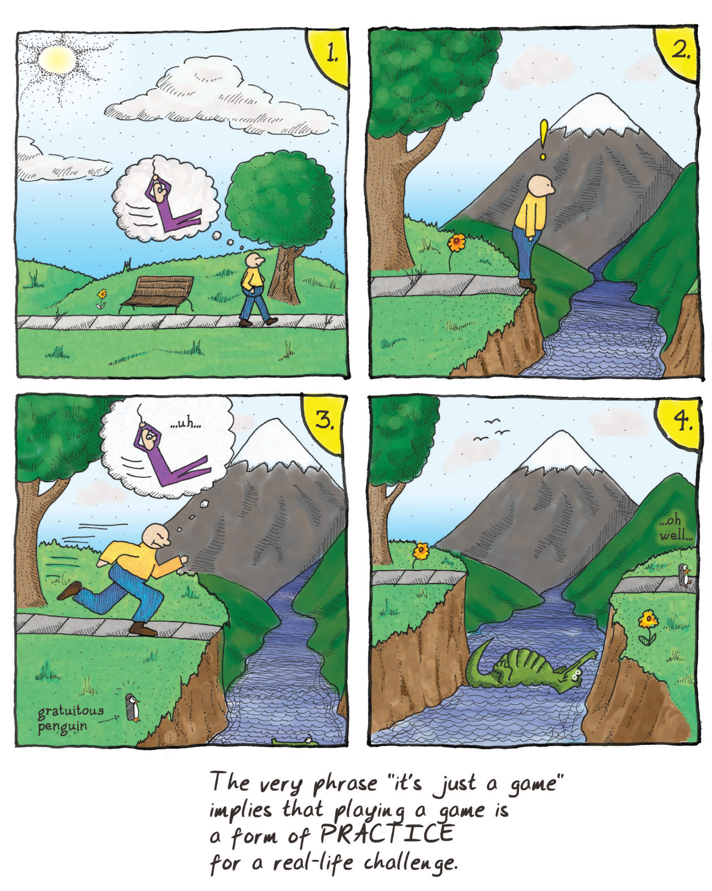
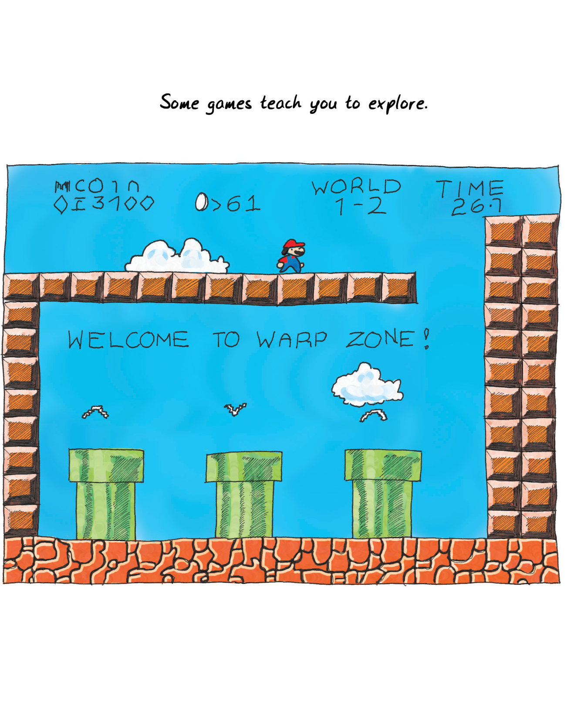

Formal training isn't really required to become a game designer. Most of the game designers working professionally today are self-taught. That is changing rapidly as [university programs for game designers](#user-content-fn-1)[^1] crop up all around the country and the world.

要成为一名游戏设计师，其实并不需要正规的培训。如今，大多数专业从事游戏设计工作的设计师都是自学成才的。这种情况正在迅速改变，因为全国乃至全世界的[游戏设计师大学课程](#user-content-fn-2)[^2]层出不穷。

I went to school to be a writer, mostly. I believe really passionately in the importance of writing and the incredible power of fiction. We learn through stories; we become who we are through stories.

我上学主要是为了成为一名作家。我坚信写作的重要性和小说不可思议的力量。我们通过故事学习；我们通过故事成为我们自己。

My thinking about what fun is led me to similar conclusions about games. I can't deny, however, that stories and games teach really different things, in very different ways. Game systems (as opposed to the visuals and presentation of a given game) don't usually have a moral. They don't usually have a theme in the sense that a novel has a theme.

我对乐趣的思考让我对游戏也得出了类似的结论。然而，我不能否认，故事和游戏以截然不同的方式传授着真正不同的东西。游戏系统（相对于特定游戏的视觉效果和表现形式）通常没有寓意。它们通常不像小说那样有主题。

The population that uses games as learning tools the most effectively is the young. Certainly folks in every generation keep playing games into old age ([pinochle](#user-content-fn-3)[^3], anyone?), but as we get older we view those people more as the exception, though this is changing as digital gaming continues to rise in popularity. Games are viewed as frivolity. In the Bible in [1 Corinthians](#user-content-fn-4)[^4], we are told, "When I was a child, I spoke like a child, I thought like a child, I reasoned like a child; when I became a man, I gave up childish ways." But children speak honestly—sometimes too much so. Their reasoning is far from impaired—it is simply inexperienced. We often assume that games are childish ways, but is that really so?

将游戏作为学习工具最有效的人群是年轻人。当然，每一代人都会一直玩游戏到老年（[皮纳克尔](#user-content-fn-5)[^5]，有人玩吗？），但随着年龄的增长，我们更多地将这些人视为例外，尽管随着数字游戏的不断普及，这种情况正在发生变化。游戏被视为无聊。《圣经》[哥林多前书](#user-content-fn-6)[^6]告诉我们：“我作孩子的时候，说话像孩子，思想像孩子，推理像孩子；及至我作了成人，就弃绝了孩子的事。”但孩子们说话坦诚——有时过于坦诚。他们的推理能力远远没有受损，只是缺乏经验而已。我们常常认为游戏是幼稚的方式，但事实真的如此吗？

> This shouldn't surprise us -- after all, the young of all species play.
> 
> 我们不应该对此感到惊讶——毕竟，所有物种的年轻人都在玩耍。

We don't actually put away the notion of "having fun," as far as I can tell. We migrate it into other contexts. Many claim that work is fun, for example (me included). Just getting together with friends can be enough to give us the little burst of endorphins we crave.

据我所知，我们实际上并没有抛弃“玩得开心”的概念。我们将其迁移到其他语境中。例如，许多人声称工作是一种乐趣（包括我在内）。与朋友相聚就足以让我们获得渴望的内啡肽。

We also don't put aside the notion of constructing abstract models of reality in order to practice with them. We practice our speeches in front of mirrors, run fire drills, go through training programs, and role-play in therapy sessions. There are games all around us. We just don't call them that.

我们也不会抛开构建抽象的现实模型的概念，以便用它们进行练习。我们对着镜子练习演讲，进行消防演习，参加培训项目，在治疗过程中进行角色扮演。游戏就在我们身边。只是我们不这样称呼它们。

As we age, we think that things are more serious and that we must leave frivolous things behind. Is that a value judgment on games or is it a value judgment on the content of a given game? Do we avoid the notion of fun because we view the content of the fire drill as being of greater import?

随着年龄的增长，我们认为事情变得更加严肃，必须抛开无聊的事情。这是对游戏的价值判断，还是对特定游戏内容的价值判断？我们是否因为认为消防演习的内容更重要而回避了趣味的念头？

Most importantly, would fire drills be more effective if they were fun activities? There is a design practice called "gamification" which attempts to use the trappings of games (reward structures, points, etc.) to make people engage more with product offerings. Does it miss the point of games? It is often layered on top of systems that lack the rich interpretability of a good game. A reward structure alone does not a [game make](#user-content-fn-7)[^7].

最重要的是，如果消防演习是有趣的活动，它们会更有效吗？有一种设计实践被称为“游戏化”，它试图利用游戏的外在特征（奖励结构、积分等）让人们更多地参与到产品中来。这种做法是否忽略了游戏的本质？游戏化经常被添加到那些缺乏优质游戏丰富解读性的系统上。单凭奖励结构并不能[构成游戏](#user-content-fn-8)[^8]。

> With age, some games turn serious.
> 
> 随着年龄的增长，有些游戏会变得严肃起来。

If games are essentially models of reality, then the things that games teach us must reflect on reality.

如果游戏本质上是现实的模型，那么游戏教给我们的东西就必须反映现实。

My first thought was that games are models of hypothetical realities, since they often bear no resemblance to any reality I know.

我首先想到的是，游戏是假设现实的模型，因为它们往往与我所知道的任何现实都毫无相似之处。

As I looked deeper, though, I found that even whacked-out abstract games do reflect underlying reality. The guys who told me these games were all about vertices were correct. Since formal rule sets are basically mathematical constructs, they always end up reflecting forms of mathematical truth, at the very least. (Formal rule sets are the basis for most games, but not all—there are classes of [games with informal rule sets](#user-content-fn-9)[^9], but you can bet that little kids will cry "no fair" when someone violates an unstated assumption in their tea party.)

但随着我的深入研究，我发现即使是古怪抽象的游戏也确实反映了潜在的现实。那些告诉我这些游戏都是关于顶点的人是对的。由于形式规则集基本上是数学构造，因此它们最终总会反映出数学真理的形式，至少是这样。(正式规则集是大多数游戏的基础，但并不是所有游戏的基础——有一些[游戏的规则集是非正式的](#user-content-fn-10)[^10]，但你可以放心，当有人在他们的茶话会上违反了一个未说明的假设时，小孩子们一定会大叫“不公平”。）

Sadly, reflecting mathematical structures is also the only thing many games do. The real-life challenges that games prepare us for are almost exclusively ones based on the calculation of odds. They teach us how to predict events. A huge number of games simulate forms of combat. Even games ostensibly about building are usually framed competitively.

可悲的是，反映数学结构也是许多游戏唯一能做的事情。游戏让我们为现实生活中的挑战做好准备，而这些挑战几乎都是基于几率计算的。它们教我们如何预测事件。大量游戏模拟了各种形式的战斗。即使是表面上是关于建设的游戏，通常也是以竞争为框架的。

Given that we're basically [hierarchical and strongly tribal primates](#user-content-fn-11)[^11],  it's not surprising that so many of the basic lessons taught by our early childhood play are about power and status. Think about how important these lessons still are within society, regardless of your particular culture. Games almost always teach us tools for being the top monkey or tribe of monkeys.

鉴于我们基本上是[等级森严且热衷抱团的灵长类动物](#user-content-fn-12)[^12]，很多我们儿时游戏中学到的基本课程都与权力和地位有关也就不足为奇。想想看，无论你的文化背景如何，这些课程在社会中都至关重要。游戏几乎总是教我们如何成为最顶尖的猴子或猴群。

> ...uh...
> 
> ……嗯……
> 
> gratuitous penguin
> 
> 无谓的企鹅
> 
> ...oh well...
> 
> ……好吧……
> 
> The very phrase "it's just a game" implies that playing a game is a form of PRACTICE for a real-life challenge.
> 
> “这只是个游戏”这句话本身就意味着，玩游戏是对现实挑战的一种练习。

Games also teach us how to [examine the environment, or space, around us](#user-content-fn-13)[^13]. From games where we fit together odd shapes to games where we learn to see the invisible lines of power projection across a grid, much effort is spent in teaching us about territory. That is what tic-tac-toe is essentially all about.

游戏还教会我们如何[审视周围的环境或空间](#user-content-fn-14)[^14]。从拼凑奇形怪状的游戏，到让我们学会看清权力投射的无形线条的游戏，都在教我们认识领地方面花费了大量精力。这也是井字游戏的本质所在。

Spatial relationships are, of course, critically important to us. Some animals might be able to navigate the world using the Earth's magnetic field, but not us. Instead, we use maps and we use them to map all sorts of things, not just space. Learning to interpret symbols on a map, assess distance, assess risk, and remember caches must have been a critically important survival skill when we were nomadic tribesmen. Most games incorporate some element of spatial reasoning. The space may be a [Cartesian coordinate space](#user-content-fn-15)[^15], like what we see on a soccer field, or it may be a [directed graph](#user-content-fn-16)[^16] like we see in "racetrack" board games. Mathematicians might even point out that something like [a tennis court could be both](#user-content-fn-17)[^17] at the same time. Classifying, collating, and exercising power over the contents of a space is one of the fundamental lessons of all kinds of gameplay.

当然，空间关系对我们来说至关重要。有些动物也许可以利用地球磁场来导航，但我们不行。相反，我们使用地图，而且我们用地图来描绘各种事物，而不仅仅是空间。当我们还是游牧部落的人时，学会解释地图上的符号、评估距离、评估风险和记住藏匿地点一定是一项极其重要的生存技能。大多数游戏都包含一些空间推理元素。空间可能是[笛卡尔坐标空间](#user-content-fn-18)[^18]，就像我们在足球场上看到的那样；也可能是[有向图](#user-content-fn-19)[^19]，就像我们在“赛道”棋类游戏中看到的那样。数学家甚至会指出，像网球场这样的东西可以同时是这[两种空间](#user-content-fn-20)[^20]。对空间内容进行分类、整理和行使权力，是各种游戏的基本课程之一。

Examining space also fits into our nature as toolmakers. We learn how things [fit together](#user-content-fn-21)[^21]. We often abstract this a lot—we play games where things fit together not only physically, but [conceptually](#user-content-fn-22)[^22] as well. We map things like temperature. We map social relationships (as graphs of edges and vertices, in fact). We map things over time. By playing [games of classification and taxonomy](#user-content-fn-23)[^23], we extend mental maps of relationships between objects. With these maps, we can extrapolate behaviors of these objects.

研究空间也符合我们作为工具制造者的天性。我们学习如何将[事物组合](#user-content-fn-24)[^24]在一起。我们经常把这一点抽象化——在我们玩的游戏中，事物不仅是物理上的组合，也是[概念上的组合](#user-content-fn-25)[^25]。我们将温度等事物绘制成图。我们绘制社会关系图（实际上是边和顶点的图）。我们绘制事物的时间图。通过[玩分类游戏](#user-content-fn-26)[^26]，我们扩展了物体间关系的心理地图。有了这些地图，我们就能推断出这些物体的行为。

> Some games teach spatial relationships.
> 
> 有些游戏教你空间关系。

Exploring conceptual spaces is critical to our success in life. Merely understanding a space and how the rules make it work isn't enough, though. We also need to understand how it will react to change to exercise power over it. This is why games progress over time. There are almost no games that take just [one turn](#user-content-fn-27)[^27].

探索概念空间是我们人生成功的关键。不过，仅仅了解一个空间以及它的运行规则还不够。我们还需要了解它对变化的反应，才能对它行使权力。这就是为什么游戏会随着时间的推移而进步。几乎没有游戏是只进行[一轮](#user-content-fn-28)[^28]的。

Let's consider "games of chance" that use a six-sided die. Here we have a possibility space—values labeled 1 through 6. If you roll dice against someone, the game you are playing might seem to end very quickly. You also might feel you don't have much control over the outcome. You might think an activity like this shouldn't be called a game. It certainly seems like a game you can play in one turn.

让我们考虑一下使用六面骰子的“机会游戏”。这里我们有一个可能性空间——标有 1 到 6 的数值。如果你和别人掷骰子，你所玩的游戏似乎很快就会结束。你也可能会觉得自己无法控制结果。你可能会认为这样的活动不应该叫做游戏。当然，这似乎是一个你可以一局玩完的游戏。

But I suggest gambling games like this are actually designed to teach us about odds. You usually don't just play for one turn, and with each turn you try to learn more about how odds work. (Unfortunately, you often prove you didn't learn the lesson—especially if you are [gambling for money](#user-content-fn-29)[^29].) We know from experiments that probability is something our brains have serious trouble grasping.

但我认为，这样的赌博游戏实际上是为了让我们了解赔率而设计的。你通常不会只玩一局，每一局你都会试图了解更多关于赔率如何运作的知识。(不幸的是，你往往会证明自己并没有学到这门课——尤其是如果你是[为了钱而赌博](#user-content-fn-30)[^30]的话。) 我们从实验中得知，概率是我们大脑很难掌握的东西。

Exploring a possibility space is the only way to learn about it. Most games repeatedly throw evolving spaces at you so that you can explore the recurrence of symbols within them. A modern video game will give you tools to navigate a complicated space, and when you finish, the game will give you another space, and another, and another.

探索可能性空间是了解它的唯一途径。大多数游戏都会反复向你抛出不断演变的空间，让你探索其中符号的反复出现。现代电子游戏会给你一些工具来浏览一个复杂的空间，当你完成后，游戏会给你另一个空间，再一个，再一个。

Some of the really important parts of exploration involve memory. A huge number of games involve recalling and managing very long and complex chains of information. (Think about counting cards in [blackjack](#user-content-fn-31)[^31] or playing competitive [dominoes](#user-content-fn-32)[^32].) Many games involve thoroughly exploring the possibility space as part of their victory condition.

一些真正重要的探索部分涉及记忆。大量的游戏都需要回忆和管理很长很复杂的信息链。(想想[二十一点](#user-content-fn-33)[^33]中的算牌或玩竞技性[多米诺骨牌](#user-content-fn-34)[^34]）许多游戏的胜利条件之一就是彻底探索可能性空间。

> Some games teach you to explore.
> 
> WELCOME TO WARP ZONE!
> 
> 有些游戏教你探索。
> 
> 欢迎来到传送区！

In the end, most games have something to do with power. Even the innocuous games of childhood tend to have violence lurking in their heart of hearts. Playing "house" is about jockeying for social status. It is richly multileveled, as kids position themselves in authority (or not) over other kids. They play-act at using the authority that their parents exercise over them. (There's this idealized picture of [young girls](#user-content-fn-35)[^35] as being all sweetness and light, but there are few more viciously status-driven groups on earth.)

归根结底，大多数游戏都与权力有关。即使是童年时无害的游戏，在它的核心深处也往往潜藏着暴力。玩“过家家”游戏是为了争夺社会地位。它具有丰富的多层次性，因为孩子们把自己放在其他孩子的权威之上（或者之下）。他们扮演模仿使用父母对他们行使的权威。(有一种理想化的印象，认为[年轻女孩](#user-content-fn-36)[^36]都是甜美可人的，但世界上很少有比它更激烈地追求地位的群体。）

Consider the games that get all the attention lately: [shooters](#user-content-fn-37)[^37], [fighting games](#user-content-fn-38)[^38], and war games. They are not subtle about their love of power. The gap between these games and cops and robbers is small as far as the players are concerned. They are all about reaction times, tactical awareness, assessing the weaknesses of an opponent, and judging when to strike. Just as my playing guitar was in fact preparing me for playing mandolin by teaching me skills beyond basic guitar fretting, these games teach many skills that are relevant in a corporate setting. It is easy to pay attention to the obvious nature of a particular game and miss the subtler point; be it cops and robbers or [CounterStrike](#user-content-fn-39)[^39], the real lessons are about teamwork and not about aiming. In fact, the [training provided by shooting a virtual gun](#user-content-fn-40)[^40] is worse than useless in teaching you how to shoot a real one.

看看最近备受关注的游戏：[射击游戏](#user-content-fn-41)[^41]、[格斗游戏](#user-content-fn-42)[^42]、战争游戏。它们对权力的热爱毫不掩饰。就玩家而言，这些游戏与警察抓小偷之间的差距很小。他们玩的都是反应速度、战术意识、评估对手的弱点以及判断何时出手。就像我弹吉他实际上是在为弹曼陀林做准备，因为我学到了吉他基本指法以外的技能，这些游戏也教给我许多与公司环境相关的技能。人们很容易只注意到某款游戏的明显性质，而忽略了更微妙的一点；无论是《警察抓强盗》还是[《反恐精英》](#user-content-fn-43)[^43]，真正的课程都是关于团队合作，而不是瞄准。事实上，[通过射击虚拟枪支所提供的训练](#user-content-fn-44)[^44]，在教你如何射击真枪方面毫无用处。

Think about it: teamwork is a far deadlier tool than sharpshooting.

想想看：团队合作是比神枪手更致命的工具。

> Some games teach you how to aim precisely.
> 
> 有些游戏会教你如何精确瞄准。

Many games, particularly those that have evolved into the classic Olympian sports, can be directly traced back to the needs of primitive humans to survive under very difficult conditions. Many things we have fun doing are in fact training us to be better cavemen. We learn skills that are antiquated. Most folks never need to shoot something with an arrow to eat, and nowadays we run marathons or other long races mostly to raise funds for charities.

许多游戏，特别是那些演变成经典奥林匹克运动的游戏，可以直接追溯到原始人类在非常困难的条件下生存的需要。我们所做的许多有趣的事情实际上是在训练我们成为更好的穴居人。我们学习的是过时的技能。大多数人从来不需要箭射抓东西吃，如今，我们参加马拉松或其他长跑比赛，主要是为了给慈善机构筹款。

Many games have become obsolete and are no longer played. During World War II, there were [games about rationing supplies](#user-content-fn-45)[^45].

许多游戏已经过时，不再玩了。在第二次世界大战期间，有一些[关于物资配给的游戏](#user-content-fn-46)[^46]。

Nonetheless, we have fun mostly to improve our life skills. And while there may be something deep in our reptile brains that wants us to continue practicing aiming or sentry-posting, we do in fact evolve games that are more suited to our modern lives.

尽管如此，我们享受乐趣主要是为了提升我们的生存技能。而且，尽管我们大脑深处可能有一种原始的本能，驱使我们不断练习瞄准或站岗，但我们确实发展出了更适合现代生活的游戏。

> From cops and robbers to playing house, play trains skills that provide an evolutionary advantage...
> 
> 从“警察抓小偷“到”过家家“，游戏训练的技能为进化提供了优势……

For example, there are many games in my collection that relate to large-scale network building. Building railway lines or aqueducts wasn't exactly a caveman activity. As humans have evolved, we've changed around our games. In early versions of chess, [queens](#user-content-fn-47)[^47] weren't nearly as powerful a piece as they are today.

例如，我收藏的许多游戏都与大型网络建设有关。建造铁路或沟渠并不是穴居人的活动。随着人类的进化，我们的游戏也发生了变化。在早期的国际象棋中，[皇后](#user-content-fn-48)[^48]并不像今天这样强大。

Farming used to be a much bigger part of the typical person's life than it is in industrialized societies. In the ancient [mancala](#user-content-fn-49)[^49] family of games, players "sow seeds," and rotate them through "houses." In some variants, you are not supposed to leave your opponent without any seeds.

与工业化社会相比，农耕曾经是普通人生活中更重要的一部分。在古老的[《曼卡拉》](#user-content-fn-50)[^50]游戏家族中，玩家“播种种子”，并在“房子”之间轮流播种。在某些变体中，你不应该让对手没有任何种子。

For a long time, we had few new games about farming, perhaps because there was no need to model an activity that one participated in every day. When they did return in force in the form of casual online games, they were really games about running a business, not about crop rotation and cooperation. Today's [farming games](#user-content-fn-51)[^51] won't actually help you feed yourself from crops.

长期以来，我们很少有关于农耕的新游戏，也许是因为没有必要模拟一项人们每天都要参与的活动。当它们以休闲在线游戏的形式重新强势回归时，它们实际上是关于经营的游戏，而不是关于作物轮作和合作的游戏。如今的[农耕游戏](#user-content-fn-52)[^52]实际上不会帮助你用农作物养活自己。

In general, the level of mathematical sophistication required by games has risen dramatically over the course of human history, as common people learned how to do sums. Word games were once restricted to the elite, but today they are enjoyed by the masses.

一般来说，随着普通人学会算术，游戏所要求的数学复杂程度在人类历史进程中大幅提高。文字游戏曾经仅限于精英阶层，但如今大众都喜欢玩。

Games do adapt, but perhaps not as fast as we might wish, since almost all of these games are still, at their core, about the same activities even though they may involve different skill sets: resource allocation, force projection, territory control, and so on.

游戏确实在适应环境，但也许并没有我们希望的那么快，因为几乎所有这些游戏的核心仍然是相同的活动，尽管它们可能涉及不同的技能组合：资源分配、武力投射、领土控制等等。

> Some of which might be useful in modern life, and some of which might not.
> 
> 其中有些在现代生活中可能有用，有些可能没用。
> 
> ...uh...mom?...
> 
> ……呃……妈？……

In some ways games can be compared to music (which is even more mathematically driven). Music excels at conveying a few things—emotion being paramount among them—but as a medium, is not very good at conveying things outside of its "sweet spot." Games also seem to have a sweet spot. They do very well at active verbs: controlling, projecting, surrounding, matching, remembering, counting, and so on. Games are also very good at quantification.

在某些方面，游戏可以与音乐相提并论（音乐的数学驱动力更强）。音乐擅长传达一些东西——情感是其中最重要的，但作为一种媒介，它并不擅长传达其“甜蜜点”之外的东西。游戏似乎也有一个“甜蜜点”。它们在主动动词方面表现出色：控制、投射、环绕、匹配、记忆、计数等等。游戏还非常擅长量化。

By contrast, literature can tackle all of the above and more. Over time, language-based media have tackled increasingly broader subjects. Are game systems simply more limited than literature, like music is?

相比之下，文学作品可以解决上述所有问题，甚至更多。随着时间的推移，以语言为基础的媒体所涉及的主题越来越广泛。难道游戏系统就像音乐一样，比文学作品更有局限性吗？

Pure systems probably cannot convey the same breadth of content that literature can. That said, games are capable of modeling situations of greater richness and complexity than many assume. Games like [Diplomacy](#user-content-fn-53)[^53] are evidence that remarkably subtle interactions can be modeled within the confines of a rule set, and traditional [role-playing](#user-content-fn-54)[^54]  can reach the same heights as literature in the right hands. But it is an uphill battle for the medium nonetheless, simply because games, at their core, are about teaching us survival skills. As we all know, when you're worried about subsistence and survival, more refined things tend to fall by the wayside.

纯粹的系统可能无法像文学作品那样传达广泛的内容。尽管如此，游戏还是能够模拟比许多人想象的更加丰富和复杂的情况。像[《外交》](#user-content-fn-55)[^55]这样的游戏就证明，在规则设定的范围内，可以模拟出非常微妙的互动，而传统的[角色扮演](#user-content-fn-56)[^56]游戏在合适的人手中也可以达到与文学作品同样的高度。* 但是，对于游戏媒介来说，这是一场艰苦的战斗，因为游戏的核心是教会我们生存技能。众所周知，当你为温饱和生存发愁时，更高雅的东西往往会被抛到一边。

Of course, games are a "compound" medium, and can have stories, artwork, and music all working alongside the game system. And at that point, games can have an incredible expressive breadth, with potential that has not yet been fulfilled.

当然，游戏是一种“复合”媒体，可以有故事、艺术作品和音乐与游戏系统并行不悖。在这一点上，游戏的表现力可以达到令人难以置信的广度，其潜力尚未得到发挥。 

> timing
> 
> 时机
> 
> hunting
> 
> 狩猎
> 
> 3...
> 2...
> 1...
> ollie
> ollie
> oxen
> free!
> ...
> or
> whatever...
> 
> 3……
> 2……
> 1……
> ……
> 都出来吧
> …… 
> 随便吧……
> 
> ollie ollie oxen free是捉迷藏的用语，大意是：躲藏的玩家可以出来露面而不会被抓住。
> 
> atari!
> 
> 叫吃！（围棋用语）
> 
> territory
> 
> 领地
> 
> aiming
> 
> 瞄准
> 
> projecting power
> 
> 投射权力
> 
> When you get right down to it, most games are teaching us about only a few things,
> 
> 说到底，大多数游戏只教我们几件事，

[^1]: University programs for game designers: To investigate this more, I urge you to look at the website for the International Game Developers Association and its academic outreach [page](www.igda.org/academia/).

[^2]: 针对游戏设计师的大学课程：要进一步了解这方面的情况，我建议你访问国际游戏开发者协会的网站及其学术推广[页面](www.igda.org/academia/)。

[^3]: Pinochle: A game of cards. You play with a slightly different deck than the standard 52-card deck used for poker or bridge. Points are scored based on the number of particular combinations of cards (called "melds") that you hold in your hand, which is similar to poker, but you also bid for "trumps" (naming a suit higher ranking than all other suits), similar to bridge.

[^4]: 1 Corinthians: The citation is 1 Corinthians 13:11. The following is from the King James version of the Bible:
`When I was a child, I spake as a child, I understood as a child, I thought as a child: but when I became a man, I put away childish things.
For now we see through a glass, darkly; but then face to face: now I know in part; but then shall I know even as also I am known.
And now abideth faith, hope, charity, these three; but the greatest of these is charity.`

[^5]: 皮纳克尔：一种纸牌游戏。与扑克或桥牌所用的标准 52 张牌略有不同。得分是根据你手中的牌的特定组合（称为“拼牌”）的数量来计算的，这与扑克牌类似，但你也要为“王牌”出价（命名一种比其他花色等级都高的花色），这与桥牌类似。

[^6]: 哥林多前书：引用的是《哥林多前书》13:11。以下内容出自《圣经》詹姆士王版本：
`我作孩子的时候，说话像孩子，心思像孩子，意念像小孩子。既成了人，就把孩子的事丢弃了。
我们如今仿佛对着镜子观看，模糊不清；到那时就要面对面了。我如今所知道的有限，到那时就全知道，如同主知道我一样。
如今常存的有信，有望，有爱；这三样，其中最大的是爱。`

[^7]: Gamification: Two solid critiques of this practice can be found in Margaret Robertson's blog post on ["pointsification"](http://bit.ly/cant-play-wont-play) and Ian Bogost's critique ["Gamification is Bullshit,](https://www.theatlantic.com/technology/archive/2011/08/gamification-is-bullshit/243338/) published in The Atlantic.

[^8]: 游戏化：玛格丽特·罗伯逊的博客文章[《点数化 》](http://bit.ly/cant-play-wont-play)和伊恩·博格斯特在《大西洋月刊》发表的批评文章[《游戏化是胡扯》](http://bit.ly/gamification-bogost-atlantic)，是对这种做法的两个有力批判。

[^9]: Games with informal rule sets: Many theorists have established a spectrum from "game" to "play." Bruno Bettelheim, the child psychologist, defined forms of play as make-believe (solo or cooperative), joint storytelling, community building, and play with toys. He saw games as team-based, or individual competitions against other people or against self-imposed marker thresholds. Of course, joint storytelling or social tie-building proceed by concrete if unspoken rules. I'd argue that what we tend to think of as "play" or "informal" games may have more rules than the classic definition of game.

[^10]: 具有非正式规则集的游戏：许多理论家建立了一个从“游戏”到“玩耍”的谱系。儿童心理学家布鲁诺·贝特尔海姆把游戏的形式定义为虚构（独自或合作）、共同讲故事、社区建设和玩玩具。他认为游戏是以团队为基础的，或者是个人与他人的竞争，或者是与自我设定的标记阈值的竞争。当然，共同讲故事或建立社会纽带的游戏是根据具体的规则进行的。我认为，我们通常认为的“游戏”或“非正式”游戏可能比游戏的经典定义有更多的规则。

[^11]: Hierarchical and strongly tribal primates: For marvelous insight into the tribal and animalistic nature of human societies, I highly recommend the work of Jared Diamond, particularly The Third Chimpanzee (Harper, 2006) and Guns, Germs, and Steel (W.W. Norton and Company, 1999).

[^12]: 等级森严且热衷抱团的灵长类动物：我强烈推荐贾雷德·戴蒙德的作品，尤其是《第三只黑猩猩》（哈珀出版社，2006 年）和《枪炮、病菌和钢铁》（W.W. Norton and Company, 1999 年），其中对人类社会的部落和兽性有深刻的见解。

[^13]: Examining the space around us: A lot of games can be treated as problems in graph theory—and this is where those guys saying that the game was all vertices were right. These were people who had essentially "leveled up" in how they viewed space; they were practiced enough in territory problems that they were able to abstract any given territory game into a graph and discern patterns that I, stuck in my perception of it, was unable to see.

[^14]: 审视我们周围的空间：很多游戏都可以被视为图论中的问题——这也是那些说游戏都是顶点的人说对了的地方。这些人在看待空间方面基本上已经“升级”了；他们在领地问题上已经练得足够好，能够将任何给定的领地游戏抽象成图形，并找出我无法看到的模式，而我却还停留在对它的认知上。

[^15]: Cartesian coordinate space: This is the classic method, developed by René Descartes, of locating a point in 2-D space on a grid defined by two orthogonal axes. It serves as the basis of much of algebra (as well as most of computer graphics). This tends to be our default assumption for how space is "shaped," but within graph theory many other types of spaces are possible.

[^16]: Directed graph: A directed graph is one where you have points or nodes connected by lines (vertices and edges, in mathematics lingo) but the lines have direction. Think of the classic children's board game Chutes and Ladders; the chutes and ladders on the board are directed links between points on the board. You can only move one way on a chute. It is a game that does not use Cartesian space; the shortest distances between points have nothing to do with the physical distances on the board, but rather with the number of moves it takes to get to a given spot. All of the "track" games such as Monopoly are in effect directed graphs.

[^17]: A tennis court could be both: Tennis has two separate spaces divided by a net, and can therefore be looked at either way. Were we to graph it using nodes, we might say that there are four nodes: two halves of the court, and the out of bounds area at each extreme. The game is about getting the ball from your node to the out of bounds area on the opposite side. But of course, it is also a game played in a traditional coordinate space. Player position within a node is actually where most of the strategy lies.

[^18]: 笛卡尔坐标空间：这是由勒内·笛卡尔提出的经典方法，即在两个正交轴所定义的网格上确定二维空间中某一点的位置。它是大部分代数（以及大部分计算机制图）的基础。这往往是我们对空间如何“成形”的默认假设，但在图论中，还有许多其他类型的空间是可能的。

[^19]: 有向图：有向图是指点或节点由线（数学术语为顶点和边）连接，但线是有方向的。想想经典的儿童棋盘游戏“滑梯和梯子”：棋盘上的滑梯和梯子是棋盘上各点之间的有向连接。在滑梯上只能单向移动。这是一个不使用笛卡尔空间的游戏；点与点之间的最短距离与棋盘上的物理距离无关，而是与到达指定地点所需的移动次数有关。所有的“轨道”游戏，如大富翁，实际上都是有向图。

[^20]: 网球场可以两者兼而有之：网球场有两个独立的空间，由球网分割开来，因此可以从任意一个方面来看。如果用节点来表示，我们可以说有四个节点：两个半场和两端的出界区。比赛就是要把球从你的节点打到对面的出界区。当然，这也是一场在传统坐标空间中进行的比赛。球员在节点内的位置实际上是大部分策略的所在。

[^21]: Games where things fit together physically: My favorites include Tetris, [Blokus](https://en.wikipedia.org/wiki/Blokus), and [Rumis](https://en.wikipedia.org/wiki/Rumis).

[^22]: Games where things fit together conceptually: Poker is probably the most obvious example, but many card games work this way, as do many tile-laying games such as [Carcassonne](https://en.wikipedia.org/wiki/Carcassonne_(board_game)).

[^23]: Games of classification or taxonomy: Card games such as [Uno](https://en.wikipedia.org/wiki/Uno_(card_game)) and [Go Fish!](https://en.wikipedia.org/wiki/Go_Fish), and even memory games, rely on classifying things into sets.

[^24]: 在物理意义上进行组合的游戏：我最喜欢的游戏包括俄罗斯方块、[Blokus](https://en.wikipedia.org/wiki/Blokus) 和 [Rumis](https://en.wikipedia.org/wiki/Rumis)。

[^25]: 在概念上进行组合的游戏：扑克可能是最明显的例子，但许多纸牌游戏都是如此，许多铺瓷砖游戏（如[卡卡颂](https://en.wikipedia.org/wiki/Carcassonne_(board_game))）也是如此。

[^26]: 分类游戏：[Uno](https://en.wikipedia.org/wiki/Uno_(card_game)) 和 [Go Fish!](https://en.wikipedia.org/wiki/Go_Fish) 等纸牌游戏，甚至是记忆游戏，都依赖于将事物分类成套。

[^27]: Games that take one turn: We might think of ro-sham-bo when used as a decision-making tool (“Let's do rock-paper-scissors to see who pays the bill.”), or the mathematical game of [Nomic](http://en.wikipedia.org/wiki/Nomic), or the parodic “non-game” of [Mornington Crescent](https://en.wikipedia.org/wiki/Mornington_Crescent_(game)) from the UK.

[^28]: 一局定胜负的游戏：我们可能会想到用剪刀石头布作为决策工具（“我们来玩剪刀石头布，看谁买单”），或者数学游戏 [Nomic](http://en.wikipedia.org/wiki/Nomic)，或者英国的讽刺性“非游戏” [Mornington Crescent](https://en.wikipedia.org/wiki/Mornington_Crescent_(game))。

[^29]: You didn't learn the lesson (games of chance): Some wags have called gambling "a tax on the math-impaired." Probability is one of those areas where the human mind just seems to have trouble. The classic example is the repeated coin toss—there are only two possibilities, heads or tails. If you throw a coin and it lands on heads seven times in a row, what are the odds that it will land on tails next? The answer is still 50 percent because of how the question is phrased. If you ask, "What are the odds that eight consecutive throws will land on heads?" the answer is very different (1 in 28). Playing on this weakness has been a classic tool of marketers and con men. Unfortunately, this inherent inability to properly assess probability leads our brain to treat it as a "richly interpretable" situation, resulting in positive feedback for gambling even though the house always wins in the long run.

[^30]: 你没有学到课程（机会游戏）：有些人把赌博称为“对数学障碍者的征税”。概率是人类思维似乎有问题的领域之一。最典型的例子就是反复抛掷硬币——只有两种可能，正面或反面。如果你扔硬币，连续七次都是正面，那么下一次是反面的概率是多少？答案仍然是 50%，因为问题的措辞是这样的。如果你问：“连续八次掷出正面的概率是多少？”答案就大不相同了（1/28）。利用这一弱点一直是营销人员和骗子的经典手段。不幸的是，这种天生无法正确评估概率的情况导致我们的大脑将其视为一种“可解释性很强”的情况，从而为赌博带来正反馈，尽管从长远来看，庄家总是赢家。

[^31]: Blackjack card counting: Card counting is based on rough statistical analysis to determine what the odds are of receiving a card of the right value next. This is possible because the game is played with a finite deck of known configuration. A detailed explanation of card counting methods can be found at [here](http://en.wikipedia.org/wiki/Card_counting).

[^32]: Dominoes: Because a line of dominoes can only fork when a "double" is played (a domino with the same value on both squares), you can count how many times a given value has been played, and how many are likely to be in players’ hands, in order to determine whether it will be possible to play a given number in the future. Assuming the other players are playing optimally to remove the highest-value dominoes from their hand, you can determine which particular dominoes they are likely to have in their hands based on what play choices they make.

[^33]: 二十一点算牌：算牌是基于粗略的统计分析来确定接下来得到一张合适数值的牌的几率。之所以能做到这一点，是因为游戏使用的是有限且已知配置的牌组。有关算牌方法的详细解释，请访问[这里](http://en.wikipedia.org/wiki/Card_counting)。

[^34]: 多米诺骨牌：因为一排多米诺骨牌只有在打出“双牌”（两个方格上的点数相同）时才能分叉，所以你可以计算给定点数的骨牌被打出的次数，以及玩家手中可能有的骨牌数量，从而确定未来是否有可能打出给定数字的骨牌。假设其他玩家的最佳策略是从手中打出点数最高的多米诺骨牌，你可以根据他们的出牌选择来判定他们手中可能会有哪些特定的多米诺骨牌。

[^35]: Young girls as status driven: An excellent glimpse into this world can be found in Queen Bees and Wannabes: Helping Your Daughter Survive Cliques, Gossip, Boyfriends, and Other Realities of Adolescence by Rosalind Wiseman.

[^36]: 受地位驱使的年轻女孩：罗莎琳德·怀斯曼所著的《蜂后与崇拜者：帮助你的女儿度过拉帮结派、流言蜚语、男朋友和青春期的其他现实问题》一书中对这一世界进行了精彩的描述。

[^37]: Shooters: A class of video games where you fire projectiles at targets in order to score points. Usually divided into first-person shooters and 2-D shooters.

[^38]: Fighting games: A specific genre of video game wherein players take control of a martial artist. Typically, these games involve pressing particular button combinations in order to execute a particular kick or blow, or to dodge or deflect attacks. These games usually mimic one-on-one battles.

[^39]: CounterStrike: A team-based first-person shooter where players play one of two teams: terrorists or counterinsurgents. Each team has a slightly different goal, and the game is fought within a time limit. A very high degree of team coordination is required in order to be successful. CounterStrike was the most popular online action game in the world for many years.

[^40]: Training provided by shooting a virtual gun: In professions where training is a matter of life and death, training is designed to match the real circumstances as closely as possible. A mouse or a tap on a screen does not convey the realities of recoil, mass, size, or how humans react to being hit in various locations. The same is true for operating vehicles, such as tanks or airliners. Interfaces matter tremendously.

[^41]: 射击游戏：向目标发射弹丸以获取分数的一类电子游戏。通常分为第一人称射击游戏和 2-D 射击游戏。

[^42]: 格斗游戏：一种特殊类型的视频游戏，玩家在游戏中控制一名武术家。通常，这些游戏涉及按特定的组合键来执行特定的踢或击，或躲避或抵挡攻击。这些游戏通常模仿一对一的战斗。

[^43]: 反恐精英：这是一款以团队为基础的第一人称射击游戏，玩家可从两支队伍中选择一支：恐怖分子或反叛乱分子。每支队伍的目标略有不同，游戏有时间限制。要想取得成功，需要高度的团队协作。多年来，《反恐精英》一直是世界上最受欢迎的在线动作游戏。

[^44]: 通过虚拟枪支射击进行训练：在训练关系到生死存亡的职业中，训练的设计要尽可能与真实情况相吻合。鼠标或在屏幕上点击并不能传达后坐力、质量、大小或人类在不同位置被击中时的反应等真实情况。操作坦克或客机等交通工具也是如此。界面非常重要。

[^45]: Games about rationing: The specific game was called simply Ration Board Game and was made by the Jay-line Mfg. Co. Inc., in 1943. The wonderful BoardGameGeek website has an [entry](http://boardgamegeek.com/boardgame/27313/ration-board) on it:.

[^46]: 关于配给的游戏：具体的游戏名为《配给委员会》，由 Jay-line 制造公司于 1943 年制作。精彩的 BoardGameGeek 网站上有一个关于它的[条目](http://boardgamegeek.com/boardgame/27313/ration-board)。

[^47]: Chess and queens: Chess most likely originated in India 1400 years ago. The most mobile piece is the queen, which is allowed to move any distance it likes across the board, be it horizontally, diagonally, or vertically. This mobility only arrived in the game in the fifteenth century, and some argue that it arose as a result of the increasing presence of queens as heads of state in European politics.

[^48]: 国际象棋和皇后：国际象棋很可能起源于 1400 年前的印度。皇后是移动性最强的棋子，它可以在棋盘上任意移动，无论是横向、斜向还是纵向。这种移动性直到 15 世纪才出现在国际象棋中，有人认为它的出现是由于皇后作为国家元首在欧洲政治中的作用越来越大。

[^49]: Mancala: This family of games goes under many names including mancala, oware, wari, and many more. They all involve moving seeds or pebbles through wells on a board. The variant where you are not supposed to leave the opponent with no seeds is called oware, and is widely played in Africa. The name literally means "he/she marries."

[^50]: 《曼卡拉》：这个游戏家族有很多名字，包括曼卡拉、奥瓦、瓦里等等。它们都是在棋盘上的凹槽中移动种子或鹅卵石。不能让对手没有种子的变体叫做播棋，在非洲广为流传。这个名字的字面意思是 "他/她结婚"。

[^51]: Modern games about farming: There are a number of these, including Euro games like [Agricola](https://en.wikipedia.org/wiki/Agricola_(board_game)), social games like [Farmville](https://en.wikipedia.org/wiki/FarmVille), and card games like [Bohnanza](https://en.wikipedia.org/wiki/Bohnanza). However, none of them encode the same set of social practices as mancala does.

[^52]: 现代农耕游戏：这类游戏有很多，包括欧洲游戏（如[《农家乐》](https://en.wikipedia.org/wiki/Agricola_(board_game))）、社交游戏（如[《农场小镇》](https://en.wikipedia.org/wiki/FarmVille)）和纸牌游戏（如[《种豆》](https://en.wikipedia.org/wiki/Bohnanza)）。不过，这些游戏都没有像《曼卡拉》那样包含了相同的社会实践。

[^53]: [Diplomacy](https://en.wikipedia.org/wiki/Diplomacy_(game)): A classic board game of interpersonal strategy, Diplomacy requires that players make deals with one another and then proceed to double-cross each other, all in the context of a board representing a map of the world.

[^54]: Role-playing: Generally speaking, role-playing games are ones where the player takes on an alternate identity. Traditional pen-and-paper role-playing is like a special form of collaborative acting, but the computerized versions tend to put a much heavier emphasis on increasing the statistical definition of your character. A game with role-playing elements is typically one where the character you play can become more powerful over time.

[^55]: [《外交》](https://en.wikipedia.org/wiki/Diplomacy_(game))：是一款经典的人际策略棋盘游戏，要求玩家在一个代表世界地图的棋盘上相互交易，然后再相互出卖。

[^56]: 角色扮演：一般来说，角色扮演游戏是指玩家扮演另一个身份的游戏。传统的纸笔角色扮演游戏就像是一种特殊形式的合作表演，但电脑版的角色扮演游戏往往更强调增加角色的统计定义。具有角色扮演元素的游戏通常会让玩家扮演的角色随着时间的推移变得更加强大。