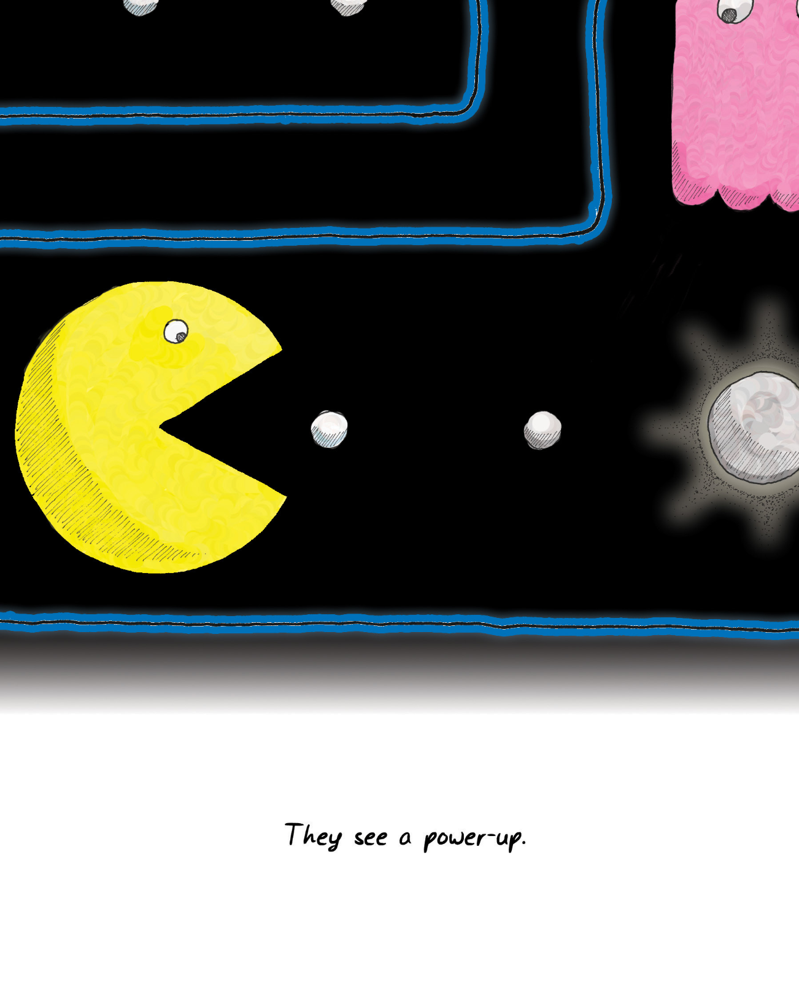

# Chapter 5 What Games Aren't? 第五章 游戏不是什么？

Until now, I've been discussing formal game design—abstract simulations. I've also been pretty loose with the term "game," conflating game systems with games. But we rarely see truly abstract simulations in games. People tend to dress up game systems with some fiction. Designers put artwork on them that is suggestive of some real-world context. Take checkers for example—abstractly, it's a board game about entrapment and forced action, played on a diamond-shaped grid. When we say ["king me"](#user-content-fn-1)[^1] in checkers, we're adding a subtle bit of fiction to the game; suddenly it has acquired feudal overtones and a medieval context. Usually, the pieces have a crown embossed on them.

截至目前，我一直在讨论形式化的游戏设计——抽象的模拟。我对“游戏”一词的使用也很随意，把游戏系统和游戏混为一谈。但我们很少在游戏中看到真正抽象的模拟。人们往往会用一些虚构表象来装扮游戏系统。设计者会在游戏中加入一些艺术元素，让人联想到现实世界中的一些场景。以跳棋为例——抽象地看，这是一种在菱形棋盘上进行的关于围捕和强制行动的棋盘游戏。当我们在跳棋中说[“升王”](#user-content-fn-2)[^2]时，我们就给这个游戏添加了一点微妙的虚构表象；突然间，它就有了封建色彩和中世纪背景。通常情况下，棋子上会刻上王冠图案。

This is similar to word problems in math class. The fiction serves two purposes: it trains you to see past it to the underlying math problem, and it also trains you to recognize real-world situations where that math problem might be lurking. 

这类似于数学课上的应用题。虚构表象有两个目的：一是训练你透过它看到潜在的数学问题，二是训练你识别现实世界中可能潜伏着数学问题的情况。

Games in general tend to be like word problems. You won't find many games that are pure unclothed [abstractions](#user-content-fn-3)[^3]. Most games have more in common with chess or checkers—they provide some level of misdirection. Usually there are metaphors for what is going on in the game.

一般来说，游戏往往就像应用题。你不会找到很多纯粹的[抽象游戏](#user-content-fn-4)[^4]。大多数游戏与国际象棋或跳棋有更多的共同之处——它们提供了某种程度的误导。通常游戏中发生的事情都有一些隐喻。

While metaphors are fun to play with, players can basically ignore them. The name of the unique checker piece that has made it to the other side is irrelevant, mathematically speaking. We could call the regular pieces chickens and the crowned ones wolves and the game would not change one whit.

虽然隐喻很有趣，但玩家基本上可以忽略它们。从数学角度讲，到达另一方的独特跳棋棋子的名称是无关紧要的。我们可以把普通棋子叫做鸡，把有王冠的棋子叫做狼，而游戏却丝毫不会改变。

Games, by the very nature of what they teach, push towards this sort of understanding. Since they are about teaching underlying patterns, they train their players to ignore the fiction that wraps the patterns.

游戏根据它们所教授的内容的本质，推动了这种理解的形成。由于它们的目的是教授底层模式，所以他们训练玩家忽略包裹这些模式的虚构表象。

> SPACE INVADERS
> 
> 太空侵略者
> 
> GALAXIAN
> 
> 小蜜蜂
> 
> TEMPEST
> 
> 暴风雨
> 
> SCROLLING SHMUP
> 
> 滚动射击清版游戏
> 
> player
> 玩家
> 
> force projection
> 武力投射
> 
> playfield
> 游戏场地
> 
> enemies
> 敌人
> 
> Games are largely about getting people to see past the variations and look instead at the underlying patterns. Because of this, gamers are very good at seeing past fiction.
> 
> 游戏在很大程度上是要让人们看穿游戏的变化，转而关注它潜在的模式。正因为如此，游戏玩家非常善于透过虚构表象看本质。

Back in 1976, a company called Exidy scored a first in video game history: its game [Deathrace](#user-content-fn-5)[^5] was taken off the market because of public concerns about the game's violent nature. Deathrace was loosely based on a movie called [Deathrace 2000](#user-content-fn-6)[^6]. The premise involved driving a car to run over pedestrians for points.

早在 1976 年，一家名为 Exidy 的公司创造了视频游戏史上的一个第一：其游戏[《亡命赛车》](#user-content-fn-7)[^7]因公众对游戏暴力性质的担忧而被下架。《亡命赛车》是根据一部名为[《亡命赛车 2000》](#user-content-fn-8)[^8]的电影改编的。游戏的前提是驾驶汽车碾压行人得分。

Mechanically, Deathrace was the same as any other game that involved catching objects moving around the screen. If you looked at this game today, with its crude pixelated graphics and its tiny iconic people, you wouldn't be particularly shocked. After all, countless other gore-fests have come along that make the game look quaint.

从机制上讲，《亡命赛车》与其他任何涉及捕捉屏幕上移动物体的游戏一样。如果你今天来看看这款游戏，看看它粗糙的像素化画面和微小的象征性人物，你不会感到特别震惊。毕竟，无数其他血腥游戏的出现让这款游戏显得相当古朴。

I don't think debates about the suitability of violence in the media will disappear. Much evidence shows that [media have some effect on how we act](#user-content-fn-9)[^9]. If media didn't have an effect, we wouldn't spend so much effort on using them as teaching tools. But evidence also shows that media aren't mind-control devices (of course they aren't, or else we'd all behave like the people in the children's stories we read in elementary school).

我不认为关于媒体中暴力是否合适的争论会消失。许多证据表明，[媒体对我们的行为方式有一定的影响](#user-content-fn-10)[^10]。如果媒体没有影响，我们就不会花这么多精力把它们用作教学工具。但也有证据表明，媒体并不是精神控制设备（当然不是，否则我们的行为就会像小学时读的儿童故事里的人一样）。

Gamers, however, have always viewed this issue with some perplexity. When they defend their beloved games, they use one of the most self-defeating rallying cries in history: "It's only a game!"

然而，游戏玩家对这一问题的看法总是有些令人费解。当他们为自己心爱的游戏辩护时，他们使用的是史上最不攻自破的辩护词之一：“这只是个游戏！”

In the wake of [school shootings](#user-content-fn-11)[^11] and ex-military people decrying first-person shooters as "[murder simulators](#user-content-fn-12)[^12]," this argument doesn't carry a lot of weight. Academics who disagree with the portrayal of games as damaging to children tend to muster learned arguments about privileged spaces and magic circles. Much of the public dismisses these arguments as coming from an ivory tower.

在[校园枪击案](#user-content-fn-13)[^13]和退役军人斥责第一人称射击游戏为“[谋杀模拟器](#user-content-fn-14)[^14]”之后，这种论调并不具有多少分量。不同意将游戏描绘成对儿童有害的学者们，往往会提出关于特权空间和魔法圈的学术论据。公众大多认为这些论点来自脱离现实的学术象牙塔。

But there's a very good reason why the gamers are incredulous.

但游戏玩家感到难以置信是有充分理由的。

> WHAT'S HE IN FOR?
> 
> 他犯了什么罪？
> 
> GRAND THEFT AUTO, ASSAULT AND BATTERY, VEHICULAR HOMICIDE, SOLICITATION, AND LITTERING.
> 
> 盗窃汽车、殴打他人、驾车杀人、拉皮条、乱扔垃圾。
> 
> This is why gamers are dismissive of the ethical implications of games -- they don't see "pick up a hooker, then run her over to get your money back."
> 
> 这就是为什么玩家们对游戏中的道德含义不以为然——他们看不到“搭上一个妓女，然后打倒她，拿回你的钱。”（这样的行为有道德上的问题）

Remember, game systems train us to see underlying mathematical patterns. The fact that I can describe Deathrace as being a game about picking up objects on a two-dimensional playing field is evidence that its "dressing" is largely irrelevant to what the game is about at its core. As you get more into a game, you'll most likely cut to the chase and examine the true underpinnings of the game, just as a music aficionado can cut past the lyrical content of different types of Latin music and determine whether a given song is a [cumbia](#user-content-fn-15)[^15] or a [marinera](#user-content-fn-16)[^16] or a salsa.

记住，游戏系统会训练我们看到潜在的数学模式。我可以把《亡命赛车》描述成一款关于在二维游戏场地上拾取物体的游戏，这就证明了它的“外衣”与游戏的核心内容基本无关。随着你对游戏的深入了解，你很可能会直奔主题，研究游戏的真正基础，就像一个音乐发烧友可以绕过不同类型拉丁音乐的抒情内容，确定某首歌曲是[康比亚舞曲](#user-content-fn-17)[^17]、[马里内拉舞曲](#user-content-fn-18)[^18]还是萨尔萨舞曲一样。

Running over pedestrians, killing people, fighting terrorists, and eating dots while running from ghosts are all just stage settings, convenient metaphors for what a game is actually teaching. Deathrace does not teach you to run over pedestrians any more than Pac-Man teaches you to eat dots and be scared of ghosts.

碾压行人、杀害他人、与恐怖分子搏斗、以及在躲避鬼魂时吃豆子，这些都只是舞台设定，是游戏实际教授内容的便捷隐喻。《死亡赛车》教你碾压行人，并不比《吃豆人》教你吃豆子和害怕鬼魂更多。

None of this is to minimize the fact that Deathrace does involve running over pedestrians and squishing them into little tombstone icons. That's there, for sure, and it's kind of reprehensible. It's not a great setting or staging for the game, but it's also not what the game is really about.

这并不是要淡化《亡命赛车》确实涉及碾压行人并将他们压成小墓碑图标的事实。这确实是存在的，而且应该受到谴责。这不是游戏的一个很好设定或舞台，但这也并不是游戏真正要传达的内容。

Learning to see that division is important to our understanding of games, and I'll touch on it at greater length later. For now, suffice it to say that the part of games that is *least* understood is the formal abstract system portion of it, the mathematical part of it, the chunky part of it. Attacks on other aspects of games are likely to miss the key point—at their core, games need to develop this formal aspect of themselves in order to improve.

学会看待这种划分对于我们理解游戏非常重要，我稍后会详细论述。现在，我只想说，游戏中*最*不为人所理解的部分是它的形式化抽象系统部分、数学部分、成块的部分。对游戏其他方面的攻击很可能会错过关键点——游戏的核心就是需要发展其自身的形式方面，才能不断进步。

> They see a power-up.
> 
> 它们看到一个强化道具。

Alas, that isn't what we tend to focus on.

可惜，这并不是我们关注的重点。

The most common route these days for developing games involves grafting a story onto them. But most video game developers take a (usually mediocre) story and put little game obstacles all through it. It's as if we are requiring the player to solve a crossword puzzle in order to turn the page to get more of the novel. There is also a current of game design which unapologetically [puts story first](#user-content-fn-19)[^19]. These are often powerful emotional experiences with relatively shallow game mechanics. This isn't a flaw—it's a deliberate design choice—but it doesn't speak to the kind of learning we get from game systems.

如今，开发游戏最常见的方式就是在游戏中嫁接故事。但大多数视频游戏开发商都是在一个（通常平庸无奇的）故事中设置一些小游戏障碍。这就好像我们要求玩家解开填字游戏谜题，才能翻开一页，获得更多的小说内容。还有一股游戏设计潮流，毫不掩饰地[将故事放在首位](#user-content-fn-20)[^20]。这些游戏通常具有强大的情感体验，但游戏机制却相对肤浅。这并不是一个缺陷，而是一种刻意的设计选择，但这并不符合我们从游戏系统中获得的学习体验。

By and large, people don't play with game systems because of the stories. The stories that wrap the systems are usually side dishes for the brain. For one thing, it has been rare to see a game [story written by an actual writer](#user-content-fn-21)[^21]. As a result, they are usually around the high-school level of literary sophistication at best.

总的来说，人们玩游戏系统并不是因为故事。包装游戏系统的故事通常只是大脑的配菜。首先，[由真正的作家撰写的游戏故事](#user-content-fn-22)[^22]已经很少见了。因此，这些故事的文学水平充其量只能达到高中水平。

For another, since the games are generally about power, control, and those other primitive things, the stories tend to be as well. This means they tend to be power fantasies. That's generally considered a pretty juvenile sort of story.

另外，由于游戏一般都与权力、控制和其他人类本能行为有关，故事也往往如此。这意味着它们往往是权力幻想。这通常被认为是一种非常幼稚的故事。

The stories in many video games serve the same purpose as calling the über-checker a "king." It adds interesting shading to the game but the game at its core is unchanged. Often the story elements are reduced to being positive feedback to the player, to tell her that she is doing well. Remember—my background is as a writer, so this actually pisses me off. Story deserves better treatment than that.

许多电子游戏中的故事与把超级跳棋称为“国王”的目的是一样的。它为游戏增添了有趣的色彩，但游戏的核心却没有改变。故事元素往往沦为对玩家的积极反馈，告诉玩家她做得很好。请记住，我的职业背景是作家，所以这实际上让我很生气。故事应该得到更好的处理。

> Story, setting, and backplot in games are nothing more than an attempt to give a side dish to the brain while it completes its challenges -- sometimes the hope is that it makes up for an otherwise unremarkable game.
> 
> 游戏中的故事、设定和背景情节不过是在大脑完成挑战的同时为其提供的一道配菜——有时，人们希望它能补偿一个本身平淡无奇的游戏。
> 
> SURE, IT'S ANOTHER FIRST-PERSON SHOOTER, BUT WITH THE MOVIE LICENSE, I AM SURE IT'LL BE A HIT...
> 
> 当然，这又是一款第一人称射击游戏，但有了电影授权，我相信它会大受欢迎……

Games are not stories (though [players can create stories](#user-content-fn-23)[^23] from them). It is interesting to make the comparison, though:

游戏不是故事（尽管玩家可以从中[创造故事](#user-content-fn-24)[^24]）。不过，做这样的比较还是很有意思的：

* Games tend to be experiential teaching. Stories teach vicariously.\
    游戏倾向于体验式教学。故事则是代入式教学。
    
* Games are good at objectification. Stories are good at empathy.\
    游戏擅长物化。故事善于移情。

* Games tend to quantize, reduce, and classify. Stories tend to blur, deepen,and make subtle distinctions.\
    游戏倾向于量化、缩小和分类。故事则倾向于模糊、深化和细微区分。

* Games are external—they are about people's actions. Stories (good ones,anyway) are internal—they are about people's emotions and thoughts.\
    游戏是外在的，是关于人的行为的。故事（至少好故事是这样）是内在的——它们关乎人们的情感和思想。

* Games are generators of player narratives. Stories provide a narrative.\
    游戏是玩家叙事的生成器。故事则提供了一种叙事方式。

In both cases, when stories and games are good, you can come back to them repeatedly and keep learning something new. But we never speak of fully mastering a good story.

在这两种情况下，如果故事和游戏都不错，你就可以反复回味，不断学到新东西。但我们从来没有说过要完全掌握一个好故事。

I don't think anyone would quarrel with the notion that stories are one of humanity's chief teaching tools. One might quarrel with the notion that play is the other and that mere lecturing runs a distant third. I also don't think that many would quarrel with the notion that stories have achieved far greater artistic heights than games have, despite the fact that play probably *predates* story (after all, even animals play, whereas stories require some form of language).

我想没有人会反对故事是人类主要教学工具之一的观点。有人可能会争论说，游戏是另一种工具，而单纯的说教只能排在第三位。我也不认为有多少人会反对故事的艺术成就远远高于游戏的观点，尽管事实上游戏可能*早于*故事（毕竟，连动物都会玩，而故事则需要某种形式的语言）。

Are stories superior? We often speak of wanting to make a game that makes players cry. The classic example is the text adventure game [Planetfall](#user-content-fn-25)[^25], where Floyd the robot sacrifices himself for you. But it happens outside of player control, so it isn't a challenge to overcome. It's grafted on, not part of the game. What does it say about games that the peak emotional moment usually cited actually involves *cheating*, rather than using game systems?

故事优越吗？我们经常说要做一款让玩家流泪的游戏。最经典的例子就是文字冒险游戏[《行星陨落》](#user-content-fn-26)[^26]，机器人弗洛伊德为你牺牲了自己。但这是在玩家控制之外发生的，所以并不是一个需要克服的挑战。它是嫁接上去的，不是游戏的一部分。游戏中最激动人心的时刻通常涉及*作弊*，而不是利用游戏系统，这说明了什么？

Games do better at emotions that relate to mastery. Stories can provide these too, however. Getting these sorts of emotional effects out of games may be the wrong approach—perhaps a better question is whether stories can be fun in the way games can.

> I BEAT THE LAST LEVEL OF ULYSSES LAST NIGHT. I HAD TO USE GOD MODE FOR THE END BOSS. MOLLY IS REALLY TOUGH!
> 
> 我昨晚打通了《尤利西斯》的最后一关。我不得不用上帝模式来对付最后的头目。莫莉真的很难缠！
> 
> YES! YES! YES!
> 
> 是的！是的！是的！
> 
> Stories are powerful teaching tool in their own right, but games are not stories.
> 
> 故事本身是强有力的教学工具，但游戏不是故事。

游戏更擅长于表达与掌握技能相关的情感。故事当然也能提供这些情感。从游戏中获取这类情感效果可能是个错误的方法——也许更好的问题是，故事是否能像游戏一样有趣。

When we speak of enjoyment, we actually mean a constellation of different feelings. Having a nice dinner out can be fun. Riding a roller coaster can be fun. Trying on new clothes can be fun. Winning at table tennis can be fun. Watching your hated high school rival trip and fall in a puddle of mud can be fun. Lumping all of these under "fun" is a rather horribly vague use of the term.

当我们谈论享受时，我们实际上指的是一系列不同的感受。在外面吃一顿丰盛的晚餐可以是一种享受。坐过山车可以是一种乐趣。试穿新衣服可以是一种乐趣。赢乒乓球可以是一种乐趣。看着高中时讨厌的对手绊倒在泥潭里也是一种乐趣。把所有这些都归结为“乐趣”，这个词的用法模糊得令人发指。

Different people have classified this differently. Game designer [Marc LeBlanc](#user-content-fn-27)[^27] has defined eight types of fun: sense-pleasure, make-believe, drama, obstacle, social framework, discovery, self-discovery and expression, and surrender. [Paul Ekman](#user-content-fn-28)[^28], a researcher on emotions and facial expressions, has identified literally dozens of different emotions—it's interesting to see how many of them only exist in one language but not in others. [Nicole Lazzaro](#user-content-fn-29)[^29] did some studies watching people play games, and she arrived at four clusters of emotion represented by the facial expressions of the players: hard fun, easy fun, altered states, and the people factor.

不同的人对此有不同的分类。游戏设计师[马克·勒布朗](#user-content-fn-30)[^30]定义了八种乐趣：感官愉悦、虚构、戏剧、障碍、社会框架、发现、自我发现和表达以及投降。[保罗·艾克曼](#user-content-fn-31)[^31]是一位研究情绪和面部表情的学者，他发现了几十种不同的情绪——其中有很多情绪只存在于一种语言中，而在其他语言中却不存在，这很有意思。[妮可·拉扎罗](#user-content-fn-32)[^32]对人们玩游戏时的表情进行了研究，得出了玩家面部表情所代表的四种情绪：挑战乐趣、轻松乐趣、改变状态和人际因素。

My personal breakdown would look a lot like Lazzaro's:

我个人的分解看起来很像拉扎罗的分解：

* **Fun** is the act of mastering a problem mentally.\
    **乐趣**是在头脑中解决问题的行为。

* **Aesthetic appreciation** isn't always fun, but it's certainly enjoyable.\
    **审美欣赏**并不总是有趣的，但肯定是令人愉快的。

* **Visceral reactions** are generally physical in nature and relate to physical mastery of a problem.\
    **内在反应**一般是身体反应，与身体对问题的掌握有关。

* **Social status signals** of various sorts are intrinsic to our self-image and our standing in a community.\
    各种**社会地位信号**与我们的自我形象和社会地位息息相关。

All of these things make us feel good when we're successful at them, but lumping them all together as "fun" just renders the word meaningless. So throughout this book, when I have referred to "fun," I've meant only the first one: mentally mastering problems. Often, the problems mastered are aesthetic, physical, or social, so fun can appear in any of those settings. That's because all of these are feedback mechanisms the brain gives us for successfully exercising survival tactics.

当我们在这些方面取得成功时，所有这些都会让我们感觉良好，但把它们统统归结为“乐趣”只会让这个词失去意义。因此，在本书中，当我提到“乐趣”时，我指的只是第一种：在智力上解决问题。通常，要解决的问题是涉及到审美、体能或社交方面的，所以乐趣可以出现在这些情景中的任何一种当中。那是因为，所有这些都是大脑在我们成功运用生存策略时给予我们的反馈机制。

> Of course, learning patterns is not the only thing that is entertaining. Humans enjoy primate dominance games, for example. You could argue that jockeying for status is also a challenge, of course.
> 
> 当然，学习模式并不是唯一具有娱乐性的事情。例如，人类喜欢灵长类动物的统治游戏。你可以说，争夺地位当然也是一种挑战。
> 
> (unranked amateur gamer)
> 
> (无排名的业余玩家）
> 
> schadenfreude
> 
> 幸灾乐祸
> 
> HA HA!
> 
> 哈哈！
> 
> (top-ranked pro gamer)
> 
> (高排名的职业玩家）

Physical challenges alone aren't fun. The feeling of triumph when you break a personal record is. Physical challenges can be approached as a game, the game of your own body. [Endurance running](#user-content-fn-33)[^33] or lifting weights can be immensely satisfying, but the high you get from vigorous exercise is not the same high as when you win a well-fought game of soccer thanks to your teamwork.

单纯的体能挑战并不有趣。打破个人记录时的胜利感才是。体能挑战可以当作一场游戏，一场自己身体的游戏。[耐力跑](#user-content-fn-34)[^34]或举重会让人感到无比满足，但剧烈运动带来的兴奋感，与团队合作赢得一场精彩的足球比赛时的兴奋感是不同的。

Similarly, autonomic responses aren't fun in and of themselves. You have them developed already, so the brain only rewards you for doing them in the context of a mental challenge. You don't get a high from just typing, you get it from typing while pondering what to say, or from typing during a typing game.

同样，自主神经反应本身并不有趣。你已经开发了这些反应，所以大脑只会在你进行心智挑战时才会奖励你。你不会从单纯的打字中获得快感，你会从一边打字一边思考说什么或者在打字游戏中打字中获得快感。

Social interactions of all sorts are often enjoyable as well. The constant maneuvering for social status that all humans engage in is a cognitive exercise, and therefore essentially a game. There is a constellation of positive emotions surrounding interpersonal interactions. Almost all of them are signals of either pushing someone else down, or pushing yourself up, on the social ladder. Some of the most notable include:

各种社会交往通常也会让人感到愉快。全人类都在不断地争取社会地位，这是一种认知活动，因此本质上也是一种游戏。围绕着人际交往有一系列积极的情绪。几乎所有这些情绪都是在社会阶梯上将别人推下或将自己推上的信号。其中最显著的包括：

* [Schadenfreude](#user-content-fn-35)[^35], the gloating feeling you get when a rival fails at something. This is, in essence, a put down.\
	[幸灾乐祸](#user-content-fn-36)[^36]，当对手在某件事情上失败时，你心中暗自得意的感觉。这本质上是一种贬低。

* Fiero, the expression of triumph when you have achieved a significant task (pumping your fist, for example). This is a signal to others that you are valuable.\
	骄傲，当你完成一项重要任务时的胜利表达（例如，挥舞拳头）。这是向他人发出的一个信号，表明你很有价值。

* Naches, the feeling you get when someone you mentor succeeds. This is a clear feedback mechanism for tribal continuance.\
	欣慰，当你指导的人成功时你的感觉。这是部落延续的一个明确反馈机制。

* Kvell, the emotion you feel when bragging about someone you mentor. This is also a signal that you are valuable.\
	夸耀：当你向别人夸耀你指导的人时产生的情绪。这也是一个表明你有价值的信号。

* Social behaviors, such as signals of intimacy, often representing relative [social status](#user-content-fn-37)[^37]. One example is feeding other people, which is a very important social signal in human societies.\
	社交行为，如亲密的信号，通常代表相对的[社会地位](#user-content-fn-38)[^38]。给别人喂食就是一个例子，这在人类社会中是一个非常重要的社会信号。

A lot of these feel good, but they aren't necessarily "fun."

这些行为很多都让人感觉良好，但并不一定“有趣”。

> We also enjoy visceral experiences of various sorts -- these are often challenges to ourselves.
> 
> 我们还喜欢各种内在体验——这些体验往往是对自己的挑战。
> 
> get me offa here!
> 
> 让我离开这里！

Aesthetic appreciation is the most interesting form of enjoyment to me. Science fiction writers call it "[sensawunda](#user-content-fn-39)[^39]." It's awe, it's mystery, it's harmony. I call it delight. Aesthetic appreciation, like fun, is about patterns. The difference is that aesthetics is about *recognizing* patterns, not learning new ones.

对我来说，审美欣赏是最有趣的享受形式。科幻小说家称之为“[惊奇感](#user-content-fn-40)[^40]”，是敬畏，是神秘，是和谐。我称之为愉悦。审美欣赏和乐趣一样，都是关于模式的。所不同的是，审美是*识别*模式，而不是学习新的模式。

Delight strikes when we recognize patterns but are surprised by them. It's the moment at the end of *Planet of the Apes* when we see the Statue of Liberty. It's the thrill at the end of the mystery novel when everything falls into place. It's looking at the Mona Lisa and seeing that smile hovering at the edge of known expressions, and matching it to our hypothesis of what she's thinking. It's seeing a beautiful landscape and thinking all is right in the world.

当我们认识到模式，却又为它的超乎意料的出现感到惊讶时，愉悦就会悄然而至。就像在 *《人猿星球》* 的结尾看到自由女神像的那一瞬间。就像在悬疑小说结尾，一切真相大白时的激动。就像看着蒙娜丽莎，看到那她在已知表情边缘徘徊的微笑，并将其与我们对她所思所想的假设相吻合。就像看到美丽的风景，觉得世界一切都很美好。

Why does a beautiful landscape make us feel that way? Because it meets our expectations and *exceeds* them. We find things beautiful when they are very close to our idealized image of what they should be, but with an additional surprising wrinkle. A perfectly closed-off plot, with just a couple of loose threads. A picture of a farmhouse, but the paint is peeling. Music that comes back to the tonic note and then drops a whole step further to end on an unresolved minor seventh. These send us chasing off after new patterns.

为什么美丽的景观会让我们有这种感觉？因为它符合我们的期望，而且*超出*了我们的期望。当事物非常接近我们理想中的样子，但又多了一个令人惊讶的皱褶时，我们就会觉得它很美。一个完美封闭的情节，却只有几条松散的线索。一幅农舍图，但油漆已经剥落。音乐回到了主音，然后又下降了一大步，以一个悬而未决的小七度结束。这些都让我们去追寻新的模式。

Beauty is found in the tension between our expectation and the reality. It is *only* found in settings of extreme order. Nature is full of extremely ordered things. The flowerbed bursting its boundaries is expressing the order of growth, the order of how living things stretch beyond their boundaries, even as it is in tension with the order of the well-manicured walkway.

美在于我们的期望与现实之间的张力之中。它*只*存在于极端有序的环境中。大自然中充满了极度有序的事物。突破界限的花坛表达了生长的秩序，表达了生物如何超越自身界限的秩序，即使它与修剪整齐的人行道的秩序相冲突。

Delight, unfortunately, doesn't last. It's like the smile from a beautiful stranger in a stairwell—it's fleeting. It cannot be otherwise—recognition is not an extended process.

遗憾的是，喜悦不会持久。它就像楼梯间美丽陌生人的微笑——转瞬即逝。不可能有其他的情况——认识不是一个漫长的过程。

You can regain delight by staying away from the object that caused it previously, then returning. You'll get that recognition again. But it's not quite what I would call fun. It's something else—our brains rewarding us for having learned well. It is the epilogue to the story. The story itself is the fun of learning.

你可以通过远离之前引起愉悦的对象，然后再回来，重新获得愉悦。你会再次获得这种认可。但这并不是我所说的乐趣。它是另一种东西——我们的大脑在奖励我们学得好。这是故事的尾声。故事本身才是学习的乐趣所在。

> Last, people often take DELIGHT in things that are not challenges.
> 
> 最后，人们常常会对一些并非挑战的事情感到高兴。

Fun, as I define it, is the feedback the brain gives us when we are absorbing patterns for learning purposes. Consider the basketball team that says, "We went out there to have fun tonight," versus the one that says, "We went out there to win." The latter team is approaching the game as no longer being practice. Fun is primarily about practicing and learning, not about exercising mastery. In fact, the fun often starts before the action does; [anticipating a solution](#user-content-fn-41)[^41] can be as exciting as applying one. Exercising mastery will give us some other feeling, because we are doing it *for a reason*, such as status enhancement or survival.

根据我的定义，“乐趣”是大脑在我们为了学习而吸收模式时给予我们的反馈。想想一支篮球队说：“我们今晚上场是为了玩得开心”，而另一支篮球队说：“我们上场是为了赢球。”后一支球队对待比赛的态度不再是练习。乐趣主要在于练习和学习，而不是锻炼掌握技巧。事实上，乐趣往往在行动之前就已经开始了；[期待一个解决方案](#user-content-fn-42)[^42]和应用一个解决方案一样令人兴奋。锻炼掌握技巧会给我们带来其他感觉，因为我们这样做是有原因的，比如提高地位或生存。

The lesson here is that *fun is contextual*. The reasons why we are engaging in an activity matter a lot. Bernard Suits called this "approaching things with a [lusory attitude](#user-content-fn-43)[^43]," which in part means putting the activity into that "magic circle" of lack of consequence. School is not usually all that fun because we take it seriously—it's not practice, it's for real, and your grades, social standing, and clothing determine whether you are in the in-crowd, or whether you sit at the table close to the cafeteria kitchen.

这里的教训是，*乐趣是有背景的*。我们从事一项活动的原因非常重要。伯纳德·苏伊茨将此称为“以一种[游戏的态度](#user-content-fn-44)[^44]对待事物”，这在一定程度上意味着将活动置于没有后果的“魔法圈”中。学校通常并不那么有趣，因为我们认真对待它——它不是练习，而是真实的，你的成绩、社会地位和衣着决定了你是圈内人，还是坐在靠近食堂厨房的桌子旁。

It's very telling that when we lose a competition, we often say, "Well, I was just doing it for fun." The implication is that we are shrugging off the loss of social status inherent in a loss. Since it was merely a form of practice, perhaps we didn't put forth our best effort.

很能说明问题的是，当我们输掉比赛时，我们经常会说：“好吧，我只是为了好玩。”言下之意，我们是在推卸输掉比赛所带来的社会地位的损失。因为这只是一种练习，也许我们并没有尽全力。

We get positive feedback for climbing the social ladder. We're just tribal monkeys throwing feces at each other in order to own the top of the tree. But notice some of the subtleties there: climbing it while helping others (naches and kvell). Climbing it while pushing the boundaries of our knowledge (fun). Climbing it while strengthening our social networks, building communities and families that work together to improve everyone's lot (grooming, pairing, and feeding others).

我们在社会阶梯上攀爬，得到的是积极的反馈。我们只是部落里的猴子，为了占据树顶而互相泼粪。但请注意其中的一些微妙之处：在帮助他人的同时攀登（欣慰和夸耀）。在挑战知识极限的同时攀登（乐趣）。一边攀爬，一边加强我们的社交网络，建立社区和家庭，共同改善每个人的命运（梳理、配对和喂养他人）。

As monkeys go, that's pretty darn good. In the general run of animals, it's amazing. It's a lot better than being a shark that only gets feedback for eating.

就猴子而言，这已经很不错了。在一般动物中，这已经很了不起了。这比鲨鱼只在吃东西时得到反馈要好得多。

I think there's a good case to be made that having fun is a key evolutionary advantage right next to opposable thumbs in terms of importance. Without that little chemical twist in our brains that makes us enjoy learning new things, we might be more like the sharks and ants of the world.

我认为有充分的理由证明，玩乐是一种关键的进化优势，其重要性仅次于对生拇指。如果我们的大脑中没有那种让我们喜欢学习新事物的化学反应，我们可能会更像世界上的鲨鱼和蚂蚁。

> But delight tends to wear thin very quickly. Real fun comes from challenges that are always at the margin of our ability.
> 
> 但快乐往往很快就会被消磨殆尽。真正的乐趣总是来自于我们能力边缘的挑战。

So how does it feel? Well, the moment a lot of players like to cite is "being in the zone." If you get academic about it, you might reference Csikszentmihalyi's concept of "[flow](#user-content-fn-45)[^45]." This is the state you enter when you are experiencing absolute concentration on a task. When you're in absolute control, the challenges that come at you are met precisely by your skills.

感觉如何？嗯，很多球员喜欢引用的时刻是“进入状态”。如果你对此有学术研究，你可能会参考西克森特米哈伊的“[心流](#user-content-fn-46)[^46]”概念。这是当你绝对专注于某项任务时所进入的状态。当你处于绝对控制状态时，你的技能就能准确地应对各种挑战。

Flow doesn't happen very often, but when it does it feels pretty darn wonderful. The problem is that precisely matching challenges to capability is incredibly hard. For one thing, the brain is churning away, and might make a conceptual breakthrough at any moment, rendering the rest of the challenge trivial. For another, an automated system isn't likely to be able to assess the player's shifting skill very well.

心流并不经常发生，但当它发生时，感觉非常美妙。问题在于，将挑战与能力精确匹配是一件非常困难的事情。首先，大脑在不断运转，随时可能在概念上有所突破，从而使挑战的其余部分变得微不足道。另外，自动系统也不可能很好地评估玩家的技能变化。

As we succeed in mastering patterns thrown at us, the brain gives us little jolts of pleasure. But if the flow of new patterns slows, then we won't get the jolts, and we'll start to feel boredom. If the flow of new patterns increases beyond our ability to resolve them, we won't get the jolts either because we're not making progress.

当我们成功掌握抛给我们的模式时，大脑会给我们带来小小的快感。但如果新图案的出现速度减慢，我们就不会获得这种快感，从而开始感到无聊。如果新模式的增加超出了我们的解决能力，我们也不会得到快感，因为我们没有取得进展。

The absence of flow doesn't preclude fun—it just means that instead of a steady drip-drip-drip of endorphins, you're getting occasional bits. And in fact, there can be flow that isn't fun; meditation induces similar brain waves, for example. Instead, fun tends to hit when bumping up at the top edge of flow.

没有心流并不意味着没有乐趣——它只是意味着，你得到的不是稳定的、滴滴答答的内啡肽，而是偶尔的一点。事实上，心流也可以是没有乐趣的；例如，冥想也会诱发类似的脑电波。相反，乐趣往往是在达到心流的顶峰时才会出现。

A more fruitful reference might be the educational concept of the "[zone of proximal development](#user-content-fn-47)[^47]." This is the idea that a given learner has things he can do without help, things he just cannot do, and things he can do with some help. Fun tends to come in this last one, and the help is provided by the game system.

“[最近发展区](#user-content-fn-48)[^48]”这一教育概念可能是一个更有意义的参考。这个概念认为，一个特定的学习者在没有帮助的情况下可以做一些事情，他只是不能做一些事情，以及他在一些帮助下可以做一些事情。趣味往往属于最后一种，而帮助则是由游戏系统提供的。

一个更有成效的参考可能是教育概念中的“最近发展区”。这个观点认为，一个学习者有他无需帮助就能做的事情，有他根本无法做到的事情，以及有他借助些许帮助就能做到的事情。乐趣往往出现在这最后一种情况中，而帮助是由游戏系统提供的。

So fun isn't flow. You can find flow in countless activities, but they aren't all fun. Most of the cases where we typically cite flow relate to exercising mastery, not learning.

所以，乐趣并不是心流。你可以在无数活动中找到心流，但它们并不都是有趣的。我们通常提到心流的大多数情况都与锻炼掌握有关，而不是学习。

> When the balance is really perfect, people often zone out.
> 
> 当平衡真正达到完美时，人们常常会进入一种忘我状态。

Fun isn't the only reason to play a game with a system, of course:

当然，乐趣并不是玩系统游戏的唯一原因：

* **Practice.** Practice is a very common thing to do with games. Studies have shown that mastering a field can take many hours of what is termed "[deliberate practice](#user-content-fn-49)[^49]," where the person practicing drills herself on challenging tasks, over and over. It is very hard work. In some sense games are "deliberate practice machines" that make this work easier.\
    **练习。** 在游戏中，练习是一件非常常见的事情。研究表明，掌握一个领域需要很多小时的所谓“[刻意练习](#user-content-fn-50)[^50]”，即练习者一遍又一遍地练习自己完成具有挑战性的任务。这是一项非常艰苦的工作。从某种意义上说，游戏就是“刻意练习的机器”，让这项工作变得更轻松。

* **Meditation.** Although meditation is poorly studied in the sciences, there are common elements that recur in various practices around the world: using a focus object of some sort, such as a mantra or breathing pattern, and engaging in repetitive behavior. Many games work well for this.\
    **冥想。** 虽然科学界对冥想的研究不多，但世界各地的各种冥想练习都有一些共同的元素：使用某种专注对象，如咒语或呼吸模式，并进行重复行为。许多游戏在这方面都很有效。

* **Storytelling.** Some games come with stories, and of course, a player can always construct a narrative of events after the fact. A given player might very well be more interested in these stories than in the game systems which accompany them. We can debate whether this is "gamelike" or not in some dry and technical sense, but why bother?\
    **讲故事。** 有些游戏会附带故事，当然，玩家也可以在事后对事件进行叙述。玩家对这些故事的兴趣很可能超过对游戏系统的兴趣。我们可以从枯燥和技术性意义上争论这是否算是“游戏化”，但何必呢？

* **Comfort.** The act of playing in a space which is fully understood, where one can exercise mastery with little risk, can provide a welcome break from a challenging life. Games offer this type of escape, much as a familiar well-loved book or film does when experienced over and over.\
    **舒适。** 在一个完全被理解的空间里玩游戏，在几乎没有风险的情况下掌握技巧，可以让人从充满挑战的生活中解脱出来。游戏提供了这种逃避的方式，就像一本耳熟能详、深受喜爱的书籍或电影一样，让人反复体验。

There is nothing wrong with using a game or a game system for these purposes! But many other things would also serve. So these qualities do not speak to what makes games unique and special.

将游戏或游戏系统用于这些目的无可厚非！但是，许多其他事物也能起到同样的作用。因此，这些特质并不能说明游戏的独特和特别之处。

To recap the preceding pages: Games aren't stories. Games aren't about beauty or delight. Games aren't about jockeying for social status. They stand, in their own right, as something incredibly valuable. Fun is about learning in a context where there is no pressure from consequence, and that is why games matter.

总结一下前面的内容：游戏不是故事。游戏与美或快乐无关。游戏不是为了争夺社会地位。游戏本身就具有令人难以置信的价值。乐趣在于在没有后果压力的环境中学习，这也是游戏重要的原因。

> PRACTICE
> 
> 实践
> 
> STROYTELLING
> 
> 讲故事
> 
> COMFORT
> 
> 舒适
> 
> MEDITATION
> 
> 冥想

[^1]: "King me": The phrase spoken when you move a checkers piece to the last row on the board. There's an interesting political undertone to checkers, in that it is assumed that common soldiers must only charge forward, whereas kings have more freedom of movement (and may retreat)—and yet, it is also assumed that any soldier may become a king.

[^2]: “升王”：当你把跳棋棋子移动到棋盘最后一行时说的一句话。跳棋有一个有趣的政治含义，即人们认为普通士兵只能向前冲锋，而国王则有更多的行动自由（可以后退）——然而，人们也认为任何士兵都可以成为国王。

[^3]: Abstract games: In the gamer community, religious wars occur over whether or not a game should include fictional dressing or not. There is an entire genre of abstract strategy games that is arguably not enhanced by the inclusion of back story or art treatments.

[^4]: 抽象游戏：在游戏玩家群体中，关于游戏是否应包含虚构装扮的话题，常常引发激烈争论。有这样一整类抽象游戏，可以说，这类游戏并不会因为加入背景故事或者美术设计而得到改善。

[^5]: Deathrace: This was also the first instance of a movie being adapted to a game.

[^6]: Deathrace 2000: Movie released in 1975, starring David Carradine and Sylvester Stallone. It is about cross-country racing in the future; running over pedestrians scores points in the race, and some fans are crazed enough to throw themselves under the wheels of their favorite drivers to help them win.

[^7]: 《亡命赛车》：这也是第一次将电影改编成游戏。

[^8]: 《亡命赛车 2000》：1975年上映的电影，由大卫·卡拉丁和西尔维斯特·史泰龙主演。影片讲述的是未来越野赛车的故事；碾压行人可在比赛中得分，一些车迷为了帮助自己喜欢的车手获胜，疯狂地将自己扔到车轮下。

[^9]: Effects of media on violence: An ongoing debate among academics. Most of the evidence is limited to demonstrating a rise in aggressive behavior for a few minutes—hardly advanced mind control. Others feel that vicarious exploration of violence is natural and even a necessary part of development. For a representative look at this position, try Gerard Jones's [Killing Monsters: Why Children Need Fantasy, Super Heroes, and Make-Believe Violence](https://www.amazon.com/dp/0465036953), published by Basic Books in 2003. In addition, the American Academy of Family Physicians determined that there was insufficient evidence to make a link between video games and violence, www.aafp.org/afp/20020401/tips/1.html. There have been [studies](http://www.international.ucla.edu/cms/files/dahl_dellaviga.pdf) showing that watching violent films may actually reduce real life violent activity.

[^10]: 媒体对暴力的影响：学术界一直在争论这个问题。大多数证据仅限于证明攻击性行为会在几分钟内增加——这还算不上高级精神控制。另一些人则认为，对暴力的代入性探索是自然的，甚至是成长的必要组成部分。要了解这种观点的代表作，请阅读杰拉德·琼斯的[《杀死怪物：为什么儿童需要幻想、超级英雄和虚构的暴力》](https://www.amazon.com/dp/0465036953) ，该书于 2003 年由 Basic Books 出版。此外，美国家庭医生学会认为，没有足够的证据表明电子游戏与暴力之间存在联系，www.aafp.org/afp/20020401/tips/1.html。有[研究](http://www.international.ucla.edu/cms/files/dahl_dellaviga.pdf)表明，观看暴力电影实际上可以减少现实生活中的暴力活动。

[^11]: School shootings: Several school shootings have been blamed on the effects of video games. There have also been cases of criminals claiming inspiration from acts of crime in video games. The industry's position is that games are an art form and worthy of protection under the First Amendment, and that the responsibility for keeping violent media out of the hands of children rests with parents. In addition, several statistics can be cited to buttress the opinion that video games do not have a significant effect on violent crime; for example, the incidence of violent crime has fallen dramatically just as the popularity of video games has risen. Were there a causal link, one would expect the two to rise in tandem.

[^12]: Murder simulators: The most outspoken advocate of the point of view that media and video games cause violent behavior is Lt. Col. Dave Grossman, the author of Stop Teaching Our Kids to Kill: A Call to Action Against TV, Movie and Video Game Violence, published by Crown Books in 1999. The term "murder simulators" is his.

[^13]: 校园枪击案：多起校园枪击案被归咎于电子游戏的影响。也有罪犯声称从电子游戏中的犯罪行为中获得灵感。游戏业的立场是，游戏是一种艺术形式，值得受到第一修正案的保护，而不让儿童接触暴力媒体的责任在于家长。此外，还可以引用一些统计数据来证明电子游戏对暴力犯罪没有显著影响的观点；例如，随着电子游戏的普及，暴力犯罪的发生率急剧下降。如果两者之间存在因果关系，人们就会认为两者会同步上升。

[^14]: 杀人模拟器：戴夫·格罗斯曼中校是媒体和电子游戏导致暴力行为这一观点最直率的倡导者，他是《停止教孩子杀人》一书的作者：该书由 Crown Books 于 1999 年出版。“谋杀模拟器”一词就是他提出的。

[^15]: Cumbia: A Colombian folk dance style in 4/4 with a distinctive "heartbeat" rhythm. It has become popular worldwide and is one of the commonest Latin music rhythms heard.

[^16]: Marinera: A Peruvian folk dance with a distinctive rat-a-tat beat. It is a highly dramatized courtship dance.

[^17]: 昆比亚：一种哥伦比亚民间舞蹈风格，节奏为 4/4 拍，具有独特的“心跳”节奏。它已风靡全球，是最常见的拉丁音乐节奏之一。

[^18]: 马里内拉：秘鲁民间舞蹈，具有独特的“嗒嗒”节拍。这是一种高度戏剧化的求爱舞蹈。

[^19]: Games that put story first: some of the best examples come from the genre of interactive fiction, such as Galatea by Emily Short, or Photopia by Adam Cadre.

[^20]: 把故事放在首位的游戏：一些最好的例子来自交互式小说类型，如艾米丽·肖特的《Galatea》，或亚当·卡德雷的《Photopica》。

[^21]: Story written by an actual writer: Two good books on the subject are Lee Sheldon's [Character Development and Storytelling for Games](https://www.amazon.com/dp/1592003532) (Cengage, 2004) and David Freeman's [Creating Emotion in Games](https://www.amazon.com/dp/1592730078) (New Riders, 2003). We are also seeing, as of this writing in 2013, a rise in storytelling games where narrative elements are actually treated as tokens within a game system. These games include many of the latest developments in the game genre termed "interactive fiction," as well as games such as [Sleep is Death](https://libregamewiki.org/Sleep_Is_Death) by Jason Rohrer or Daniel Benmergui's [Storyteller](https://en.wikipedia.org/wiki/Storyteller_(video_game)).

[^22]: 由真正的作家撰写的故事：这方面有两本好书，一本是李·谢尔顿的[《游戏角色开发与故事讲述》](https://www.amazon.com/dp/1592003532)（Cengage，2004 年），另一本是大卫·弗里曼的[《在游戏中创造情感》](https://www.amazon.com/dp/1592730078)（New Riders，2003 年）。截至 2013 年撰写本文时，我们还看到了讲故事游戏的兴起，在这些游戏中，叙事元素实际上被视为游戏系统中的代币。这些游戏包括许多被称为“互动小说”的游戏类型的最新发展，以及杰森·罗勒的[《睡眠即死亡》](https://libregamewiki.org/Sleep_Is_Death)或丹尼尔·本默吉的[《讲故事的人》](https://en.wikipedia.org/wiki/Storyteller_(video_game))等游戏。

[^23]: Players can create stories: to be precise, there are three terms that are often used interchangeably, but which can also mean very distinct things: plot, story, and narrative. A plot is a sequence of causal events created by an author: "and then they broke up because of his indiscretion." A narrative is a sequence of events from a perspective: "and then this happened." We can build a narrative out of any experience at all, and it is very common to build narratives out of gameplay, either after the game is over or even while it is still going on. A story is basically the narrative constructed out of interacting with a plot. In game design circles, we often speak of the author's story and the player's story, because these can end up diverging widely.

[^24]: 玩家可以创作故事：确切地说，有三个术语经常被互换使用，但它们也可以有非常不同的含义：情节、故事和叙事。情节是作者创作的一连串因果事件：“然后他们因为他的轻率而分手了”。叙事是从一个角度出发的一系列事件：“然后就发生了这样的事”。我们可以从任何经历中构建叙事，而从游戏中构建叙事是非常常见的，可以是在游戏结束后，甚至是在游戏仍在进行时。故事基本上就是在与情节互动的过程中构建的叙事。在游戏设计圈子里，我们经常谈论作者的故事和玩家的故事，因为这两者最终可能会大相径庭。

[^25]: Planetfall: Designed by Steve Mereztky, Planetfall was a very funny text adventure game published by Infocom in 1983.

[^26]: 《行星陨落》：由史蒂夫·梅雷兹基设计的《行星陨落》是一款非常有趣的文字冒险游戏，于 1983 年由 Infocom 出版发行。

[^27]: Marc LeBlanc: A noted designer, LeBlanc is also the co-developer of the MDA framework, a system for assessing games in terms of mechanics, dynamics, and aesthetics. His game design writings can be found at http://www.8kindsoffun.com/.

[^28]: Paul Ekman: A pioneering researcher on facial expressions and emotions. You can read a good introduction to his research in his book Emotions Revealed, published by Times Books in 2003.

[^29]: Nicole Lazzaro: Lazzaro's studies were done by her company XEODesign and were presented at the 2004 Game Developers Conference as well as several other conferences. You can read an overview of the research at www.xeodesign.com/whyweplaygames/.

[^30]: 马克·勒布朗：著名设计师，同时也是 MDA 框架的联合开发者，该框架是一套从机制、动态和美学角度评估游戏的系统。他的游戏设计著作见 http://www.8kindsoffun.com/。

[^31]: 保罗·埃克曼：研究面部表情和情绪的先驱。你可以在他 2003 年由时代图书出版的《情感揭示》一书中读到他的研究简介。

[^32]: 妮可·拉扎罗：拉扎罗的研究由她的公司 XEODesign 完成，并在 2004 年游戏开发者大会以及其他一些会议上进行了展示。你可以在 www.xeodesign.com/whyweplaygames/ 上阅读研究概述。

[^33]: Runner's high and cognitive puzzles: I'm doing a disservice here to long-distance running, for the sake of the argument. I ran track briefly as a kid, and in fact there are a lot of tough cognitive puzzles to solve when running, such as managing your breathing, the strategy of when to sprint and when to jog, judging stride length and how you plant your feet, and so on. Cognitive puzzles lurk in all sorts of places. My main point, however, stands: putting one foot after another to exhaustion isn't fun.

[^34]: 跑步者的高潮和认知难题：在这里，为了论证，我可能对长跑有所不公。我小时候短暂地跑过田径，实际上在跑步时需要解决很多棘手的认知难题，比如如何管理你的呼吸，何时冲刺何时慢跑的策略，判断步幅长度以及你的脚如何落地等等。认知难题潜藏在各种地方。然而，我的主要观点依然成立：连续不断地把一只脚放在另一只脚前面直到筋疲力尽，这并不有趣。

[^35]: Schadenfreude, fiero, naches, kvell: I am indebted to Nicole Lazzaro for introducing me to many of these wonderful words. Naches and kvell come from Yiddish; fiero is an adaptation of an Italian word, and schadenfreude is from German. Lazzaro's use of these terms in her research on emotions players feel while playing games has led to their being adopted by the game design community.

[^36]: Schadenfreude，fireo，naches，kvell：感谢妮可·拉扎罗向我介绍了这些美妙的词语。Naches 和 kvell 来自意第绪语；fireo 是意大利语的改编词，schadenfreude 来自德语。拉扎罗在研究玩家玩游戏时的情绪时使用了这些词语，因此它们被游戏设计界所采用。

[^37]: Maneuvering for social status: there is a branch of evolutionary biology called "signaling theory" which argues that many of the choices we make in our lives are unconsciously aimed at presenting our qualifications as mates and tribespeople to others. For example, a green thumb is indicative of diligence and responsible behavior; a large library of bound books, of erudition; a somewhat messy appearance and "outsider" hairstyle, of creativity. A layman's introduction to this in the context of consumer behavior can be found in [Spent: Sex, Evolution, and Consumer Behavior](https://www.amazon.com/dp/0143117238) by Dr. Geoffrey Miller.

[^38]: 争取社会地位：进化生物学中有一个分支叫做“信号理论”，它认为我们在生活中做出的许多选择都是无意识的，目的是向他人展示我们作为配偶和部落成员的资格。例如，园艺技艺高超代表勤奋和负责任的行为；收藏大量精装书籍代表博学；略显凌乱的外表和“局外人”的发型代表创造力。关于消费者行为的通俗介绍，可参阅《消费：性、进化与消费者行为》，作者杰弗里·米勒博士。

[^39]: Sensawunda: A term from science fiction criticism. It means, of course, "sense of wonder."

[^40]: Sensawunda：科幻小说评论中的一个术语。当然，它的意思是“惊奇感(sense of wonder)”。

[^41]: Anticipating a solution: Dopamine, the neurotransmitter most often implicated in the feeling of "fun," has been shown to release in anticipation of successful outcomes. It also is associated with focus and learning. The work of Irving Biederman and Edward Vessel shows that "richly interpretable" experiences (to use their term) are rewarding in and of themselves, which of course suggests the sort of learning I am talking about in this book. That said, it is dangerous to try to draw too many conclusions from the neuroscience given the current knowledge; much is controversial.

[^42]: 期待解决方案：多巴胺是最常与“有趣”的感觉有关的神经递质，已被证明在预期成功结果时会释放多巴胺。多巴胺还与注意力集中和学习有关。欧文·比德曼和爱德华·维塞尔的研究表明，“丰富的可解释的”体验（用他们的话说）本身就是一种奖赏，这当然也暗示了我在本书中所说的那种学习。尽管如此，鉴于目前的知识水平，试图从神经科学中得出太多结论是危险的，因为很多结论都是有争议的。

[^43]: Bernard Suits and lusory attitude: The term comes from his book [The Grasshopper: Games, Life, and Utopia](https://www.amazon.com/dp/1554812151). In it, he defines a game this way: "To play a game is to attempt to achieve a specific state of affairs [prelusory goal], using only means permitted by rules [lusory means], where the rules prohibit use of more efficient means in favor of less efficient means [constitutive rules], and where the rules are accepted just because they make possible such activity [lusory attitude]."

[^44]: 伯纳德·苏伊茨和游戏的态度：这个词来自他的[《蚱蜢：游戏、生活与乌托邦》](https://www.amazon.com/dp/1554812151)一书中。在书中，他是这样定义游戏的：“玩游戏就是试图达到一种特定的状态[前游戏目标]，只使用规则允许的手段[游戏手段]，规则禁止使用效率较高的手段，而使用效率较低的手段[构成性规则]，规则被接受只是因为它们使这种活动成为可能[游戏态度]”。

[^45]: Flow: A term coined by Mihaly Csikszentmihalyi to describe the frame of mind characterized by intense attention and maximum performance on a task. The sensation of flow appears to be linked to increased release of dopamine, which is a neurotransmitter that apparently increases attention ability in the frontal cortex. Evidence seems to be mounting that dopamine is not, in itself, the chemical that provides positive feedback. For an introduction to the concept, try [Flow: The Psychology of Optimal Experience](https://www.amazon.com/dp/0061339202).

[^46]: 心流：这是米哈里·西克森特米哈伊创造的一个术语，用来描述注意力高度集中并在某项任务中发挥最大效能的心境。流的感觉似乎与多巴胺的释放增加有关，多巴胺是一种神经递质，显然能提高额叶皮层的注意力。越来越多的证据表明，多巴胺本身并不是提供正反馈的化学物质。如需了解这一概念，请阅读[《心流：最佳体验心理学》](https://www.amazon.com/dp/0061339202)。

[^47]: Zone of proximal development: originally described Lev Vygotsky, and since expanded into a wide swath of educational theory. Also important here is the concept of "scaffolding," the notion that learning builds on learning. The way in which Super Mario taught you the unfolding power of jumping is often cited as the perfect way to teach a game, and it also lines up very well with the ideal of scaffolding.

[^48]: 最近发展区：最初由列夫·维果茨基描述，后被广泛应用于教育理论中。同样重要的是“脚手架”的概念，即学习建立在学习之上的概念。超级马里奥教你跳跃的展开能力的方式经常被认为是完美的游戏教学方式，它也非常符合脚手架的理想。

[^49]: Deliberate practice: This has popularized as the notion that it takes 10,000 hours of practice to get good at something, which is an inaccurate summary of the work of K. Anders Ericsson. What matters more is the quality of those hours. Ericsson describes the necessary characteristics of deliberate practice: it has to be designed to improve performance, repeated a lot, demanding of focus and concentration, hard (as in, off the top end of flow), and oriented around clear goals. Engaging in this sort of practice can let you get away with less practice time, ironically!

[^50]: 刻意练习：这个概念因为一种观点而变得流行，即要在某件事上变得擅长需要练习10,000小时，这是对安德斯·爱立信的工作的不准确总结。更重要的是那些小时的质量。爱立信描述了刻意练习的必要特征：它必须是为了提高成绩而设计的，要多次重复练习，要求专注和集中注意力，难度大（就像心流的顶端之外），并且围绕着明确的目标。具有讽刺意味的是，进行这种练习可以让你减少练习时间！