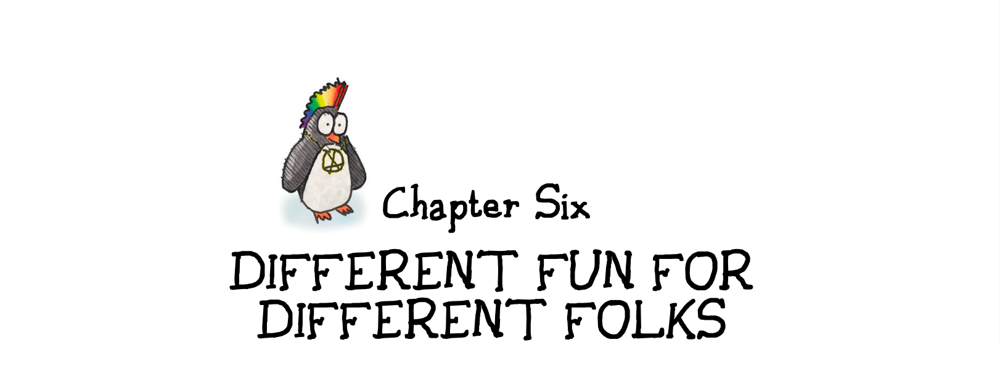
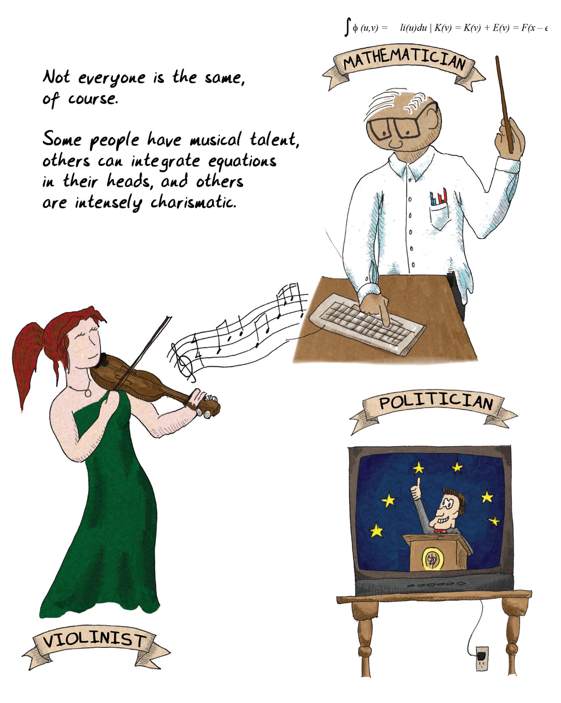
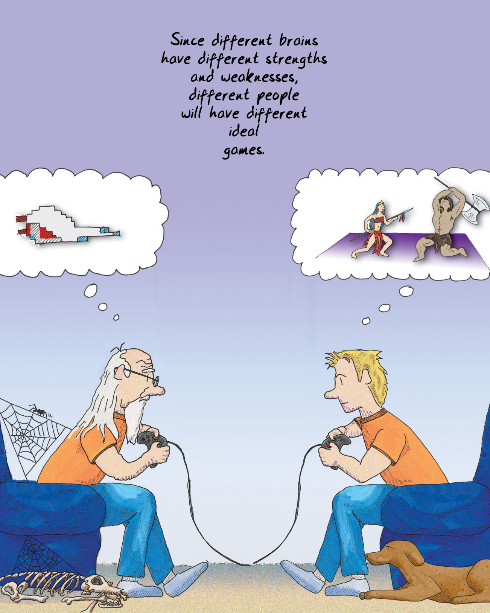
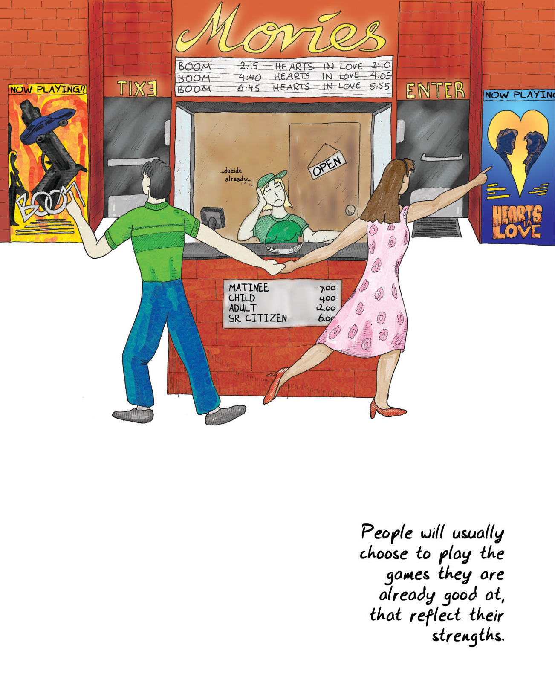
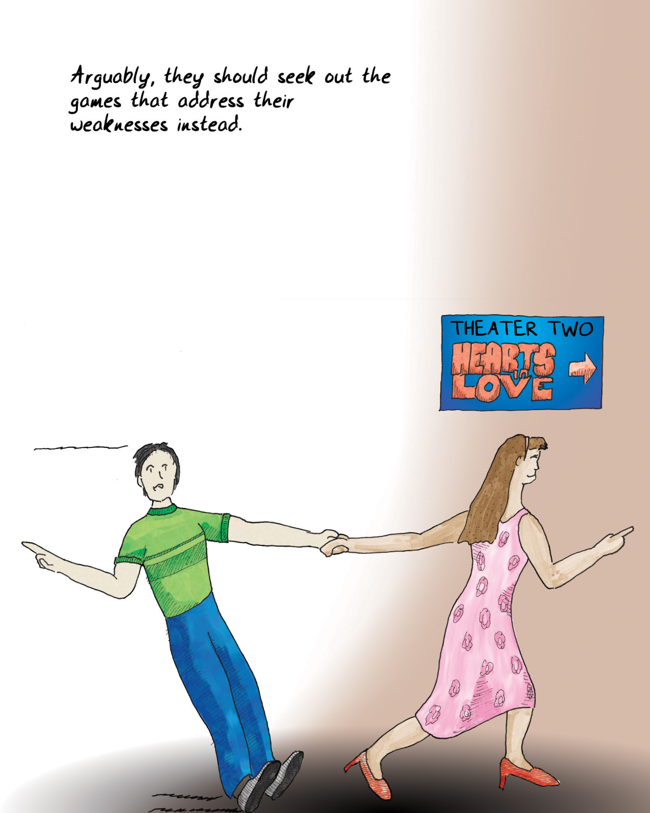

# Chapter 6 Different Fun for Different Folks 第六章 不同人的不同乐趣

We all know that people learn at different rates and in different ways. Some of these [differences manifest at a very early age](#user-content-fn-1)[^1]. Some people visualize things when they think of them; others are more verbal. Some people employ logic readily; others rely on leaps of intuition. [We still wrestle](#user-content-fn-2)[^2] with how to apply this knowledge to education. We're all familiar with the [bell curve distribution of IQ](#user-content-fn-3)[^3], and we're also familiar with the fact that IQ tests do not measure all forms of intelligence. [Howard Gardner](#user-content-fn-4)[^4] said there were in fact seven forms:

我们都知道，人们的学习速度和方式各不相同。有些[差异在很小的时候就显现出来](#user-content-fn-5)[^5]。有些人在思考问题时会将其形象化；有些人则更善于口头表达。有些人善于运用逻辑思维，有些人则依靠跳跃式的直觉。[我们仍在苦苦思索](#user-content-fn-6)[^6]如何将这些知识应用到教育中。我们都很熟悉[智商的钟形曲线分布](#user-content-fn-7)[^7]，我们也很熟悉智商测试并不能衡量所有形式的智能这一事实。[霍华德·加德纳](#user-content-fn-8)[^8]说，实际上有七种形式：

1. Linguistic 语言
2. Logical-mathematical 逻辑-数学
3. Bodily-kinesthetic 身体-动觉
4. Spatial 空间
5. Musical 音乐
6. Interpersonal 人际
7. Intrapersonal (internally directed, self-motivated) 自我（内在的，自我激励）

There aren't really standardized tests for these other types of intelligences (nor is this list authoritative!). Certainly the list suggests right off the bat that different people will be interested in different sorts of games because of their natural talents. People are not likely to tackle patterns and puzzles that appear as noise to them; they'll tend to select problems that they think they have a chance at solving. Hence the folks with bodily-kinesthetic intelligence might gravitate towards sports, whereas the linguistic folks may end up with crossword puzzles or *Scrabble*.

对于这些其他类型的智能，并没有真正的标准化测试（这份清单也不具有权威性！）。当然，这份清单一开始就表明，不同的人会因为自己的天赋而对不同类型的游戏感兴趣。人们不太可能去解决对他们来说是噪音的模式和谜题；他们会倾向于选择他们认为有机会解决的问题。因此，具有身体-动觉智能的人可能会倾向于体育运动，而具有语言智能的人可能会选择填字游戏或*拼字游戏*。

> Not everyone is the same, of course.
> 
> 当然，并不是每个人都一样。
> 
> Some people have musical talent, others can integrate equations in their heads, and others are intensely charismatic.
> 
> 有的人有音乐天赋，有的人能在脑子里对方程积分，还有的人极具魅力。
> 
> MATHEMATICIAN
> 
> 数学家
> 
> VIOLINIST
> 
> 小提琴手
> 
> POLITICIAN
> 
> 政治家

In recent years, much study has been centered on [gender differences](#user-content-fn-9)[^9]. It has finally become acceptable to discuss this topic without accusations of sexism. It's important to realize that in all cases, we're speaking in generalities, of averages. The [variation between individuals](#user-content-fn-10)[^10] of either sex is greater than the difference between the sexes, but the differences are real. One example: on average, females tend to have greater trouble with certain types of spatial perception—for example visualizing the cross section of an arbitrary three dimensional [shape that has been rotated to face a different way](#user-content-fn-11)[^11]. Conversely, males tend to have greater trouble with language skills. Doctors have long known that it takes longer for [boys to become verbally proficient](#user-content-fn-12)[^12]. Many of these [differences are actually disappearing over time](#user-content-fn-13)[^13], which suggests that they are cultural rather than biological.

近年来，许多研究都集中在[性别差异](#user-content-fn-14)[^14]上。人们终于可以在不指责性别歧视的情况下讨论这个话题了。重要的是要认识到，在任何情况下，我们都是在谈论一般情况和平均值。男女[个体之间的差异](#user-content-fn-15)[^15]大于两性之间的差异，但差异是真实存在的。举个例子：平均而言，女性在某些类型的空间感知方面往往会遇到更大的困难——例如，有一个任意三维形状，它被[旋转到不同的方向](#user-content-fn-16)[^16]，想象一下它的横截面。相反，男性在语言技能方面往往会遇到更大的困难。医生们早就知道，[男孩需要更长的时间才能熟练掌握语言](#user-content-fn-17)[^17]。随着时间的推移，这些[差异中的许多实际上正在消失](#user-content-fn-18)[^18]，这表明它们是文化差异而不是生理差异。

It speaks well of the power of video games that they can contribute to this disappearance. After all, the equation is both nature and nurture. Research has shown that if people who have trouble with spatial rotation tests are given a video game that encourages them to practice rotating objects and matching particular configurations in 3-D, not only will they master the spatial perception necessary, but the [results will be permanent](#user-content-fn-19)[^19].

电子游戏可以促进这种差异的消失，这充分说明了电子游戏的力量。毕竟，等式中既有天性，也有培养。研究表明，如果给那些在空间旋转测试中遇到困难的人提供一款电子游戏，鼓励他们练习旋转物体和匹配三维空间中的特定结构，他们不仅能掌握必要的空间感知能力，而且[效果将是永久性的](#user-content-fn-20)[^20]。

One researcher in the U.K., [Simon Baron-Cohen](#user-content-fn-21)[^21], has concluded that there are "systematizing brains" and "empathizing brains." He identifies extreme systematizing brains as being autistic and ones just slightly less so as being those diagnosed as having [Asperger's syndrome](#user-content-fn-22)[^22]. The distribution curve of systematizing brains versus empathizing brains, according to Baron-Cohen, is apparently influenced by gender. Men are somewhat more likely to have systematizing brains, and women more likely to have empathizing brains.

英国的一位研究人员[西蒙·巴伦·科恩](#user-content-fn-23)[^23]得出结论认为，人有“系统化大脑”和“移情大脑”之分。他认为极端的系统化大脑是自闭症患者，而稍微差一点的则被诊断为[阿斯伯格综合症](#user-content-fn-24)[^24]患者。巴伦·科恩认为，系统化大脑与移情大脑的分布曲线显然受到性别的影响。男性拥有系统化大脑的可能性更大一些，而女性拥有移情大脑的可能性更大一些。

According to Baron-Cohen's theory, there are people who have high abilities in both systematizing and empathizing. One would surmise that these people tend to go into the arts, which are heavily systematic and also require a high degree of empathy. Baron-Cohen postulates that having high abilities in both is a contraindicated survival trait, since it means that they are almost certainly not as good at either as the "specialists." This may explain all those consumptive poets dying in garrets.

根据巴伦·科恩的理论，有些人在系统化和移情方面都有很高的能力。我们可以推测，这些人倾向于从事艺术工作，因为艺术工作系统性很强，同时也需要高度的移情能力。巴隆·科恩推测，在这两方面都具有较高能力是一种不利的生存特征，因为这意味着他们几乎肯定在这两方面都不如“专家”。这或许可以解释那些死在阁楼里的肺痨病诗人。

> But as we tell our kids, if you work hard enough, you can overcome deficiencies. Talent is no substitute for hard work.
> 
> 但正如我们告诉孩子们的那样，只要你足够努力，就能克服不足。天赋不能取代努力。
> 
> POLITICIAN
> 
> 政治家
> 
> VIOLINIST
> 
> 小提琴手
> 
> encore! brava!
> 
> 安可！太棒了！
> 
> MATHEMATICIAN
> 
> 数学家

Another way to look at this is not in terms of intelligence but in terms of [learning styles](#user-content-fn-25)[^25]. Here again, gender shows itself. Men not only navigate space differently, but they tend to learn by trying, whereas women prefer to learn through modeling another's behavior. Recent research suggests that [men and women may even see differently](#user-content-fn-26)[^26], which cannot help but lead to different learning styles.

另一种方法不是从智力的角度，而是从[学习风格](#user-content-fn-27)[^27]的角度来看待这个问题。在这里，性别再次显现出来。男性不仅浏览空间的方式不同，而且他们倾向于通过尝试来学习，而女性则更喜欢通过模仿他人的行为来学习。最近的研究表明，[男性和女性的看到的不同](#user-content-fn-28)[^28]，这必然会导致不同的学习风格。

The classic ways of looking at learning styles and personalities are the [Keirsey Temperament Sorter](#user-content-fn-29)[^29] and the [Myers-Briggs personality type](#user-content-fn-30)[^30]. These are the ones with the four letter codes like INTP, ENFJ, and so on. Of course, there's also astrology, [enneagrams](#user-content-fn-31)[^31], and lots of others. Virtually all of these lack scientific basis. But there is a model based on widespread surveys of individuals from around the world: the [Five Factor Model](#user-content-fn-32)[^32]. This model finds five big domains of personality: Openness, Conscientiousness, Extraversion, Agreeableness, and Neuroticism.

观察学习风格和性格的经典方法是[凯尔西性格分类器](#user-content-fn-33)[^33]和[迈尔斯·布里格斯性格类型](#user-content-fn-34)[^34]。这些是带有像INTP、ENFJ等四字母代码的类型。当然，还有占星术、[九型人格](#user-content-fn-35)[^35]等许多其他方法。几乎所有这些都没有科学依据。但是，有一个基于对世界各地个体进行广泛调查的模型：[五因素模型](#user-content-fn-36)[^36]。这个模型发现了性格的五个大领域：开放性、责任心、外向性、宜人性和神经质。

Anecdotally, players tend to prefer certain types of games in ways that seem to correspond to their personalities. There is an effort now by game designer [Jason VandenBerghe](#user-content-fn-37)[^37] to find hard data on correlations between the Five Factor Model and the types of games that people play. 

据说，玩家倾向于偏好某些类型的游戏，这似乎与他们的性格相符。目前，游戏设计师[贾森·范登博格](#user-content-fn-38)[^38]正在努力寻找五因素模型与人们所玩游戏类型之间相关性的确凿数据。

This may seem obvious, but different people bring different experiences to the table. This implies they will have differing levels of ability in solving specific types of problems. Even things that are more fundamental than that may change over time; for example, the levels of hormones such as estrogen and testosterone fluctuate pretty significantly over the course of a life, and it's been shown that these fluctuations [affect personality](#user-content-fn-39)[^39]. 

这可能看起来很明显，但不同的人带来不同的经验。这意味着他们在解决特定类型问题时的能力水平各有不同。甚至比这更基本的事情也可能随时间而变化；例如，雌激素和睾酮等激素的水平在一生中会有相当大的波动，并且已经证明这些波动会[影响性格](#user-content-fn-40)[^40]。

What does this all mean for game designers? Not only will a given game be unlikely to appeal to everyone, but it is probably *impossible* for it to do so. The difficulty ramp is almost certain to be wrong for many people, and the basic premises are likely to be uninteresting or too difficult for large segments of the population.

这一切对游戏设计师意味着什么？一款游戏不仅不可能吸引所有人，而且很可能*无法*吸引所有人。对许多人来说，游戏的难度坡度几乎肯定是错误的，而游戏的基本前提很可能对大部分人来说是无趣或太难。

> Since different brains have different strengths and weaknesses, different people will have different ideal games.
> 
> 由于不同的大脑有不同的优劣势，不同的人也会有不同的理想游戏。

This may indicate a fundamental limitation of game systems. Since they are formal abstract systems, they are by their very nature biased towards certain types of brains, just as books are biased. (Most [book purchases](#user-content-fn-41)[^41] in the U.S. are made by women, and half are made by individuals over the age of 45.)

这可能表明了游戏系统的根本局限性。由于游戏系统是形式化的抽象系统，其本质是偏向于某些类型的大脑，就像书籍一样。(在美国，大多数[购买图书](#user-content-fn-42)[^42]的人都是女性，其中一半人年龄在是 45 岁以上。)

For years, the video game industry struggled with the lack of appeal of games to the female audience. Many possible reasons have been advanced for this: the rampant sexism in video games, the lack of a distribution channel that reached the female demographic, the juvenile themes, the fact that there were relatively few female creators in the industry, the fact that the games focused on violence.

多年来，电子游戏行业一直在为游戏对女性观众缺乏吸引力而苦苦挣扎。对此，人们提出了许多可能的原因：电子游戏中充斥的性别歧视、缺乏覆盖女性人群的发行渠道、题材幼稚、行业中女性创作者相对较少、游戏以暴力为主。

Perhaps the answer is simpler. Maybe games appealed to young males because they have the sort of brain that works well with the systems the games had, and they were designed by people with that same bias. If so, you'd expect to see the following:

也许答案更简单。也许游戏之所以吸引年轻男性，是因为他们的大脑能够很好地配合游戏的系统，而设计游戏的人也有同样的偏见。如果是这样，你就会看到以下情况：

* [Female players would gravitate toward games](#user-content-fn-43)[^43] with simpler abstract systems, less spatial reasoning, and more emphasis on interpersonal relationships, narrative, and empathy. They would also prefer games with simpler spatial topologies.\
    [女性玩家会倾向](#user-content-fn-44)[^44]于抽象系统较简单、空间推理较少、更强调人际关系、叙事和移情的游戏。她们也更喜欢空间拓扑结构更简单的游戏。

* There would be clear gender differences in play style between [hardcore gamers of different genders](#user-content-fn-45)[^45]. Males would focus on games emphasizing the projection of power and the control of territory, whereas females would select games that permit modeling behavior (such as multiplayer games) and do not demand strict hierarchies.\
    [不同性别的铁杆玩家](#user-content-fn-46)[^46]在游戏风格上会有明显的性别差异。男性会专注于强调权力投射和领土控制的游戏，而女性则会选择允许模拟行为（如多人游戏）和不要求严格等级制度的游戏。

* As males [aged](#user-content-fn-47)[^47], you'd expect them to slowly shift over to play styles similar to those of the women. Many of them might outright drop out of the gaming hobby. In contrast, older females likely wouldn't drop out of gaming; if anything, their interest in games might actually sharpen after menopause.\
    随着男性[年龄的增长](#user-content-fn-48)[^48]，你会发现他们会慢慢转向与女性类似的游戏风格。他们中的许多人可能会彻底退出游戏爱好。与此相反，老年女性可能不会退出游戏；如果有的话，她们对游戏的兴趣在绝经后可能会更加浓厚。

* There would be fewer female gamers in general, since no matter what, games are still about formal abstract systems at heart.\
    一般来说，女性游戏玩家会越来越少，因为无论如何，游戏的本质还是形式上的抽象系统。

You would also expect to see this change as the culture shifts towards greater equality in all things, and as games themselves do their work of teaching alternate ways of thinking.

你也可以预见，随着文化向着更加平等的方向转变，游戏本身也会教给人们另一种思维方式，这种情况也会发生变化。

> Movies
> 
> 电影
> 
> BOOM
> 
> 爆炸
> 
> HEARTS in LOVE
> 
> 恋爱中的心
> 
> ...decide already...
> 
> ……快决定吧……
> 
> People will usually choose to play the games they are already good at, that reflect their strengths.
> 
> 人们通常会选择玩自己擅长的游戏，这些游戏能展现他们的优势。

As it happens, we *did* see all of these in demographic data of game players (along with much more). Games may have been the province of 14-year-old boys because that's what games have selected for. Over the last ten years, far more *kinds* of games have been made, and there are now slightly more female players than male players.

事实上，我们*确实*在游戏玩家的人口统计数据中看到了所有这些数据（还有更多数据）。游戏可能曾经是 14 岁男孩的领域，因为那就是游戏所选择的群体。在过去的十年里，游戏的*种类*大大增加，现在女性玩家的数量略多于男性玩家。

As games become more prevalent in society, we'll likely see more young girls using the amazing brain-rewiring abilities of games to train themselves up and become more comfortable with the kinds of games the boys always liked. There has been research showing that girls who play "boys' games," such as sports, [tend to break out of traditional gender roles](#user-content-fn-49)[^49] years later, whereas girls who stick to "girls' games" tend to adhere to the traditional stereotypes more strictly.

随着游戏在社会中的普及，我们很可能会看到更多的年轻女孩利用游戏惊人的大脑重连能力来锻炼自己，并更适应男孩们一直喜欢的游戏类型。有研究表明，玩体育等“男孩游戏”的[女孩往往会在多年后打破传统的性别角色](#user-content-fn-50)[^50]，而坚持玩“女孩游戏”的女孩往往会更严格地遵守传统的刻板印象。

This argues pretty strongly that if people are to achieve their maximum potential, they need to do the hard work of playing the games they *don't* get, the games that *don't* appeal to their natures. Taking these on may serve as the nurture part of the equation, counterbalancing the brains that they were born with or culturally trained to have. The result would be people who move freely between worldviews, and who bring a wider array of skills to bear on a given problem.

这就有力地证明，如果人们要发挥自己的最大潜能，就需要付出艰苦的努力，去玩那些他们*不*理解的游戏，那些对他们的天性*没有*吸引力的游戏。玩这些游戏可以作为等式中的培养部分，抵消他们与生俱来的或文化训练出来的大脑。这样，人们就能在各种世界观之间自由转换，并在解决特定问题时发挥更广泛的技能。

The converse trick, of training boys up, might be harder for single-player games to achieve because it does not play to the strength of game systems as a medium. Nonetheless, games should try—perhaps with [designs emphasizing social interaction](#user-content-fn-51)[^51], such as in Diplomacy or online virtual worlds. The thought that games could be limited because of their fundamentally mathematical nature is somewhat depressing; but it hasn't stopped music from being a highly emotional medium, and language manages to convey mathematical thoughts, so there is hope for games yet.

反之，单机游戏可能更难做到培养男孩，因为它没有发挥游戏系统作为媒介的优势。尽管如此，游戏还是应该尝试——或许可以设计一些[强调社交互动的游戏](#user-content-fn-52)[^52]，如《外交》或在线虚拟世界。游戏因其基本的数学性质而受到限制的想法有些令人沮丧；但这并不妨碍音乐成为一种高度情感化的媒介，语言也能传达数学思想，所以游戏还是有希望的。

> Arguably, they should seek out the games that address their weaknesses instead.
> 
> 可以说，他们应该寻找针对自己弱点的游戏。

[^1]: Differences manifest at a very early age: In particular, we see this in the developmental schedule of boys versus girls.

[^2]: We still wrestle: A survey of "learning style" [studies](https://journals.sagepub.com/doi/full/10.1111/j.1539-6053.2009.01038.x) published in 2009 in APS, a journal of the Association for Psychological Science, concluded that there hasn't been enough rigor in testing learning-style-specific approaches alongside broad-based approaches. In other words, we'd need to run formal experiments with classes of students, one group taught with learning styles in mind, and the other not, to really assess whether it makes sense to essentially present curricula in multiple different ways. After all, teachers are a limited resource, and presenting the classes in one way that covers a reasonably broad base might actually net out as more efficient (though perhaps not maximizing each individual student's potential). That said, learning styles approaches are pretty widespread in educational theory circles, anyway.

[^3]: Bell curve distribution of IQ: The standard IQ (intelligence quotient) tests are normalized around an average score of 100. The tests need to be renormalized every few years, because we're all apparently getting smarter; this is called the Flynn Effect. IQ is not accepted by everyone as a valid measure of all sorts of intelligence. There is a concept called "emotional intelligence" as well, which argues that how well we understand and cope with emotions is at least as important, if not more so.

[^4]: Howard Gardner: In his book Frames of Mind, Gardner defined seven types of intelligence, arguing that IQ tests only measured the first two. More recently, he has argued that there are two more types of intelligence: naturalist intelligence and existentialist intelligence.

[^5]: 差异在很小的时候就显现出来：特别是，我们可以从男孩和女孩的发育时间表中看到这一点。

[^6]: 我们仍在苦苦思索：2009 年，心理科学协会的期刊《APS》发表了一份关于“学习风格”研究的[调查报告](https://journals.sagepub.com/doi/full/10.1111/j.1539-6053.2009.01038.x)，得出的结论是，在测试针对特定学习风格的方法和广泛的方法时，还不够严谨。换句话说，我们需要对班级学生进行正式实验，一组学生在教学时考虑到了学习风格，另一组则没有，以真正评估以多种不同方式呈现课程是否有意义。毕竟，教师的资源是有限的，以一种覆盖面相当广的方式授课可能会更有效率（尽管可能无法最大限度地发挥每个学生的潜能）。不过，无论如何，学习风格方法在教育理论界非常普遍。

[^7]: 智商的钟形曲线分布：标准智商（IQ）测试围绕平均分 100 进行归一化。测试每隔几年就需要重新归一化，因为我们显然都变得越来越聪明了；这就是所谓的弗林效应。并非所有人都认为智商是衡量各种智力的有效标准。还有一个概念叫做“情绪智能”，它认为我们对情绪的理解和应对能力至少同样重要，甚至更为重要。

[^8]: 霍华德·加德纳：加德纳在《心智框架》一书中定义了七种智能，认为智商测验只能测量前两种智能。最近，他又提出了另外两种智能类型：自然主义智能和存在主义智能。

[^9]: Gender differences: Two books that provide differing surveys of the field are Sex on the Brain: The Biological Differences Between Men and Women by Deborah Blum and Brain Sex: The Real Difference Between Men and Women by Anne Moir and David Jessel. Differences can be seen across large populations using statistical analysis. One example is the use of textual analysis to identify the gender of an author of a piece of text. Some papers on this subject can be found [here](https://www.joycerain.com/uploads/2/3/2/0/23207256/gender_differences_in_language_use.pdf) and [here](https://u.cs.biu.ac.il/~koppel/papers/male-female-text-final.pdf). To try this out yourself, visit [here](http://www.hackerfactor.com/GenderGuesser.php).

[^10]: Variations between individuals: A [survey](https://psycnet.apa.org/record/2014-04853-004) of available literature by Carothers and Reis in 2013 showed that virtually all psychological differences are "dimensional" rather than "taxonic." In other words, on average, yes, there are differences. But men and women overlap to an enormous degree on everything from personality types, to how they think of potential mates, measures of empathy, orientation towards care, fear of success, and many more. For any given trait, an individual might lean more towards one side or the other, so you cannot use measurements of any given trait as a predictor of gender. As yet unclear: the degree to which acculturation affects these results; psychological studies are notoriously biased demographically towards educated Westerners in college, because most psych studies use psych students as their subjects. An excellent survey of the differences that have been shown to exist can be found in The Cambridge Handbook of Intelligence (Cambridge University Press, 2011).

[^11]: Spatial rotation: A study in Norway found that differences in spatial rotation ability across genders manifest even in a society that has worked very hard to have gender equality. You can read the study at [here](http://www.ncbi.nlm.nih.gov/pubmed/23448540). There are no conclusions yet in the scientific community as to why exactly this is so, though of course various evolutionary reasons have been proposed.

[^12]: Language proficiency in boys: It is worth pointing out again that it is only on average that boys do worse in language proficiency; biological determinism alone does not doom a given individual. In some studies, boys have been shown to have a greater variable range in various skills than girls; for example, both the higher and lower ends of the IQ range tend to be populated with more males than females. There is also evidence, at least in older kids, that coeducational settings cause kids of both genders to shy away from the subjects that are supposed to be better suited to the opposite gender.

[^13]: Differences disappearing over time: In 1998, a survey of standardized test results showed that, with the exception of high-end math, performance among high schoolers was equalizing at a precipitous rate. See [here](https://psycnet.apa.org/record/1988-18577-001). Similar results were found in 2010 by a group at Duke looking at very high performers: http://bit.ly/2010-duke-differences.

[^14]: 性别差异：有两本书对这一领域进行了不同的研究，它们是德博拉·布卢姆所著的《大脑中的性别：男女之间的生物学差异》和安妮·莫尔和大卫·杰塞尔所著的《脑性别：男女之间的真正差异》。通过统计分析可以看出大量人群的差异。其中一个例子是使用文本分析来识别文本作者的性别。有关这方面的一些论文可以在[这里](https://www.joycerain.com/uploads/2/3/2/0/23207256/gender_differences_in_language_use.pdf)和[这里](https://u.cs.biu.ac.il/~koppel/papers/male-female-text-final.pdf)找到。 要亲自尝试，请访问[这里](http://www.hackerfactor.com/GenderGuesser.php)。

[^15]: 个体之间的差异：2013 年，卡罗瑟斯和赖斯对现有文献进行的一项[调查](https://psycnet.apa.org/record/2014-04853-004)显示，几乎所有的心理差异都是“维度上”而非“分类上”。换句话说，平均而言，确实存在差异。但是，从性格类型到如何看待潜在配偶、同理心测量、关爱取向、对成功的恐惧等等，男性和女性在各个方面都有很大程度的重叠。对于任何给定的特征，一个人都可能更倾向于一方或另一方，因此不能用任何给定特质的测量结果来预测性别。目前尚不清楚的是：文化同化对这些结果的影响程度；心理学研究在人口统计学上偏向于受过教育的西方大学生，这是众所周知的，因为大多数心理学研究都以心理系学生为研究对象。剑桥智能手册》（剑桥大学出版社，2011 年）对已证明存在的差异进行了出色的调查。

[^16]: 空间旋转：挪威的一项研究发现，即使是在一个努力实现性别平等的社会中，不同性别在空间旋转能力上的差异也是显而易见的。你可以在[这里](http://www.ncbi.nlm.nih.gov/pubmed/23448540)阅读这项研究。科学界还没有得出结论说这究竟是为什么，当然也有人提出了各种进化方面的原因。

[^17]: 男孩的语言能力：值得再次指出的是，男孩在语言能力方面表现较差只是平均水平；仅凭生物决定论并不能注定一个人的命运。一些研究表明，男孩在各种技能方面的可变范围大于女孩；例如，在智商范围的高端和低端，男性往往多于女性。也有证据表明，至少在年龄较大的孩子中，男女同校会导致男女孩子对那些本应更适合异性的科目望而却步。

[^18]: 差异逐渐消失：1998 年，一项对标准化考试结果的调查显示，除高端数学外，高中生的成绩正以迅雷不及掩耳之势趋于平稳。见[这里](https://psycnet.apa.org/record/1988-18577-001)。 2010 年，杜克大学的一个研究小组对成绩优异的学生进行了调查，也发现了类似的结果：http://bit.ly/2010-duke-differences。

[^19]: Permanent changes in rotation ability: To quote Skip Rizzo of USC, from the transcript of his presentation at the Annenberg Center's conference "Entertainment in the Interactive Age" in 2001: "On the paper and pencil test [of spatial rotation ability], men did much better than women. But when we replicated the test involving an integrated immersive interactive approach [e.g., with a video game], we found women performed as well as men...the important finding was that we found that when we administered the paper and pencil test afterwards, that men and women's scores were no longer significantly different." This is not a shocking result; it has also been seen among deaf kids, who typically suffer from problems in spatial rotation as well. See [here](https://www.researchgate.net/publication/11559123_Virtual_Reality_as_a_Tool_for_Improving_Spatial_Rotation_among_Deaf_and_Hard-of-Hearing_Children).

[^20]: 旋转能力的永久性变化：引用南加州大学的斯基普·里佐在 2001 年安纳伯格中心举办的“互动时代的娱乐”会议上的发言记录：“在纸笔测试（空间旋转能力）中，男性的表现比女性好得多。但是，当我们用一种综合的沉浸式互动方法（例如，用电子游戏）进行重复测试时，我们发现女性的表现与男性一样好……重要的发现是，我们发现当我们之后进行纸笔测试时，男性和女性的得分不再有显著差异。”这并不是一个令人震惊的结果；在聋哑儿童中也出现过这种情况，他们通常也有空间旋转方面的问题。参见[这里](https://www.researchgate.net/publication/11559123_Virtual_Reality_as_a_Tool_for_Improving_Spatial_Rotation_among_Deaf_and_Hard-of-Hearing_Children)。

[^21]: Simon Baron-Cohen: Baron-Cohen's theory, elucidated in his book The Essential Difference: Men, Women and the Extreme Male Brain, is controversial, although it echoes earlier theories about Thinking and Feeling brains. Baron-Cohen is an autism researcher, so he didn't come to this conclusion solely from gender research; boys suffer disproportionately from autism and Asperger's, and his hypothesis is that these are malfunctions of the "extreme systematizing brain." There are some [tests online](https://www.theguardian.com/life/news/page/0,12983,937443,00.html) that you can take to arrive at your "systematizing quotient" and "empathizing quotient."

[^22]: Asperger's syndrome: Commonly called "high-functioning autism," this syndrome is characterized by difficulty with social interactions and reading emotions. In DSM V Asperger's has been removed as a separate diagnosis, and instead will be simply considered to be on the autism spectrum.

[^23]: 西蒙·巴伦·科恩：巴伦·科恩在其《本质区别：男人、女人和极端的男性大脑》一书中阐明了这一理论，虽然与早先关于思考和感觉大脑的理论相呼应，但仍存在争议。巴龙·科恩是一名自闭症研究者，因此他并不只是从性别研究中得出这一结论；男孩患自闭症和阿斯伯格症的比例过高，而他的假设是，这些都是“极端系统化大脑”的功能障碍。网上有一些[测试](https://www.theguardian.com/life/news/page/0,12983,937443,00.html)，可以测出你的“系统化商数”和“情商”。

[^24]: 阿斯伯格综合症：这种综合症通常被称为“高功能自闭症”，其特点是难以进行社会交往和解读情绪。在精神障碍诊断和统计手册第五版中，阿斯伯格综合症已不再作为一个单独的诊断，而是被简单地视为自闭症谱系。

[^25]: Learning styles: Sheri Graner Ray's Gender Inclusive Game Design is an excellent book covering learning styles as they apply specifically to game design.

[^26]: Men and women seeing differently: Two examples of scientific work on this are [here](https://bsd.biomedcentral.com/articles/10.1186/2042-6410-3-21) and the [work](https://www.discovermagazine.com/mind/the-humans-with-super-human-vision) of Dr. Gabriele Jordan. In the first, researchers found that women had slightly faster reaction times in finding stationary objects, whereas men were faster at seeing moving ones. In classic evolutionary psych fashion, these were promptly termed "gathering eye" and "hunting eye" in the media. The other study is about color perception. The typical human has three cones and rods for seeing colors. Many men only have two functioning ones, which leads to a far greater prevalence of colorblindness. Recently it has been found that some women have four. Women with four functioning cones and rods are termed "true tetrachromats" and are able to see more colors than other humans.

[^27]: 学习风格：谢里·格拉纳·雷的《游戏设计中的性别包容》是一本很好的书，它专门介绍了适用于游戏设计的学习风格。

[^28]: 男性和女性的看到的不同：[这里](https://bsd.biomedcentral.com/articles/10.1186/2042-6410-3-21)和加布里埃尔·乔丹博士的[工作](https://www.discovermagazine.com/mind/the-humans-with-super-human-vision)是这方面科学研究的两个例子。在第一项研究中，研究人员发现女性发现静止物体的反应时间稍快，而男性看到移动物体的反应时间更快。按照经典的进化心理学方式，媒体迅速将其称为“采集眼”和“狩猎眼”。另一项研究是关于颜色感知的。典型的人类有三个锥状体和杆状体来观察颜色。许多男性只有两个，这导致色盲的发生率要高得多。最近发现，有些女性有四个。拥有四个视锥和视杆细胞的女性被称为“真正的四色人”，她们比其他人能看到更多的颜色。

[^29]: Kiersey Temperament Sorter: A derivation of the Myers-Briggs personality type that uses a slightly different organizing metaphor based on the Hippocratic temperaments.

[^30]: Myers-Briggs personality type: Based on the theories of Carl Jung, this psychometric tool measures a subject's preference for one side or another of four different dichotomies. The results can be read as classifying an individual into one of 16 personality types, but in psychology they are intended to indicate preference for given approaches to problem-solving.

[^31]: Enneagrams: Another personality classification system, enneagrams have nine different types into which people can fall. Each type has two subsidiary characteristics as well; the enneagram is diagrammed on a circle, so the "wings," or secondary types, are therefore the neighbors on the circle. Enneagrams are not based on empirical study or psychological theory so much as they are based on the seven deadly sins and numerology.

[^32]: Five Factor Model: Also known as the Big Five, OCEAN, CANOE, and more. Each of these five breaks down further into more subcategories. The five factors were found via cross-cultural metastudies, and though there is still debate about aspects of the model, it is widely used in the psychology community. The FFM does show some gender differences on average, as well as significant variances across cultures. Some cultures may not have one or another of the five factors.

[^33]: 凯尔西性格分类器：迈尔斯·布里格斯人格类型的衍生，使用了一种基于希波克拉底气质的略有不同的组织隐喻。

[^34]: 迈尔斯·布里格斯性格类型：这种心理测量工具以卡尔·荣格的理论为基础，测量受试者对四种不同二分法中的某一方或另一方的偏好。其结果可被解读为将一个人划分为 16 种人格类型中的一种，但在心理学中，其目的是表示对特定解决问题方法的偏好。

[^35]: 九型人格：九型人格是另一种人格分类系统，它将人分为九种不同的类型。每种类型都有两个附属特征；九型人格的图解是一个圆形，因此“翅膀”或次级类型就是圆形上的邻居。九型人格不是基于经验研究或心理学理论，而是基于七宗罪和命理学。

[^36]: 五因素模型：也称为大五性格、OCEAN、CANOE 等。这五种因素中的每一种又进一步细分为更多的子类别。这五个因素是通过跨文化元研究发现的，尽管对该模型的某些方面仍有争议，但它在心理学界被广泛使用。五因素模型确实在平均水平上显示出一些性别差异，以及跨文化的显著差异。有些文化可能不具备五个因子中某些因子。

[^37]: Jason VandenBerghe: His work has been presented at a few Game Developer Conference events, and you can see his presentation [here](https://ubm-twvideo01.s3.amazonaws.com/o1/vault/gdc2012/slides/Design%20Track/VandenBerghe_Jason_The_5_Domains.pdf).

[^38]: 贾森·范登博格：他的研究成果曾在几次游戏开发者大会上发表过，你可以[这里](https://ubm-twvideo01.s3.amazonaws.com/o1/vault/gdc2012/slides/Design%20Track/VandenBerghe_Jason_The_5_Domains.pdf)看到他的演讲。

[^39]: Hormone effects on personality: Many hormones have been implicated in personality differences, but there are no clear-cut answers as to why exactly this happens, nor can it be helpfully used as a predictor. That said, as testosterone decreases in males over their lives, they tend towards reduced aggression. Men convicted of violent crimes show higher levels of testosterone than noncriminal men or men convicted of nonviolent crimes.

[^40]: 荷尔蒙对性格的影响：许多激素都被认为与性格差异有关，但究竟为什么会出现这种情况，目前还没有明确的答案，也不能将其作为一种有用的预测指标。不过，随着男性体内睾丸激素的减少，他们的攻击性会降低。被判犯有暴力罪行的男性比未犯罪的男性或被判犯有非暴力罪行的男性显示出更高的睾酮水平。

[^41]: Book purchases: The statistic on the ages of women book purchasers comes from the U.S. Census Bureau. For an impressive statistic regarding book purchases by women, consider that romance novels account for almost half of all paperback sales in America. Ninety-three percent of them sell to women.

[^42]: 图书购买：关于女性购书者年龄的统计数据来自美国人口普查局。关于女性购书的一个令人印象深刻的统计数据是，爱情小说几乎占美国平装书销售总量的一半。其中 93% 卖给了女性。

[^43]: Female preferences in games: The most popular game genres among women are puzzle and parlor games. This preference is so marked that despite a low penetration of single-player games into the female market, women playing games online make up 51 percent of the online marketplace. The bulk of this large audience is playing puzzle games.

[^44]: 女性对游戏的偏好：最受女性欢迎的游戏类型是益智游戏和客厅游戏。这种偏好非常明显，尽管单机游戏对女性市场的渗透率很低，但玩在线游戏的女性占在线市场的 51%。在这一庞大的受众群体中，大部分都在玩益智游戏。

[^45]: Hardcore players of different genders: The population of women in online role-playing games varies from 15 percent to 50 percent, depending on the game. In comparison, the female market for traditional single-player games sold in retail channels is more like 5 percent.

[^46]: 不同性别的铁杆玩家：在线角色扮演游戏的女性玩家比例从 15% 到 50%不等，视游戏而定。相比之下，在零售渠道销售的传统单机游戏的女性市场比例仅为 5%。

[^47]: Aging game players: Nick Yee was able to graph the differences in male and female behavior across ages after surveying a few thousand players of massively multiplayer online games, aka "MMOs." Younger males tended towards the more violent activities in the game, and older males tended to more closely match the behavior of females. The percentage of the respondents who were of a given gender showed markedly different distributions across age; there was a huge spike in younger males, whereas the number of females tended to remain relatively even across ages. Yee's Daedalus Project can be found [here](http://www.nickyee.com/daedalus/). We should not equate this to the theory of "dedifferentiation," which asserted that as we age, our cognitive strengths and weaknesses get "smoothed out." In 2003, the APA issued a press release about dedifferentiation stating that longitudinal studies had disproven it.

[^48]: 老年游戏玩家：尼克·易在对几千名大型多人在线游戏（又称“网络游戏”）玩家进行调查后，绘制出了不同年龄段的男女行为差异图。年轻男性倾向于游戏中更暴力的活动，而年长男性则更接近女性的行为。受访者中特定性别的比例在不同年龄段的分布明显不同；年轻男性的比例激增，而女性的比例在不同年龄段相对均衡。易的代达罗斯项目可在[这里](http://www.nickyee.com/daedalus/)找到。我们不应该把这等同于“去差异化”理论，该理论断言随着年龄的增长，我们的认知强项和弱项都会被“抹平”。2003 年，美国心理学会发布了一份关于“去差异化”的新闻稿，称纵向研究已经推翻了这一理论。

[^49]: Girls breaking out of traditional gender roles: Reuters reported in September 2004 on a study performed at Penn State that showed that the games played by kids at age 10 had a significant correlation with their academic performance years later. Girls who played sports at age 10 became more interested in math at age 12 than girls who didn't do sports. Girls who spent time on stereotypically "girly" activities such as knitting, reading, dancing, and playing with dolls tended to perform better later in subjects such as English.

[^50]: 女孩打破传统性别角色：路透社 2004 年 9 月报道了宾夕法尼亚州立大学进行的一项研究，该研究表明，孩子们 10 岁时玩的游戏与他们多年后的学习成绩有很大关系。与不参加体育运动的女孩相比，10 岁时参加体育运动的女孩 12 岁时对数学更感兴趣。把时间花在编织、阅读、跳舞和玩洋娃娃等刻板印象中的“少女”活动上的女孩，日后在英语等科目上的表现往往更好。

[^51]: Designs emphasizing social interaction: (Also, see note in Chapter 4 on Diplomacy.) Virtually all games involving negotiation or collaborative storytelling or problem solving might fit the bill. Other examples could include Pandemic, any of the many tabletop role-playing games that de-emphasize combat, and socially-demanding online games such as massively multiplayer online role playing games (MMORPGs).

[^52]: 强调社交互动的设计：（另见[第四章](chapter-4.md)“外交”中的注释）几乎所有涉及谈判、合作讲故事或解决问题的游戏都可能符合要求。其他例子还包括大流行、许多不强调战斗的桌面角色扮演游戏中的任何一种，以及大型多人在线角色扮演游戏（MMORPG）等需要社交的网络游戏。