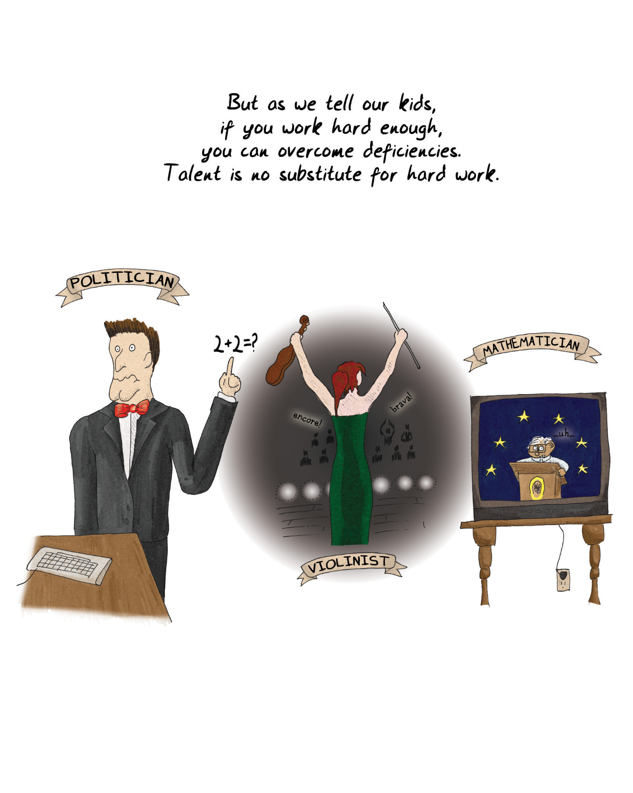

We all know that people learn at different rates and in different ways. Some of these [differences manifest at a very early age](#user-content-fn-1)[^1]. Some people visualize things when they think of them; others are more verbal. Some people employ logic readily; others rely on leaps of intuition. We [still wrestle](#user-content-fn-2)[^2] with how to apply this knowledge to education. We're all familiar with the [bell curve distribution of IQ](#user-content-fn-3)[^3], and we're also familiar with the fact that IQ tests do not measure all forms of intelligence. [Howard Gardner](#user-content-fn-4)[^4] said there were in fact seven forms:

我们都知道，人们的学习速度和方式各不相同。有些[差异在很小的时候就表现](#user-content-fn-5)[^5]出来了。有些人在思考问题时会将其形象化；有些人则更善于口头表达。有些人善于运用逻辑思维，有些人则依靠跳跃式的直觉。我们仍在[苦苦思索](#user-content-fn-6)[^6]如何将这些知识应用到教育中。我们都很熟悉[智商的钟形曲线分布](#user-content-fn-7)[^7]，我们也很熟悉智商测试并不能衡量所有形式的智能这一事实。[霍华德·加德纳](#user-content-fn-8)[^8]说，实际上有七种形式：

1. Linguistic 语言
2. Logical-mathematical 逻辑-数学
3. Bodily-kinesthetic 身体-动觉
4. Spatial 空间
5. Musical 音乐
6. Interpersonal 人际
7. Intrapersonal (internally directed, self-motivated) 自我（内在的，自我激励）

There aren't really standardized tests for these other types of intelligences (nor is this list authoritative!). Certainly the list suggests right off the bat that different people will be interested in different sorts of games because of their natural talents. People are not likely to tackle patterns and puzzles that appear as noise to them; they'll tend to select problems that they think they have a chance at solving. Hence the folks with bodily-kinesthetic intelligence might gravitate towards sports, whereas the linguistic folks may end up with crossword puzzles or Scrabble.

对于这些其他类型的智能，并没有真正的标准化测试（这份清单也不具有权威性！）。当然，这份清单一开始就表明，不同的人会因为自己的天赋而对不同类型的游戏感兴趣。人们不太可能去解决对他们来说是噪音的模式和谜题；他们会倾向于选择他们认为有机会解决的问题。因此，具有身体-动觉智能的人可能会倾向于体育运动，而具有语言智能的人可能会选择填字游戏或拼字游戏。

> Not everyone is the same, of course.
> 
> 当然，并不是每个人都一样。
> 
> Some people have musical talent, others can integrate equations in their heads, and others are intensely charismatic.
> 
> 有的人有音乐天赋，有的人能在脑子里整合方程式，还有的人极具魅力。
> 
> MATHEMATICIAN
> 
> 数学
> 
> VIOLINIST
> 
> 小提琴手
> 
> POLITICIAN
> 
> 政治家

In recent years, much study has been centered on [gender differences](#user-content-fn-9)[^9]. It has finally become acceptable to discuss this topic without accusations of sexism. It's important to realize that in all cases, we're speaking in generalities, of averages. The [variation between individuals](#user-content-fn-10)[^10] of either sex is greater than the difference between the sexes, but the differences are real. One example: on average, females tend to have greater trouble with certain types of spatial perception—for example visualizing the cross section of an arbitrary three dimensional [shape that has been rotated to face a different way](#user-content-fn-11)[^11]. Conversely, males tend to have greater trouble with language skills. Doctors have long known that it takes longer for [boys to become verbally proficient](#user-content-fn-12)[^12]. Many of these [differences are actually disappearing over time](#user-content-fn-13)[^13], which suggests that they are cultural rather than biological.

近年来，许多研究都集中在[性别差异](#user-content-fn-14)[^14]上。人们终于可以在不指责性别歧视的情况下讨论这个话题了。重要的是要认识到，在任何情况下，我们都是在谈论一般情况和平均值。男女[个体之间的差异](#user-content-fn-15)[^15]大于两性之间的差异，但差异是真实存在的。举个例子：平均而言，女性在某些类型的空间感知方面往往会遇到更大的困难——例如，有一个任意三维形状，它被[旋转到不同的方向](#user-content-fn-16)[^16]，想象一下它的横截面。相反，男性在语言技能方面往往会遇到更大的困难。医生们早就知道，[男孩需要更长的时间才能熟练掌握语言](#user-content-fn-17)[^17]。随着时间的推移，这些[差异中的许多实际上正在消失](#user-content-fn-18)[^18]，这表明它们是文化差异而不是生理差异。

It speaks well of the power of video games that they can contribute to this disappearance. After all, the equation is both nature and nurture. Research has shown that if people who have trouble with spatial rotation tests are given a video game that encourages them to practice rotating objects and matching particular configurations in 3-D, not only will they master the spatial perception necessary, but the [results will be permanent](#user-content-fn-19)[^19].

电子游戏可以促进这种差异的消失，这充分说明了电子游戏的力量。毕竟，等式中既有天性，也有教养。研究表明，如果给那些在空间旋转测试中遇到困难的人提供一款电子游戏，鼓励他们练习旋转物体和匹配三维空间中的特定结构，他们不仅能掌握必要的空间感知能力，而且[效果将是永久性的](#user-content-fn-20)[^20]。

One researcher in the U.K., [Simon Baron-Cohen](#user-content-fn-21)[^21], has concluded that there are "systematizing brains" and "empathizing brains." He identifies extreme systematizing brains as being autistic and ones just slightly less so as being those diagnosed as having [Asperger's syndrome](#user-content-fn-22)[^22]. The distribution curve of systematizing brains versus empathizing brains, according to Baron-Cohen, is apparently influenced by gender. Men are somewhat more likely to have systematizing brains, and women more likely to have empathizing brains.

英国的一位研究人员[西蒙·巴伦·科恩](#user-content-fn-23)[^23]得出结论认为，人有“系统化大脑”和“移情大脑”之分。他认为极端的系统化大脑是自闭症患者，而稍微差一点的则被诊断为[阿斯伯格综合症](#user-content-fn-24)[^24]患者。巴伦·科恩认为，系统化大脑与移情大脑的分布曲线显然受到性别的影响。男性拥有系统化大脑的可能性更大一些，而女性拥有移情大脑的可能性更大一些。

According to Baron-Cohen's theory, there are people who have high abilities in both systematizing and empathizing. One would surmise that these people tend to go into the arts, which are heavily systematic and also require a high degree of empathy. Baron-Cohen postulates that having high abilities in both is a contraindicated survival trait, since it means that they are almost certainly not as good at either as the "specialists." This may explain all those consumptive poets dying in garrets.

根据巴伦·科恩的理论，有些人在系统化和移情方面都有很高的能力。我们可以推测，这些人倾向于从事艺术工作，因为艺术工作系统性很强，同时也需要高度的移情能力。巴隆·科恩推测，在这两方面都具有较高能力是一种禁忌的生存特征，因为这意味着他们几乎肯定在这两方面都不如“专家”。这或许可以解释那些死在阁楼里的肺痨病诗人。

> But as we tell our kids, if you work hard enough, you can overcome deficiencies. Talent is no substitute for hard work.
> 
> 但正如我们告诉孩子们的那样，只要你足够努力，就能克服不足。天赋不能取代努力。
> 
> POLITICIAN
> 
> 政治家
> 
> VIOLINIST
> 
> 小提琴手
> 
> encore! brava!
> 
> 安可！太棒了！
> 
> MATHEMATICIAN
> 
> 数学家

[^1]: Differences manifest at a very early age: In particular, we see this in the developmental schedule of boys versus girls.

[^2]: We still wrestle: A survey of "learning style" studies published in 2009 in APS, a journal of the Association for Psychological Science (http://web.missouri.edu/~segerti/1000/learningstyles.pdf), concluded that there hasn't been enough rigor in testing learning-style-specific approaches alongside broad-based approaches. In other words, we'd need to run formal experiments with classes of students, one group taught with learning styles in mind, and the other not, to really assess whether it makes sense to essentially present curricula in multiple different ways. After all, teachers are a limited resource, and presenting the classes in one way that covers a reasonably broad base might actually net out as more efficient (though perhaps not maximizing each individual student's potential). That said, learning styles approaches are pretty widespread in educational theory circles, anyway.

[^3]: Bell curve distribution of IQ: The standard IQ (intelligence quotient) tests are normalized around an average score of 100. The tests need to be renormalized every few years, because we're all apparently getting smarter; this is called the Flynn Effect. IQ is not accepted by everyone as a valid measure of all sorts of intelligence. There is a concept called "emotional intelligence" as well, which argues that how well we understand and cope with emotions is at least as important, if not more so.

[^4]: Howard Gardner: In his book Frames of Mind, Gardner defined seven types of intelligence, arguing that IQ tests only measured the first two. More recently, he has argued that there are two more types of intelligence: naturalist intelligence and existentialist intelligence.

[^5]: 差异在很小的时候就显现出来：特别是，我们可以从男孩和女孩的发育时间表中看到这一点。

[^6]: 我们仍在摔跤：2009 年，心理科学协会的期刊《APS》发表了一份关于“学习风格”研究的调查报告，得出的结论是，在测试针对特定学习风格的方法和广泛的方法时，还不够严谨。换句话说，我们需要对班级学生进行正式实验，一组学生在教学时考虑到了学习风格，另一组则没有，以真正评估以多种不同方式呈现课程是否有意义。毕竟，教师的资源是有限的，以一种覆盖面相当广的方式授课可能会更有效率（尽管可能无法最大限度地发挥每个学生的潜能）。不过，无论如何，学习风格方法在教育理论界非常普遍。

[^7]: 智商的钟形曲线分布：标准智商（IQ）测试围绕平均分 100 进行归一化。测试每隔几年就需要重新归一化，因为我们显然都变得越来越聪明了；这就是所谓的弗林效应。并非所有人都认为智商是衡量各种智力的有效标准。还有一个概念叫做“情绪智能"，它认为我们对情绪的理解和应对能力至少同样重要，甚至更为重要。

[^8]: 霍华德·加德纳：加德纳在《心智框架》一书中定义了七种智能，认为智商测验只能测量前两种智能。最近，他又提出了另外两种智能类型：自然主义智能和存在主义智能。

[^9]: Gender differences: Two books that provide differing surveys of the field are Sex on the Brain: The Biological Differences Between Men and Women by Deborah Blum and Brain Sex: The Real Difference Between Men and Women by Anne Moir and David Jessel. Differences can be seen across large populations using statistical analysis. One example is the use of textual analysis to identify the gender of an author of a piece of text. Some papers on this subject can be found here: http://homepage.psy.utexas.edu/homepage/faculty/pennebaker/reprints/NewmanSexDif2007.pdf and here: http://u.cs.biu.ac.il/~koppel/papers/male-female-text-final.pdf. To try this out yourself, visit http://www.hackerfactor.com/GenderGuesser.php.

[^10]: Variations between individuals: A survey of available literature by Carrothers and Reis in 2013 (http://bit.ly/survey-carrothers-reis) showed that virtually all psychological differences are “dimensional” rather than “taxonic.” In other words, on average, yes, there are differences. But men and women overlap to an enormous degree on everything from personality types, to how they think of potential mates, measures of empathy, orientation towards care, fear of success, and many more. For any given trait, an individual might lean more towards one side or the other, so you cannot use measurements of any given trait as a predictor of gender. As yet unclear: the degree to which acculturation affects these results; psychological studies are notoriously biased demographically towards educated Westerners in college, because most psych studies use psych students as their subjects. An excellent survey of the differences that have been shown to exist can be found in The Cambridge Handbook of Intelligence (Cambridge University Press, 2011).

[^11]: Spatial rotation: A study in Norway found that differences in spatial rotation ability across genders manifest even in a society that has worked very hard to have gender equality. You can read the study at http://www.ncbi.nlm.nih.gov/pubmed/23448540. There are no conclusions yet in the scientific community as to why exactly this is so, though of course various evolutionary reasons have been proposed.

[^12]: Language proficiency in boys: It is worth pointing out again that it is only on average that boys do worse in language proficiency; biological determinism alone does not doom a given individual. In some studies, boys have been shown to have a greater variable range in various skills than girls; for example, both the higher and lower ends of the IQ range tend to be populated with more males than females. There is also evidence, at least in older kids, that coeducational settings cause kids of both genders to shy away from the subjects that are supposed to be better suited to the opposite gender.

[^13]: Differences disappearing over time: In 1998, a survey of standardized test results showed that, with the exception of high-end math, performance among high schoolers was equalizing at a precipitous rate. See Feingold, http://bit.ly/psycnet-Feingold. Similar results were found in 2010 by a group at Duke looking at very high performers: http://bit.ly/2010-duke-differences.

[^14]: 性别差异：有两本书对这一领域进行了不同的研究，它们是德博拉·布卢姆所著的《大脑中的性别：男女之间的生物学差异》和安妮·莫尔 和大卫·杰塞尔所著的《大脑中的性别：男女之间的真正差异》。通过统计分析可以看出大量人群的差异。其中一个例子是使用文本分析来识别文本作者的性别。有关这方面的一些论文可以在这里找到：http://homepage.psy.utexas.edu/homepage/faculty/pennebaker/reprints/NewmanSexDif2007.pdf 和这里：http://u.cs.biu.ac.il/~koppel/papers/male-female-text-final.pdf。 要亲自尝试，请访问 http://www.hackerfactor.com/GenderGuesser.php。

[^15]: 个体之间的差异：2013 年，卡罗瑟斯和赖斯对现有文献进行的一项调查（http://bit.ly/survey-carrothers-reis） 显示，几乎所有的心理差异都是“维度上”而非“分类上”。换句话说，平均而言，确实存在差异。但是，从性格类型到如何看待潜在配偶、同理心测量、关爱取向、对成功的恐惧等等，男性和女性在各个方面都有很大程度的重叠。对于任何给定的特征，一个人都可能更倾向于一方或另一方，因此不能用任何给定特质的测量结果来预测性别。目前尚不清楚的是：文化同化对这些结果的影响程度；心理学研究在人口统计学上偏向于受过教育的西方大学生，这是众所周知的，因为大多数心理学研究都以心理系学生为研究对象。剑桥智能手册》（剑桥大学出版社，2011 年）对已证明存在的差异进行了出色的调查。

[^16]: 空间旋转：挪威的一项研究发现，即使是在一个努力实现性别平等的社会中，不同性别在空间旋转能力上的差异也是显而易见的。您可以在 http://www.ncbi.nlm.nih.gov/pubmed/23448540 上阅读这项研究。科学界还没有得出结论说这究竟是为什么，当然也有人提出了各种进化方面的原因。

[^17]: 男孩的语言能力：值得再次指出的是，男孩在语言能力方面表现较差只是平均水平；仅凭生物决定论并不能注定一个人的命运。一些研究表明，男孩在各种技能方面的可变范围大于女孩；例如，在智商范围的高端和低端，男性往往多于女性。也有证据表明，至少在年龄较大的孩子中，男女同校会导致男女孩子对那些本应更适合异性的科目望而却步。

[^18]: 差异逐渐消失：1998 年，一项对标准化考试结果的调查显示，除高端数学外，高中生的成绩正以迅雷不及掩耳之势趋于平稳。见 Feingold, http://bit.ly/psycnet-Feingold。 2010 年，杜克大学的一个研究小组对成绩优异的学生进行了调查，也发现了类似的结果：http://bit.ly/2010-duke-differences。

[^19]: Permanent changes in rotation ability: To quote Skip Rizzo of USC, from the transcript of his presentation at the Annenberg Center's conference "Entertainment in the Interactive Age" in 2001: "On the paper and pencil test [of spatial rotation ability], men did much better than women. But when we replicated the test involving an integrated immersive interactive approach [e.g., with a video game], we found women performed as well as men...the important finding was that we found that when we administered the paper and pencil test afterwards, that men and women's scores were no longer significantly different." This is not a shocking result; it has also been seen among deaf kids, who typically suffer from problems in spatial rotation as well. See http://bit.ly/deaf-spatial-rotation.

[^20]: 旋转能力的永久性变化：引用南加州大学的斯基普·里佐在 2001 年安纳伯格中心举办的“互动时代的娱乐”会议上的发言记录：“在纸笔测试（空间旋转能力）中，男性的表现比女性好得多。但是，当我们用一种综合的沉浸式互动方法（例如，用电子游戏）进行重复测试时，我们发现女性的表现与男性一样好……重要的发现是，我们发现当我们之后进行纸笔测试时，男性和女性的得分不再有显著差异。”这并不是一个令人震惊的结果；在聋哑儿童中也出现过这种情况，他们通常也有空间旋转方面的问题。参见 http://bit.ly/deaf-spatial-rotation。

[^21]: Simon Baron-Cohen: Baron-Cohen's theory, elucidated in his book The Essential Difference: Men, Women and the Extreme Male Brain, is controversial, although it echoes earlier theories about Thinking and Feeling brains. Baron-Cohen is an autism researcher, so he didn't come to this conclusion solely from gender research; boys suffer disproportionately from autism and Asperger's, and his hypothesis is that these are malfunctions of the "extreme systematizing brain." There are some [tests online](https://www.theguardian.com/life/news/page/0,12983,937443,00.html) that you can take to arrive at your "systematizing quotient" and "empathizing quotient."

[^22]: Asperger's syndrome: Commonly called “high-functioning autism,” this syndrome is characterized by difficulty with social interactions and reading emotions. In DSM V Asperger's has been removed as a separate diagnosis, and instead will be simply considered to be on the autism spectrum.

[^23]: 西蒙·巴伦·科恩：巴伦·科恩在其《本质区别：男人、女人和极端的男性大脑》一书中阐明了这一理论，虽然与早先关于思考和感觉大脑的理论相呼应，但仍存在争议。巴龙·科恩是一名自闭症研究者，因此他并不只是从性别研究中得出这一结论；男孩患自闭症和阿斯伯格症的比例过高，而他的假设是，这些都是“极端系统化大脑”的功能障碍。网上有一些[测试](https://www.theguardian.com/life/news/page/0,12983,937443,00.html)，可以测出你的“系统化商数”和“情商”。

[^24]: 阿斯伯格综合症：这种综合症通常被称为“高功能自闭症”，其特点是难以进行社会交往和解读情绪。在精神障碍诊断和统计手册第五版中，阿斯伯格综合症已不再作为一个单独的诊断，而是被简单地视为自闭症谱系。