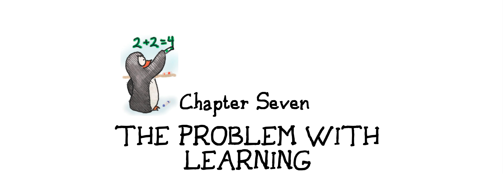
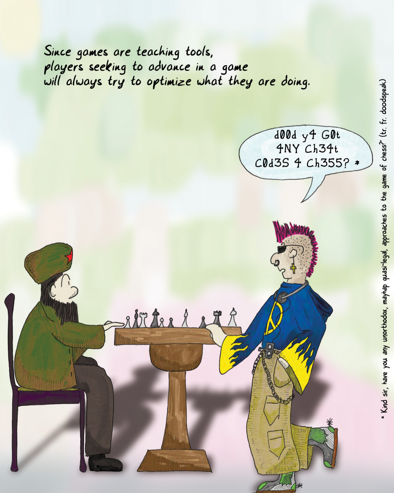
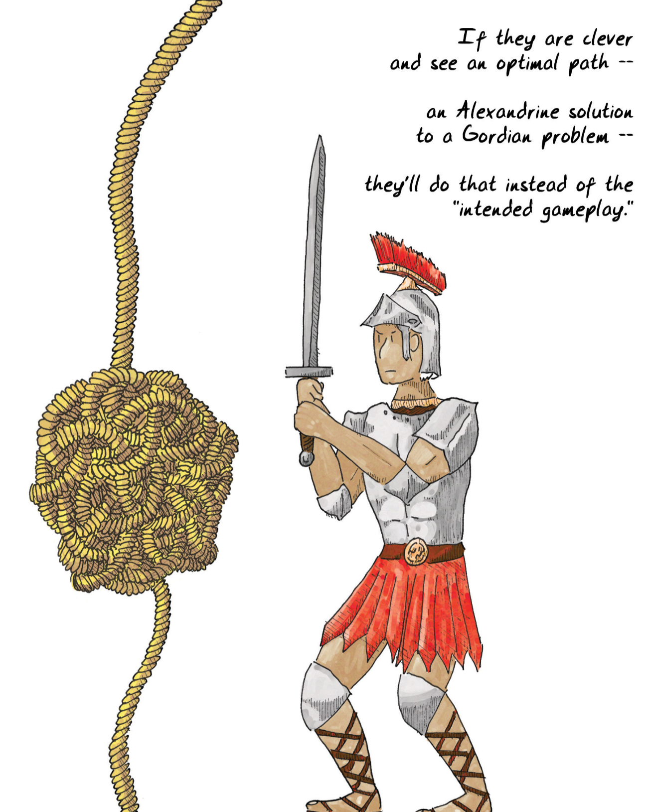
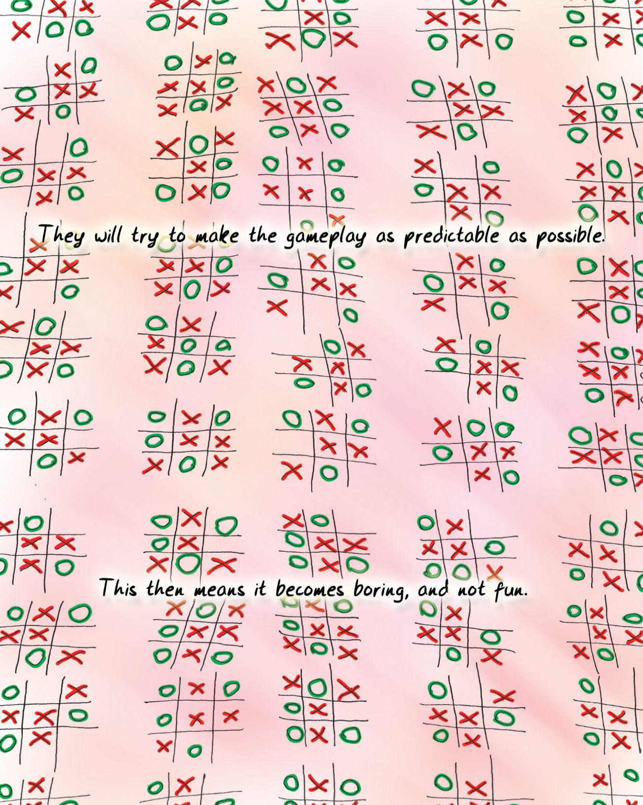
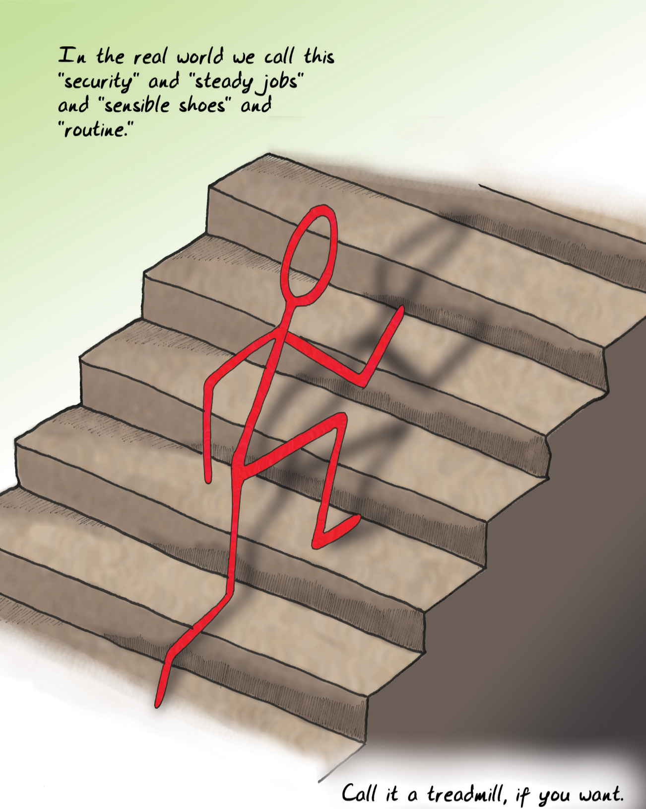
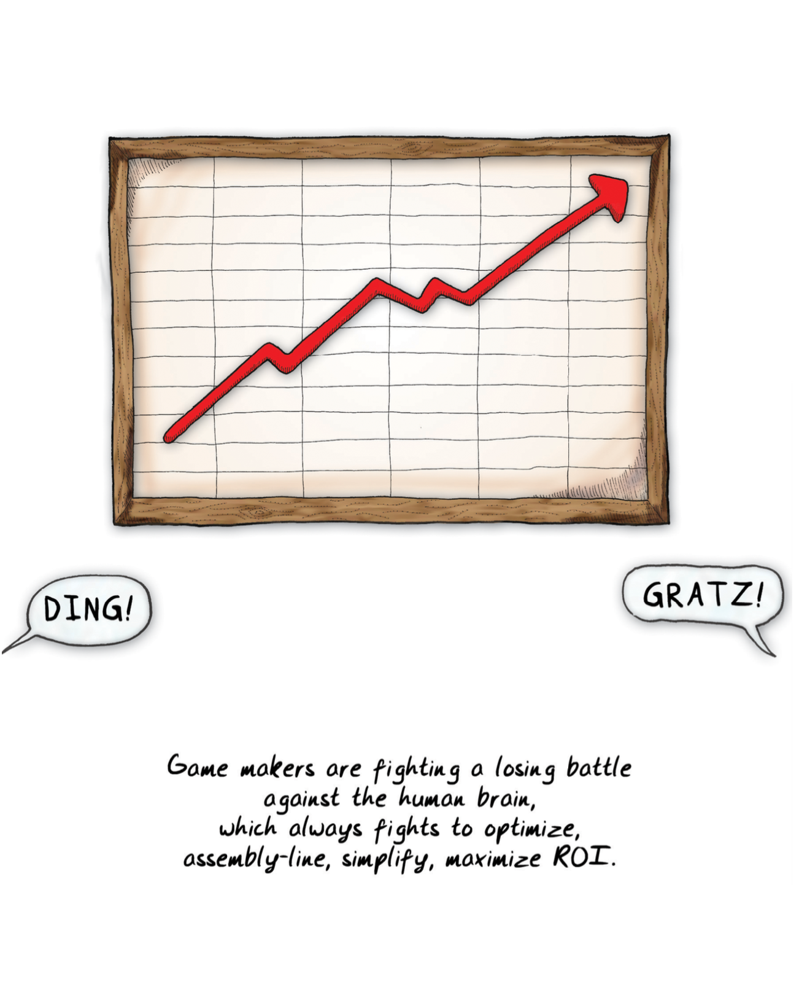
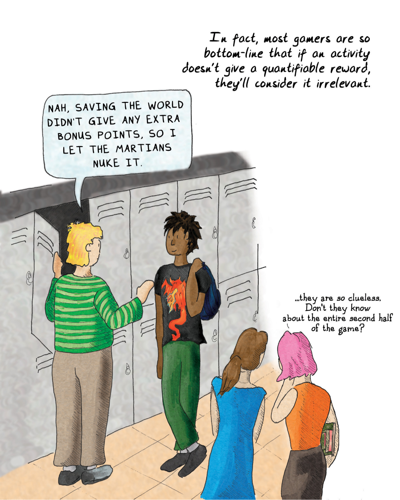
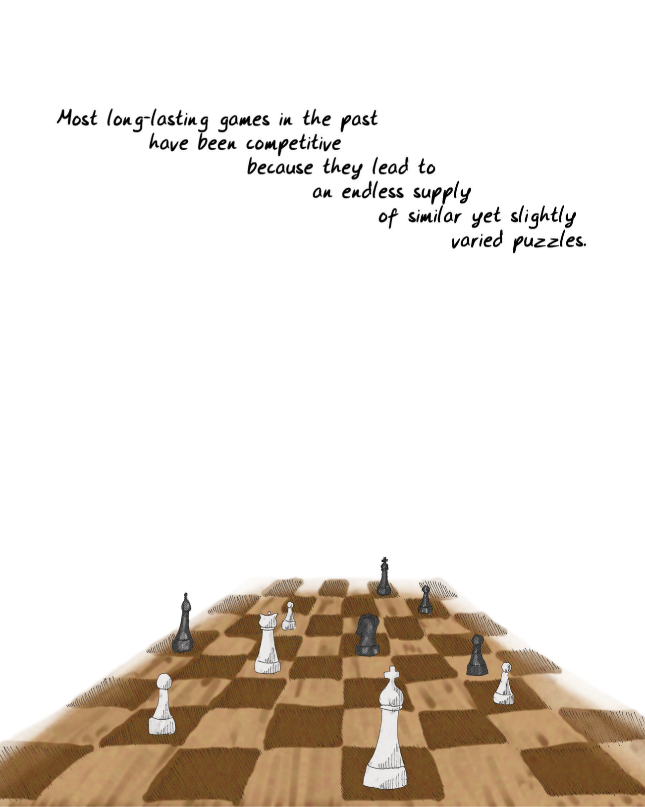
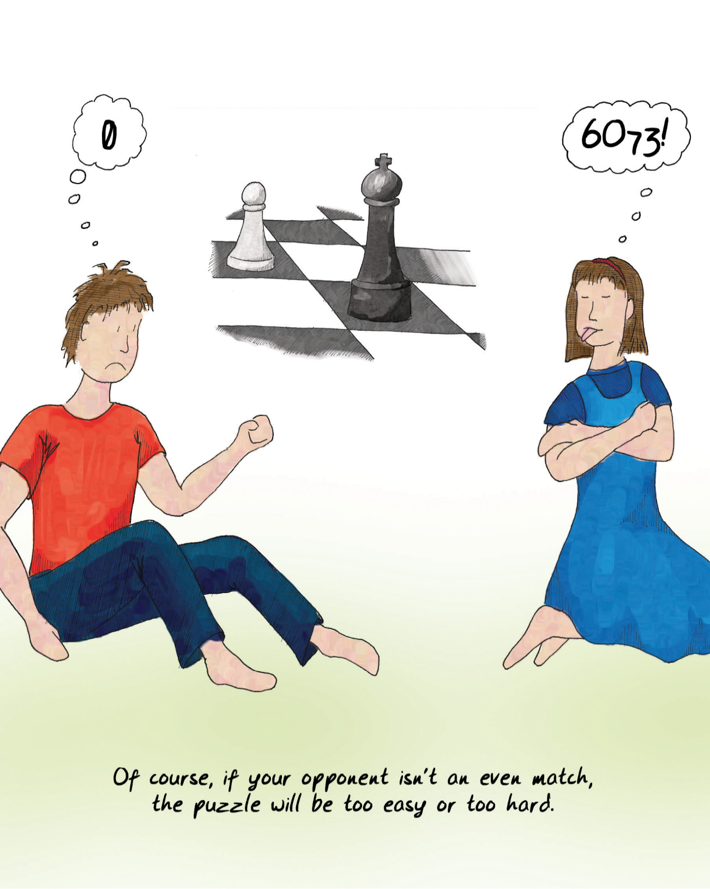
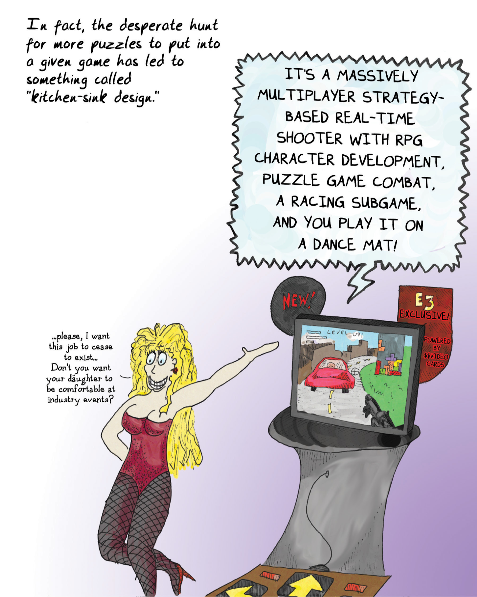

# Chapter 7 The Problem with Learning 第七章 学习的问题

Learning can be problematic. For one thing, it's kind of hard work. Our brains may unconsciously direct us to learn, but if we're pushed by parents, teachers, or even our own logical brains, we often resist most mightily.

学习有时候是个难题。首先，学习是一项艰苦的工作。我们的大脑可能会无意识地引导我们学习，但如果父母、老师，甚至我们自己的逻辑思维催促我们，我们往往会极力反抗。

When I was a kid taking math classes, teachers always made us write out proofs. Many of the students were good enough at algebra that they could look at a given problem and see the answer and then write it down, but it didn't matter—the teacher made them actually work it out:

我小时候上数学课时，老师总是让我们写出证明。很多学生代数学得很好，他们可以看完一道题，就知道答案，然后直接写下来，但这并不重要——老师却要他们真正一步一步解答出来：

x^2 + 5 = 30

We weren't allowed to just write x = 5. We had to write out:

∴ x^2 = 30 – 5

∴ x^2 = 25

∴ x = √25

∴ x = 5

We always thought this was stupid. If we could just look at the problem and see that x = 5, why the hell couldn't we just write it down? Why go through the pesky process? All it did was slow us down!

我们一直认为这很愚蠢。如果我们一看问题就知道 x = 5，为什么不能直接写下来呢？为什么要经历这个讨厌的过程？这只会拖慢我们的速度！

Of course, the good reason is that multiplying -5 by -5 is also 25, and thus there are actually two answers. Skipping to the end, we're more likely to forget that.

当然，好的理由是 -5 乘以 -5 也是 25，因此实际上有两个答案。直接跳到最后，我们更容易忘记这一点。

That doesn't stop the human mind from wanting to take shortcuts, however.

不过，这并不能阻止人类的大脑想走捷径。

> Since games are teaching tools, players seeking to advance in a game will always try to optimize what they are doing.
> 
> 由于游戏是一种教学工具，因此想要在游戏中取得进步的玩家总是会努力优化自己的操作。
> 
> d00d y4 G0t 4NY Che34t C0d3S 4 Ch355? *
> 
> dude ya got any cheat codes for chess?
> 
> 你有国际象棋的作弊码吗？
> 
> Kind Sir, have you any unorthodox, mayhap quasi-legal, approaches to the game of chess?" (tr. fr. doodspeak)
> 
> 好心的先生，你在下棋时有什么非正统的，也许是准合法的方法吗？(转自 "doodspeak")

Once players look at a game and ascertain the pattern and the ultimate goal, they'll try to find the optimal path to getting there. And one of the classic problems with games of all sorts is that players often have little compunction about violating the theoretical "magic circle" that encompasses games and makes them protected spaces in which to practice.

一旦玩家看懂了一个游戏，并确定了游戏的模式和最终目标，他们就会努力寻找达到目标的最佳路径。而各种游戏的一个典型问题是，玩家往往会毫不犹豫地违反理论上的“魔法圈”，这个魔法圈涵盖了游戏，并使游戏成为受保护的实践空间。

In other words, many players are willing to cheat.

换句话说，许多玩家愿意作弊。

This is a natural impulse. It's not a sign of people being bad (though we can call it bad sportsmanship). It's actually a sign of lateral thinking, which is a very important and valuable mental skill to learn. When someone cheats at a game, they may be acting unethically, but they're also exercising a skill that makes them more likely to survive. It's often called "cunning."

这是一种自然的冲动。它不是人们品行不端的标志（尽管我们可以称之为不良体育道德）。这实际上是横向思维的一种表现，而横向思维是一种非常重要且值得学习的心智技能。当有人在游戏中作弊时，他们的行为可能是不道德的，但他们同时也在锻炼一种技能，使他们更有可能生存下去。这通常被称为“狡猾”。

"Cheating" is a long-standing tradition in warfare. The first recorded "[rules of proper warfare](#user-content-fn-1)[^1]" date back to the sixth century BCE! And once conventions are followed, violating them is a powerful tactic. "Let's throw sand in our opponent's eyes." "Let's attack by night." "Let's not charge out of the woods and ambush them instead." "Let's make them walk through the mud so we can shoot them full of arrows." As one of the most important strategic adages has it, "If you cannot choose the battle, at least choose the battlefield."

在战争中，“作弊”是一个由来已久的传统。最早有记载的“[正确的战争规则](#user-content-fn-2)[^2]”可以追溯到公元前六世纪！而一旦约定俗成，违反规则就是一种强大的战术。“往对手眼睛里扔沙子。”“让我们夜袭。”“我们不要从树林里冲出来，而是埋伏起来。”“让他们在泥泞中穿行，让他们身中数箭。”正如最重要的战略格言之一所说：“如果不能选择战斗，至少要选择战场。”

When a player cheats in a game, she is choosing a battlefield that is broader in context than the game itself.

当玩家在游戏中作弊时，她所选择的战场要比游戏本身的范围更广。

Cheating is a sign that the player is in fact grokking the game. From a strict survival point of view, cheating is a winning strategy. Duelists who shoot first while their opponent is still pacing off are far more likely to reproduce. (Of course, above the game of dueling lies the game of social standing. Cheating in the subgame can result in a major mistake in the metagame!)

作弊是玩家真正理解游戏的标志。从严格的生存角度来看，作弊是一种制胜策略。在对手还在踱步的时候先开枪的决斗者更有可能继续生存繁衍。(当然，决斗游戏之上还有社会地位游戏。在次级博弈中作弊可能会导致在元博弈中犯下大错！）。

> If they are clever and see an optimal path -- an Alexandrine solution to a Gordian problem -- they'll do that instead of the "intended gameplay."
> 
> 如果他们很聪明，看到了一条最佳路径——一个解决戈尔迪难题的亚历山大式解决方案——他们就会这样做，而不是“预定的游戏玩法。”


译者注：戈尔迪安问题源自古希腊故事中的一个著名难题。据传说，弗里吉亚的国王戈尔迪奥斯有一个非常复杂的绳结，被称为戈尔迪安结。神谕宣称，能够解开这个结的人将会成为亚细亚之王。很多人试图解开它，但都失败了。

最终，亚历山大大帝在无法解开结的情况下，用剑将其切开，象征性地解决了这个问题，从而展示了他的决断力和领导力。这个故事后来被用来比喻那些看似复杂难以解决，但通过大胆而直接的方法可以轻易解决的问题。


There's a good reason why we instinctively and jealously preserve the notions of sportsmanship and fair play. If the lesson taught by a particular game comes up in the real world, the cheat may not work. Cheating may not prepare us correctly. This is one reason why kicking an opponent during a soccer match is considered poor form. (Another is that neither team likes getting kicked). Whatever soccer's underlying mechanics are teaching us, kicking an opponent is outside its formal framework. The rules serve to enforce [a social compact](#user-content-fn-3)[^3].

我们本能地珍视体育精神和公平竞争的理念是有道理的。如果在现实世界中出现了某个游戏所教给我们的课程，那么作弊就可能不起作用。作弊可能无法让我们做好正确的准备。这也是为什么在足球比赛中踢对手被认为是一种不良行为的原因之一。(另一个原因是两队都不喜欢被踢）。无论足球的基本机制在教导我们什么，踢对手都不在足球的正式框架之内。规则的作用是强化[社会契约](#user-content-fn-4)[^4]。

Players and designers often make the distinction between "cheating" and "exploiting a loophole." They always struggle to define this, but it boils down to whether or not the extraneous action is one that resides within the magic circle of the game's framework or not. Unsurprisingly, exploiters are often the *most* expert players of a game. They see the places where the rules don't quite jibe. This is also why they often think that it's unfair when sticklers for the rules tell them that what they did is not allowed. Their logic goes something like "if the game permits it, then it's legal."

球员和设计师经常会区分“作弊”和“钻空子”。他们总是费尽心思去界定这一点，但归根结底还是要看不相干的行为是否在游戏框架的魔法圈内。毫不奇怪，钻空子的人往往是游戏中*最*专业的玩家。他们能看到规则不协调的地方。这也是为什么他们经常会认为，当守规矩的人告诉他们，他们所做的是不被允许的，这是不公平的。他们的逻辑是“如果游戏允许，那就是合法的。”

But the game is usually intended to put players through a particular challenge, and while a bad design may allow the player to circumvent the challenge, we resent it *because* it's circumvention. It's not exactly evidence of mastery of a technique to solve the problem. Often games are trying to teach techniques; they don't merely give players goals and tell them to solve them any way they please.

但游戏的目的通常是让玩家通过特定的挑战，虽然糟糕的设计可能会让玩家规避挑战，我们讨厌这样子，*因为*这是一种欺骗。这并不能证明玩家掌握了解决问题的技巧。游戏通常是在传授技巧，而不仅仅是给玩家一个目标，让他们用自己喜欢的方式去解决问题。

We can rectify this to a degree via good game design (and even better, we can make games that don't prescribe solutions—that's a rather limited game, and it severely undermines what games are about). But in the end, we're fighting a losing battle against a natural human tendency: to get better at things.

我们可以通过良好的游戏设计在一定程度上纠正这一点（甚至更好的是，我们可以制作不规定解决方案的游戏——那是一种相当有限的游戏，它严重削弱了游戏的意义）。但最终，我们正在与一种自然人类倾向进行一场失败的战斗：变得更擅长做事情。

> They will try to make the gameplay as predictable as possible.
> 
> 他们会尽量让游戏变得可控。
> 
> This then means it becomes boring, and not fun.
> 
> 这就意味着游戏会变得枯燥乏味，毫无乐趣可言。

Consider games that intentionally create situations that we have long since moved past in the real world: games about fighting wars with bayonets, games about sailing ships, or games about an artisan-based economy. There are still lessons to learn from them, but we've advanced in technology, and we have cruise missiles, aircraft carriers, and factories now.

考虑一下那些故意创造我们在现实世界中早已不存在的情境的游戏：用刺刀打仗的游戏、关于帆船的游戏或关于以工匠为基础的经济的游戏。我们仍然可以从这些游戏中吸取经验教训，但我们的科技已经进步，我们现在有了巡航导弹、航空母舰和工厂。

These games, however, do not permit progress. [Most games do not permit innovation and invention](#user-content-fn-5)[^5]. They present a pattern. Innovating out of a pattern is by definition outside the magic circle. You almost never get to change the physics of a game.

然而，这些游戏并不允许进步。[大多数游戏不允许创新和发明](#user-content-fn-6)[^6]。它们呈现的是一种模式。跳出模式进行创新从本质上超出了魔法圈的范围。你几乎永远无法改变游戏的物理原理。

Human beings are *all* about progress. We like life to be easier. We're lazy that way. We like to find ways to become more efficient. We like to find ways to keep from doing something over and over. We dislike tedium, sure, but the fact is that we crave *predictability*. Our whole life is built on it. Unpredictable things are stuff like drive-by shootings, lightning bolts that fry us, smallpox, food poisoning—unpredictable things can kill us! We tend to avoid them. We instead prefer sensible shoes, pasteurized milk, vaccines, lightning rods, and laws. These things aren't perfect, but they do significantly reduce the odds of unpredictable things happening to us.

人类*全都*关乎进步。我们喜欢生活变得简单。我们懒惰。我们喜欢想方设法提高效率。我们喜欢想办法避免重复做某事。我们当然不喜欢单调乏味，但事实上，我们渴望*可预见性*。我们的整个生活都建立在可预测性之上。不可预知的东西，比如驾车枪击、把我们烧焦的闪电、天花、食物中毒——不可预知的东西会要了我们的命！我们倾向于避开它们。相反，我们更倾向于穿合脚的鞋子、喝巴氏杀菌奶、接种疫苗、避雷针和法律。这些东西并不完美，但它们确实大大降低了不可预知的事情发生在我们身上的几率。


译者注：drive-by shootings，驾车枪击。犯罪分子在驾车经过目标时进行射击的行为，这种攻击方式往往突然且迅速，使受害者难以防备，同时让犯罪分子能够快速逃离现场。


And since we dislike tedium, we'll allow unpredictability, but only inside the confines of predictable boxes, like games or TV shows. Unpredictability means new patterns to learn, therefore unpredictability is fun. So we like it, for enjoyment (and therefore, for learning). But the stakes are too high for us to want that sort of unpredictability under normal circumstances. That's what games are for in the first place—to package up the unpredictable and the learning experience into a space and time where there is no risk.

由于我们不喜欢单调乏味，所以我们允许不可预知性的存在，但仅限于在可预知的范围内，比如游戏或电视节目。不可预知性意味着要学习新的模式，因此不可预知性是有趣的。因此，我们喜欢它，因为它能带来乐趣（因此也能带来学习）。但在正常情况下，我们不希望有这种不可预知性，因为风险太大了。这就是游戏的初衷——把不可预知性和学习体验打包到一个没有风险的空间和时间里。

The natural instinct of a game player is to make the game more predictable because then he is more likely to win.

游戏玩家的本能是让游戏更容易预测，因为这样他就更有可能获胜。

> In the real world we call this "security" and "steady jobs" and "sensible shoes" and "routine."
> 
> 在现实世界中，我们称之为“安全感”、“稳定的工作”、“合脚的鞋子”和“例行公事”。
> 
> Call it a treadmill, if you want.
> 
> 如果你愿意，也可以称之为跑步机。

This leads to behaviors like "bottom-feeding," where a player will intentionally take on weaker opponents under the sensible logic that a bunch of sure wins is a better strategy than gambling it all on an iffy winner-take-all battle. Players running an easy level two hundred times to build up enough lives so that they can cruise through the rest of the game with little risk is the equivalent of stockpiling food for winter: it's just the smart thing to do.

这就导致了“抄底”等行为，玩家会故意与较弱的对手较量，其合理的逻辑是，与把全部赌注都押在不确定的赢家通吃的战斗上相比，稳操胜券才是更好的策略。玩家把一个简单的关卡玩上两百次，积累足够的生命值，这样他们就能在几乎没有风险的情况下完成游戏的其余部分，这就相当于为冬天储备食物：这是明智之举。

This is what games are *for*. They teach us things so that we can minimize risk and know what choices to make. Phrased another way, [the destiny of games](#user-content-fn-7)[^7] is to become boring, not to be fun. Those of us who want games to be fun are fighting a losing battle against the human brain because fun is a process and routine is its destination.

这就是游戏的*作用*。游戏教会我们一些东西，这样我们就能把风险降到最低，并知道该做出怎样的选择。换一种说法，[游戏的命运](#user-content-fn-8)[^8]是变得无聊，而不是变得有趣。我们中那些希望游戏变得有趣的人，正在与人类大脑进行一场失败的战斗，因为有趣是一个过程，而常规才是它的终点。

So players often intentionally suck the fun out of a game in hopes they can learn something new (in other words, find something fun) once they complete the task. They'll do it because they perceive it (correctly) as the optimal strategy for getting ahead. They'll do it because they see others doing it, and it's outright unnatural for a human being to see another human being succeeding at something and not want to compete.

因此，玩家往往会故意从游戏中吸取乐趣，希望在完成任务后能学到新东西（换句话说，找到乐趣）。他们会这么做，是因为他们认为（正确地）这是出人头地的最佳策略。他们会这么做，是因为他们看到别人在这么做，而对人类来说，看到别人在某件事情上取得成功而不想与之竞争是完全不自然的。

All of this happens because the human mind is goal-driven. We make pious statements like "it's the journey, not the destination," but that's mostly wishful thinking. The rainbow is pretty and all, and we may well enjoy gazing at it, but while you were gazing, lost in a reverie, someone else went and dug up the pot of gold at the end of it.

所有这一切的发生，都是因为人类的思想是目标驱动的。我们会虔诚地说“重要的是旅程，而不是目的地”，但这大多是一厢情愿的想法。彩虹固然美丽，我们也可能喜欢凝望彩虹，但当你沉浸在遐想中时，别人已经去挖掘彩虹尽头的金矿了。

Rewards are one of the key components of a successful game activity; if there isn't a quantifiable advantage to doing something, the brain will often discard it out of hand. What are the other fundamental components of a game element, the "atoms" of games, so to speak? Game designer Ben Cousins calls these "[ludemes](#user-content-fn-9)[^9]," the basic units of gameplay. We've talked about several of them, such as "visit everywhere" and "get to the other side." There are many left to discover, we hope. In the end, though, games are almost always made up of the same elementary particles.

奖励是游戏活动成功的关键要素之一；如果做某件事情没有可量化的好处，大脑往往会立刻放弃。游戏元素的其他基本要素是什么，可以说是游戏的“原子”吗？游戏设计师本·库辛斯将其称为“[游戏元素](#user-content-fn-10)[^10]”，即游戏的基本单位。我们已经讨论过其中的几个，比如“到处游览”和“到达另一边”。我们希望还有更多的游戏等着我们去发现。不过归根结底，游戏几乎都是由相同的基本粒子组成的。

> DING!
> 
> 叮！
> 
> 恭喜！
> 
> GRATZ!
> 
> Game makers are fighting a losing battle against the human brain, which always fights to optimize, assembly-line, simplify, maximize ROI.
> 
> 游戏制作者在与人类大脑的斗争中节节败退，因为人类大脑总是在追求优化、流水线作业、简化、投资回报率最大化。

Successful [games tend to incorporate the following elements](#user-content-fn-11)[^11]:

成功的[游戏往往包含以下要素](#user-content-fn-12)[^12]：

* **Preparation.** Before taking on a given challenge, the player gets to make some choices that affect her odds of success. This might be healing up before a battle, handicapping the opponent, or practicing in advance. She might set up a strategic landscape, such as building a particular hand of cards in a card game. Prior moves in a game are automatically part of the preparation stage, because virtually all games consist of multiple challenges in sequence.\
    **准备。** 在接受特定挑战之前，玩家可以做出一些影响成功几率的选择。这可能是在战斗前养精蓄锐，也可能是给对手下套，还可能是提前练习。她可能会设置一个战略格局，比如在纸牌游戏中打造一手特定的牌。游戏中的先手自动成为准备阶段的一部分，因为几乎所有游戏都是由多个挑战依次组成的。

* **A sense of space.** The space might be the landscape of a war game, a chessboard, or the network of relationships between the players during the bridge game.\
    **空间感。** 空间可以是战争游戏中的地形、棋盘，也可以是桥牌游戏中玩家之间的关系网络。

* **A solid core mechanic.** This is a puzzle to solve, an intrinsically interesting rule set into which content can be poured. An example might be "moving a piece in chess." The core mechanic is usually a fairly small rule; the intricacies of games come from either having a lot of mechanics or having a few, very elegantly chosen ones. Most of these mechanics turn out to be from a fairly small set of problem types: estimating curves, optimizing, matching, balancing, or classifying.\
    **坚实的核心机制。** 这是一个需要解决的难题，是一个内在有趣的规则集，可以在其中注入内容。例如“在国际象棋中移动棋子”。核心机制通常是一个相当小的规则；游戏的复杂性来自于要么有很多机制，要么有少数几个非常优雅的机制。这些机制中的大多数都来自相当小的一组问题类型：估计曲线、优化、匹配、平衡或分类。

* **A range of challenges.** This is basically content. It does not change the rules, it operates within the rules, and brings slightly different parameters to the table. Each enemy you encounter in a game is one of these.\
    **一系列挑战。** 这基本上就是内容。它不改变规则，在规则范围内运作，并带来略有不同的参数。游戏中遇到的每个敌人都是其中之一。

* **A range of abilities required to solve the encounter.** If all you have is a hammer, and you can only do one thing with it, then the game is going to be dull. This is a test that tic-tac-toe fails but that checkers meets; in a game of checkers you start learning the importance of forcing the other player into a disadvantageous jump. Most games unfold abilities over time, until at a high level you have many possible stratagems to choose from.\
    **解决遭遇战所需的一系列能力。** 如果你只有一把锤子，而你只能用它做一件事，那么游戏就会变得枯燥乏味。在跳棋游戏中，你开始学习迫使对方跳到不利位置的重要性。大多数游戏都会随着时间的推移逐渐展现出各种能力，直到达到很高的水平，你才会有许多可能的计谋可供选择。

* **Skill required in using the abilities.** Bad choices lead to failure in the encounter. This skill can be of any sort, really: resource management during the encounter, failures in timing, failures in physical dexterity, and failures to monitor all the variables that are in motion.\
    **使用这些能力需要技巧。** 错误的选择会导致遭遇失败。这种技巧可以是各种类型的：遭遇战中的资源管理、时机把握失败、身体灵活性失败以及无法监控运动中的所有变量。

> In fact, most gamers are so bottom-line that if an activity doesn't give a quantifiable reward, they'll consider it irrelevant.
> 
> 事实上，大多数游戏玩家都很有底线，如果一项活动不能带来可量化的奖励，他们就会认为这项活动无关紧要。
> 
> NAH, SAVING THE WORLD DIDN'T GIVE ANY EXTRA BONUS POINTS, SO I LET THE MARTIANS NUKE IT.
> 
> 不，拯救世界并没有带来额外的奖励积分，所以我让火星人用核弹炸了它。
> 
> ...they are so clueless. Don't they know about the entire second half of the game?
> 
> ……他们真是没脑子。难道他们不知道整个游戏的后半部分吗？

A game having all of these elements hits the right cognitive buttons to be fun. If a game involves no preparation, we say it relies on chance. If there's no sense of space, we call it trivial. If there's no core mechanic, there's no game system at all. If there's no range of challenges, we exhaust it quickly. If there aren't multiple choices to make, it's simplistic. And if skill isn't required, it's tedious.

一个游戏如果具备了所有这些要素，就能击中正确的认知按钮，从而变得有趣。如果一个游戏不需要任何准备，我们就说它依赖于机会。如果没有空间感，我们称之为狭小。如果没有核心机制，就根本不存在游戏系统。如果没有各种挑战，我们很快就会把它玩腻。如果没有多种选择，那就是过分简单。如果不需要技巧，就会乏味。

There are also some features that should be present to make the experience a learning experience:

还有一些功能应该具备，以使体验成为一种学习经历：

* **A variable feedback system.** The result of the encounter should not be completely predictable. Ideally, greater skill in completing the challenge should lead to better rewards. In a game like chess, the variable feedback is your opponent's response to your move.\
	**可变反馈系统。** 遭遇战的结果不应该是完全可以预测的。理想情况下，完成挑战的技巧越高，奖励就越好。在国际象棋这样的游戏中，可变反馈就是对手对你走棋的反应。

* **[The Mastery Problem](#user-content-fn-13)[^13] must be dealt with.** High-level players can't get big benefits from easy encounters or they will bottom-feed. Inexpert players will be unable to get the most out of the game.\
	**必须解决[掌握问题](#user-content-fn-14)[^14]。** 高水平玩家不能从简单的遭遇战中获得巨大收益，否则他们就会去抄底。不精通的玩家将无法从游戏中获得最大收益。

* **Failure must have a cost.** At the very least there is an [opportunity cost](#user-content-fn-15)[^15], and there may be more. Next time you attempt the challenge, you are assumed to come into it from scratch—there are no "do-overs." Next time you try, you may be prepared differently.\
	**失败必须付出代价。** 至少要付出[机会成本](#user-content-fn-16)[^16]，甚至更多。下一次尝试挑战时，你必须从头开始，没有“重来”的机会。下一次尝试，你可能会有不同的准备。

Looking at these elementary particles that make up ludemes, it's easy to see why most games in history have been competitive head-to-head activities. It's the easiest way to constantly provide a new flow of challenges and content.

看看这些构成“游戏元素”的基本粒子，我们就不难理解为什么历史上大多数游戏都是正面交锋的竞技活动了。这是不断提供新挑战和新内容的最简单方法。

> Most long-lasting games in the past have been competitive because they lead to on endless supply of similar yet slightly varied puzzles.
> 
> 过去，大多数长寿游戏都具有竞争性，因为它们会带来无穷无尽的相似但略有不同的谜题。

Historically, competitive game-playing of all sorts has tended to squeeze out the people who most need to learn the skills it provides, simply because they aren't up to the competition and they are eliminated in their first match. This is the essence of the Mastery Problem. Because of this, a lot of people prefer games that take no skill. These people are definitely failing to exercise their brains correctly. *Not requiring skill from a player should be considered a cardinal sin in game design*. At the same time, designers of games need to be careful not to make the game demand too much skill. They must keep in mind that players are always trying to reduce the difficulty of a task. The easiest way to do that is to not play.

从历史上看，各种竞技游戏往往会挤掉最需要学习其所提供技能的人，原因很简单，因为他们不适应竞争，在第一场比赛中就被淘汰了。这就是“掌握问题”的本质。正因为如此，很多人更喜欢不需要技巧的游戏。这些人肯定没有正确锻炼自己的大脑。*不要求玩家掌握技巧应被视为游戏设计中的大忌*。同时，游戏设计者也需要注意，不要让游戏对玩家的技能要求过高。他们必须牢记，玩家总是试图降低任务的难度。最简单的方法就是不玩。

This isn't an algorithm for fun, but it's a useful tool for checking for the absence of fun, because designers can identify systems that fail to meet all the criteria. It may also prove useful in terms of game critique. Simply check each system against this list:

这并不是一种有趣的算法，但它却是检查游戏是否有趣的有用工具，因为设计者可以找出不符合所有标准的系统。在游戏评论方面，它也可能被证明是有用的。只需对照清单检查每个系统即可

* Do you have to prepare before taking on the challenge?\
	在接受挑战之前，你是否必须做好准备？

* Can you prepare in different ways and still succeed?\
	你能以不同的方式做好准备并取得成功吗？

* Does the environment in which the challenge takes place affect the challenge?\
	挑战所处的环境是否会影响挑战？

* Are there solid rules defined for the challenge you undertake?\
	挑战是否有明确的规则？

* Can the core mechanic support multiple types of challenges?\
	核心机制能否支持多种类型的挑战？

* Can the player bring multiple abilities to bear on the challenge?\
	玩家能否在挑战中发挥多种能力？

* At high levels of difficulty, does the player have to bring multiple abilities to bear on the challenge?\
	在高难度情况下，玩家是否必须使用多种能力来应对挑战？

* Is there skill involved in using an ability? (If not, is this a fundamental "move" in the game, like moving one checker piece?)\
	使用某种能力是否需要技巧？(如果没有，这是否是游戏中的基本“移动”，就像移动跳棋棋子一样？）

* Are there multiple success states to overcoming the challenge? (In other words, success should not have a single guaranteed result.)\
	克服挑战是否有多种成功状态？(换句话说，成功不应该只有一个确定的结果）。

> Of course, if your opponent isn't on even match, the puzzle will be too easy or too hard.
> 
> 当然，如果对手不是势均力敌，谜题就会太简单或太难。

* Do advanced players get no benefit from tackling easy challenges?\
	高级玩家从简单的挑战中得不到任何益处吗？

* Does failing at the challenge at the very least make you have to try again?\
	挑战失败是否至少会让你不得不再试一次？

If your answer to any of the above questions is "no," then the game system is probably worth readdressing.

如果你对上述任何一个问题的回答都是“否”，那么游戏系统可能值得重新考虑。

Game designers are caught in the [Red Queen's Race](#user-content-fn-17)[^17], because challenges are meant to be surmounted. The result is that modern game designers have often taken the approach of piling more and more different types of challenges into one game. The number of ludemes reaches astronomical proportions. Consider that checkers consists of exactly two: "capture all the pieces" and "move one piece." Now compare that to the last console game you saw. Which do you think will still be played in a hundred years?

游戏设计者陷入了“[红皇后竞赛](#user-content-fn-18)[^18]”的困境，因为挑战就是用来克服的。其结果是，现代游戏设计者经常采取的做法是，在一个游戏中堆砌越来越多不同类型的挑战。游戏元素的数量达到了天文数字。想想看，跳棋就只有两种：“吃掉所有棋子”和“移动一个棋子”。现在把它与你看到的上一款游戏机游戏进行比较。你认为哪个游戏在一百年后还能玩？

Most classic games consist of relatively few systems that fit together elegantly. The entire genre of abstract strategy games is about elegant choice of ludemes. But in today's world, many of the lessons we might want to teach might require highly complex environments and many moving parts—online virtual worlds spring to mind as an obvious example.

大多数经典游戏都由相对较少的系统组成，这些系统可以优雅地组合在一起。抽象策略游戏的整个流派都是关于如何优雅地选择游戏元素。但在当今世界，我们想要教授的许多课程可能都需要非常复杂的环境和许多活动部件——网络虚拟世界就是一个明显的例子。

The lesson for designers is simple: a game is destined to become boring, automated, cheated, and exploited. Your sole responsibility is to know what the game is about and to ensure that the game teaches that thing. That one thing, the theme, the core, the heart of the game, might require many systems or it might require few. But *no system should be in the game that does not contribute towards that lesson*. It is the cynosure of all the systems; it is the moral of the story; it is the point.

对于设计者来说，教训很简单：游戏注定会变得无聊、自动化、欺骗和被利用。你唯一的责任就是要知道游戏是关于什么的，并确保游戏教给人们的就是这件事。这一件事，即游戏的主题、核心和心脏，可能需要很多系统，也可能只需要很少系统。但*游戏中的任何系统都应该对这一课程有益*。它是所有系统的核心；它是故事的寓意；它是重点。

In the end, that is both the glory of learning and its fundamental problem: once you learn something, it's over. You don't get to learn it again.

归根结底，这既是学习的荣耀，也是学习的根本问题：一旦你学会了什么，它就结束了。你没有机会再学了。

> In fact, the desperate hunt for more puzzles to put into a given game has led to something called "kitchen-sink design."
> 
> 事实上，为了在游戏中加入更多的谜题，人们不惜一切代价，这就是所谓的“厨房水槽设计”。
> 
> IT'S A MASSIVELY MULTIPLAYER STRATEGY-BASED REAL-TIME SHOOTER WITH RPG CHARACTER DEVELOPMENT, PUZZLE GAME COMBAT, A RACING SUBGAME, AND YOU PLAY IT ON A DANCE MAT!
> 
> 这是一款基于即时战略的大型多人射击游戏，包含 RPG 角色养成、益智游戏战斗、赛车子游戏，而且是在舞垫上玩的！
> 
> ...please, I want this job to cease to exist...Don't you want your daughter to be comfortable at industry events?
> 
> ……拜托，我希望这份工作消失……难道你不想让你的女儿在行业活动中感到舒适吗？

[^1]: First recorded rules of war: These were a suggestion by Sun Tzu. Most often, these have been intended to protect non-combatants, but sometimes they have been conventions of honor, such as not attacking by night or from ambush.

[^2]: 第一部有记载的兵书：这是孙子的建议。大多数情况下，这些规则旨在保护非战斗人员，但有时它们也是荣誉公约，例如不在夜间或埋伏地发动攻击。

[^3]: Cheating during a soccer match: On the flip side, if the referee fails to see that we are offside, we'll take it and often say, "Them's the breaks." It is still a violation of the rules, but since the ref (who is part of the formal construct) is fallible, we accept the violation.

[^4]: 在足球比赛中作弊：反过来说，如果裁判没有发现我们越位，我们也会接受，并经常说:“这就是比赛的一部分。”这仍然是违反规则的行为，但由于裁判（他是正式结构的一部分）也可能犯错，所以我们接受这种违规行为。

[^5]: Most games do not permit innovation and invention: There does exist a game, called Nomic, whose rules you rewrite as you play; it's part of the game. It too has limits; you bump up against the physics of reality if you try to change too much. In Nomic's case, the changing rules are themselves part of the pattern—but declaring atoms to be the size of Jupiter, or pulling out a gun and shooting another player, are still off-limits even if you make a rule allowing it. Nomic was designed by Peter Suber of the Philosophy Department at Earlham College.

[^6]: 大多数游戏都不允许创新和发明：确实有一种游戏叫《Nomic》，它的规则可以边玩边改写；这也是游戏的一部分。它也有限制；如果你试图改变太多，就会与现实的物理原理相冲突。在《Nomic》中，改变规则本身就是模式的一部分——但宣布原子有木星那么大，或掏出枪来射击其他玩家，即使你制定了允许这样做的规则，仍然是不允许的。《Nomic》由厄勒姆学院哲学系的彼得·苏伯设计。

[^7]: The destiny of games: Many games, of course, seem to become more fun as you learn more about them. This has a lot to do with the nature of the challenge presented in those games; they tend to present problems of a certain complexity level that reveals more subtleties the deeper in you go.

[^8]: 游戏的命运：当然，许多游戏似乎会随着你对它们了解的加深而变得更加有趣。这与这些游戏的挑战性质有很大关系；它们往往会提出具有一定复杂程度的问题，越深入越能发现其中的奥妙。

[^9]: Ludemes: As used here, a concept developed by Ben Cousins, a video game designer. An article about the concept appeared in the October 2004 issue of Develop Magazine. Ben has renamed the concept "primary elements," but I like "ludemes" better, even though the word is already in use in a different context (see http://www.davidparlett.co.uk/gamester/ludemes.html for a history of the term by David Parlett). The idea also has a lot in common with the "choice molecules" described by Eric Zimmerman and Katie Salen in Rules of Play (MIT Press, 2003).

[^10]: 游戏元素：这里指的是视频游戏设计师本·库辛斯提出的概念。关于这一概念的文章刊登在《开发》杂志 2004 年 10 月刊上。本将这一概念改名为“主要元素”，但我更喜欢“游戏元素”，尽管这个词已经在不同的语境中使用过（参见 http://www.davidparlett.co.uk/gamester/ludemes.html，戴维·帕莱特撰写的该词历史）。这个想法与埃里克·齐默尔曼和凯蒂·萨伦在《游戏规则》（麻省理工学院出版社，2003 年）中描述的“选择分子”也有很多共同之处。

[^11]: Games incorporate the following elements: This material on basic elements of games is an extremely brief survey of "game grammar," the idea that ludic structures have specific structural qualities that make them work. For more information on this idea, I recommend the following:
    * "[A Grammar of Gameplay](http://www.raphkoster.com/gaming/atof/grammarofgameplay.pdf)," a presentation I delivered at GDC 2005.
    * Dan Cook's article "[The Chemistry of Game Design.](http://www.lostgarden.com/2007/07/chemistry-of-game-design.html)"
    * Stéphane Bura's "[A Game Grammar](http://users.skynet.be/bura/diagrams/)."
    * The book Game Mechanics: Advanced Game Design (New Riders, 2012) by Ernest Adams and Joris Dormans.

[^12]: 游戏包含以下要素：关于游戏基本要素的这些材料只是对“游戏语法”的一个极为简短的概述，“游戏语法”的概念是，游戏结构具有特定的结构特质，这些特质使其能够发挥作用。关于这一观点的更多信息，我推荐阅读以下书籍：
    * [《游戏玩法的语法》](http://www.raphkoster.com/gaming/atof/grammarofgameplay.pdf)，我在 2005 年 GDC 上发表的演讲。
    * 丹·库克的文章[《游戏设计的化学》](http://www.lostgarden.com/2007/07/chemistry-of-game-design.html)。
    * 斯特凡·布拉的[《游戏语法》](http://users.skynet.be/bura/diagrams/)。
    * 《游戏机制：高级游戏设计》，由欧内斯特·亚当斯和约里斯·多曼斯撰写，New Riders出版社，2012年出版。

[^13]: The Mastery Problem: This can be summarized as "the rich get richer." It is an expression of iterative zero-sum games—games in which the winner ends up in a better position than the loser. If a high-level player can reinforce his position by repeatedly defeating easy targets, then eventually his position will become unassailable. This is not in itself a problem—it simply leads to victory. The problem arises when a novice coming to the game cannot possibly succeed.

[^14]: 掌握问题：可以概括为“富者愈富”。它是迭代零和游戏的一种表现形式——在这种游戏中，赢家最终会比输家处于更有利的地位。如果一个高水平的玩家可以通过反复击败容易击败的目标来巩固自己的地位，那么最终他的地位将变得不可撼动。这本身并不是问题——它只会导致胜利。如果新手不可能成功，问题就出现了。

[^15]: Opportunity cost: Since games are always sequences of challenges, the fact that you made a bad choice cannot simply be undone. At the very least, the fact that you could have chosen to do something else allows your opponent to make her own choice. In playing games, we only give "take-backs" to young children, and there exist a plethora of rules dictating when moves become irrevocable in board games (for example, you commit to a move in chess when you let go of the piece).

[^16]: 机会成本：由于游戏总是一连串的挑战，因此你做出了错误的选择这一事实是无法简单挽回的。至少，你本可以选择做其他事情，这让你的对手可以做出自己的选择。在玩游戏时，我们只给年幼的孩子“反悔”的机会，而在棋类游戏中，有大量的规则规定了何时走棋变得不可更改（例如，在国际象棋中，当你放开棋子时，你就承诺了走棋）。

[^17]: Red Queen's Race: In Lewis Carroll's classic book Through the Looking Glass, Alice runs alongside the Red Queen in a landscape that is moving very quickly. So quickly, in fact, that they have to run to stand still. This situation has become known as the Red Queen's Race.

[^18]: 红皇后的赛跑：在刘易斯·卡罗尔的经典名著《镜中奇遇记》中，爱丽丝与红皇后在一片快速移动的风景中并肩奔跑。事实上，他们跑得太快了，以至于必须跑着才能站稳。这种情况被称为红皇后赛跑。

