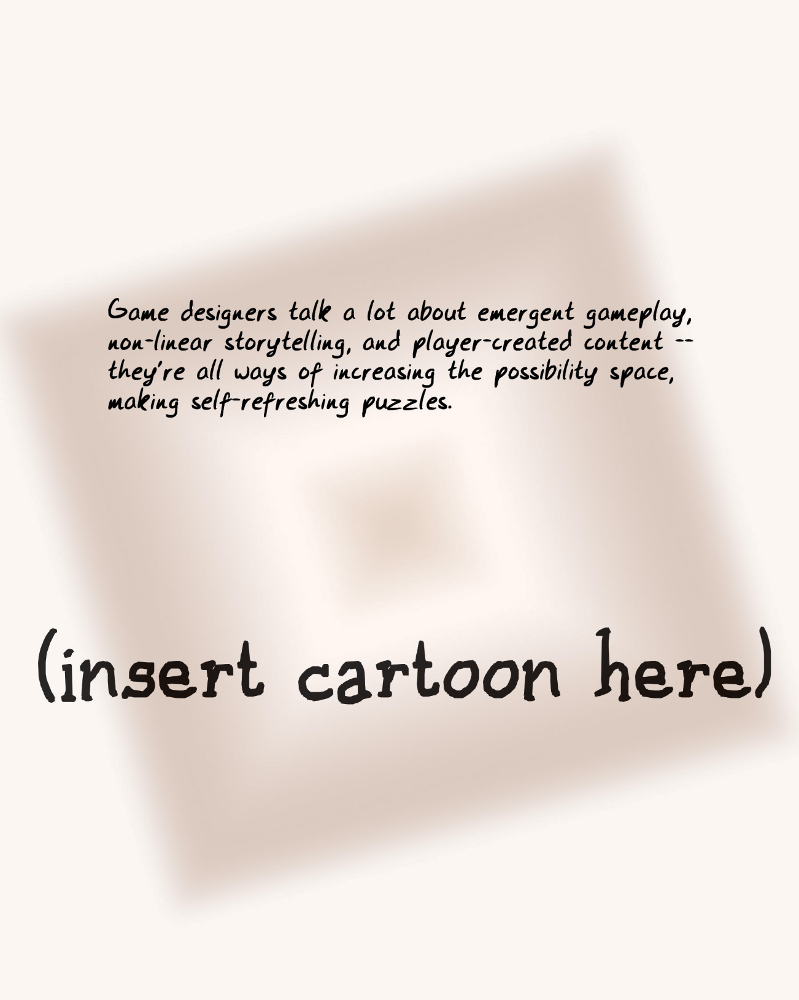
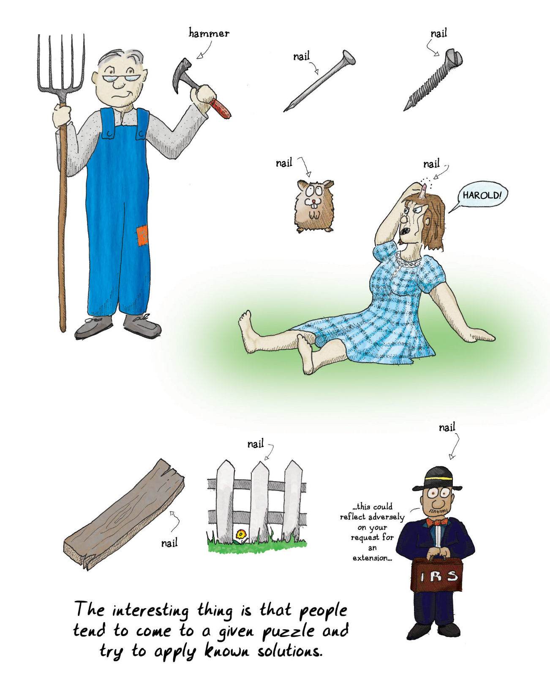
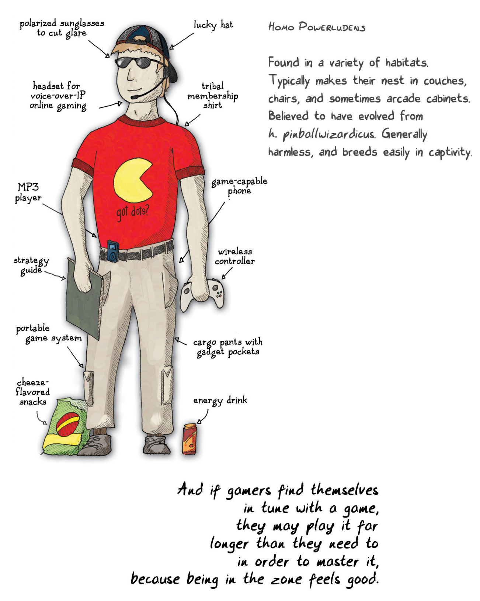
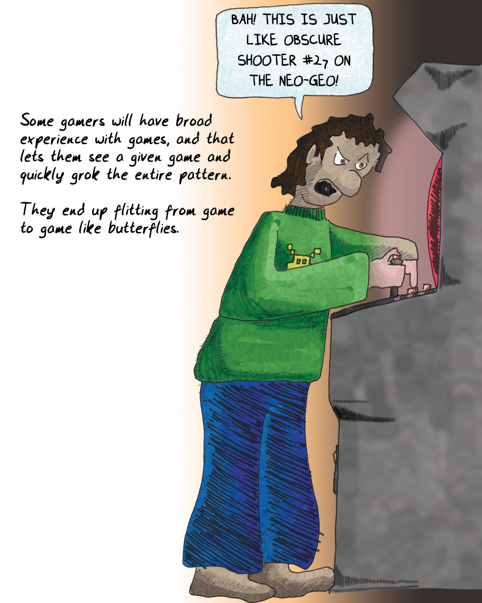
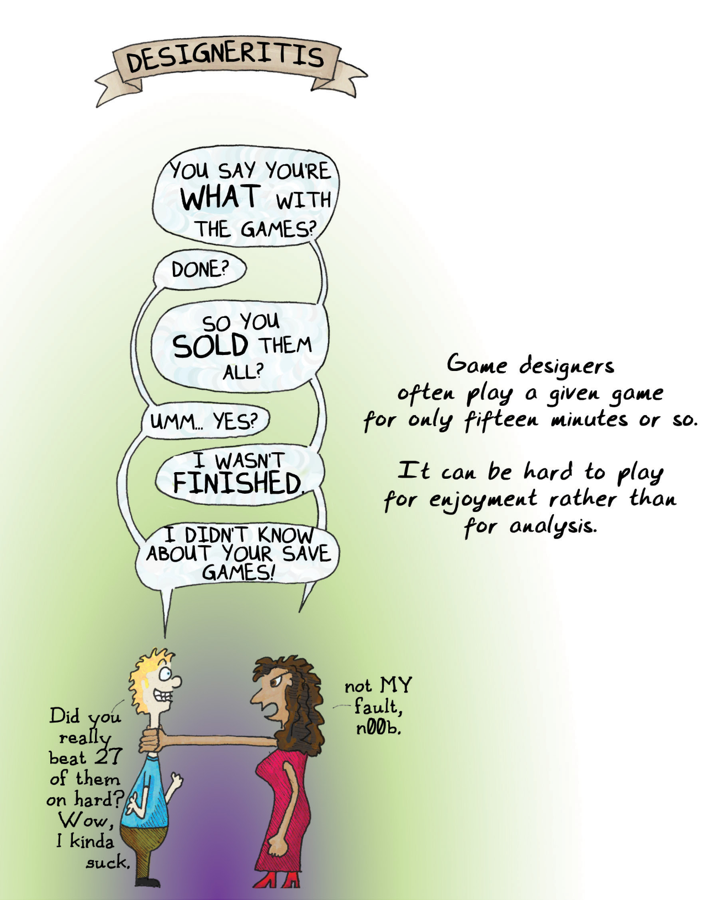

# Chapter 8 The Problem with People 第八章 人的问题

The holy grail of game system design is to make a game where the challenges are never ending, the skills required are varied, and the difficulty curve is perfect and adjusts itself to exactly our skill level. Someone did this already, though, and it's not always fun. It's called "life." Maybe you've played it.

游戏系统设计的圣杯是制作一款挑战永无止境、所需技能多种多样、难度曲线完美且能根据我们的技能水平自动调整的游戏。不过已经有人做到了，但并不总是有趣的。这就是“生活”。也许你已经玩过了。

Designers often feel proudest of designing good abstract systems that have deep self-generating challenges—games like chess, [go](#user-content-fn-1)[^1], and Othello, and so on. Designing rule sets and making all the content is hard! That hasn't stopped us from trying all sorts of tactics to make games self-refreshing:

设计者通常最引以为豪的是设计出优秀的抽象系统，这些系统具有深刻的自我挑战性——比如国际象棋、[围棋](#user-content-fn-2)[^2]、和黑白棋等等。设计规则集和制作所有内容都很难！但这并不妨碍我们尝试各种策略，让游戏自我刷新：

* **"[Emergent behavior](#user-content-fn-3)[^3]"** is a common buzzword. The goal is new patterns that emerge spontaneously out of the rules, allowing the player to do things that the designer did not foresee. (Players do things designers don't expect all the time, but we don't like to talk about it.) Emergence has proven a tough nut to crack in game design; it usually makes games easier, often by generating loopholes and exploits.\
	**“[涌现行为](#user-content-fn-4)[^4]”** 是一个常用的流行语。目标是从规则中自发产生新的模式，允许玩家做出设计者没有预料到的事情。(玩家经常会做出设计者意想不到的事情，但我们不喜欢谈论它）。事实证明，在游戏设计中，“涌现”是一个难以破解的难题；它通常会让游戏变得更简单，往往是通过产生漏洞和钻空子的方式。

* **We also hear a lot about storytelling.** It's easier to construct a story with multiple possible interpretations than it is to construct a game with the same characteristics. However, most games melded with stories tend to be Frankenstein monsters. Players tend to either skip the story or skip the game. Balancing the two so that they reinforce each other is hard, and often either the story or the game ends up too shallow for repeated play.\
	**我们还经常听到讲故事的说法。** 构建一个有多种可能诠释的故事比构建一个具有相同特点的游戏要容易得多。然而，大多数与故事相融合的游戏往往是科学怪人。玩家往往要么跳过故事，要么跳过游戏。要在两者之间取得平衡，使其相互促进是很难的，而且往往不是故事太浅就是游戏太浅，无法让玩家反复玩。

> Game designers talk a lot about emergent gameplay, non-linear storytelling, and player-created content -- they're all ways of increasing the possibility space, making self-refreshing puzzles.
> 
> 游戏设计师们经常谈论涌现玩法、非线性叙事和玩家自创内容——它们都是增加可能性空间、制造自我刷新谜题的方法。
> 
> (insert cartoon here)
> 
> (此处插入漫画）

* Placing players head-to-head is also a common tactic, on the grounds that other players are an endless source of new content. This is accurate, but the Mastery Problem rears its ugly head. Players hate to lose. If you fail to match them up with an opponent who is very precisely of their skill level, they'll quit.\
	让玩家正面交锋也是一种常见的策略，理由是其他玩家是无穷无尽的新内容来源。这种说法是正确的，但“掌握问题”又出现了。玩家讨厌失败。如果你不能为他们匹配一个与他们的技术水平非常接近的对手，他们就会放弃。

* Using players to generate content is a useful tactic. Many games expect players to supply the challenges in various ways, ranging from making maps for a shooter game to contributing characters in a role-playing game.\
	利用玩家创造内容是一种有用的策略。许多游戏都希望玩家以各种方式提供挑战，从为射击游戏制作地图到为角色扮演游戏贡献角色，不一而足。

But is this futile? I mean, all these designers are trying to expand the possibility space...and all the players are trying to reduce it, just as fast as they can. You see, humans are wired in some interesting ways. If something has worked for us before, we'll tend to do it again. We're really very resistant to discarding prior learning. We're conservative at heart, and we grow more so as we age. You've perhaps heard the old saw, variously attributed to Clemenceau, Churchill, and Bismarck, "If a man isn't liberal when he's 20, he has no heart. If he's not conservative when he's 40, he has no brain." Well, there's a lot of truth to this. We grow more resistant to change as we age, and we grow [less willing (and able) to learn](#user-content-fn-5)[^5].

但这是徒劳的吗？我的意思是，所有这些设计师都在试图扩大可能性空间……而所有玩家都在试图尽可能快地缩小空间。人类的思维方式很有趣。如果某件事以前对我们有用，我们就会倾向于再做一次。我们非常不愿意放弃之前的学习。我们的内心是保守的，而且随着年龄的增长，我们会变得更加保守。你也许听说过克莱蒙梭、丘吉尔和俾斯麦说过的一句老话：“如果一个人在 20 岁时还不是自由主义者，他就没有心。如果一个人到了40岁还不保守，那他就是没脑子。”这句话很有道理。随着年龄的增长，我们会越来越抗拒改变，[越来越不愿意（也越来越不能够）学习](#user-content-fn-6)[^6]。

If we come across a problem we have encountered in the past, our first approach is to try the solution that has worked before, even if the circumstances aren't exactly the same.

如果我们遇到了过去曾遇到过的问题，我们的第一反应就是尝试以前行之有效的解决方案，即使情况并不完全相同。

The problem with people isn't that they work to undermine games and make them boring. That's the natural course of events. The real problem with people is that:

人的问题并不在于他们破坏游戏，让游戏变得无聊。这是自然规律。人的真正问题在于：

    …even though our brains feed us drugs to keep us learning…

    ……尽管我们的大脑给我们喂食药物，让我们不断学习……

    …even though from earliest childhood we are trained to learn through play…

    ……尽管我们从孩提时代起就被训练在游戏中学习……

    …even though our brains send incredibly clear feedback that we should learn throughout our lives…

    ……尽管我们的大脑发出了令人难以置信的明确反馈，告诉我们应该终生学习……

    PEOPLE ARE LAZY.

    人是懒惰的。

In some ways, anyway. We're reluctant to abandon known solutions.

无论如何，在某些方面是这样。我们不愿意放弃已知的解决方案。

> hammer
> 
> 锤子
> 
> nail, nail, nail, nail, nail, nail
> 
> 钉子，钉子，钉子，钉子，钉子，钉子
> 
> HROLD!
> 
> 哈罗德！
> 
> ...this could reflect adversely on your request for an extension...
> 
> ……这可能会对您的延期申请产生不利影响……
> 
> IRS
> 
> 国税局（Internal Revenue Service）
> 
> The interesting thing is that people tend to come to a given puzzle and try to apply known solutions.
> 
> 有趣的是，人们往往会在遇到某个难题时，尝试应用已知的解决方案。

Look at the games that offer the absolute greatest freedom possible within the scope of a game setting. In role-playing games there are few rules. The emphasis is on collaborative storytelling. You can construct your character any way you want, use any background, and take on any challenge you like.

看看那些能在游戏设定范围内提供绝对最大自由度的游戏。在角色扮演游戏中，规则很少。游戏强调的是合作讲故事。你可以随心所欲地塑造角色，使用任何背景，接受任何挑战。

And yet, [people choose the same characters to play, over and over](#user-content-fn-7)[^7]. I've got a friend who has played the big burly silent type in literally dozens of games over the decade I have known him. Never once has he been a vivacious small girl.

然而，[人们却一次又一次地选择相同的角色进行游戏](#user-content-fn-8)[^8]。我有一个朋友，在我认识他的十几年里，他在几十款游戏中扮演的都是沉默寡言的大块头。他从来没有扮演过一个活泼的小姑娘。

Different games appeal to different personality types, and not just because particular problems appeal to certain brain types. It's also because particular solutions appeal to particular brain types, and when we've got a good thing going, we're not likely to change it. This is not a recipe for long-term success in a world that is constantly changing around us. Adaptability is key to survival.

不同的游戏会吸引不同性格类型的人，这不仅仅是因为特定的问题会吸引特定类型的大脑。这还因为特定的解决方案对特定的大脑类型有吸引力，而当我们有了一个好东西，我们就不可能去改变它。在我们周围不断变化的世界中，这不是长期成功的秘诀。适应能力是生存的关键。

Much is made of [cross-gender role-play](#user-content-fn-9)[^9] in online settings. When you look at it in this light, it's clearly because a given gender presentation is a solution choice—a tool the player is using to solve problems presented by the online game setting. It might be because the gender presentation is a good way to meet like-minded people. Males choosing female avatars may be signaling something about their preference for the company of other empathizing brains, for example. It might also be because they are simply leveraging the statistical fact that male players tend to give gifts to female ones to curry favor.

[跨性别角色扮演](#user-content-fn-10)[^10]在网络游戏中大行其道。从这个角度来看，这显然是因为特定的性别表现形式是一种解决方案的选择——玩家用来解决网络游戏环境中出现的问题的工具。也可能是因为性别表现是结识志同道合者的好方法。例如，男性选择女性化身可能表明他们更喜欢与其他具有同理心的大脑为伴。也可能是因为他们只是在利用男性玩家倾向于向女性玩家赠送礼物来讨好女性玩家这一统计事实。

Sticking to one solution is not a survival trait anymore. The world is changing very fast, and we interact with more kinds of people than ever before. The real value now lies in a wide range of experiences and in understanding a wide range of points of view. Closed-mindedness is actively dangerous to society because it leads to misapprehension. And misapprehension leads to misunderstanding, which leads to offense, which leads to violence.

墨守成规已不再是生存之道。世界瞬息万变，我们比以往任何时候都要与更多的人打交道。现在，真正的价值在于广泛的经历和对各种观点的理解。封闭的思想对社会是非常危险的，因为它会导致认知错误。而认知错误导致误解，误解导致冒犯，冒犯导致暴力。

Consider the hypothetical case where every player of an online role-playing game gets exactly two characters: one male and one female. Would the world be more or less sexist as a result?

假设每个在线角色扮演游戏的玩家都有两个角色：一男一女。这个世界的性别歧视会因此更严重还是更轻微？

> For example, players of online role-playing games tend to play the same character types in game after game after game.
> 
> 例如，在线角色扮演游戏的玩家往往在一个又一个游戏中扮演相同类型的角色。
> 
> THE ONLINE RPG RORSCHACH TEST
> 
> 在线角色扮演游戏罗夏克测试

Another case where the wiring of the human brain tends to betray us lies in the seductive feeling of make-believe mastery.

人类大脑的另一个出卖我们的地方，就是“虚幻的掌握”这种诱人的感觉。

Engaging in an activity that you have fully mastered, being in the zone, feeling the flow, can be a heady experience. And no one can deny the positive effects of meditation. That said, the point at which a player chooses to repeatedly play a game they have already mastered completely, just because they like to feel powerful, is the point at which the game is betraying its own purpose. Games need to encourage you to move on. They are not there to fulfill power fantasies.

参与一项你已经完全掌握的活动，进入状态，感受心流，会是一种令人陶醉的体验。没有人能否认冥想的积极作用。话虽如此，如果玩家只是因为喜欢感觉强大，而选择反复玩一款自己已经完全掌握的游戏，那么这款游戏就违背了它的初衷。游戏需要鼓励你继续前进。游戏不是为了满足你对力量的幻想。

Ah, but is it ever seductive! Because games exist within the confines of "let's pretend," they also offer a lack of consequences. They are libertine in their freedoms. They let you be a godlet. They can offer false positive feedback to keep a player playing. To the person that perhaps does not get enough sense of control in her real life, the game may offer something rather...persuasive.

啊，但它是多么诱人啊！因为游戏存在于“让我们假装”的范围之内，所以它们也没有后果。它们自由自在。它们让你成为神灵。它们可以提供虚假的积极反馈，让玩家继续玩下去。对于那些在现实生活中缺乏控制感的人来说，游戏可能会提供一些相当……有说服力的东西。

Making you feel good about yourself in a pretend arena isn't what games are for. Games are for offering challenges, so that you can then turn around and apply those techniques to real problems. Going back through defeated challenges in order to pass time isn't a productive exercise of your brain's abilities. Nonetheless, lots of people do it.

让你在一个虚假的竞技场上自我感觉良好并不是游戏的目的。游戏是用来提供挑战的，这样你就可以反过来将这些技巧应用到实际问题中。为了消磨时间而重新玩战胜过的挑战，并不能有效地锻炼你的大脑能力。尽管如此，还是有很多人这么做。

Some choose to play for "style points," which is at least a sign that they are creating new challenges for themselves. But once you get past the point of doing something perfectly, do yourself a favor and quit the game.

有些人选择为了“风格分”而玩，这至少表明他们在为自己创造新的挑战。但是，一旦你达到了完美无缺的境界，那就帮自己一个忙，退出游戏吧。


译者注：style points，风格分，指的是某人完成任务或活动时的风格或方式所带来的额外得分或认可。例如，在某些体育比赛中，除了完成动作的基本得分外，评委可能还会因为运动员的表演风格或技巧给予额外的风格分。


> Homo Powerludens
> 
> 游戏高手
> 
> Found in a variety of habitats. Typically makes their nest in couches, chairs, and sometimes arcade cabinets. Believed to have evolved from h. pinballwizardicus. Generally harmless, and breeds easily in captivity.
> 
> 可在各种栖息地找到。通常在沙发、椅子，有时也在游戏机柜中筑巢。据信是由弹球巫师人进化而来。一般无害，容易人工繁殖。
> 
> polarized sunglasses to cut glare
> 
> 消除眩光的偏光太阳镜
> 
> lucky hat
> 
> 幸运帽
> 
> headset for voice-over-IP online gaming
> 
> 用于 IP 语音在线游戏的耳机
> 
> tribal membership shirt
> 
> 部落成员衬衫
> 
> MP3 player
> 
> MP3 播放器
> 
> got dots?
> 
> 有豆子吗？
> 
> game-capable phone
> 
> 游戏手机
> 
> strategy guide
> 
> 攻略指南
> 
> wireless controller
> 
> 无线控制器
> 
> portable game system
> 
> 便携式游戏系统
> 
> cargo pants with gadget pockets
> 
> 带小口袋的工装裤
> 
> cheeze-flavored snacks
> 
> 奶酪味零食
> 
> energy drink
> 
> 能量饮料
> 
> And if gamers find themselves in tune with a game, they may play it far longer than they need to in order to master it, because being in the zone feels good.
> 
> 如果游戏玩家发现自己喜欢上了一款游戏，为了掌握这款游戏，他们可能会玩更长时间，因为进入状态的感觉很好。

There are other sorts of audience problems with games. One of them has proven fatal to many genres of games: the problem of increasing complexity. Most art forms have swung in pendulum fashion from an [Apollonian to a Dionysian style](#user-content-fn-11)[^11]—meaning, they have alternated between periods where they were reserved and formal and where they were exuberant and communicative and raw. From Romanesque to Gothic churches, from art rock to punk, from the French Academy to Impressionism, pretty much every medium has had these swings.

游戏还有其他一些观众问题。其中一个问题已被证明对许多类型的游戏都是致命的：日益复杂的问题。大多数艺术形式都以钟摆的方式从[阿波罗式风格摇摆到戴奥尼索斯式风格](#user-content-fn-12)[^12]——也就是说，它们在拘谨和正式的时期与奔放、交流和原始的时期之间交替出现。从罗马式教堂到哥特式教堂，从艺术摇滚到朋克，从法兰西学院到印象派，几乎每一种媒介都有过这样的波动。

Games, however, are always formal. The historical trend in games has shown that when a new genre of game is invented, it follows a [trajectory where increasing complexity](#user-content-fn-13)[^13] is added to it, until eventually the games on the market are so complex and advanced that newcomers can't get into them—the barrier to entry is too high.  You could call this the [jargon factor](#user-content-fn-14)[^14] because it is common to all formal systems. Priesthoods develop, terms enter common usage, and soon only the educated few can hack it.

然而，游戏始终是形式化的。游戏的历史趋势表明，当一种新的游戏类型被发明出来，它的[发展轨迹是不断增加复杂性(#user-content-fn-15)[^15]，直到最终市场上的游戏变得复杂而发达，以至于新手无法进入——进入门槛太高。你可以称其为[行话因素](#user-content-fn-16)[^16]，因为这是所有形式化系统的共同特点。神职人员出现，术语变得通用，很快，只有少数受过教育的人才能掌握它。

In most media, the way out of this has been the development of a new formal principle (as well as a cultural shift). Sometimes it was a development in knowledge of the form. Sometimes it was the development of a competing medium that usurped the place of the old medium, as when photography forced painters to undergo a radical reevaluation of their art form. Games, though, aren't tending to do this all that much. By and large, we have seen an inexorable march towards greater complexity. This has led to a priesthood of those who can speak the language, master the intricacies, and keep up-to-date.

在大多数媒体中，解决这一问题的出路在于制定新的形式原则（以及文化转变）。有时是形式知识的发展。有时是一种竞争性媒介的发展篡夺了旧媒介的位置，如摄影迫使画家对其艺术形式进行彻底的重新评估。然而，游戏并不倾向于这样做。总的来说，我们看到的是，游戏正以不可避免之势向着更加复杂的方向发展。这就导致一群能说这门语言、掌握错综复杂细节并能与时俱进的人成为神职人员。

Every once in a while games come along that appeal to the masses, and thank goodness. Because frankly, priesthoods are a perversion of what games are about as well. The worst possible fate for games (and by extension, for our species) would be for games to become niche, something played by only a few elite who have the training to do so. It was bad for sports, it was bad for music, it was bad for writing, and it would be bad for games as well.

每隔一段时间，就会出现一些吸引大众的游戏，这真是谢天谢地。因为坦率地说，神职群体也是游戏本质的一种扭曲。对于游戏（以及我们人类）来说，最糟糕的命运莫过于游戏变得小众化，只有少数受过专业训练的精英才会玩。体育如此，音乐如此，写作如此，游戏也是如此。

Conversely, it's possible that instead games are like the [Twonky](#user-content-fn-17)[^17] from the famous science fiction story.  Maybe the kids will keep up, and the older people won't be able to. And then we'll get left behind...

相反，也有可能游戏反而会像著名科幻小说中的 [Twonky](#user-content-fn-18)[^18] 一样。也许孩子们能跟上时代的步伐，而老年人却跟不上。然后我们就会被甩在后面……

> Some gamers will have broad experience with games, and that lets them see a given game and quickly grok the entire pattern.
> 
> 有些游戏玩家拥有丰富的游戏经验，这让他们看到一款游戏就能很快摸清整个游戏的模式。
> 
> They end up flitting from game to game like butterflies.
> 
> 最后，他们就会像蝴蝶一样从一个游戏飞到另一个游戏。
> 
> BAH! THIS IS JUST LIKE OBSCURE SHOOTER #27 ON THE NEO-GEO!
> 
> 呸！这就像 NEO-GEO 上的第 27 号晦涩难懂的射击游戏！

All of these are cases where human nature works against the success of games as a medium and as a teaching tool. Ironically, these all converge most sharply in the most unlikely of candidates, the person who loves games more than anyone: the game designer.

所有这些都是人的本性妨碍了游戏作为媒介和教学工具成功的情形。具有讽刺意味的是，所有这些都在最不可能的人选——比任何人都热爱游戏的人：游戏设计师——身上得到了最鲜明的体现。

Game designers spend less time playing individual games than the typical player does. Game designers finish games less often than typical players do. They have less time to play a given game because they typically sample so many of them. And perniciously, they are just as likely (if not more so because of business pressures) to turn to known solutions.

游戏设计师玩单个游戏的时间比一般玩家少。游戏设计师通关游戏的次数比一般玩家少。因为他们通常会尝试很多游戏，所以他们分配给每一款游戏的时间更少。糟糕的是，他们同样有可能（如果因为商业压力，甚至可能更多）采用已知的解决方案。

Basically, game designers suffer from what I call "designeritis." They are hypersensitive to patterns in games. They grok them very readily and move on. They see past fiction very easily. They build up encyclopedic recollections of games past and present, and they then theoretically use these to make new games.

基本上，游戏设计师都患有我所说的“设计师炎”。他们对游戏中的模式非常敏感。他们很容易理解这些模式，然后继续前进。他们很容易看穿虚构。他们对过去和现在的游戏建立起百科全书式的回忆，然后理论上利用这些回忆来制作新游戏。

But they usually don't make new games because their very experience, their very library of assumptions, holds them back. Remember what the brain is doing with these chunks it builds—it is trying to create a generically applicable library of solutions. The more solutions you have stored up, the less likely you are to go chasing after a new one.

但他们通常做不出新游戏，因为他们的经验、他们的假设库，反而阻碍了他们。请记住，大脑是如何处理这些它构建起来的块——它正在试图创建一个通用的解决方案库。你存储的解决方案越多，你就越不可能去追求一个新的解决方案。

The result has been, as you would expect, a lot of derivative work. Yes, you need to know the rules in order to break them, but given the lack of codification and critique of what games are, game designers have instead operated under the more guildlike model of apprenticeship. They do what they have seen work—and critically, so do the funders and publishers of games as product.

结果正如你所料，产生了大量仿品。没错，你需要先了解规则才能打破规则，但由于缺乏对游戏本质的系统化定义和批评，游戏设计师更多地遵循着类似行会学徒制的模式在操作。他们做着已见证过成效的事情——至关重要的是，作为产品的游戏的投资方和发行商也是如此行事。

[The most creative and fertile game designers](#user-content-fn-19)[^19] working today tend to be the ones who make a point of not focusing too much on other games for inspiration. Creativity comes from cross-pollination, not the reiteration of the same ideas. By making gaming their hobby, game designers are making an echo chamber of their own work. Because of this, it is critical that games be placed in context with the rest of human endeavor so that game designers can feel comfortable venturing outside their field in search of innovative ideas.

当今[最具创造力和活力的游戏设计师](#user-content-fn-20)[^20]，往往是那些不太注重从其他游戏中获取灵感的人。创意来自于相互交流，而不是重复相同的想法。游戏设计师将游戏作为自己的业余爱好，就是在为自己的作品制造回音室。正因为如此，将游戏与人类的其他活动放在一起至关重要，这样游戏设计师才能自如地跳出自己的领域，寻找创新的想法。

> DESIGNERITIS
> 
> 设计师炎
> 
> YOU SAY YOU'RE WHAT WITH THE GAMES?
> 
> 你说你把游戏怎么样了？
> 
> DONE?
> 
> 玩完了？
> 
> SO YOU SOLD THEM ALL?
> 
> 你把它们都卖了？
> 
> UMM...YES?
> 
> 呃……是的？
> 
> I WASN'T FINISHED.
> 
> 我还没玩完。
> 
> I DIDN'T KNOW ABOUT YOUR SAVE GAMES!
> 
> 我不知道你有游戏存档！
> 
> Did you really beat 27 of them on hard? Wow, I kinda suck.
> 
> 你真的用高难度打完了 27 个游戏？哇，我有点烂。
> 
> not MY fault, n00b.
> 
> 不是我的错，菜鸟。
> 
> Game designers often play a given game only fifteen minutes or so.
> 
> 游戏设计师通常只玩 15 分钟左右的游戏。
> 
> It can be hard to play for enjoyment rather than for analysis.
> 
> 为了享受而不是为了分析而玩游戏是很难的。

[^1]: Go: The Chinese game of go is centuries old, and in many parts of the world holds much the same cultural status as chess does in the West. The game is usually played on a 19x19 grid. Players take turns placing white and black beads on the board, with the objective of surrounding a larger area than the opponent. You may also capture an opponent's bead by completely surrounding it. Go is a rich game; it has been estimated that there are more possible games of go than there are atoms in the universe. 

[^2]: 围棋：中国的围棋已有几百年的历史，在世界许多地方的文化地位与国际象棋在西方的地位差不多。围棋通常在 19 x 19 的方格上进行。棋手轮流在棋盘上放置白子和黑子，目标是包围比对手更大的区域。你也可以通过完全包围对手的棋子来吃掉它。围棋是一种内容丰富的游戏；据估计，可能的围棋对局数量比宇宙中的原子还要多。

[^3]: Emergent behavior: The concept of emergence recurs in fields like chaos theory, artificial life, and cellular automata, which are all mathematical systems in which very simple rules lead to behavior that is realistic or unpredictable. Steven Johnson's book [Emergence](https://www.amazon.com/dp/068486875X) (Scribner, reprinted 2002) covers this topic fairly thoroughly.

[^4]: 涌现行为：涌现的概念在混沌理论、人工生命和细胞自动机等领域反复出现，在这些数学系统中，非常简单的规则会导致现实或不可预测的行为。史蒂文·约翰逊的[《涌现》](https://www.amazon.com/dp/068486875X)（Scribner，2002 年再版）一书对这一主题进行了深入探讨。

[^5]: Less able to learn as we age: In general, psychological studies have shown that inductive reasoning and information processing (so-called "fluid intelligence") decrease as we age. However, verbal abilities and other forms of "crystallized intelligence" tend to remain constant.

[^6]: 随着年龄的增长，学习能力下降：一般来说，心理学研究表明，随着年龄的增长，归纳推理和信息处理能力（即所谓的“流体智力”）会下降。然而，语言能力和其他形式的“固化智力”往往保持不变。

[^7]: Choose the same characters to play: The tendency of players to repeatedly choose similar characters in online RPGs is verified in my own research, and can also be observed in playstyle choices revealed in the work of Dr. Nick Yee and other researchers of MMORPG social structures.

[^8]: 选择相同的角色进行游戏：玩家在在线 RPG 游戏中反复选择相似角色的倾向在我自己的研究中得到了验证，在尼克·易博士和其他 MMORPG 社会结构研究者的研究中也可以观察到玩家的游戏风格选择。

[^9]: Cross-gender role-play: There have been many papers written about cross-gender role-play. Males tend to do it far more often than females do, and given the choice, males will rarely choose a gender-neutral presentation, whereas females are more willing. Cross-gender role-play in online games is not an indicator of gender dysphoria in real life.

[^10]: 跨性别角色扮演：关于跨性别角色扮演的论文很多。男性进行跨性别角色扮演的频率远高于女性，如果可以选择，男性很少会选择不分性别的表现形式，而女性则更愿意这样做。网络游戏中的跨性别角色扮演并不代表现实生活中的性别障碍。

[^11]: Apollonian and Dionysian: Another way to think about the distinction between the two styles is that Apollonian periods are often about the medium as a medium and Dionysian periods are about what could be said with that medium. Modernism, with its focus on formal characteristics of a medium, was an Apollonian movement; the Dionysian rebellion immediately after included populist art forms such as science fiction and other genres of pulp fiction; the rise of swing, blues, and jazz; and the flowering of the comic strip.

[^12]: 阿波罗式和戴奥尼索斯式：区分这两种风格的另一种思路是，阿波罗式时期通常关注的是作为媒介的媒介，而戴奥尼索斯式时期关注的是用媒介可以表达什么。现代主义注重媒介的形式特征，是一场阿波罗式的运动；紧随其后的戴奥尼索斯式反叛包括科幻小说和其他类型的纸质小说等大众艺术形式；摇摆乐、蓝调和爵士乐的兴起；以及连环漫画的繁荣。

[^13]: Historical trajectory of new game genres: Many game genres have exhibited the arc towards greater complexity. Of course, often the genre is reinvented with a populist take on the game style, whereupon the curve is reset. There are many genres of game where the complexity has reached a point where only a very few play the games; among them are war games, simulators, and algorithmic games such as [CoreWars](https://en.wikipedia.org/wiki/Core_War), which required a high degree of programming knowledge in the first place. The designer Dan Cook terms the peak title which strikes the balance between accessibility and rococo complexity the "genre king." Usually sales of subsequent games after that game decline, until the genre fades away from the marketplace. For a series of articles examining this in great detail, see [here](https://lostgarden.com/2005/05/06/game-genre-lifecycle-part-i/comment-page-1/).

[^14]: The jargon factor: An increase in jargon is also a clear sign that a medium has reached the level of maturity where it can be taught formally rather than through apprenticeship, and where the field has enough self-awareness to have examined itself critically. In film, for example, this developed fairly rapidly as film theory was defined. Unfortunately, games are laggards in this respect.

[^15]: 新游戏类型的历史轨迹：许多游戏类型都呈现出越来越复杂的弧线。当然，这种类型的游戏往往会以一种大众化的游戏风格重新发明，然后曲线又会重置。有许多游戏类型的复杂程度已经达到了只有极少数人玩的地步，其中包括战争游戏、模拟器和算法游戏（如[《核心大战》](https://en.wikipedia.org/wiki/Core_War)），这些游戏首先需要很高的编程知识。设计师丹·库克将在易玩性和洛可可式复杂性之间取得平衡的巅峰之作称为“类型之王”。通常在这款游戏之后，后续游戏的销量就会下降，直到该类型游戏淡出市场。有关详细研究的系列文章，请参阅[这里](https://lostgarden.com/2005/05/06/game-genre-lifecycle-part-i/comment-page-1/)。

[^16]: 行话因素：专业术语的增加也是一个明显的迹象，表明一种媒介已经达到成熟的程度，可以进行正式的教学，而不是通过学徒的方式，也表明该领域已经有了足够的自我意识，对自身进行了批判性的审视。例如，在电影领域，随着电影理论的确定，这一点发展得相当迅速。遗憾的是，游戏在这方面却落在后面。

[^17]: Twonky: The original story by [Henry Kuttner](https://en.wikipedia.org/wiki/Henry_Kuttner) and [C. L. Moore](https://en.wikipedia.org/wiki/C._L._Moore) was published under the pseudonym of Lewis Padgett and filmed in 1953. In it, a device from the future arrives in the past. Its owners cannot cope with it (even though one is a professor), so they get zapped. Even more apropos is their story ["Mimsy Were the Borogoves,"](https://en.wikipedia.org/wiki/Mimsy_Were_the_Borogoves) in which toys from an alien dimension arrive on Earth. Adults cannot cope with them, but the children can—and eventually, they learn enough to open an interdimensional door and go elsewhere, having transcended humanity. So far, nobody has teleported as a result of playing video games, but we can hope.

[^18]: Twonky：[亨利·库特纳](https://en.wikipedia.org/wiki/Henry_Kuttner)和[凯瑟琳·露西尔·摩尔](https://en.wikipedia.org/wiki/C._L._Moore)的原创故事以刘易斯·帕吉特的笔名出版，于 1953 年拍摄。故事中，一个来自未来的装置来到了过去。它的主人无法应对它（尽管其中一位是教授），于是他们被消灭了。更贴切的是他们的故事[《Mimsy Were the Borogoves》](https://en.wikipedia.org/wiki/Mimsy_Were_the_Borogoves)，在这个故事里，来自异空间的玩具来到了地球。成人无法与他们相处，但孩子们可以——最终，他们学到了足够的知识，打开了一扇异次元传送门，去了别处，超越了人类。到目前为止，还没有人因为玩电子游戏而穿越时空，但我们可以期待。

[^19]: The most creative designers: Two prominent examples are Shigeru Miyamoto, creator of Mario, who has publicly stated he has drawn inspiration from topics such as gardening; and Will Wright, whose sim games have touched on urban planning, consumerism, ant colonies, and the Gaia hypothesis.

[^20]: 最具创造力的设计师：两个突出的例子是《马里奥》的创造者宫本茂，他曾公开表示自己从园艺等主题中汲取灵感；还有威尔·赖特，他的模拟游戏涉及城市规划、消费主义、蚂蚁群落和盖亚假说。