# Chapter 9 Games in Context 第九章 情境下的游戏

Game design is becoming a discipline. In the past 10 years there has been a large increase in the number of books about game design, the beginnings of a critical vocabulary, and the creation of academic programs. The field has started to move away from the hit-or-miss shot-in-the-dark approach, and towards an understanding of how games work.

游戏设计正在成为一门学科。在过去的 10 年中，有关游戏设计的书籍数量大幅增加，批判性词汇开始出现，学术项目也开始设立。这一该领域已开始从碰运气的摸索方式中走出，转向对游戏运作机制的理解。

On the facing pages, I've filled out a few grids with different human endeavors. This may rub you wrong philosophically. Bear with me—there are two sorts of people in this world, those who divide everyone into two sorts of people and those who don't.

在对面的页面上，我用不同的人类活动填写了一些格子。这可能会让你在哲学上产生误解。请耐心听我说——这个世界上有两种人，一种人把每个人都分成两种人的人，另一种则不是。

Any given activity can be performed either by yourself or with others. If you are doing it with others, you can be working either with or against each other. I call these three approaches collaborative, competitive, and solo.

任何一项活动都可以自己进行，也可以与他人一起进行。如果是与他人一起进行，你们可以相互合作，也可以相互对抗。我把这三种方式称为合作式、竞争式和单干式。

Down the side of our grid, I've made a subtler distinction. Are you a passive consumer of this activity (to the degree the activity permits)? An audience member? If you are someone who doesn't work on the activity, but instead lets the work of others wash over you, we'll call you interested in the experiential side of the activity—you want the experience.

在网格的下方，我做了更细微的区分。你是这项活动的被动消费者（在活动允许的范围内）？还是观众？如果你不参与活动，而是任由他人的工作影响你，我们就称你对活动的体验方面感兴趣——你想要这种体验。

Are you actually creating the experience? Then you are engaging in a constructive activity. Maybe instead, you are taking the experience apart, to see how it works. I used to label this destructive, but it's not really; often the original is left behind, intact though somewhat bruised and battered. So perhaps deconstructive is a better term.

你真的在创造体验吗？那你就是在从事建设性的活动。也许相反，你是在拆解体验，看看它是如何运作的。我曾经给这种做法贴上破坏性的标签，但其实并非如此；通常情况下，原来的东西会被留下来，虽然有些伤痕累累，但却完好无损。因此，“解构”也许是一个更好的说法。

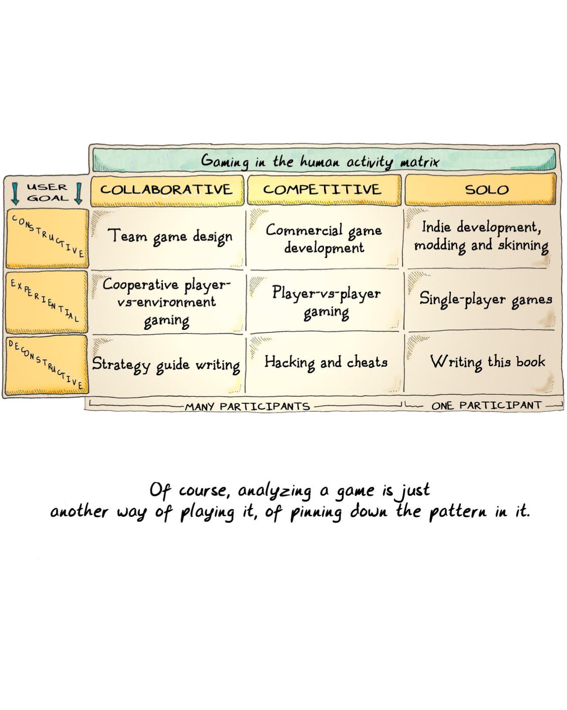

> <table>
>   <thead>
>     <tr>
>       <th colspan="4">人类活动中的游戏矩阵</th>
>     </tr>
>     <tr>
>       <th>用户目标</th>
>       <th>合作</th>
>       <th>竞争</th>
>       <th>单干</th>
>     </tr>
>   </thead>
>   <tbody>
>     <tr>
>       <td>建设</td>
>       <td>团队游戏设计</td>
>       <td>商业游戏开发</td>
>       <td>独立开发，模组，皮肤</td>
>     </tr>
>     <tr>
>       <td>体验</td>
>       <td>合作玩家对抗环境游戏</td>
>       <td>玩家对抗玩家游戏</td>
>       <td>单人游戏</td>
>     </tr>
>     <tr>
>       <td>解构</td>
>       <td>撰写攻略指南</td>
>       <td>黑客和作弊</td>
>       <td>撰写本书</td>
>     </tr>
>     <tr>
>       <td></td>
>       <td colspan="2">多人参与</td>
>       <td>一人参与</td>
>     </tr>
>   </tbody>
> </table>
> 
> Of course, analyzing a game is just another way of playing it, of pinning down the pattern in it.
> 
> 当然，分析游戏只是玩游戏的另一种方式，是找出其中的规律。

My second grid shows how we can analyze music. When I look at the chart for music, what I see is a constellation of music-based entertainment. If I made a similar chart for books, it would cover prose-based entertainment. Basically, this chart can be applied to any medium.

第二个网格展示了我们如何分析音乐。当我查看音乐图表时，我看到的是一群基于音乐的娱乐活动。如果我为书籍制作一个类似的图表，它将涵盖散文类娱乐。基本上，这个图表可以适用于任何媒介。

"Game" is a very fuzzy word. A few times in this book I have mentioned game systems as being distinct from games, or as the core element that makes something a game (in some senses). But "game systems" are not a medium. They are, depending on the definition, one use of a medium. The medium is really an unwieldy phrase like "formal abstract models for teaching patterns." I have taken to calling these "[ludic artifacts](#user-content-fn-1)[^1]" to distinguish them from the fuzziness of "game." Even though ludic artifacts—like fire drills or CIA model war games of the future of the Middle East—may not necessarily be fun, they still belong on the chart. The fact that they are not fun has more to do with their implementation than with their intrinsic nature.

“游戏”是一个非常模糊的词。在本书中，我曾多次提到游戏系统有别于游戏，或者游戏系统是游戏的核心要素（在某些意义上）。但 “游戏系统”并不是一种媒介。根据不同的定义，它们只是媒介的一种用途。媒介实际上是一个难以理解的短语，比如“教学模式的形式抽象模型”。我习惯于称这些为“[游戏机制](#user-content-fn-2)[^2]”，以区别于“游戏”的模糊性。尽管游戏机制——如消防演习或中情局关于中东未来的战争游戏模型——不一定有趣，但它们仍然属于图表。它们之所以不好玩，与其说与它们的内在本质有关，不如说与它们的实施方式有关。

Interaction happens with all media (at a minimum, we interact by engaging with the work). Actively and constructively interacting with stage-based media is termed "acting" and interacting with prose-based media is termed "writing." There's been a lot of discussion in professional video game design circles about "the surrender of authorship" inherent in adding greater flexibility to games and in the ["mod" community](#user-content-fn-3)[^3]. I think the key insight here is that players are simply "interacting with the medium" in a way that isn't purely experiential.

互动发生在所有媒介上（至少，我们通过与作品互动）。与舞台媒介进行积极和建设性的互动被称为“表演”，与散文媒介进行互动被称为“写作”。在专业的电子游戏设计圈子里，有很多关于在游戏和[“模组”社区](#user-content-fn-4)[^4]中增加更多灵活性所固有的“放弃作者身份”的讨论。我认为，关键在于玩家只是以一种非纯粹体验的方式“与媒介互动”。

In other words, modding is just playing the game in another way, sort of like a budding writer might rework plots of characters from other writers into derivative journeyman fiction or into fan fiction. The fact that some forms of interaction are constructive (modding a game), experiential (playing a game), or deconstructive (hacking a game) is immaterial; the same activities are possible with a given play, book, or song. Arguably, the act of literary analysis is much the same as the act of hacking a game—the act of disassembling the components of a given piece of work in a medium to see how it works, or even to get it to do things, carry messages, or otherwise represent itself as something other than what the author of the piece intended.

换句话说，MOD 只是以另一种方式玩游戏，就像新晋作家可能会把其他作家笔下的人物情节改编成衍生的穿越小说或粉丝小说。事实上，某些互动形式是建设性的（修改游戏）、体验性的（玩游戏）或解构性的（黑客攻击游戏）并不重要；同样的活动在特定的戏剧、书籍或歌曲中也是可能的。可以说，文学分析的行为与黑客攻击游戏的行为如出一辙——拆解特定作品在某种媒介中的组成部分，看看它是如何运作的，甚至让它做事、传递信息，或以其他方式表现出与作品作者意图不同的东西。

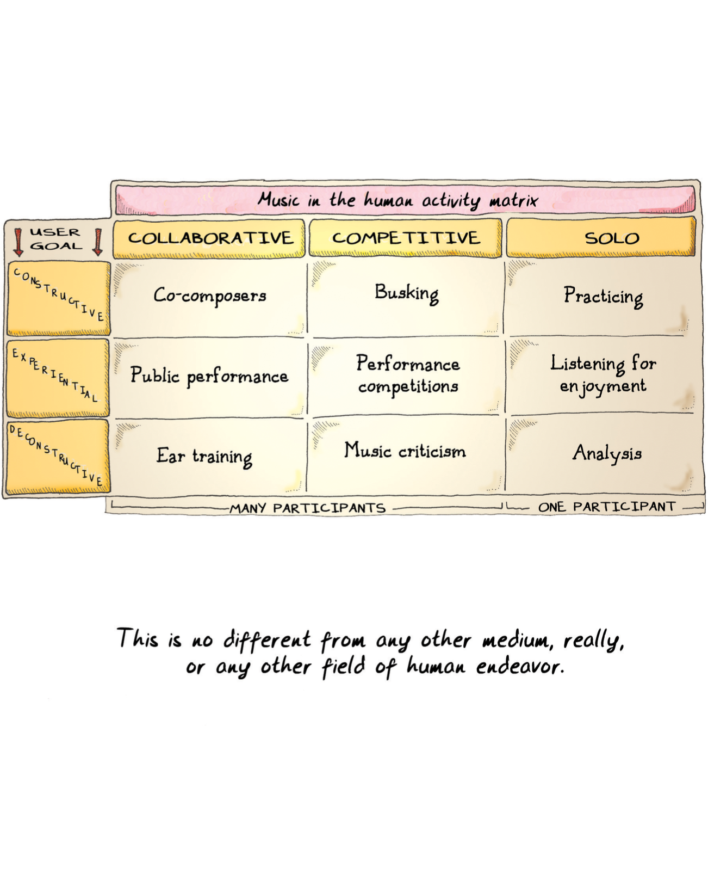

> <table>
>   <thead>
>     <tr>
>       <th colspan="4">人类活动中的音乐矩阵</th>
>     </tr>
>     <tr>
>       <th>用户目标</th>
>       <th>合作</th>
>       <th>竞争</th>
>       <th>单干</th>
>     </tr>
>   </thead>
>   <tbody>
>     <tr>
>       <td>建设</td>
>       <td>合作作曲家</td>
>       <td>街头卖艺</td>
>       <td>练习</td>
>     </tr>
>     <tr>
>       <td>体验</td>
>       <td>公共演出</td>
>       <td>表演比赛</td>
>       <td>欣赏</td>
>     </tr>
>     <tr>
>       <td>解构</td>
>       <td>练耳</td>
>       <td>音乐评论</td>
>       <td>分析</td>
>     </tr>
>     <tr>
>       <td></td>
>       <td colspan="2">多人参与</td>
>       <td>一人参与</td>
>     </tr>
>   </tbody>
> </table>
> 
> This is no different from any other medium, really, or any other field of human endeavor.
> 
> 实际上，这与其他任何媒介或人类行为的任何其他领域并无不同。

Some of the activities on the first chart aren't what you would normally term "fun," even though they are almost all activities in which you learn patterns. We can sit here and debate whether performing music, writing a story, or drawing a picture is fun. Having training in all three, I can tell you that they are all hard work, which isn't something we necessarily consider fun. But I derive great fulfillment from these activities. This is perhaps analogous to watching Hamlet on stage, reading [Lord Jim](#user-content-fn-5)[^5], or viewing [Guernica](#user-content-fn-6)[^6]—an interaction with a system rich and challenging enough to permit me to treat it as a learning opportunity.

第一张图表中的一些活动并不是你通常所说的“有趣”，尽管它们几乎都是学习模式的活动。我们可以坐在这里争论表演音乐、写故事或画画是否有趣。我在这三方面都接受过训练，我可以告诉你，它们都是艰苦的工作，我们不一定会认为这很有趣。但我从这些活动中获得了极大的成就感。这也许类似于在舞台上观看《哈姆雷特》、阅读[《吉姆勋爵》](#user-content-fn-7)[^7]或观赏[《格尔尼卡》](#user-content-fn-8)[^8]——与一个系统的互动丰富而富有挑战性，足以让我把它当作一次学习的机会。

The chills that go down your back are not always indicative of something that you find enjoyable. A tragedy or moment of great sorrow can cause them. The moment you recognize a pattern, your body will give you the chill as a sign. Just as writing isn't necessarily fun but might be something valuable for the writer to do, or practicing piano for hours on end might not be fun but something that gives fulfillment, engaging in interaction with games need not be fun, either, but might indeed be fulfilling, thought-provoking, challenging, and also difficult, painful, and even compulsive.

背脊发凉并不总是你觉得愉快的事情。悲剧或极度悲伤的时刻也会引起它们。当你发现一个规律的时候，你的身体就会给你寒意作为信号。就像写作并不一定有趣，但对写作者来说可能是有价值的事情，或者连续几个小时的钢琴练习可能并不有趣，但却能给人带来成就感一样，参与游戏互动也不一定有趣，但确实可能是充实的、发人深省的、具有挑战性的，也可能是困难的、痛苦的，甚至是强迫性的。

In other words, games can take forms we don't recognize. They might not be limited to being "a game" or even a "[software toy](#user-content-fn-9)[^9]." The definition of "game" implies certain things, as do the words "toy," "sport," and "hobby." The layman's definition of "game" covers only some of the boxes in the grid. Arguably, all of the boxes in the grid are fun to someone. We need to start thinking of games a little more broadly. Otherwise, we will be missing out on large chunks of their potential as a medium.

换句话说，游戏可以有我们不认识的形式。它们可能并不局限于“游戏”，甚至是“[软件玩具](#user-content-fn-10)[^10]”。与“玩具”、“运动”和“爱好”等词一样，“游戏”的定义也暗示着某些东西。外行人对 “游戏”的定义只包括网格中的部分方框。可以说，网格中的所有方格对某些人来说都是有趣的。我们需要从更广阔的角度来看待游戏。否则，我们就会错过游戏作为一种媒介所具有的巨大潜力。

The reason why the rise of critique and academia surrounding games is important is that it finally adds the missing element to put games in context with the rest of human endeavor. It signals their arrival as a medium. Considering how long they have been around, they're a little late to the party.

围绕游戏的评论和学术研究的兴起之所以重要，是因为它最终增加了一个缺失的元素，将游戏与人类其他活动联系起来。它标志着游戏作为一种媒介的到来。考虑到游戏已经存在了很长时间，它们的出现有点晚了。

Once games are seen as a medium, we can start worrying about whether they are a medium that permits art. All other media do, after all.

一旦游戏被视为一种媒介，我们就可以开始担心它是否是一种允许艺术存在的媒介。毕竟，所有其他媒介都是如此。

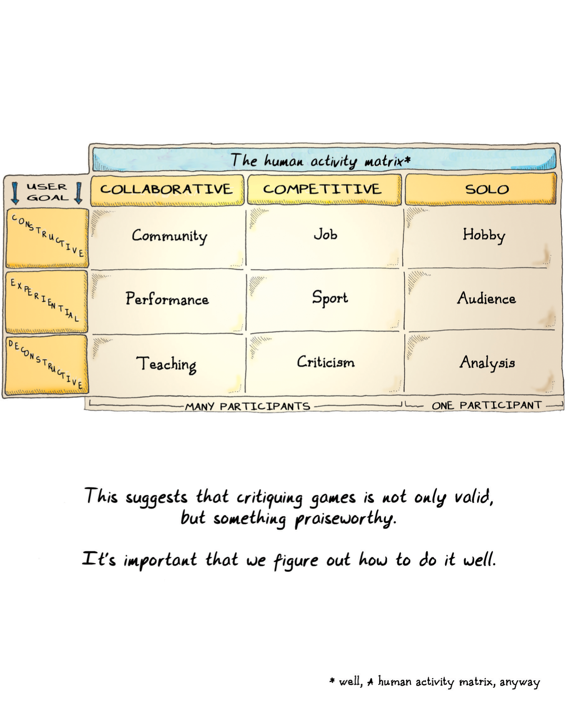

> <table>
>   <thead>
>     <tr>
>       <th colspan="4">人类活动矩阵</th>
>     </tr>
>     <tr>
>       <th>用户目标</th>
>       <th>合作</th>
>       <th>竞争</th>
>       <th>单干</th>
>     </tr>
>   </thead>
>   <tbody>
>     <tr>
>       <td>建设</td>
>       <td>社区</td>
>       <td>工作</td>
>       <td>爱好</td>
>     </tr>
>     <tr>
>       <td>体验</td>
>       <td>表演</td>
>       <td>体育</td>
>       <td>观众</td>
>     </tr>
>     <tr>
>       <td>解构</td>
>       <td>教学</td>
>       <td>评论</td>
>       <td>分析</td>
>     </tr>
>     <tr>
>       <td></td>
>       <td colspan="2">多人参与</td>
>       <td>一人参与</td>
>     </tr>
>   </tbody>
> </table>
> 
> This suggests that critiquing games is not only valid, but something praiseworthy.
> 
> 这表明，批评游戏不仅是正确的，而且是值得称赞的。
> 
> It's important that we figure out how to do it well.
> 
> 重要的是，我们要想办法做好这件事。
> 
> \* well, A human activity matrix, anyway
> 
> \* 好吧，一个人类活动矩阵

Pinning art down is tricky. We can start from the basics, though. What is art for? Communicating. That's intrinsic to the definition. And (if you've bought into the premises of this book) we have seen that the basic intent of games is rather communicative as well—it is the creation of a symbolic logic set that conveys meaning.

把艺术固定下来是件棘手的事。不过，我们可以从最基本的开始。艺术是用来做什么的？传播。这是艺术的固有定义。而且（如果你相信本书的前提），我们已经看到，游戏的基本意图也相当具有交流性，它是创造一种传递意义的符号逻辑集。

Some apologists for games like to tout the fact that games are interactive as a sign that they are special. Others like to say that interactivity is precisely why games cannot be art, because art relies on authorial intent and control. Both positions are balderdash. [Every medium is interactive](#user-content-fn-11)[^11]—just go look on the grid.

一些为游戏辩护的人喜欢把游戏具有互动性这一事实作为游戏特别的标志。还有人喜欢说，互动性正是游戏不能成为艺术的原因，因为艺术依赖于作者的意图和控制。这两种观点都是胡说八道。[每一种媒介都是互动的](#user-content-fn-12)[^12]——去网格上看看就知道了。

So what is art? My take on it is simple. Media provide information. Entertainment provides comforting, simplistic information. And art provides challenging information, stuff that you have to think about in order to absorb. Art uses a particular medium to communicate within the constraints of that medium, and often what is communicated is thoughts about the medium itself (in other words, a formalist approach to arts—much modern art falls in this category).

那么什么是艺术呢？我的看法很简单。媒介提供信息。娱乐提供的是令人欣慰的、简单化的信息。而艺术提供的是具有挑战性的信息，是你必须思考才能吸收的东西。艺术使用一种特定的媒介，在该媒介的限制下进行交流，交流的内容往往是对媒介本身的思考（换句话说，艺术的形式主义方法——很多现代艺术都属于这一类）。

The medium shapes the nature of the message, of course, but the message can be representational, impressionistic, narrative, emotional, intellectual, or whatever else. Some art works are solo creations, and some are collaborative (and they can all be made collaborative to an extent, I believe). And some media are actually the result of the collaboration of specialists in many different media, working together to present a work that is incomplete without the use of multiple media within it. Film is one such medium. And games are another.

当然，媒介决定了信息的性质，但信息可以是表现性的、印象性的、叙事性的、情感性的、知识性的，或其他任何形式的。有些艺术作品是单独创作的，有些则是合作创作的（我相信它们在某种程度上都可以是合作创作的）。而有些媒介实际上是许多不同媒介的专家合作的结果，他们共同完成的作品，如果没有多种媒介的使用，是不完整的。电影就是这样一种媒介。游戏是另一种。

One of the most common points I hear about why video games are not an art form is that they are just for fun. They are just entertainment. Hopefully, I've made it clear why that is a dangerous underestimation of fun. But most music is also just entertainment, and most novels are read just for fun, and most movies are mere escapism, and yes, even most pretty pictures are just pretty pictures. The fact that most games are merely entertainment does not mean that this is all they are doomed to be.

关于电子游戏为什么不是一种艺术形式，我最常听到的观点之一就是它们只是为了好玩。它们只是娱乐而已。希望我已经说得很清楚，这是对娱乐的危险低估。但是，大多数音乐也只是娱乐，大多数小说也只是为了消遣，大多数电影也只是逃避现实，是的，甚至大多数漂亮的图片也只是漂亮的图片。大多数游戏只是娱乐，但这并不意味着它们注定只能是娱乐。

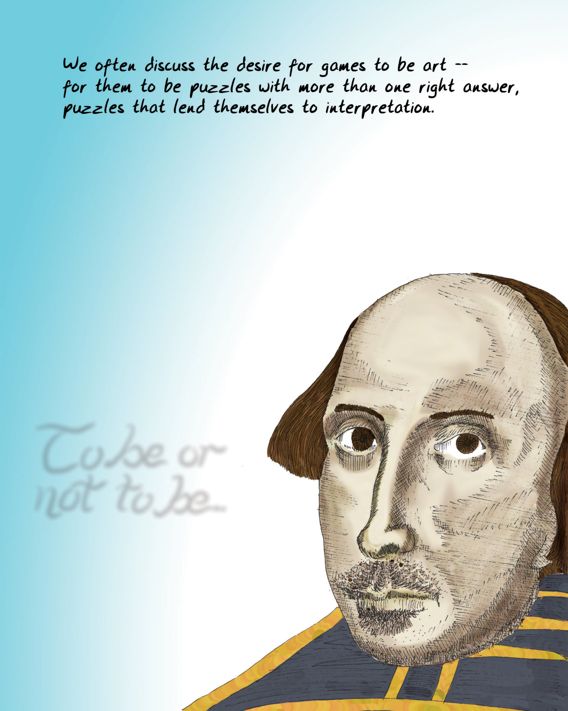

> We often discuss the desire for games to be art--for them to be puzzles with more than one right answer, puzzles that lend themselves to interpretation.
> 
> 我们经常讨论游戏成为艺术的渴望——渴望成为不仅仅有一个正确答案的谜题，成为能够引发解读和多重理解的谜题。
> 
> To be or not to be.
> 
> 生存还是毁灭。

Mere entertainment becomes art when the communicative element in the work is either novel or exceptionally well done. It really is that simple. The work has the power to alter how people perceive the world around them. And it's hard to imagine a medium more powerful in that regard than video games, where you are presented with a virtual world that reacts to your choices.

当作品中的交流元素新颖或做得特别好时，单纯的娱乐就变成了艺术。就是这么简单。作品有能力改变人们对周围世界的看法。在这方面，很难想象有哪种媒介比电子游戏更有力量，因为在电子游戏中，你所看到的虚拟世界会对你的选择做出反应。

"Well done" and "novel" mean, basically, craft. You can have well-crafted entertainment that fails to reach the level of art. The upper reaches of art are usually subtler achievements. They are works that you can return to again and again, and still learn something new from. The analogy for a game would be one you can replay over and over again, and still discover new things.

“做得好”和“新颖”基本上是指工艺。精心制作的娱乐作品可能达不到艺术的水平。艺术的上层通常是更微妙的成就。这些作品可以让你反复回味，并从中汲取新的东西。对于游戏的类比是，一个可以反复玩游戏，但仍能从中发现新的东西。

Since games are closed formal systems, that might mean that games can never be art in that sense. But I don't think so. I think that means that we just need to decide what we want to say with a given game—something big, something complex, something open to interpretation, something where there is no single right answer—and then make sure that when the player interacts with it, she can come to it again and reveal whole new aspects to the challenge presented.

由于游戏是封闭的形式系统，这可能意味着游戏在这个意义上永远无法成为艺术。但我不这么认为。我认为，这意味着我们只需要确定我们想用一个游戏表达什么——一些宏大的东西，一些复杂的东西，一些可以解释的东西，一些没有唯一正确答案的东西——然后确保当玩家与之互动时，她可以再次面对它，并揭示所呈现挑战的全新方面。

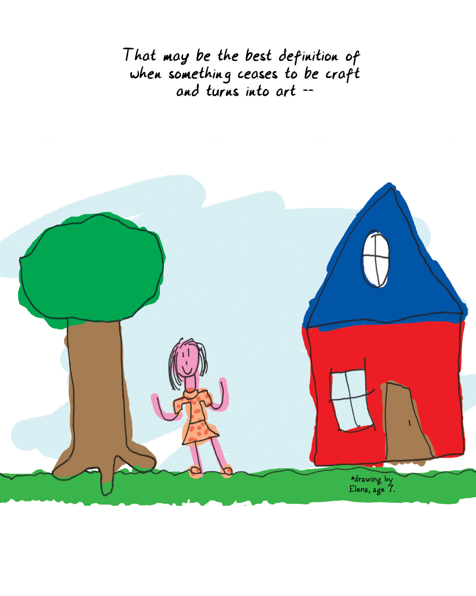

> That may be the best definition of when something ceases to be craft and turns into art --
> 
> 这可能是判断某事物何时从工艺转变为艺术的最佳标准——

What would a game like this be?

这样的游戏会是什么呢？

It would be thought-provoking.

它会发人深省。

It would be revelatory.

它会启发思考。

It might contribute to the betterment of society.

它可能会改善社会。

It would force us to reexamine assumptions.

它会迫使我们重新审视假设。

It would give us different experiences each time we tried it.

每次尝试都会给我们带来不同的体验。

It would allow each of us to approach it in our own ways.

它会允许我们每个人以自己的方式来对待它。

It would forgive misinterpretation—in fact, it might even encourage it.

它会宽容误解，事实上，它甚至会鼓励误解。

It would not dictate.

它不会发号施令。

It would immerse, and change a worldview.

它会令人沉浸其中，并改变世界观。

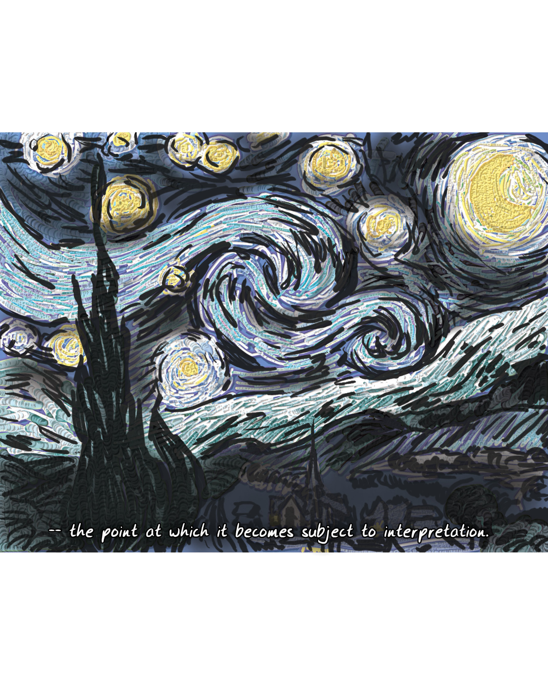

> -- the point at which it becomes subject to interpretation.
> 
> ——即当它开始受到主观解读的那一刻。

Some might say that abstract formal systems cannot achieve this. But I have seen wind course across the sky, bearing leaves; I have seen paintings by [Mondrian](#user-content-fn-13)[^13] made of nothing but colored squares; I have heard Bach played on a harpsichord; I have traced the rhythms of a sonnet; I have followed the steps of a dance.

有人可能会说，抽象的形式系统无法做到这一点。但是，我曾见风掠天际，携叶起舞；我曾赏[蒙德里安](#user-content-fn-14)[^14]，色格构筑；我曾听巴赫之音，琴键倾诉；我曾循诗行漫步，韵律含蓄；我曾踏舞者步履，优雅追逐。

All media are abstract, formal systems. They have grammars, methods, and systems of craft. They follow rules, whether it is the rules of language, the rules of [leading tones](#user-content-fn-15)[^15] in music,  or the rules of visual composition. They often play with these rules and reveal startling new aspects to them.

所有媒介都是抽象的、形式化的系统。它们有语法、方法和工艺系统。它们遵循规则，无论是语言规则、音乐中的[导音](#user-content-fn-16)[^16]规则，还是视觉构图规则。它们经常玩弄这些规则，并揭示其惊人的新方面。

All artists choose constraints when they set out to create: a postage stamp of paper or a broad canvas; to use rhyme or free verse; the choice of piano versus guitar. In fact, choosing constraints is one of the most fruitful ways to prod creativity.

所有艺术家在开始创作时都会选择一些限制条件：一张邮票大小的纸张还是宽阔的画布；使用韵律还是自由诗；选择钢琴还是吉他。事实上，选择约束条件是激发创造力最富有成效的方法之一。

Games, too, share these characteristics. "Create a one button game." "Invent a game using nothing more than pennies and a deck of cards." "Design a game that is about [exact cover](#user-content-fn-17)[^17]."

游戏也有这些特点。“创造一个单按钮的游戏”。“发明一个只用几枚硬币和一副扑克牌的游戏”。“设计一款关于[精确覆盖](#user-content-fn-18)[^18]的游戏”。

Let's not sell abstraction and formality short.

我们不应该低估抽象性和形式化的重要性。

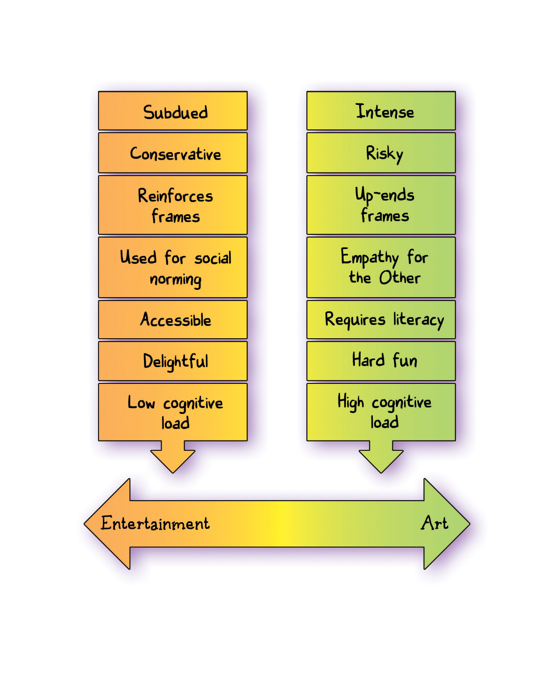

> <table>
>   <tbody>
>     <tr>
>       <td>可控</td>
>       <td>强烈</td>
>     </tr>
>     <tr>
>       <td>保守</td>
>       <td>冒险</td>
>     </tr>
>     <tr>
>       <td>强化框架</td>
>       <td>颠覆框架</td>
>     </tr>
>     <tr>
>       <td>用于社会规范</td>
>       <td>同情他人</td>
>     </tr>
>     <tr>
>       <td>平易近人</td>
>       <td>需要专业知识</td>
>     </tr>
>     <tr>
>       <td>令人愉悦</td>
>       <td>硬核趣味</td>
>     </tr>
>     <tr>
>       <td>低认知负荷</td>
>       <td>高认知负荷</td>
>     </tr>
>     <tr>
>       <td>娱乐</td>
>       <td>艺术</td>
>     </tr>
>   </tbody>
> </table>

In fact, the toughest puzzles are the ones that force the most self-examination. They are the ones that challenge us most deeply on many levels—mental stamina, mental agility, creativity, perseverance, physical endurance, and emotional self-abnegation. They come precisely from the interactive portions of the chart, when you look at other media.

事实上，最难的谜题是最能迫使我们自我审视的谜题。它们对我们的心理耐力、思维敏捷性、创造力、毅力、身体耐力和情感上的自我克制等多个层面提出了最深刻的挑战。当你观察其他媒介时，它们恰恰来自图表中的互动部分。

Consider the act of creation.

考虑一下创作行为。

It's one of the toughest things to do well in human endeavor. And yet it is also one of our most instinctive actions; from a young age, we not only trace patterns but attempt to create new ones. We scribble with crayons, we ba-ba-ba our way through songs.

这是人类努力中最难做好的事情之一。然而，这也是我们最本能的行为之一；从小到大，我们不仅追踪模式，还试图创造新的模式。我们用蜡笔涂鸦，用咿咿呀呀的方式唱歌。

The fact that playing games—good ones, anyway—is fundamentally a creative act is something that speaks very well for the medium. Games, at their best, are not prescriptive. They demand that the user create a response given the tools at hand. It is a lot easier to fail to respond to a painting than to fail to respond to a game.

无论如何，玩游戏——至少是好的游戏——本质上是一种创造性行为，这一点对游戏媒介来说非常有利。最好的游戏不是规定性的。它们要求用户根据手头的工具做出反应。与画作相比，游戏更容易引发玩家的响应。

No other artistic medium is defined around a single intended effect on the user, such as "fun." They all embrace a wider array of emotional impact. Now, we may be running into definitional questions for the word "fun" here, obviously, but even so, I'd prefer to approach things from a more [formalist](#user-content-fn-19)[^19] perspective to actually arrive at what the basic building blocks of the medium are. From a formalist point of view, music can be considered ordered sound and silence, poetry can be considered the placement of words and gaps between words, and so on.

没有任何一种艺术媒介是围绕对用户的单一预期效果（如“乐趣”）来定义的。它们都包含更广泛的情感影响。现在，我们可能会遇到 “趣味”一词的定义问题，但即便如此，我还是倾向于从[形式主义](#user-content-fn-20)[^20]的角度来看待问题，以真正了解艺术媒介的基本构成要素是什么。从形式主义的角度来看，音乐可以被视为有序的声音和寂静，诗歌可以被视为词语的位置和词语之间的间隙，等等。

The closer we get to understanding the basic building blocks of games—the things that players and creators alike manipulate in interacting with the medium—the more likely we are to achieve the heights of art.

我们越是接近于理解游戏的基本构件——玩家和创作者在与游戏媒介互动时所操控的东西——我们就越有可能达到艺术的高度。

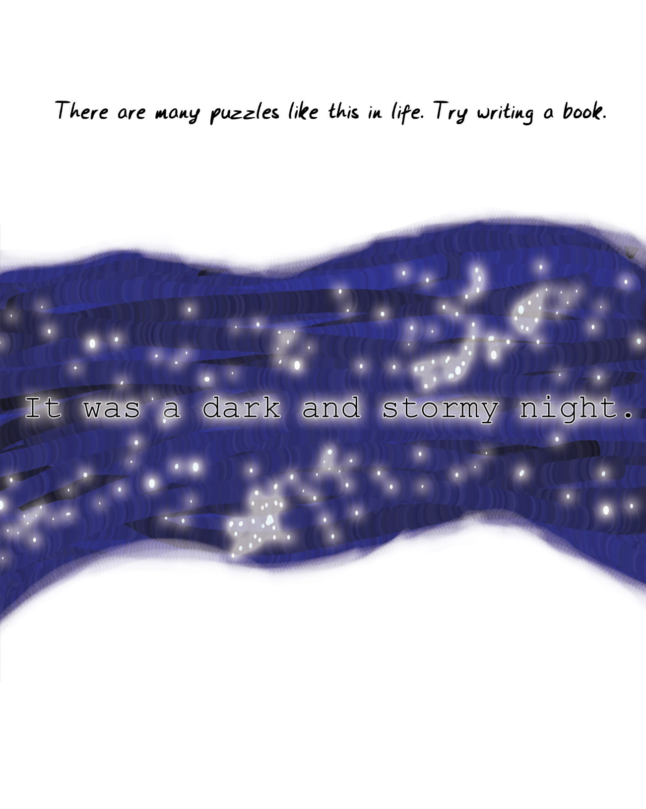

> There are many puzzles like this in life. Try writing a book.
> 
> 生活中有很多这样的谜题。试着写一本书吧。
> 
> It was a dark and stormy night.
> 
> 那是一个月黑风高的夜晚。

Some folks [disagree with me pretty vehemently on this](#user-content-fn-21)[^21]. They feel that the art of the game lies in the formal construction of systems. The more artfully constructed the system is, the closer the game is to art.

在这一点上，有些人[与我的看法大相径庭](#user-content-fn-22)[^22]。他们认为游戏的艺术在于系统的形式构造。系统构造得越艺术，游戏就越接近艺术。

Putting games in context with other media demands that we consider this viewpoint. In literature, it's called a [belles-lettristic](#user-content-fn-23)[^23] point of view. The beauty of poetry lies solely in the sound and not in the sense, according to those who feel this way.

将游戏与其他媒介放在一起，我们就必须考虑这一观点。在文学领域，这被称为“[美文](#user-content-fn-24)[^24]”观点。持这种观点的人认为，诗歌的美只在于声音，而不在于意义。

And yet, even the shape of the sound can be put in context. Let's digress and consider some other media...

然而，即使是声音的形状也可以放在一定情境下。让我们暂时说点题外话，考虑一下其他媒介……

[Impressionist](#user-content-fn-25)[^25] painting is about a more distanced form of seeing, of mimesis. Modern image processing tools describe the formal process used by Impressionist painters (and indeed many of the later processes such as [posterization](#user-content-fn-26)[^26]) as filters. Impressionist paintings are depictions not of an object or a scene, but of the play of light on an object or scene. An Impressionist painting still conforms to all previously established rules of composition—color weight, balance, vanishing point, center of gravity, eye center, and so on—while essentially avoiding painting the object or scene itself, which ends up being absent from the finished work.

[印象派](#user-content-fn-27)[^27]绘画是一种距离更远的观看和模仿。现代图像处理工具将印象派画家使用的形式过程（以及后来的许多过程，如[分色](#user-content-fn-28)[^28]）描述为滤镜。印象派绘画描绘的不是物体或场景，而是光线在物体或场景上的作用。印象派画作仍然符合所有以前确立的构图规则——色彩权重、平衡、消失点、重心、视觉中心等——同时基本上避免描绘物体或场景本身，因为最终完成的作品中是没有物体或场景的。

Impressionist music was based primarily on repetition; it went on to influence minimalist styles ranging from Philip Glass to electronica. Impressionist music is essentially that of [Debussy](#user-content-fn-29)[^29]: intensely varied in orchestration, extremely complex, particularly in its chromatic harmonies, and very repetitive melodically. [Ravel](#user-content-fn-30)[^30]'s work as an orchestrator is perhaps the epitome of the Impressionistic style: his "Bolero" consists of the same passage played over and over, identical harmonically and melodically; it has merely been orchestrated differently at each repetition, and the dynamics are different. The sense of crescendo throughout the piece is achieved precisely though this repetition.

印象派音乐主要以重复为基础，并对菲利普·格拉斯和电子乐等极简主义风格产生了影响。印象派音乐基本上是[德彪西](#user-content-fn-31)[^31]的音乐：管弦乐变化多端，极其复杂，尤其是半音和声，旋律非常重复。[拉威尔](#user-content-fn-32)[^32]作为配器师的作品也许是印象派风格的典型代表：他的《波莱罗》由重复演奏的相同段落组成，和声和旋律完全相同；只是每次重复时编排不同，且动态效果也不同。整首乐曲的高潮感正是通过这种重复来实现的。

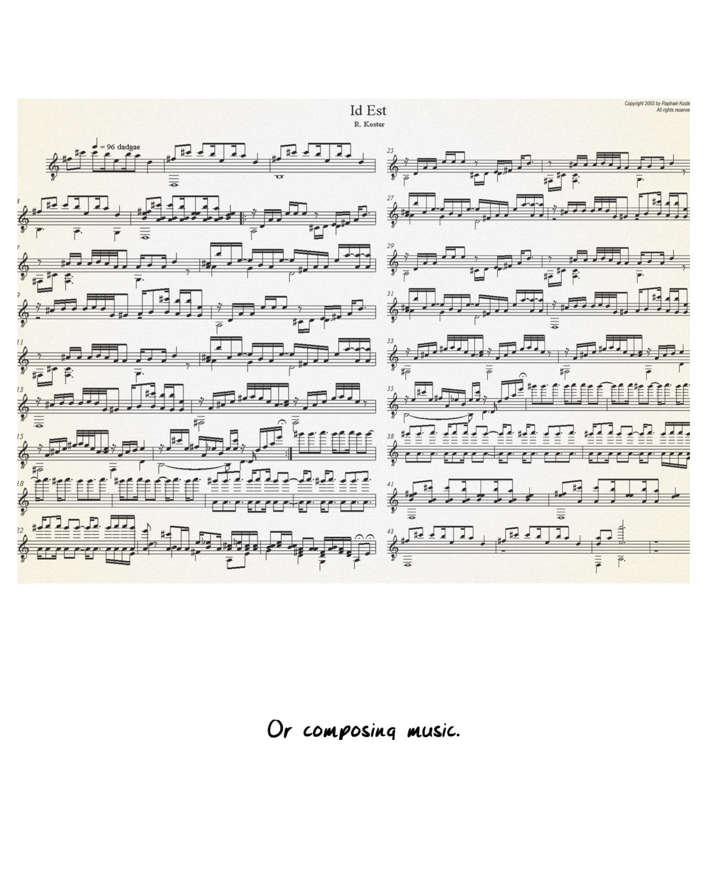

> Or composing music.
> 
> 或者作曲。

And of course, there was "Impressionist" writing. [Virginia Woolf](#user-content-fn-33)[^33], [Gertrude Stein](#user-content-fn-34)[^34], and many other writers worked with the idea that characters are unknowable. Books like Jacob's Room and The Autobiography of Alice B. Toklas play with the established notions of self and work towards a realization that other people are essentially unknowable. However, they also propose an alternate notion of knowability: that of "negative space," whereby a form is understood and its nature grasped by observing the perturbations around it. The term is from the world of pictorial art, which provides many useful insights when discussing the problem of representation of reality.

当然，还有“印象派”写作。[弗吉尼亚·伍尔夫](#user-content-fn-35)[^35]、[格特鲁德·斯坦因](#user-content-fn-36)[^36]和其他许多作家都曾提出过“人物是不可知的”这个观点。《雅各布的房间》和《爱丽丝·B·托克拉斯自传》等书玩弄了既定的自我概念，并努力让人们认识到其他人本质上是不可知的。然而，它们也提出了可知性的一个替代概念："负空间"，即通过观察周围的扰动变化来理解一种形式并把握其本质。这个术语来自绘画艺术世界，在讨论现实的再现问题时提供了许多有用的见解。

All of these are organized around the same principles: negative space, embellishing the space around a central theme, and observing perturbations and reflections. There was a [zeitgeist](#user-content-fn-37)[^37] at that time; these approaches were "in the air," but there was also conscious borrowing from art form to art form. This occurred in large part because no art form stands alone; they bleed into one another.

所有这些都围绕着相同的原则：负空间、围绕中心主题点缀空间、观察扰动和反射。当时有一种[时代思潮](#user-content-fn-38)[^38]；这些方法“风靡一时”，但同时也有意识地在不同艺术形式之间相互借鉴。这在很大程度上是因为没有一种艺术形式是孤立存在的，它们相互影响渗透。

Can you make an Impressionist game? A game where the formal system conveys the following:

你能制作一款印象派游戏吗？一款形式系统传达以下特点的游戏：

* The object you seek to understand is not visible or depicted.\
	你所要理解的对象是不可见的，或也没有被描绘出来。

* Negative space is more important than shape.\
	负空间比形状更重要。

* Repetition with variation is central to understanding.\
	带有变化的重复是理解的核心。

The answer is: of course you can. It's called [Minesweeper](#user-content-fn-39)[^39].

答案是：当然可以。它叫做[扫雷](#user-content-fn-40)[^40]。

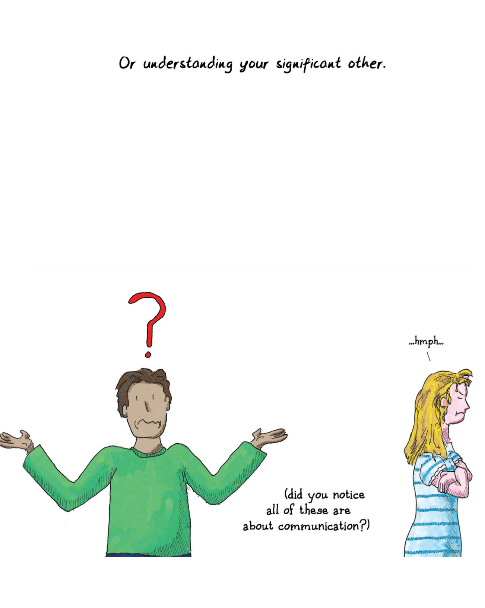

> Or understanding your significant other.
> 
> 或者理解你的另一半。
> 
> ...hmph...
> 
> ……哼……
> 
> (did you notice all of these are about communication?)
> 
> (你注意到所有这些都与沟通有关吗？）

In the end, the endeavor that games engage in is similar to the endeavors of any other art form. The principal difference is not the fact that they consist of formal systems. Look at the following lists of terms:

归根结底，游戏所从事的工作与任何其他艺术形式所从事的工作都是相似的。主要区别并不在于它们由形式系统组成。请看以下术语清单：

* Meter, rhyme, spondee, slant rhyme, onomatopoeia, caesura, iamb, trochee, pentameter, rondel, sonnet, verse\
    格律、韵脚、扬扬格、斜韵、拟声词、休止、抑扬格、扬抑格、五音步子、回旋诗歌、十四行诗、诗歌

* Phoneme, sentence, accent, fricative, word, clause, object, subject, punctuation, case, pluperfect, tense\
    音素、句子、重音、摩擦音、单词、从句、宾语、主语、标点符号、格、过去完成时、时态

* Meter, fermata, key, note, tempo, coloratura, orchestration, arrangement, scale, mode
    节拍、延长符号、调性、音符、速度、花腔、配器、编排、音阶、调式

* Color, line, weight, balance, compound, multiply, additive, refraction, closure, model, still life, perspective\
    色彩、线条、视觉重量、平衡、复合、乘法、加法、折射、闭合、模特、静物、透视

* Rule, level, score, opponent, boss, life, power-up, pick-up, bonus round, icon, unit, counter, board\
    规则、关卡、分数、对手、头目、生命、强化道具、拾取、奖励关、图标、单位、计数器、棋盘

Let's not kid ourselves—the sonnet is caged about with as many formal systems as a game is.

让我们不要自欺欺人了——十四行诗和游戏一样，被各种形式规则系统所约束。

If anything, the great irony about games, put in context with other media, is that they may afford less scope to the designer, who has less freedom to impose, less freedom to propagandize. Game systems are not good at conveying specifics, only generalities. It is easy to make a game system that tells you that small groups can prevail over large ones, or the converse. And that may be a valuable and deeply personal statement to make. It's a lot harder to make an abstract ludic artifact that conveys the specific struggle of a group of World War II soldiers to rescue one other man from behind enemy lines, as the film Saving Private Ryan does, without resorting to the tools of writing. The designer who wants to use game system design as an expressive medium must be like the painter and the musician and the writer, in that she must learn what the strengths of the medium are, and what messages are best conveyed by it.

如果要说有什么的话，与其他媒体相比，游戏最大的讽刺之处在于，它为设计者提供的发挥空间可能更小，设计者在施加意图、进行宣传鼓吹方面的自由度更低。游戏系统不善于传达具体内容，只能传达一般性内容。制作一个游戏系统，告诉你小团队能够战胜大团队，或者相反的情况，这相对容易做到。这可能是一个有价值的、深刻的个人声明。但要像电影《拯救大兵瑞恩》那样，不借助文字工具，仅通过抽象的游戏机制，传达一群二战士兵为从敌后营救一个人而进行的具体斗争，这就困难得多。想要把游戏系统设计作为一种表现媒介的设计师，必须像画家、音乐家和作家一样，了解这种媒介的优势所在，以及哪些信息最适合通过它传达。

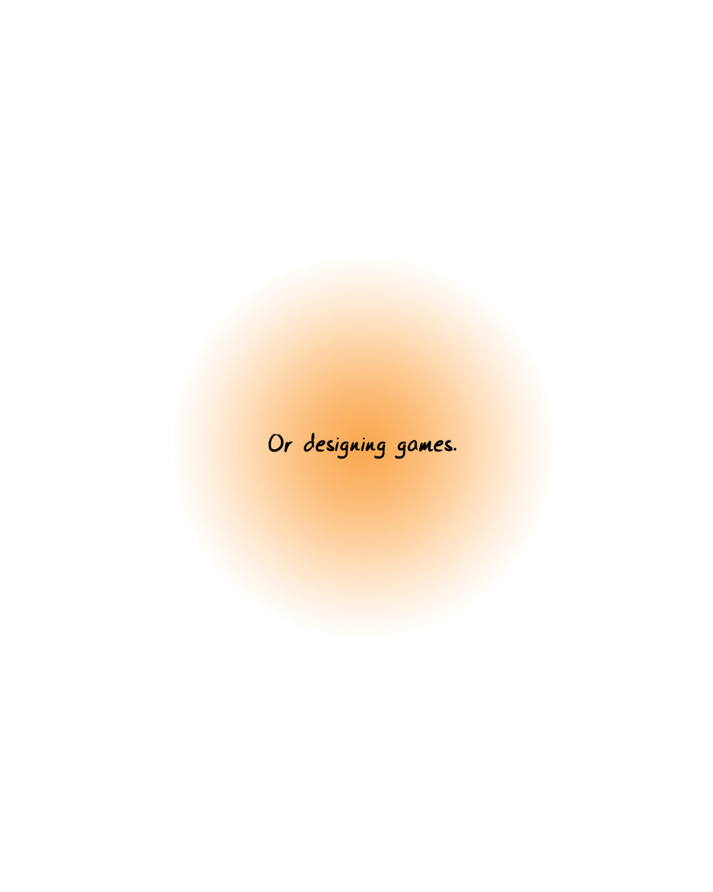

> Or designing games.
> 
> 或者射击游戏。

[^1]: Ludic artifact: It's an awkward term, but it avoids the challenges inherent in using "game" for very fuzzy concepts. In short:
	* The world is full of systems.
	* If we approach these with Suits' lusory attitude, we learn how they work through play, as elucidated in this book.
	* Fun is the feedback the brain gives us in the process.
	* We generally term the resultant activity a game.
	* Systems generally need to meet certain qualifications to be a good opportunity for the above. We could call these ludic structures.
	* A consciously designed ludic structure is a ludic artifact.
	* Even ones that are not consciously designed tend to have such as design imposed on them by our act of turning them into a game: we layer on goals, success metrics, etc.
For an essay-length working out of this concept, see [here](http://www.raphkoster.com/2013/04/16/playing-with-game/).

[^2]: 游戏机制：这是一个笨拙的术语，但它避免了用“游戏”来描述非常模糊的概念时所固有的难题。简而言之：
	* 这个世界充满了系统。
	* 如果我们以苏伊茨的“游戏”态度来对待这些系统，我们就能通过游戏来了解它们是如何运作的。正如本书所阐明的那样。
	* 乐趣是大脑在这一过程中给予我们的反馈。
	* 我们通常将由此产生的活动称为游戏。
	* 一般来说，系统需要满足一定的条件才能成为实现上述目标的好机会。我们可以把这些系统称为“游戏结构”。
	* 有意识设计的游戏结构就是游戏机制。
	* 即使不是有意识设计的，我们在将其转化为游戏的过程中，也会将这种设计强加给它们：我们会在其上叠加目标、成功指标等。
有关这一概念的长篇论文，请参阅[这里](http://www.raphkoster.com/2013/04/16/playing-with-game/)。

[^3]: Mod or modding: Many video games are constructed in a way that permits players to create variants on the rules, alter the artwork, or even create whole new games using the game's software. This has led to large "mod communities" of player-contributed games and content. This is similar to "house rules" for board games.

[^4]: 模组或修模：许多电子游戏的构造方式允许玩家对游戏规则进行修改，改变游戏美术设计，甚至使用游戏软件创建全新的游戏。这就形成了由玩家贡献游戏和内容的大型“模组社区”。这与棋盘游戏的“内部规则”类似。

[^5]: Lord Jim: A novel by Joseph Conrad. It is not a cheery book, and the ending is fatalistic at best and grim at worst.

[^6]: Guernica: A painting by Pablo Picasso, done to commemorate and protest the bombing of that city during the Spanish Civil War.

[^7]: 《吉姆勋爵》：约瑟夫·康拉德的小说。这不是一本令人愉快的书，其结局往好里说是宿命论，往坏里说是残酷的。

[^8]: 《格尔尼卡》：巴勃罗·毕加索为纪念和抗议西班牙内战期间该城市遭到轰炸而创作的一幅画。

[^9]: Software toy: A common appellation for video games that are not goal-oriented.

[^10]: 软件玩具：对不以目标为导向的电子游戏的俗称。

[^11]: Every medium is interactive: Whether you prefer Marshall McLuhan's nomenclature of "hot" and "cold" media or more contemporary conceptions of audience participation in the artistic construct, such as reader-response theory, is kind of academic because it's a debate about the level of interactivity present in only one box in the chart.

[^12]: 每一种媒介都是互动的：无论你偏好马歇尔·麦克卢汉的“热”和“冷”媒介命名法，还是更现代的受众参与艺术建构的概念，如读者反应理论，这些都有点学术性，因为这只是关于图表中一个方框的互动程度的争论。

[^13]: Mondrian: Piet Mondrian was a painter who was particularly noted for his compositions that used only colored squares and oblongs.

[^14]: 蒙德里安：皮特·蒙德里安是一位画家，他的作品只使用彩色的正方形和长方形，因此尤为著名。

[^15]: Leading tones: In music theory, this is the idea that certain pitches naturally lead the ear to expect another note. The act of moving to this new pitch is usually called "resolving" the harmony. The commonest place where we see this is leading from the V back to the I (from the dominant to the tonic), where the leading tone is the major third of the V, and one half-step short of the tonic's root, the note that is the key the song is in.

[^16]: 导音：在音乐理论中，这是一种认为某些音高自然引导听者期待另一个音符的概念。移动到这个新音高的行为通常被称为“解决”和声。最常见的情况是从 V 回到 I（从属音回到主音），其中导音是 V 的大三度，距离主音根音——也就是歌曲所在调性的基音——只有半音之遥。

[^17]: Exact cover: A class of mathematical problems based on allocating resources so that every contingency is covered. [Wikipedia](http://en.wikipedia.org/wiki/Exact_cover) has all the math for you.

[^18]: 精确覆盖：一类基于资源分配的数学问题，以确保覆盖所有可能情况。[维基百科](http://en.wikipedia.org/wiki/Exact_cover)为你提供了所有数学知识。

[^19]: Formalism: As used here, formalism means the examination of essential qualities that make up a classified artifact. It is essentially an approach based on precise description, and arriving at terms. There are many other schools of criticism, including those which reject the notion of essential qualities at all.

[^20]: 形式主义：这里所说的形式主义是指对构成分类艺术品的基本特征进行研究。它本质上是一种基于精确描述并得出术语的方法。还有许多其他的批评流派，包括那些完全拒绝本质特征概念的流派。

[^21]: Disagree with me on this: The game designer Dave Kennerly feels that "shoehorning the principle of the movie, book, narrative, or other inapplicable medium onto the game perpetuates bad games." In his defense, he is speaking primarily of the construction of formal systems themselves.

[^22]: 在这一点上不同意我的看法：游戏设计师戴夫·肯纳利认为，“把电影、书籍、叙事或其他不适用的媒介的原则硬塞进游戏里，会让糟糕的游戏长期存在”。他的辩护主要是针对形式系统本身的构建。

[^23]: Belles lettres: Literally "beautiful letters." The term was once widely used as the rubric for all forms of study of writing.

[^24]: Belles lettres：来自法语，字面意思是“美丽的文字”。该词曾被广泛用作各种形式的写作研究的标准。

[^25]: Impressionism: An artistic movement primarily centered in the visual arts and music, it takes its name from the painting Impression, Sunrise. Impressionism in art is more concerned with depicting the play of light on an object than the object itself.

[^26]: Posterization: An alteration of color and increase in contrast between color forms, frequently used as a filter in image processing software.

[^27]: 印象派：这是一场主要以视觉艺术和音乐为中心的艺术运动，其名称来源于油画《印象·日出》。艺术中的印象派更注重描绘光线在物体上的作用，而不是物体本身。

[^28]: 分色：色彩的改变和色彩形式对比度的增加，常用于图像处理软件中的滤镜。

[^29]: Debussy: Composer (1862–1918) best known for Prelude to "The Afternoon of a Faun."

[^30]: Ravel: An important composer in his own right ("Bolero"), but also a talented orchestrator and arranger. The version everyone knows of Pictures at an Exhibition is his orchestration rather than Mussorgsky's original.

[^31]: 德彪西：作曲家（1862-1918 年），最著名的作品是《牧神午后》序曲。

[^32]: 拉威尔：他不仅是一位重要的作曲家（《波莱罗》），还是一位才华横溢的配器师和编曲家。大家所熟知的《画展上的图画》就是他配器的版本，而不是穆索尔斯基的原作。

[^33]: Virginia Woolf and Jacob's Room: This novel is about Jacob, a young man dead in World War I. We never meet Jacob over the course of the novel. He is depicted solely in terms of how his absence affects the other people in his life.

[^34]: Gertrude Stein and The Autobiography of Alice B. Toklas: This subversive autobiography was written by Stein writing as Alice B. Toklas, who was Stein's longtime companion and lover.

[^35]: 弗吉尼亚·伍尔夫与《雅各布的房间》：这部小说讲述的是雅各布，一个在第一次世界大战中死去的年轻人。在整部小说中，我们从未遇见过雅各布。他完全是通过他的缺席如何影响他生活中的其他人来描绘的。

[^36]: 格特鲁德·斯坦因与《爱丽丝·托克拉斯自传》：这本颠覆性的自传是斯坦因以爱丽丝·托克拉斯的身份撰写的，爱丽丝·托克拉斯是斯坦因的长期伴侣和情人。

[^37]: Zeitgeist: Driven in part by the rise of photography and also by discoveries in science, the central concerns here became the foundations of Modernism.

[^38]: 时代思潮：在摄影术兴起和科学发现的部分推动下，这里的中心问题成为现代主义的基础。

[^39]: Minesweeper: Installed by default on almost all Windows computers, this game involves revealing a landscape full of bombs by looking at revealed squares that provide information about the hidden neighbors.

[^40]: 扫雷：几乎所有的 Windows 电脑都默认安装了这款游戏，游戏的玩法是通过观察已揭开的方格，根据它提供的邻近未揭开方格的信息，逐步揭开一个布满炸弹的地图。