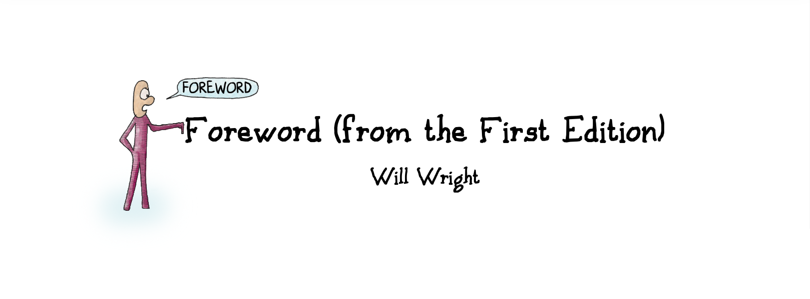

# Foreword 前言

The title of this book almost feels wrong to me. As a game designer, seeing the words "theory" and "fun" in such close proximity instinctively makes me a bit uncomfortable. Theories are dry and academic things, found in thick books at the back of the library, whereas fun is light, energetic, playful and...well...fun.

这本书的书名让我感觉有些不对劲。作为一名游戏设计师，看到“理论”和“乐趣”这两个词如此接近，我本能地感到有点不舒服。理论是枯燥的、学术性的东西，出现在图书馆后排厚重的书籍中，而乐趣则是轻松的、充满活力的、俏皮的和……嗯……有趣的。

For the first few decades of interactive game design, we were able to blithely ignore many of the larger meta-questions surrounding our craft while we slowly, painfully learned to walk. Now for the first time we are starting to see serious interest in what we do from the academic side. This is forcing those of us in the games industry to stop and consider,

在互动游戏设计的最初几十年里，我们可以轻率地忽略围绕我们这门手艺的许多大的元问题，同时慢慢地、痛苦地学会走路。现在，我们第一次开始看到学术界对我们的工作产生了真正的兴趣。这迫使我们这些游戏行业的从业者停下来思考，

"What is this new medium that we're working in?"

“我们所从事的新媒介是什么？”

The academic interest seems twofold: First is the recognition that video games probably represent an emerging new medium, a new design field, and possibly a new art form. All of these are worthy of study. Second, there are an increasing number of motivated students that grew up playing these games and now find themselves inspired to work in the field one day. They want to find schools that will help them understand what games are and how to make them.

学术界的兴趣似乎有两个方面：首先，人们认识到电子游戏可能是一种新兴的媒介、一个新的设计领域，也可能是一种新的艺术形式。所有这些都值得研究。其次，有越来越多的学生在玩这些游戏的过程中成长起来，现在他们发现自己有朝一日会从事这一领域的工作。他们希望找到能帮助他们了解游戏是什么以及如何制作游戏的学校。

One slight problem: there are very few teachers that understand games well enough to teach them, no matter how motivated their students happen to be. Actually it's worse than that, because there are very few people working in the games industry today (and Raph Koster is definitely one of them) who understand games well enough to even communicate what they know and how they know it.

但有一个小问题：无论学生有多积极，能很好地理解游戏并教授游戏的老师都很少。事实上，情况比这更糟糕，因为当今在游戏行业工作的人员（拉斐·科斯特无疑是其中之一）中，只有极少数人对游戏有足够的了解，甚至能够将他们所知道的和他们是如何知道的传达给别人。

The bridges between the game industry and the academics that want to study and teach games are slowly beginning to form. A shared language is developing, allowing both sides to speak about games and helping developers to more easily share their experiences with one another. It is in this language that the students of tomorrow will be taught.

游戏产业与希望研究和教授游戏的学术界之间的桥梁正在慢慢形成。一种共同的语言正在形成，使双方都能谈论游戏，并帮助开发人员更容易地相互交流经验。我们将用这种语言来教育未来的学生。

Games (both video and traditional) are tricky to study because they are so multidimensional. There are so many different ways you can approach them. The design and production of games involves aspects of cognitive psychology, computer science, environmental design, and storytelling, just to name a few. To really understand what games are, you need to see them from all these points of view.

游戏（包括视频游戏和传统游戏）的研究非常棘手，因为它们是多维的。你可以用许多不同的方法来研究它们。游戏的设计和制作涉及认知心理学、计算机科学、环境设计和讲故事等多个方面。要真正理解游戏是什么，你需要从所有这些角度来看待它。

I always enjoy hearing Raph Koster talk. He's one of the few people I know in the games industry who seems to investigate new subjects that might be relevant to his work, even if it's not immediately obvious why. He forages across wide intellectual landscapes and then returns to share what he's discovered with the rest of us. Not only is he a courageous explorer, he's a diligent mapmaker as well.

我一直很喜欢听拉斐·科斯特的演讲。他是我所认识的游戏行业中为数不多的人之一，他似乎会研究可能与他的工作相关的新课题，即使并不能立即看出原因。他在广阔的知识海洋中遨游，然后回来与我们分享他的发现。他不仅是一位勇敢的探险家，还是一位勤奋的地图绘制者。

In this book Raph does an excellent job of looking at games from a wide variety of perspectives. With the instincts of a designer working in the field, he has filtered out a treasure trove of useful and relevant nuggets from a career's worth of his own research in a variety of related subjects. He then manages to present what he's discovered in a friendly, playful way that makes everything feel like it's falling right into place; it just seems to make perfect sense.

在这本书中，拉斐出色地从多种角度审视了游戏。他凭借在该领域工作的设计师的直觉，从自己的职业生涯中对各种相关主题的研究中筛选出了大量有用的相关信息。然后，他以一种友好、俏皮的方式介绍了他的发现，让人感觉一切都恰到好处，一切都显得极其合理。

For such a distilled volume of wisdom...I guess I can live with the title.

对于这样一本提炼智慧的书……我想我可以接受它的书名。

—Will Wright

——威尔·赖特

> Will Wright is the legendary game designer behind titles such as The Sims, SimCity, SimEarth, and Spore. His honors and accolades include making Entertainment Weekly's "It List" of "the 100 most creative people in entertainment" and Time Digital's "Digital 50" in 1999, receiving a "Lifetime Achievement Award" at the Game Developers Choice Awards in 2001, being named #35 on Entertainment Weekly's Power List in 2002, becoming the fifth person to be inducted into the Academy of Interactive Arts and Sciences' Hall of Fame that same year, receiving the PC Magazine Lifetime Achievement Award, and in 2008 he was honored with the first-ever Spike TV Video Game Awards' Gamer God Award.
> 
> 威尔·赖特是《模拟人生》、《模拟城市》、《模拟地球》和《孢子》等游戏的传奇设计师。他获得的荣誉包括：1999 年入选《娱乐周刊》“It List”的“娱乐界最具创造力 100 人”和《时代数码》的“Digital 50”，2001 年在游戏开发者选择奖上获得“终身成就奖”、 2002 年在《娱乐周刊》的“权力榜”上排名第 35 位，同年成为第五位入选互动艺术与科学学院名人堂的人，获得《PC Magazine》终身成就奖，2008 年首次获得 Spike TV 视频游戏奖的“玩家之神奖”。
