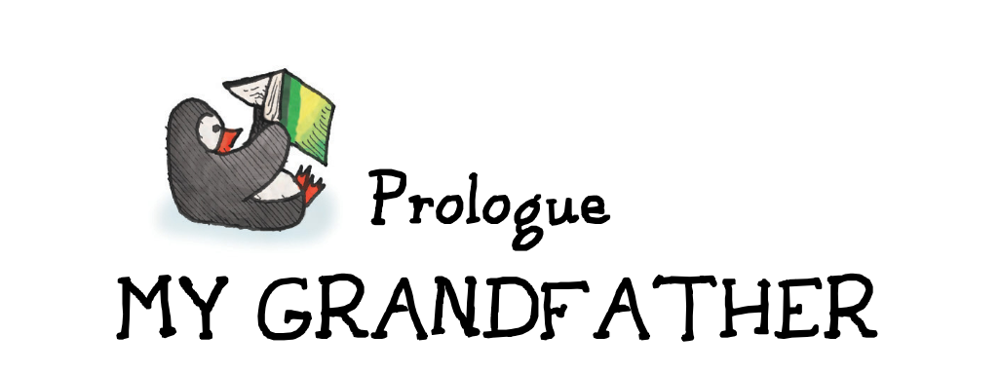
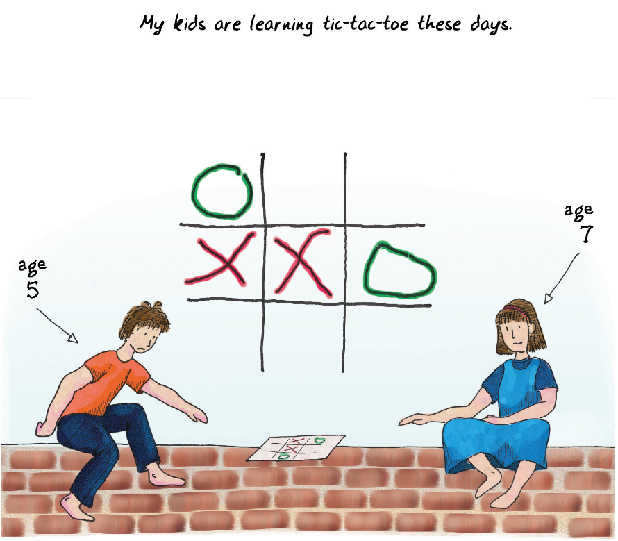

  

My grandfather wanted to know whether I felt proud of what I do. It seemed a reasonable question: there he was, aging and soon to pass away, though at the time I didn’t know that; a man who had spent his life as a fire chief, raising six children. One of them followed in his footsteps, became a fire chief himself, and now sells bathtub linings. There’s a special education teacher, an architect, a carpenter. Good, solid, wholesome professions for good, solid, wholesome people. And there I was—making games rather than contributing to society.

我的祖父想知道我是否为自己的工作感到自豪。这似乎是一个合理的问题：他年事已高，很快就要去世了，虽然当时我还不知道；他一生都在当消防队长，养育了六个孩子。其中一个继承了他的事业，也当上了消防队长，现在卖浴缸衬里。还有一位特殊教育老师，一位建筑师，一位木匠。对于善良、稳重、健康的人来说，这些都是良好、稳固、有益的职业。而我，却在制作游戏，没有为社会做贡献。

I told him that I felt I did contribute. Games aren’t just a diversion; they’re something valuable and important. And my evidence was right in front of me—my kids, playing [tic-tac-toe](#user-content-fn-1)[^1] on the floor.

我告诉他，我觉得我确实做出了贡献。游戏不只是消遣，而是有价值的、重要的东西。我的证据就摆在眼前——我的孩子们正在地板上玩[井字游戏](#user-content-fn-2)[^2]。

Watching my kids play and learn through playing had been a revelation for me. Even though my profession was making games, I often felt lost in the complexities of making large modern entertainment products rather than understanding why games are fun and what fun is.

看着孩子们在游戏中学习，对我来说是一种启示。尽管我的职业是制作游戏，但我经常感到迷失在制作大型现代娱乐产品的复杂性中，而不是理解游戏为什么有趣以及什么是乐趣。

My kids were leading me, without my quite knowing it, towards a theory of fun. And so I told my grandfather, “Yes, this is something worthwhile. I connect people, and I teach people.” But as I said it, I didn’t really have any evidence to offer.

我的孩子们在不知不觉中把我引向了趣味理论。于是我对祖父说：“是的，这是一件有价值的事情。我连接人们，我教导人们”但当我说出来的时候，我并没有任何证据。

  

> My kids are learning tic-tac-toe these days.
> 
> 我的孩子们最近在学习井字游戏。
> 
> age 5.
> 
> 5岁。
> 
> age 7.
> 
> 7岁。

[^1]: Tic-tac-toe: Also known as noughts and crosses. Tic-tac-toe, and its cousins go-moku (a game where the board is variously 13x13 or 15x15 and you have to get five in a row) and Qubic (a 4x4x4 cube) are all amenable to mathematical analysis. Tic-tac-toe in particular is fairly trivial, since there are only 125,168 possible games, and the vast majority of the possibility space collapses the moment you regard the board as having rotational symmetry. If both players employ the optimal strategy, the game will always end in a draw.

[^2]: 井字游戏：也称“零和叉”。井字游戏，以及它的同类游戏“五子棋”（一种在13x13或15x15的棋盘上进行的游戏，你必须把五个子连成一条线）和Qubic（一个4x4x4的立方体）都可以进行数学分析。特别是井字游戏，它相当简单，因为只有125,168种可能的游戏情况，而且当你考虑到棋盘具有旋转对称性时，可能性空间的绝大部分都会立即坍塌。如果两个玩家都采用最优策略，游戏总是会以平局结束。