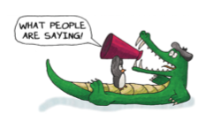

  

"The best game design book I have ever read."

—David Jaffe, creative director of God of War

“我读过的最棒的游戏设计书。”

——大卫·贾夫，《战神》创意总监

"Does for games what Understanding Comics did for sequential art. Non-gamers: Buy this for the gamer in your life. Gamers: Buy this for the non-gamer in your life. You'll never look at fun the same way again."

—Cory Doctorow, author of Little Brother and Pirate Cinema; co-editor of Boing Boing

“它为游戏做了《理解漫画》为连续艺术所做的事情。非游戏玩家：为你生活中的游戏玩家购买这本书。游戏玩家：为你生活中的非游戏玩家购买这本书。你将永远不会以同样的方式看待乐趣。”

——科里·多克托罗，《小兄弟》和《海盗影院》的作者；《啵啵》的联合编辑

One of "50 Books For Everyone In the Game Industry"

—EDGE

“50 本游戏行业人士必读书”之一

——《EDGE》杂志

One of the "Five Books You Should Read About Game Design"

—1up.com

“关于游戏设计必读的五本书”之一

——1up.com

"If you're interested in game design, get it and read it."

—Steve Jackson, designer of Munchkin and GURPS

“如果你对游戏设计感兴趣，那就赶紧买来读一读吧。”

——史蒂夫·杰克逊，《Munchkin》和《GURPS》的设计师

⭐️⭐️⭐️⭐️⭐️

—Midwest Book Review

⭐️⭐️⭐️⭐️⭐️

——Midwest 书评

"...It's a book I sincerely believe everyone should have read at least once in their lifetime. It's that important...what Campbell and Vogler did to storytelling, Koster has done to play...This book is history in the making. It will be referred to in seminal books whose authors have not yet even been born."

—GameDev.net

“……我真诚地相信，每个人一生中至少应该读过一次这本书。它就是这么重要……坎贝尔和沃格勒对讲故事的贡献，科斯特对游戏的贡献……这本书正在创造历史。它将在那些作者还未出生的开创性书籍中被提及。”

——GameDev.net

"An excellent, even foundational, read for anyone interested in creating experiences that challenge and engage minds."

—Learning Solutions Magazine

“对于任何有兴趣创造挑战和吸引思维的体验的人来说，这是一本优秀的、甚至是基础性的读物。”

——学习解决方案杂志

"An absolute classic on the theory of playing games."

—Tom Chatfield, author of Fun, Inc.

“游戏理论的绝对经典。”

——汤姆·查特菲尔德，《趣味公司》的作者

"Koster successfully bridges the gap between game design practice and academic theory... For anyone interested in the relationship between games and human experience, this book is a must-read."

—Australian Journal of Emerging Technologies and Society

“科斯特成功地在游戏设计实践和学术理论之间架起了一座桥梁……对于任何对游戏与人类体验之间的关系感兴趣的人来说，这本书都是必读之书。”

——澳大利亚新兴技术与社会期刊

"Koster outlines a convincing manifesto for why people do or don't have a good time in games in A Theory of Fun. He also makes us feel very very not smart."

—Game Informer Magazine

“科斯特在《趣味理论》一书中勾勒出了一个令人信服的宣言，说明了为什么人们在游戏中玩得开心或不开心。他还让我们觉得自己非常非常不聪明。”

——《Game Informer》杂志

"You cannot possibly read it and not feel at least twice like your brain has been hit by lightning."

—Jessica Mulligan, online gaming pioneer

“你读了这本书，不可能不至少有两次感觉大脑被闪电击中。”

——杰西卡·穆里根，在线游戏先驱

"Anyone that wants to know what REALLY makes a game fun needs to read this book."

—Chris Melissinos, curator of the Smithsonian's Art of Videogames exhibit 

“任何想知道是什么真正让游戏变得有趣的人都需要读一读这本书。”

——克里斯·梅利西诺斯，史密森尼博物馆电子游戏艺术展策展人

"The arcane mysteries of game design go poof with this delightful approach to the fundamentals of fun."

—Computer Games Magazine

“游戏设计的奥秘在这本令人愉快的趣味基本原理书中一扫而光。”

——《电脑游戏》杂志

"Gaming is much more than having fun—it is core to being human. Understanding games, and fun, helps us understand ourselves. Raph Koster is one of the good guys, always working to make more fun in our world. With this book he's just helped all of us, his readers and students, do exactly that."

—Mike McShaffry, author of Game Coding Complete

“游戏不仅仅是玩乐——它是做人的核心。了解游戏和乐趣有助于我们了解自己。拉斐·科斯特是好人之一，他一直致力于为我们的世界带来更多乐趣。通过这本书，他帮助我们所有人——他的读者和学生——做到了这一点。”

——迈克·麦沙弗里，《游戏编码大全》的作者

"Koster has written one of the best books for our industry. I hope everyone adds it to their bookshelf."

—Scott Miller, CEO of 3DRealms

“科斯特为我们这个行业写了一本最好的书。我希望每个人都能把它放进自己的书架。”

——斯科特·米勒，3DRealms 首席执行官

⭐️⭐️⭐️⭐️

—Training Media Review

⭐️⭐️⭐️⭐️

——培训媒体评论

"A Theory of Fun elucidates some basic truths that apply not just to games but to all entertainment. Even better, it does so in a style that is clear, insightful, and...fun! I expect this book to become an instant classic, fascinating to anyone who has ever made a game -- or played one."

—Noah Falstein, Chief Game Designer at Google

“《趣味理论》阐明了一些基本真理，这些真理不仅适用于游戏，也适用于所有娱乐活动。更妙的是，这本书的风格清晰明了、富有洞察力，而且……充满乐趣！我希望这本书能成为一本经典之作，让所有制作过游戏——或者玩过游戏——的人都为之着迷。”

——诺亚·法尔斯坦，谷歌首席游戏设计师

"An important and valuable book."

—Ernest Adams, game designer

“这是一本重要而有价值的书。”

——埃内斯特·亚当斯，游戏设计师

"Please do yourself a favor and pick up a copy."

—Brenda Romero, designer of Train

“请帮自己一个忙，买一本吧。”

——布伦达·罗梅罗，《火车》设计师

"A book about fun which is actually fun to read. It reminds me of Scott McCloud's Understanding Comics—a work which makes sophisticated arguments by pulling them down to basic principles and presenting them in an engaging fashion. Raph Koster offers a road map for how to make games an even more expressive medium."

—Dr. Henry Jenkins, USC

“一本关于乐趣的书，读起来其实很有趣。它让我想起了斯科特·麦克劳德的《理解漫画》——这是一本将复杂的论点归结为基本原理并以引人入胜的方式加以阐述的作品。拉斐·科斯特为如何让游戏成为更具表现力的媒介提供了路线图。”

——亨利·詹金斯博士，南加州大学

"Everyone from professional game developers to those who want to understand why we play games will enjoy A Theory of Fun."

—Cory Ondrejka, Facebook

“从专业游戏开发人员到那些想了解我们为什么玩游戏的人，每个人都会喜欢《趣味理论》。”

——科里·翁德雷卡，Facebook

"My favorite work on this subject to date and therefore I highly recommend it."

—David Perry, of Shiny Entertainment, Gaikai, and Sony

“迄今为止，我最喜欢有关这一主题的作品，因此我强烈推荐它。”

——大卫·佩里，Shiny Entertainment、Gaikai 和索尼

"Raph Koster asks the important question about games: why are they fun, and what does that say about games and about us? [It is] a tour of the nature of consciousness, how games do and do not intersect with reality, the difference between games and stories, and the seven different kinds of fun. It's a tour you'll be glad to take with him."

—Clay Shirky, NYU

“拉斐·科斯特提出了一个关于游戏的重要问题：游戏为什么好玩？[它是]一次关于意识本质、游戏与现实的交集与否、游戏与故事的区别以及七种不同乐趣的巡回之旅。你会很乐意和他一起游览的。”

——克莱·舍基，纽约大学

"Great sophistication yet without a trace of pretention or even an excess of big words."

—Michael Feldstein, SUNY Learning Network

“精妙绝伦，却没有一丝矫揉造作，晦涩难懂。”

——迈克尔·费尔德斯坦，纽约州立大学学习网络

"A Theory of Fun is a must read for anyone who wants to understand why games are so pervasive today, as it sheds new light into why fun matters in this world, and how 'play' makes us truly human."

—Dan Arey, designer on the Jak and Daxter series

“对于任何想了解游戏为何在当今如此流行的人来说，《趣味理论》都是一本必读书，因为它揭示了趣味为何在这个世界上如此重要，以及‘游戏’如何让我们成为真正的人类。”

——丹·阿雷，《杰克和达斯特》系列游戏设计师

"Tackles the questions of fun and engagement in a fun and engaging way."

—Learning Circuits, American Society for Training and Development

“以有趣和引人入胜的方式解决了乐趣和参与的问题。”

——《Learning Circuits》，美国培训与发展协会

"Everyone involved in game design—students, teachers, and professionals—should read this."

—Ian Schreiber, co-author of Challenges for Game Designers

“参与游戏设计的每个人——学生、教师和专业人士——都应该读一读这本书。”

——伊恩·施赖伯，《游戏设计师面临的挑战》合著者

"A delightful read. This book fills the 'game apologist' niche in my bookshelf."

—Dan Cook, game designer of Triple Town

“一本令人愉快的读物。这本书填补了我书架上‘游戏辩护人’的空缺。”

——丹·库克，《三重镇》游戏设计师

"A very fun book :D executed in a witty entertaining style."

—Michael Samyn of [Tale of Tales](https://www.tale-of-tales.com/index.php)

“这是一本非常有趣的书：D 以诙谐有趣的风格呈现。”

——迈克尔·萨曼，[故事的故事](https://www.tale-of-tales.com/index.php)游戏工作室

"Koster's A Theory of Fun is well-written, timely, passionate and scientifically informed, a fine piece of work that's bound to get lots of well-deserved attention."

—Dr. Edward Castronova, Indiana University and author of Exodus to the Virtual World

“科斯特的《趣味理论》文笔流畅，时效性强，充满激情，并且基于科学依据，是一部优秀的作品，必定会受到大量关注。”

——爱德华·卡斯特罗诺瓦博士，印第安纳大学，《虚拟世界的出埃及记》作者

"If there is a game designer lurking anywhere in your soul, this book may not be the Bible of game design, but I would certainly include it in the Apocrypha (the missing books of the Bible)... [E]ssential reading. I can't imagine anyone in the game industry who would not profit from enjoying this delightful book."

—Alan Emrich, Art Institute of California

“如果你的灵魂深处潜藏着一位游戏设计师，这本书也许不是游戏设计的圣经，但我肯定会把它列入圣经的启示录（《圣经》中缺失的书籍）……[必读]。我无法想象在游戏行业中，有谁会不喜欢这本令人愉快的书。”

——阿兰·埃姆里奇，加利福尼亚艺术学院的

"[One of] my very favorite books of all time... Raph, the Creative Lead of Many a Famous Online Game looks first at Human Nature, and from that, he deduces that games are very important, and puts forward formulae for understanding games. You end up going, 'Woah.'"

—George "The Fat Man" Sanger, game audio legend

“我最喜欢的书[之一]……拉斐是许多著名网络游戏的创意负责人，他首先从人性入手，推断出游戏的重要性，并提出了理解游戏的公式。最后你会惊呼，‘哇哦’。”

——乔治·“胖子”·桑格，游戏音频传奇人物

"Well worth reading. It won't take long to get through; and there is a great deal of thoughtfulness crammed into its few pages."

—Lee Sheldon, game designer

“非常值得一读。这本书不需要花很长时间就能读完；在这短短的几页纸中，蕴含着大量的深思熟虑。”

——李·谢尔顿，游戏设计师

"Raph's book has the most important words of wisdom for our entire industry that I've read yet. He's spot on when talking about how our work, our craft can only be taken seriously if developers themselves start taking their work seriously and produce art."

—Reid Kimball, game designer

“拉斐的这本书是我读过的对我们整个行业最重要的智慧之言。他一针见血地指出，只有开发者自己开始认真对待自己的工作并创造出艺术作品，我们的工作、我们的技艺才能得到认真对待。”

——雷德·金博尔，游戏设计师

"If you have any interest in game design, you should read this book."

—f13.net

“如果你对游戏设计感兴趣，就应该读读这本书。”

——f13.net

"Thankfully, A Theory of Fun exceeded my expectations on all levels. It has the accessibility of Understanding Comics, having a narrative depicted in images on every other page. But it also has the depth...an excellent book and an instant classic."

—Terra Nova

“值得庆幸的是，《趣味理论》在各个层面上都超出了我的预期。它具有《理解漫画》的易读性，每隔一页就有一个用图片描述的故事。但它也有深度……这是一本出色的书，注定成为经典。”

——特拉·诺娃

"Worth reading. You should go buy it and read it."

—Dave Sirlin, game designer

“值得一读。你应该买一本，读一读。”

——戴夫·塞尔林，游戏设计师

"Raph Koster's Theory of Fun for Game Design is brilliant—not a game design primer, but a meditation on what it is about games that makes them fun, and certainly worth reading for that reason."

—Greg Costikyan, game designer

“拉斐·科斯特的《游戏设计趣味理论》非常出色，它不是一本游戏设计入门书，而是一本关于游戏趣味所在的沉思录，因此当然值得一读。”

——格雷格·科斯蒂克扬，游戏设计师

"I'm a huge fan. I think I've handed out close to 15 copies of this book so far, including a copy to my mother. I love how I can use this book to spark an advanced design conversation but also use it to explain to my mom what the hell it is I do for a living and why all these games I play actually matter."

—Paul Stephanouk, game designer

“我是这本书的超级粉丝。到目前为止，我已经送出了将近 15 本书，包括给我母亲的一本。我喜欢用这本书来引发一场高级设计对话，同时也用它来向我妈妈解释我到底是做什么工作的，以及为什么我玩的这些游戏真的很重要。”

——保罗·斯特凡诺克，游戏设计师

"You should buy the book immediately if you haven't already, by the way. Yes, that is a gold-plated recommendation."

—Dr. Richard Bartle, co-creator of MUDs

“顺便说一句，如果你还没有买这本书，你应该马上买。是的，我极力推荐。”

——理查德·巴特尔博士，MUDs 的联合创始人

"Raph Koster's A Theory of Fun for Game Design is an important book. On one level, it's a manifesto for social responsibility and artistry in game design. On another level, it's an insightful exploration of human motivation and learning."

—Nonprofit Online News

“拉斐·科斯特的《游戏设计趣味理论》是一本重要的书。一方面，它是游戏设计中社会责任和艺术性的宣言。从另一个角度看，它是对人类动机和学习的深刻探索。”

——非营利在线新闻

"Raph Koster's A Theory of Fun for Game Design takes an entertaining look at a subject that has, in some ways, been taken too seriously by other authors. The book is thoughtful as well, providing a groundwork for a discussion of games as learning tools, art, and societal shapers..."

—Slashdot

“拉斐·科斯特的《游戏设计趣味理论》以有趣的方式探讨了一个在某些方面被其他作者过于严肃对待的主题。这本书也很有思想，为讨论游戏作为学习工具、艺术和社会塑造者提供了基础……”

——Slashdot

"This entertaining and innovative book is ostensibly for game designers. Personally, I think it is more than that: it's a primer for anyone interested in games, both for how they work and what we think of them."

—[BlogCritics.org](https://blogcritics.org/)

“这本有趣而新颖的书表面上是为游戏设计师而写。就我个人而言，我认为它的意义远不止于此：对于任何对游戏感兴趣的人来说，它都是一本入门书，既能让你了解游戏是如何运作的，也能让你了解我们对游戏的看法。”

——[BlogCritics.org](https://blogcritics.org/)